## 进程

1. 进程的概念

**CPU执行内存中指令，这个运行的程序被称为进程。**

进程是对运行时程序的封装，**操作系统进行资源调度和分配的基本单位。**

2. 进程的实现

中断发生后操作系统底层的工作步骤：

[中断讲述链接](https://blog.csdn.net/qq_42995499/article/details/110561360)

   1. 硬件压入堆栈程序计数器等
   2. 硬件从中断向量装入新的程序计数器
   3. 汇编语言过程保存寄存器值
   4. 汇编语言过程设置新的堆栈
   5. C中断服务例程运行(典型地读和缓冲输入) 6. 调度程序决定下一个将运行的进程
   6. C过程返回至汇编代码
   7. 汇编语言过程开始运行新的当前进程

进程表(PCB)

为了实现进程模型，操作系统维护着一张表格(一个结构数组)，即进程表。

每个进程占有一个进程表项。(有些著作称这些为进程控制块)

该表项包含了一个进程状态的重要信息

**包括程序计数器、堆栈指针、内存分配状况、所打开文件的状态、账号的调度信息，以及其他在进程由运行态转换 到就绪态或阻塞态时必须保存的信息，从而保证该进程随后能再次启动，就像从未中断过一样**

```
进程控制块（Process Control Block，PCB）是操作系统中用于管理进程的数据结构。每个正在运行或等待运行的进程都有一个对应的 PCB，它包含了关于该进程的所有信息，包括但不限于以下内容：

进程状态：表示进程当前所处的状态，例如运行、就绪、阻塞等。
进程标识符：唯一标识该进程的标识符，通常是进程的 ID。
程序计数器（Program Counter）：存储下一条即将执行的指令地址。
寄存器状态：包括通用寄存器、程序状态字（PSW）等。
进程优先级：用于调度算法决定进程的执行顺序。
进程调度信息：例如进程的时间片大小、已运行时间等。
内存管理信息：进程所占用的内存块、页表等。
文件描述符表：记录了进程打开的文件和其他I/O设备的信息。
进程间通信信息：例如进程间通信机制使用的信号量、消息队列等。
进程的父子关系：指向父进程和子进程的指针。
```

3. 并发与并行

单个核心在很短时间内分别执行多个进程，称为并发

多个核心同时执行多个进程称为并行

对于并发来说，CPU需要从一个进程切换到另一个进程，这个过程需要保存进程的状态信息

4. 进程的状态

某个进程在某个时刻所处的状态分为以下几种，**运行态、就绪态、阻塞态**。

对于阻塞状态, 比如read系统调用阻塞，进程会占用内存空间，这是一种浪费行为，于是操作系统会有跟内存管理中物理页置换到 磁盘一样的行为，**把阻塞的进程置换到磁盘中，此时进程未占用物理内存，我们称之为挂起;**

挂起不仅仅可能是物理内存不足，比如sleep系统调用过着用户执行Ctrl+Z也可能导致挂起。

除了创建和结束一般有三个状态:

运行态: 该时刻进程占用CPU

就绪态: 可运行，由于其他进程处于运行状态而暂时停止运行

阻塞态: 该进程正在等待某一事件发生(如等待输入/输出操作的完成)而暂时停止运行

阻塞态的进程占用着物理内存，在虚拟内存管理的操作系统中，通常会把阻塞态的进程的物理内存空间换出到硬
盘，等需要再次运行的时候，再从硬盘换入到物理内存。

挂起态:新的状态，描述进程没有占用实际的物理内存空间的情况，这个状态就是挂起状态

阻塞挂起状态: 进程在外存(硬盘)并等待某个事件的出现

就绪挂起状态: 进程在外存(硬盘)，但只要进入内存，马上运行

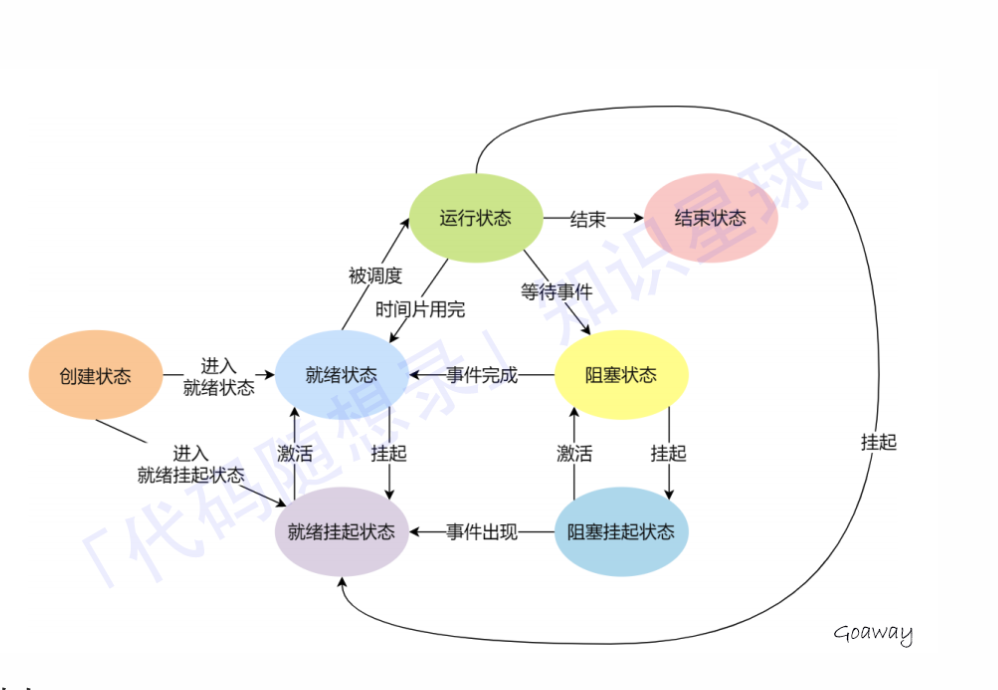

特点:

   1. 就绪态和运行态可以相互转换，其它的都是单向转换。就绪态的进程通过调度算法从而获得CPU 时间，转为运 行状态;

   2. 运行态的进程，在分配给它的 CPU 时间片用完之后就会转为就绪状态，等待下一次调度。

   3. 阻塞态是缺少需要的资源从而由运行态转换而来，但是该资源不包括 CPU 时间，缺少 CPU 时间会从运行态转换为就绪态。


5. 进程控制块(PCB)

操作系统对进程的感知，是通过进程控制块PCB数据结构来描述的。它是**进程存在的唯一标识**，其包括以下信息:

   1. 进程描述信息: **进程标识符、用户标识符等**;
   2. 进程控制和管理信息: 进程**状态**，进程**优先级**等;
   3. 进程资源分配清单: **虚拟内存地址空间**信息，**打开文件列表**，**IO设备信息**等;
   4. CPU相关信息: 当**进程切换时，CPU寄存器的值都被保存在相应PCB中，**以便CPU重新执行该进程时能从断点处继续执行;

PCB通过**链表**形式组织起来，比如有就绪**队列**、阻塞队列等，方便增删，方便进程管理。

虽然 PCB 描述了进程的属性和状态，但 PCB 本身并不是保存在进程中的，而是保存在操作系统内核的进程表中。

6. 进程状态的切换

进程的状态分类:

   1. 就绪状态(ready):等待被调度 
   2. 运行状态(running)
   3. 阻塞状态(waiting):等待资源

转换关系:

只有**就绪态**和**运行态**可以**互相转换**，其他都是单向转换。

就绪态的进程通过调度算法从而获得CPU时间，转为运行状态;

而运行状态的进程，在分配给它的CPU时间片完之 后就会转为就绪状态，等待下一次调度。

进程**因为等待资源而阻塞**，但是该资源不包括 CPU 时间，缺少 CPU 时间会从运行态转换为就绪态。

当进程等待的**外部事件发生时(如一些输入到达)，则又阻塞态转换为就绪态**,如果此时没有其他进程运行，变转 换为运行态，否则该进程将处于就绪态，等待CPU空闲轮到它运行。

7. 进程切换为何比线程慢

**涉及到虚拟内存的问题**，进程切换涉及虚拟地址空间的**切换**而线程不会。

因为每个进程都有自己的虚拟地址空间，而**线程是共享所在进程的虚拟地址空间**的，所以同一个进程中的线程进行线程切换时不涉及虚拟地址空间的转换。

把虚拟地址转换为物理地址需要查找页表，页表查找是一个很慢的过程(至少访问2次内存)，因此通常使用Cache 来缓存常用的地址映射，这样可以加速页表查找，这个cache就是**TLB(快表)**。

由于每个进程都有自己的虚拟地址空间，那么显然每个进程都有自己的页表，那么当进程切换后页表也要进行切 换，**页表切换后TLB就失效了，cache失效导致命中率降低，那么虚拟地址转换为物理地址就会变慢，表现出来的就是程序运行会变慢**，而线程切换则不会导致TLB失效，因为线程线程无需切换地址空间，这也就是进程切换要比同 进程下线程切换慢的原因。

8. 守护进程

[知乎讲解](https://www.zhihu.com/question/38609004)

守护进程是指在后台运行的，**没有控制终端与它相连**的进程。它**独立于控制终端，周期性地执行某种任务。**

**Linux**的大多数服务器就是用守护进程的方式实现的，如**web服务器进程http**等。

创建守护进程要点:

(1)让程序在后台执行。

方法是调用fork()产生一个子进程，然后使父进程退出。


(2)调用setsid()创建一个新对话期。

守护进程需要摆脱父进程的影响，方法是调用setsid()使进程成为一个会话组长。setsid()调用成功后，进程成为新的 会话组长和进程组长，并与原来的登录会话、进程组和控制终端脱离。

(3)禁止进程重新打开控制终端。

经过1和2，进程已经成为一个无终端的会话组长，但是它可以重新申请打开一个终端。为了避免这种情况发生，可以通过使进程不再是会话组长来实现。再一次通过fork()创建新的子进程，使调用fork的进程退出。

(4)关闭不再需要的文件描述符。

子进程从父进程继承打开的文件描述符。如不关闭，将会浪费系统资源，造成进程所在的文件系统无法卸下以及引 起无法预料的错误。首先获得最高文件描述符值，然后用一个循环程序，关闭0到最高文件描述符值的所有文件描 述符。

(5)将当前目录更改为根目录。

(6)子进程从父进程继承的文件创建屏蔽字可能会拒绝某些许可权。

为防止这一点，使用unmask(0)将屏蔽字清零。

(7)处理SIGCHLD信号

对于服务器进程，在请求到来时往往生成子进程处理请求。如果子进程等待父进程捕获状态，则子进程将成为僵尸 进程(zombie)，从而占用系统资源。如果父进程等待子进程结束，将增加父进程的负担，影响服务器进程的并发 性能。在Linux下可以简单地将SIGCHLD信号的操作设为SIG_IGN。这样，子进程结束时不会产生僵尸进程。

9. 僵尸进程

多进程程序，父进程一般需要跟踪子进程的退出状态，当子进程退出，父进程在运行，子进程必须等到父进程捕获到了子进程的退出状态才真正结束。**在子进程结束后，父进程读取状态前，此时子进程为僵尸进程。**

设置僵尸进程的目的是维护子进程的信息，以便父进程在以后某个时候获取。这些信息至少包括进程ID，进程的终 止状态，以及该进程使用的CPU时间。所以当终止子进程的父进程调用wait或waitpid时就可以得到这些信息。

但是子进程停止在僵尸态会占据内核资源，所以需要避免僵尸进程的产生或立即结束子进程的僵尸态。

   1. 父进程调用wait/waitpid等函数等待子进程结束，如果尚无子进程退出wait会导致父进程阻塞。waitpid只会等 待由pid参数指定的子进程，同时也是非阻塞，目标进程正常退出返回子进程PID，还没结束返回0。
   2. 在事件已经发生情况下执行非阻塞调用可以提高程序效率。对waitpid，最好在子进程退出后调用。使用 SIGCHLD信号通知父进程，子进程结束。

父进程中捕获信号，然后在信号处理函数中调用waitpid以彻底结束子进程

```
static void handle_child(int sig)
{
    pid_t pid;
    int stat;
    while((pid = waitpid(-1, &stat, WNOHANG)) > 0)
    {
//结束子进程的处理; }
}
```
   1. 通过signal(SIGCHLD, SIG_IGN)通知内核对子进程的结束不关心，由内核回收。如果不想让父进程挂起，可以 在父进程中加入一条语句:signal(SIGCHLD,SIG_IGN);表示父进程忽略SIGCHLD信号，该信号是子进程退出的 时候向父进程发送的。

   2. 忽略SIGCHLD信号，这常用于并发服务器的性能的一个技巧因为并发服务器常常fork很多子进程，子进程终结 之后需要服务器进程去wait清理资源。如果将此信号的处理方式设为忽略，可让内核把僵尸子进程转交给init进 程去处理，省去了大量僵尸进程占用系统资源。

10. 多进程

进程结构由以下几个部分组成:代码段、堆栈段、数据段。代码段是静态的二进制代码，多个程序可以共享。

父进程创建子进程之后，父、子进程除了pid外，几乎所有的部分几乎一样。

父、子进程共享全部数据，子进程在**写数据时**会使用写时复制技术将公共的数据重新拷贝一份，之后在拷贝出的数据上进行操作;**不是对同一块数据进行操作;**

如果子进程想要运行自己的代码段，还可以通过调用execv()函数**重新加载新的代码段**，之后就和父进程独立开了。

## 进程调度算法

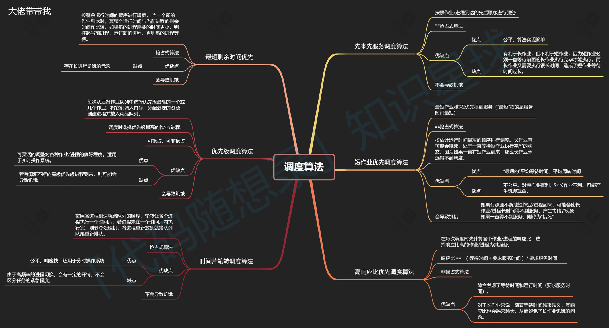

1. 批处理系统中的调度

(1)先来先服务

非抢占式的调度算法，**按照请求的顺序进行调度。**

**有利于长作业，但不利于短作业，**因为短作业必须一直等待前面的长作业执行完毕才能执行，而长作业又需要执行很长时间，造成了短作业等待时间过长。

(2)最短作业优先

非抢占式的调度算法，按估计运行时间最短的顺序进行调度。

长作业有可能会饿死，处于一直等待短作业执行完毕的状态。因为如果一直有短作业到来，那么长作业永远得不到
调度。

(3)最短剩余时间优先

最短作业优先的抢占式版本，按剩余运行时间的顺序进行调度。

当一个新的作业到达时，**其整个运行时间与当前进程的剩余时间作比较。**如果新的进程需要的时间更少，则挂起当前进程，运行新的进程。否则新的进程等待。

2. 交互式系统中的调度

(1)时间片轮转调度

将所有就绪进程按 FCFS 的原则排成一个队列，每次调度时，把 CPU 时间分配给队首进程，该进程可以执行一个时 间片。当时间片用完时，由计时器发出时钟中断，调度程序便停止该进程的执行，并将它送往就绪队列的末尾，同 时继续把 CPU 时间分配给队首的进程。

(2)优先级调度

为每个进程分配一个优先级，按优先级进行调度。**为了防止低优先级的进程永远等不到调度，可以随着时间的推移增加等待进程的优先级。**

(3)多级队列

一个进程需要执行 100 个时间片，如果采用时间片轮转调度算法，那么需要交换 100 次。

多级队列是为这种需要连续执行多个时间片的进程考虑，它设置了多个队列，每个队列时间片大小都不同，例如 1,2,4,8,..。进程在第一个队列没执行完，就会被移到下一个队列。这种方式下，之前的进程只需要交换 7 次。

每个队列优先权也不同，最上面的优先权最高。因此只有上一个队列没有进程在排队，才能调度当前队列上的进
程。

可以将这种调度算法看成是时间片轮转调度算法和优先级调度算法的结合。

(4)最短进程优先

如果我们将每一条命令的执行看作是一个独立的“作业”，则我们可以通过首先运行最短的作业来使响应事件最短

## 进程通信

1. 通信的类型

1、同一主机:

    1. 无名管道 
    2. 有名管道 
    3. 信号
    4. 消息队列 
    5. 共享内存 
    6. 信号量 
    7. 存储映射

2、不同主机:

   不同主机的通信有 socket

2. 无名管道

1、特点

1. 半双工，数据在同一时刻只能在一个方向上流动
2. 数据只能从管道的一端写入，从另一端读出
3. 写入管道中的数据遵循先入先出的规则
4. 管道所传送的数据是无格式的，这要求管道的读出方与写入方必须事先约定好数据的格式，如多少字节算一个消息等
5. 管道不是普通的文件，不属于某个文件系统，其只存在于内存中
6. 管道在内存中对应一个缓冲区。不同的系统其大小不一定相同
7. 从管道读数据是一次性操作，数据一旦被读走，它就从管道中被抛弃，释放空间以便写更多的数据
8. 管道没有名字，只能在具有公共祖先的进程(父进程与子进程，或者两个兄弟进程，具有亲缘关系)之间使用
9. 存在阻塞方式

2、pipe函数

```
#include <unistd.h>
/**
* 创建无名管道.
* @param pipefd 为int型数组的首地址，其存放了管道的文件描述符 * pipefd[0]、pipefd[1].
* @return 创建成功返回0，创建失败返回-1.
*/
int pipe(int pipefd[2]);
/**
* 当一个管道建立时，它会创建两个文件描述符 fd[0] 和 fd[1]。其中 * fd[0] 固定用于读管道，而 fd[1] 固定用于写管道。
* 一般文件 I/O的函数都可以用来操作管道(lseek() 除外。)
*/
```

3、读写管道四种进程情况

(1)第一种:

1. 如果写端没有关闭，管道中没有数据，这个时候读管道进程去读管道会阻塞;
2. 如果写段没有关闭，管道中有数据，这个时候读管道进程就会将数据读出来，下一次读没有数据汇总阻塞;

(2)第二种:

管道所有的写端关闭，都进程去读管道的内容，读取全部内容，最后返回0;

(3)第三种:

所有读端没有关闭，如果管道被写满了，写管道进程写管道会被阻塞;

(4)第四种:

所有的读端被关闭，写管道进程写管道会收到一个信号，然后退出。

4、读管道

(1)管道中有数据:

read返回实际读到的字节数

(2)管道中无数据:

1. 管道写端被全部关闭，read返回0 (相当于读到文件结尾)
2. 写端没有全部被关闭，read阻塞等待(不久的将来可能有数据递达，此时会让出cpu)

5、写管道

(1)管道读端全部被关闭:

进程异常终止(也可使用捕捉SIGPIPE信号，使进程终止);

(2)管道读端没有全部关闭:

1. 管道已满，write阻塞
2. 管道未满，write将数据写入，并返回实际写入的字节数

6、查看管道缓冲区函数

```
#include <unistd.h>
/**
* 该函数可以通过name参数查看不同的属性值.
* @param fd 文件描述符.
* @param name _PC_PIPE_BUF，查看管道缓冲区大小;
* _PC_NAME_MAX，文件名字字节数的上限.
* @return 成功: name返回的值的决定name的意义; 失败: 返回-1. */
long fpathconf(int fd, int name);
```

7、设置为非阻塞的方法

```
// 获取原来的flags
int flags = fcntl(fd[0], F_GETFL); // 设置新的flags
flag |= O_NONBLOCK;
// flags = flags | O_NONBLOCK; fcntl(fd[0], F_SETFL, flags);
```

3. 有名管道

命名管道(FIFO)不同于无名管道之处在于它提供了一个路径名与之关联，**以 FIFO 的文件形式存在于文件系统 中**，这样，即使与 FIFO 的创建进程不存在亲缘关系的进程，只要可以访问该路径，就能够彼此通过 FIFO 相互通 信，因此，通过 FIFO 不相关的进程也能交换数据.

1、与无名管道(pipe)不同

1. FIFO 在文件系统中作为一个特殊的文件而存在，**但 FIFO 中的内容却存放在内存中;**
2. 当使用 FIFO 的进程退出后，FIFO 文件将继续保存在文件系统中以便以后使用;
3. FIFO 有名字，不相关的进程可以通过打开命名管道进行通信.

2、通过命令创建有名管道

1. mkfifo fifo;
2. eg创建fifo 文件;
3. fifo形式文件，存在于内容种，查看文件大小位0.

3、通过函数创建有名管道

```
#include <sys/types.h>
#include <sys/stat.h>
/**
* 命名管道的创建.
* @param pathname 普通的路径名，也就是创建后 FIFO 的名字.
* @param mode 文件的权限，
* 与打开普通文件的 open() 函数中的 mode 参数相同。(0666).
* @return 成功: 0 状态码;
失败: 如果文件已经存在，则会出错且返回 -1. int mkfifo(const char *pathname, mode_t mode);
```

4、注意事项

一个为只读而打开一个管道的进程会阻塞直到另外一个进程为只写打开该管道;

一个为只写而打开一个管道的进程会阻塞直到另外一个进程为只读打开该管道.

(1)读管道:

1. 管道中有数据，read返回实际读到的字节数

2. 管道中无数据:

    1. 管道写端被全部关闭，read返回0 (相当于读到文件结尾);
    2. 写端没有全部被关闭，read阻塞等待.

(2)写管道:

    1. 管道读端全部被关闭， 进程异常终止(也可使用捕捉SIGPIPE信号，使进程终止);
    2. 管道读端没有全部关闭:
       1. 管道已满，write阻塞;
       2. 管道未满，write将数据写入，并返回实际写入的字节数。

4. 共享存储映射

存储映射I/O (Memory-mapped I/O) 使一个**磁盘文件**与存储空间中的一个**缓冲区相映射.**

于是当从缓冲区中取数据，就相当于读文件中的相应字节。于此类似，将数据存入缓冲区，则相应的字节就自动写入文件。

这样，就可在不适用read和write函数的情况下，使用地址(指针)完成I/O操作，进程就可以直接通过读写内存来 操作文件.

共享内存可以说是最有用的进程间通信方式，也是最快的IPC形式, 因为进程可以直接读写内存，而不需要任何数据 的拷贝.

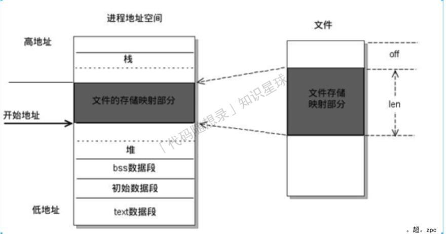

1、存储映射函数:

(1)mmap函数

```
#include <sys/mman.h>
/**
一个文件或者其它对象映射进内存.
@param addr 指定映射的起始地址, 通常设为NULL, 由系统指定. @param length 映射到内存的文件⻓度.
@param prot 映射区的保护方式, 最常用的:
(1) 读:PROT_READ;
(2) 写:PROT_WRITE;
(3) 读写:PROT_READ | PROT_WRITE.
@param flags 映射区的特性, 可以是:
(1) (2)
MAP_SHARED: 写入映射区的数据会复制回文件, 且允许其他映射该文件的进程共享。 MAP_PRIVATE: 对映射区的写入操作
会产生一个映射区的复制(copy - on - write),
对此区域所做的修改不会写回原文件。 @param fd 由open返回的文件描述符, 代表要映射的文件.
@param offset 以文件开始处的偏移量,
必须是4k的整数倍, 通常为0, 表示从文件头开始映射.
@return 成功:返回创建的映射区首地址; 失败:MAP_FAILED宏.
*/
void *mmap(void *addr, size_t length,
    int prot, int flags, int fd, off_t offset);
```

内存是按照页来区别的，通常一页就是4K

总结:
1. 第一个参数写成NULL
2. 第二个参数要映射的文件大小 > 0
3. 第三个参数:PROT_READ 、PROT_WRITE
4. 第四个参数:MAP_SHARED 或者 MAP_PRIVATE 5. 第五个参数:打开的文件对应的文件描述符
6. 第六个参数:4k的整数倍，通常为0

(2)munmap函数

```
#include <sys/mman.h>
/**
* 释放内存映射区.
* @param addr 使用mmap函数创建的映射区的首地址. * @param length 映射区的大小.
* @return 成功返回0; 失败返回-1.
*/
int munmap(void *addr, size_t length);
```

2、注意事项:

1. 创建映射区的过程中，隐含着一次**对映射文件的读操作**
2. 当MAP_SHARED时，要求:映射区的权限应 <=文件打开的权限(出于对映射区的保护)。而MAP_PRIVATE则无所谓，因为mmap中的权限是对内存的限制
3. 映射区的释放与文件关闭无关。只要映射建立成功，文件可以立即关闭
4. 特别注意，当映射文件大小为0时，不能创建映射区。所以，用于映射的文件必须要有实际大小。mmap使用时
 常常会出现总线错误，通常是由于共享文件存储空间大小引起的
5.  munmap传入的地址一定是mmap的返回地址。坚决杜绝指针++操作
6.  如果文件偏移量必须为4K的整数倍
7.  mmap创建映射区出错概率非常高，一定要检查返回值，确保映射区建立成功再进行后续操作

3、匿名映射实现父子进行通信

(1)为什么使用匿名的方式实现通信?

内存映射的需要依赖文件。而建立文件建立好了只会还要unlink close掉，比较麻烦;

(2)有什么好的不能办法进行解决?

直接使用匿名映射来代替;

(3)Linux系统给我们提供了创建匿名映射区的方法，无需依赖一个文件即可创建映射区。同样需要借助标志位参 数flags来指定;

(4)使用MAP_ANONYMOUS (或MAP_ANON):

```
int *p = mmap(NULL, 4, PROT_READ|PROT_WRITE, MAP_SHARED|MAP_ANONYMOUS, -1, 0);
```

5. 消息队列

基本原理:A 进程要给 B 进程发送消息，A 进程把数据放在对应的消息队列后就可以正常返回了，B 进程需要的时候再去读取数据就可以了。

特点:

1. 消息队列是保存在内核中的消息链表，每个消息体都是固定大小的存储块。如果进程从消息队列中读取了消息 体，内核就会把这个消息体删除。
2. 如果没有释放消息队列或者没有关闭操作系统，消息队列会一直存在。

缺点:

1. 通信不及时，附件也有大小限制。
2. 消息队列不适合比较大数据的传输，每个消息体都有一个最大长度的限制，同时所有队列所包含的全部消息体的总长度也是有上限
3. 消息队列通信过程中，存在用户态与内核态之间的数据拷贝开销

6. 信号

信号是linux进程通信的最古老的方式;

信号是软件中断，它是在软件层次上对中断机制的一种模拟，是一种异步通信的方式 。信号可以导致一个正在运行 的进程被另一个正在运行的异步进程中断，转而处理某一个突发事件;

信号可以直接进行用户空间进程和内核空间进程的交互，内核进程可以利用它来通知用户空间进程发生了哪些系统 事件.

1、信号的特点

   1. 简单
   2. 不能携带大量信息
   3. 满足某个特定条件才发送

2、一个完整的信号周期

    1. 信号的产生
    2. 信号在进程种的注册，信号在进程种的注销
    3. 执行信号处理函数

3、信号编号

    (1)不存在编号为0的信号

        1. 其中1-31号信号称之为常规信号(也叫普通信号或标准信号)
        2. 34-64称之为实时信号，驱动编程与硬件相关。名字上区别不大。而前32个名字各不相同

    (2)不存在编号为0的号，也没有32-33号
    (3)比较重要的一些，需要记住的几个信号

       1. SIGINT 当用户按下了<Ctrl+C>组合键时，用户终端向正在运行中的由该终端启动的程序发出此信号，终止进程
       2. SIGQUIT 用户按下<ctrl+>组合键时产生该信号，用户终端向正在运行中的由该终端启动的程序发出些信号,终止进程
       3. SIGSEGV 指示进程进行了无效内存访问(段错误), 终止进程并产生core文件
       4. SIGPIPE Broken pipe向一个没有读端的管道写数据,终止进程
       5. SIGCHLD 子进程结束时，父进程会收到这个信号,忽略这个信号
4、信号四要素

(1)编号: man 7 signal 查看文档帮助
(2)名称
(3)事件
(4)默认处理动作:
   1. Term:终止进程
   2. Ign: 忽略信号 (默认即时对该种信号忽略操作)
   3. Core:终止进程，生成Core文件。(查验死亡原因，用于gdb调试) 
   4. Stop:停止(暂停)进程
   5. Cont:继续运行进程
   
特别强调: 9) SIGKILL 和19) SIGSTOP信号，不允许忽略和捕捉，只能执行默认动作。甚至不能将其设置为阻塞.

5、信号的状态

(1)产生

1. 当用户按某些终端键时，将产生信号
2. 硬件异常将产生信号
3. 软件异常将产生信号
4. 调用系统函数(如:kill、raise、abort)将发送信号 
5. 运行 kill /killall命令将发送信号

(2)未决状态:没有被处理

(3)递达状态:信号被处理了

6、阻塞信号集和未决信号集

(1)阻塞信号集

将某些信号加入集合，对他们设置屏蔽，当屏蔽x信号后，再收到该信号，该信号的处理将推后(处理发生在解除屏 蔽后)

(2)未决信号集合

信号产生，未决信号集中描述该信号的位立刻翻转为1，表示信号处于未决状态。当信号被处理对应位翻转回为0。这一时刻往往非常短暂.

7、信号产生函数

(1)kill函数:

```
#include <sys/types.h>
#include <signal.h>
/**
* 给指定进程发送指定信号(不一定杀死).
* @param pid 取值有四种情况:
pid > 0: 将信号传送给进程 ID 为pid的进程.
pid = 0 : 将信号传送给当前进程所在进程组中的所有进程.
pid = -1 : 将信号传送给系统内所有的进程.
pid < -1 : 将信号传给指定进程组的所有进程，这个进程组号等于 pid 的绝对值. 信号的编号，这里可以填数字编号，也可以填信号的宏定义.
可以通过命令 kill - l("l" 为字母)进行相应查看. 不推荐直接使用数字，应使用宏名，因为不同操作系统信号编号可能不同，但名称一致.
普通用户基本规则是:发送者实际或有效用户ID == 接收者实际或有效用户ID. int kill(pid_t pid, int sig);
```

(2)raise函数

```
#include <signal.h>
/**
* 给当前进程发送指定信号(自己给自己发)，等价于 kill(getpid(), sig). * @param sig 信号编号.
* @return 成功: 0; 失败: 非0值.
*/
int raise(int sig);
```

(3)abort函数

```
#include <stdlib.h>
/**
* 给自己发送异常终止信号 6) SIGABRT，并产生core文件，等价于kill(getpid(), SIGABRT). */
void abort(void);
```

(4)alarm函数(闹钟)

```
#include <unistd.h>
/**
* 设置定时器(闹钟)。在指定seconds后，内核会给当前进程发送14)SIGALRM信号。进程收到该信号，默认动作
终止。每个进程都有且只有唯一的一个定时器;
* 取消定时器alarm(0)，返回旧闹钟余下秒数. * @param seconds 指定的时间，以秒为单位. * @return 返回0或剩余的秒数.
*/
unsigned int alarm(unsigned int seconds);
```

(5)setitimer函数(定时器)

```

    #include <sys/time.h>
struct itimerval {
struct timerval it_interval; // 闹钟触发周期 struct timerval it_value; // 闹钟触发时间
};
struct timeval {
    long tv_sec;
    long tv_usec;
// 秒 // 微秒
}
/**
* 设置定时器(闹钟)。 可代替alarm函数。精度微秒us，可以实现周期定时. * @param which 指定定时方式:
* (1) 自然定时:ITIMER_REAL → 14)SIGALRM计算自然时间;
* (2) 虚拟空间计时(用户空间):ITIMER_VIRTUAL → 26)SIGVTALRM
cpu的时间;
* (3) 虚拟空间计时(用户空间):ITIMER_VIRTUAL → 26)SIGVTALRM
cpu的时间.
* @param new_value 负责设定timeout时间.
* @param old_value 存放旧的timeout值，一般指定为NULL. * @return 成功: 0; 失败: -1.
*/
int setitimer(int which, const struct itimerval *new_value, struct itimerval *old_value);
// itimerval.it_value: 设定第一次执行function所延迟的秒数
// itimerval.it_interval: 设定以后每几秒执行function

```

8、自定义信号集函数

```
#include <signal.h>
int sigemptyset(sigset_t *set); // 将set集合置空
int sigfillset(sigset_t *set); // 将所有信号加入set集合
int sigaddset(sigset_t *set, int signo); // 将signo信号加入到set集合 int sigdelset(sigset_t *set, int signo); // 从set集合中移除signo信号 int sigismember(const sigset_t *set, int signo); // 判断信号是否存在
```

除sigismember外，其余操作函数中的set均为传出参数。sigset_t类型的本质是位图;

9、阻塞信号集

(1)信号阻塞集也称信号屏蔽集、信号掩码;
(2)信号阻塞集用来描述哪些信号递送到该进程的时候被阻塞;
(3)sigprocmask函数

```
#include <signal.h>
/**
 *
 *
 *
 *
 *
 *
 *
 *
 *
 *
检查或修改信号阻塞集，根据 how 指定的方法对进程的阻塞集合进行修改， 新的信号阻塞集由 set 指定，而原先的信号阻塞集合由 oldset 保存.
@param how 信号阻塞集合的修改方法，有 3 种情况:
(1) SIG_BLOCK:向信号阻塞集合中添加 set 信号集，
新的信号掩码是set和旧信号掩码的并集。相当于 mask = mask|set; (2) SIG_UNBLOCK:从信号阻塞集合中删除 set 信号集，
从当前信号掩码中去除 set 中的信号。相当于 mask = mask & ~ set; (3) SIG_SETMASK:将信号阻塞集合设为 set 信号集，
相当于原来信号阻塞集的内容清空，然后按照 set 中的信号重新设置信号阻塞集。相当于
mask = set. *
* @set 要操作的信号集地址,若 set 为 NULL，则不改变信号阻塞集合，函数只把当前信号阻塞集合保存到 oldset 中.
* @oldset 保存原先信号阻塞集地址.
* @return 成功: 0; 失败: -1，失败时错误代码只可能是 EINVAL，表示参数 how 不合法. */
int sigprocmask(int how, const sigset_t *set, sigset_t *oldset);
```

(4)sigpending函数

```
#include <signal.h>
/**
* 读取当前进程的未决信号集.
* @param set 未决信号集.
* @return 成功: 0; 失败: -1. */
int sigpending(sigset_t *set);
```

10、信号捕捉

注意: SIGKILL 和 SIGSTOP 不能更改信号的处理方式，因为它们向用户提供了一种使进程终止的可靠方法;

(1)sigaction函数

```
#include <signal.h>
/**
* 检查或修改指定信号的设置(或同时执行这两种操作).
* @param signum 要操作的信号.
* @param act 要设置的对信号的新处理方式(传入参数).
* @param oldact:原来对信号的处理方式(传出参数). *
* 如果 act 指针非空，则要改变指定信号的处理方式(设置)，
* 如果 oldact 指针非空，则系统将此前指定信号的处理方式存入 oldact. *
* @return 成功: 0; 失败: -1. */
int sigaction(int signum, const struct sigaction *act, struct sigaction *oldact);
```

(2)sa_handler、sa_sigaction:信号处理函数指针

和 signal() 里的函数指针用法一样，应根据情况给sa_sigaction、sa_handler 两者之一赋值 其取值如下:
1. SIG_IGN:忽略该信号
2. SIG_DFL:执行系统默认动作
3. 处理函数名:自定义信号处理函数

(3)sa_mask:

信号阻塞集，在信号处理函数执行过程中，临时屏蔽指定的信号;

(4)sa_flags: 用于指定信号处理的行为，通常设置为0，表使用默认属性。它可以是一下值的“按位或”组合:

1. A_RESTART:使被信号打断的系统调用自动重新发起(已经废弃)
2. SA_NOCLDSTOP:使父进程在它的子进程暂停或继续运行时不会收到 SIGCHLD 信号
3. SA_NOCLDWAIT:使父进程在它的子进程退出时不会收到 SIGCHLD 信号，这时子进程如果退出也不会成为僵尸进程
4. SA_NODEFER:使对信号的屏蔽无效，即在信号处理函数执行期间仍能发出这个信号
5. SA_RESETHAND:信号处理之后重新设置为默认的处理方式
6. SA_SIGINFO:使用 sa_sigaction 成员而不是 sa_handler 作为信号处理函数

11、struct sigaction结构体

```
struct sigaction {
void(*sa_handler)(int); //旧的信号处理函数指针 void(*sa_sigaction)(int, siginfo_t *, void *); //新的信号处理函数指针 sigset_t sa_mask; //信号阻塞集
int sa_flags; //信号处理的方式
void(*sa_restorer)(void); //已弃用
};
```

12、信号处理函数

```
/**
* @param signum 信号的编号.
* @param info 记录信号发送进程信息的结构体.
* @param context 可以赋给指向 ucontext_t 类型的一个对象的指针 * 以引用在传递信号时被中断的接收进程或线程的上下文.
*/
void(*sa_sigaction)(int signum, siginfo_t *info, void *context);
```

13、不可重入、可重入函数

如果有一个函数不幸被设计成为这样:那么不同任务调用这个函数时可能修改其他任务调用这个函数的数据，从而
导致不可预料的后果。 

这样的函数是不安全的函数，也叫不可重入函数;

(1)不可重入函数:

1. 函数体内使用了静态的数据结构;
2. 函数体内调用了malloc() 或者 free() 函数(谨慎使用堆); 
3. 函数体内调用了标准 I/O 函数;

(2)可重入函数:

1. 所谓可重入是指一个可以被多个任务调用的过程，任务在调用时不必担心数据是否会出错;
2. 在写函数时候尽量使用局部变量(例如寄存器、栈中的变量);
3. 对于要使用的全局变量要加以保护(如采取关中断、信号量等互斥方法)，这样构成的函数就一定是一个可重入的函数.


14、SIGCHLD信号

1. 子进程终止时;
2. 子进程接收到SIGSTOP信号停止时;
3. 子进程处在停止态，接受到SIGCONT后唤醒时。

15、如何避免僵尸进程

(1)最简单的方法:

父进程通过 wait() 和 waitpid() 等函数等待子进程结束，但是，这会导致父进程挂起;

(2)如果父进程要处理的事情很多，不能够挂起，通过 signal() 函数人为处理信号 SIGCHLD:

只要有子进程退出自动调用指定好的回调函数，因为子进程结束后， 父进程会收到该信号 SIGCHLD ，可以在其回调函数里调用 wait() 或 waitpid() 回收;

(3)如果父进程不关心子进程什么时候结束，那么可以用signal(SIGCHLD, SIG_IGN)通知内核:

自己对子进程的结束不感兴趣，父进程忽略此信号，那么子进程结束后，内核会回收，并不再给父进程发送信号;

7. 守护进程

1、进程组概述

   1. 代表一个或多个进程的集合;
   2. 每个进程都属于一个进程组;
   3. 是为了简化对多个进程的管理。

2、会话

1. 一个会话可以有一个控制终端。这通常是终端设备或伪终端设备;
2. 建立与控制终端连接的会话首进程被称为控制进程;
3. 一个会话中的几个进程组可被分为一个前台进程组以及一个或多个后台进程组;
4. 如果一个会话有一个控制终端，则它有一个前台进程组，其它进程组为后台进程组; 
5. 如果终端接又检测到断开连接，则将挂断信号发送至控制进程会话首进程。

3、创建会话注意事项

1. 调用进程不能是进程组组长，该进程变成新会话首进程(session header);
2. 该调用进程是组长进程，则出错返回;
3. 该进程成为一个新进程组的组长进程;
4. 需有root权限(ubuntu不需要);
5. 新会话丢弃原有的控制终端，该会话没有控制终端;
6. 建立新会话时，先调用fork, 父进程终止，子进程调用setsid。

4、API函数

(1)getsid 函数

```
#include <unistd.h>
/**
* 获取进程所属的会话ID.
* @param pid 进程号，pid为0表示查看当前进程session ID. * @return 成功: 返回调用进程的会话ID; 失败: -1.
*/
pid_t getsid(pid_t pid);
```

(2)setsid函数

```
#include <unistd.h>
/**
* 创建一个会话，并以自己的ID设置进程组ID，同时也是新会话的ID。 * 调用了setsid函数的进程，既是新的会⻓，也是新的组⻓.
*
* @return 成功: 返回调用进程的会话ID; 失败: -1.
*/
pid_t setsid(void);
```

5、守护进程

守护进程(Daemon Process)，也就是通常说的 Daemon 进程(精灵进程)，是 Linux 中的后台服务进程

1. 它是一个生存期较长的进程，通常独立于控制终端并且周期性地执行某种任务或等待处理某些发生的事件
2. 一般采用以d结尾的名字
3. 所有的服务存在于 etc/init.d
4. 守护进程是个特殊的孤儿进程
5. 之所以脱离于终端是为了避免进程被任何终端所产生的信息所打断，其在执行过程中的信息也不在任何终端上显 示
6. Linux 的大多数服务器就是用守护进程实现的

6、守护进程模型

(1)创建子进程，父进程退出(必须)

所有工作在子进程中进行形式上脱离了控制终端

(2)在子进程中创建新会话(必须)

1. setsid()函数
2. 使子进程完全独立出来，脱离控制

(3)改变当前目录为根目录(不是必须)

1. chdir()函数
2. 防止占用可卸载的文件系统 
3. 也可以换成其它路径

(4)重设文件权限掩码(不是必须)

1. umask()函数
2. 防止继承的文件创建屏蔽字拒绝某些权限 
3. 增加守护进程灵活性

(5)关闭文件描述符(不是必须)

继承的打开文件不会用到，浪费系统资源，无法卸载

(6)开始执行守护进程核心工作(必须)

守护进程退出处理程序模型

## 线程

**1 线程的特点**

1. 线程是轻量级进程(light-weight process)，也有PCB，创建线程使用的底层函数和进程一样，都是clone;
2. 从内核里看进程和线程是一样的，都有各自不同的PCB;
3. 进程可以蜕变成线程;
4. 在linux下，**线程最是小的执行单位;进程是最小的分配资源单位。**

实际上，无论是创建进程的fork，还是创建线程的pthread_create，底层实现都是调用同一个内核函数 clone 。

1. 如果复制对方的地址空间，那么就产出一个“进程”;
2. 如果共享对方的地址空间，就产生一个“线程”。

Linux内核是不区分进程和线程的, 只在用户层面上进行区分。所以，线程所有操作函数 pthread_* 是库函数，而非
系统调用。

三种线程的实现

(1)用户线程

用户空间实现的线程，由基于用户态的线程库管理

优点:

1. 管理不需要内核直接参与，因此可用于不支持线程技术的操作系统;
2. 用户线程切换由线程库调度，不需要用户态与内核态之间转换。

缺点:

1. 由于不由操作系统调度，一旦用户线程发起系统调用而阻塞，那么此进程下用户线程都无法运行;
2. 一旦某个用户线程正在运行，只有当其交出CPU执行权，其他用户线程才可以运行，无法被打断，因为只有操作系统才有权限打断运行，但是操作系统不直接参与调度;
3. 用户线程操作系统无法感知，CPU资源是直接分配给线程所在的进程，因此分到具体用户线程的时间片就较短
了。，其TCB线程控制块无法被操作系统所感知，因此用户线程的创建、终止、同步、调度等都不是由操作系统 直接参与。

(2)内核线程:

由操作系统管理、调度，其TCB是存放在内核中。一般由操作系统事先创建内核线程集(类似于线程池)，数量有
限。

优点:

1. 当一个内核线程发起系统调用阻塞时不会影响其它内核线程的执行;
2. 操作系统将CPU资源直接分配给内核线程，更多CPU时间。

缺点:

1. 需要由内核来维护内核线程的上下文信息及运行状态等，占用内核资源;
2. 内核线程创建、终止、切换都是在内核中进行，开销比较大。

(3)轻量级线程 LWP:

内核支持的用户线程，像普通进程一样被调度，其类似于进程中的执行线程。
每个LWP都需要一个内核线程的支持(CPU资源分配、调度)，实际上用户线程是运行在LWP上的。

**2. 线程共享资源**

1. 文件描述符表
2. 每种信号的处理方式
3. 当前工作目录
4. 用户ID和组ID

**3. 线程非共享资源**

1. 线程id
2. 处理器现场和栈指针(内核栈)
3. 独立的栈空间(用户空间栈)
4. errno变量
5. 信号屏蔽字
6. 调度优先级

**4. 线程的优缺点**

优点:
1. 提高程序并发性
2. 开销小
3. 数据通信、共享数据方便

缺点:
1. 库函数，不稳定
2. 调试、编写困难、gdb不支持
3. 对信号支持不好

线程如何减少开销
1. 线程创建快，进程创建需要资源管理信息，比如内存管理信息和文件管理信息，而线程创建后是共享其所属进程 的资源管理信息;
2. 线程终止时间快，需要回收的仅有少量寄存器和私有的栈区;
3. 线程切换快，因为线程切换仅涉及到少量寄存器和栈区，而进程上下文切换有CPU寄存器和程序计数器(CPU上
下文)、虚拟内存空间、页表切换、TLB失效等;
4. 线程因为创建时共享了其所述进程绝大多数资源，因此天生具有很好的线程间通信交互效率。

**5. 线程常用操作(线程号)**

进程号用 pid_t 数据类型表示，是一个非负整数。线程号则用 pthread_t 数据类型来表示，Linux 使用无符号长整
数表示。

1、pthread_self函数

```
#include <pthread.h>
/**
* 获取线程号.
* @return 返回调用线程的线程. */
pthread_t pthread_self(void);
```

2、pthread_equal函数

```
/**
* 判断线程号 t1 和 t2 是否相等。为了方便移植，尽量使用函数来比较线程 ID. * @param t1 待判断的线程号.
* @param t2 待判断的线程号.
* @return 相等: 非0; 不相等: 0.
*/
int pthread_equal(pthread_t t1, pthread_t t2);
```
3、pthread_create函数
```
#include <pthread.h>
/**
* 创建一个线程.
* @param thread 线程标识符地址.
* @param attr 线程属性结构体地址，通常设置为 NULL. * @param start_routine 线程函数的入口地址.
* @param arg 传给线程函数的参数.
* @return 成功: 0; 失败: 非0.
*/
int pthread_create(pthread_t *thread,
            const pthread_attr_t *attr,
            void *(*start_routine)(void *),
void *arg );
// 由于pthread_create的错误码不保存在errno中，
// 因此不能直接用perror()打印错误信息，
// 可以先用strerror()把错误码转换成错误信息再打印。
```
4、线程资源回收

pthread_join函数，会阻塞。

```
#include <pthread.h>
/**
* 等待线程结束(此函数会阻塞)，并回收线程资源，类似进程的 wait() 函数。如果线程已经结束，那么该函数
会立即返回.
* @param thread 被等待的线程号.
* @param retval 用来存储线程退出状态的指针的地址. * @return 成功: 0; 失败: 非0.
*/
int pthread_join(pthread_t thread, void **retval);
```

调用该函数的线程将挂起等待，直到id为thread的线程终止。 thread线程以不同的方法终止，通过pthread_join得到的终止状态是不同的。

总结:

1. 如果thread线程通过return返回，retval所指向的单元里存放的是thread线程函数的返回值。
2. 如果thread线程被别的线程调用pthread_cancel异常终止掉，retval所指向的单元里存放的是常数
PTHREAD_CANCELED。
3. 如果thread线程是自己调用pthread_exit终止的，retval所指向的单元存放的是传给pthread_exit的参数。

5、线程分离

pthread_detach函数，不会阻塞。

```
#include <pthread.h>
/**
* 使调用线程与当前进程分离，分离后不代表此线程不依赖与当前进程，
* 线程分离的目的是将线程资源的回收工作交由系统自动来完成，
* 也就是说当被分离的线程结束之后，系统会自动回收它的资源。所以，此函数不会阻塞. *
* @param thread 线程号.
* @return 成功: 0; 失败: 非0. */
int pthread_detach(pthread_t thread);
```

总结:


1. 线程终止后，其终止状态一直保留到其它线程调用pthread_join获取它的状态为止。但是线程也可以被置为 detach状态，这样的线程一旦终止就立刻回收它占用的所有资源，而不保留终止状态。
2. 不能对一个已经处于detach状态的线程调用pthread_join，这样的调用将返回EINVAL错误。也就是说，如果已 经对一个线程调用了pthread_detach就不能再调用pthread_join了

6、线程退出

pthread_exit函数，资源不会被释放。

```
#include <pthread.h>
/**
* 退出调用线程。一个进程中的多个线程是共享该进程的数据段，因此，通常线程退出后所占用的资源并不会释放. * @param retval 存储线程退出状态的指针.
*/
void pthread_exit(void *retval);
```
总结:

1. 线程从执行函数中返回。
2. 线程调用pthread_exit退出线程。
3. 线程可以被同一进程中的其它线程取消。

7、线程取消

pthread_cancel函数

```
#include <pthread.h>
/**
* 杀死(取消)线程.
* @param thread 目标线程ID.
* @return 成功: 0; 失败: 出错编号.
* 注意: 线程的取消并不是实时的，而又一定的延时。需要等待线程到达某个取消点(检查点) */
int pthread_cancel(pthread_t thread);
```

pthread_testcancel(); //设置取消点.

**6. 线程通信**

线程间的通信目的主要是用于线程同步。所以线程没有像进程通信中的用于数据交换的通信机制。

同一进程的不同线程共享同一份内存区域，所以线程之间可以方便、快速地共享信息。只需要将数据复制到共享
(全局或堆)变量中即可。但是需要避免出现多个线程试图同时修改同一份信息。

**7. 线程属性**

1、线程属性初始化和销毁

```
 #include <pthread.h>
 /**
* 初始化线程属性函数，注意:应先初始化线程属性，再pthread_create创建线程. * @param attr 线程属性结构体.
* @return 成功: 0; 失败: 错误号.
*/
int pthread_attr_init(pthread_attr_t *attr);
/**
* 销毁线程属性所占用的资源函数.
* @param attr 线程属性结构体.
* @return 成功: 0; 失败: 错误号. */
 int pthread_attr_destroy(pthread_attr_t *attr);
```

2、线程分离状态

(1)非分离状态:

线程的默认属性是非分离状态，这种情况下，原有的线程等待创建的线程结束。只有当pthread_join()函数返回时， 创建的线程才算终止，才能释放自己占用的系统资源。

(2)分离状态

分离线程没有被其他的线程所等待，自己运行结束了，线程也就终止了，马上释放系统资源。应该根据自己的需
要，选择适当的分离状态。

注意:

1. 如果设置一个线程为分离线程，而这个线程运行又非常快，它很可能在pthread_create函数返回之前就终止了， 它终止以后就可能将线程号和系统资源移交给其他的线程使用，这样调用pthread_create的线程就得到了错误的 线程号。
2. 要避免这种情况可以采取一定的同步措施，最简单的方法之一是可以在被创建的线程里调用 pthread_cond_timedwait函数，让这个线程等待一会儿，留出足够的时间让函数pthread_create返回。

```
#include <pthread.h>
/** * * * * * *
设置线程分离状态.
@param attr 已初始化的线程属性. @detachstate(分离状态)
1. PTHREAD_CREATE_DETACHED(分离线程);
2. PTHREAD_CREATE_JOINABLE(非分离线程). @return 成功: 0; 失败: 非0.
*/
/** * * * * * *
获取线程分离状态.
@param attr 已初始化的线程属性. @detachstate(分离状态)
1. PTHREAD_CREATE_DETACHED(分离线程);
2. PTHREAD_CREATE_JOINABLE(非分离线程). @return 成功: 0; 失败: 非0.
*/
int pthread_attr_getdetachstate(const pthread_attr_t *attr, int *detachstate);
```

3、线程栈地址

当进程栈地址空间不够用时，指定新建线程使用由malloc分配的空间作为自己的栈空间。

通过pthread_attr_setstack和pthread_attr_getstack两个函数分别设置和获取线程的栈地址。

```
#include <pthread.h>
/**
* 设置线程的栈地址.
* @param attr 指向一个线程属性的指针. * @param stackaddr 内存首地址.
* @param stacksize 返回线程的堆栈大小. * @return 成功: 0; 失败: 错误号.
*/
int pthread_attr_setstack(pthread_attr_t *attr, void *stackaddr,  size_t stacksize);
/**
* 获取线程的栈地址.
* @param attr 指向一个线程属性的指针. * @param stackaddr 返回获取的栈地址. * @param stacksize 返回获取的栈大小. * @return 成功: 0; 失败: 错误号.
*/
int pthread_attr_getstack(const pthread_attr_t *attr, void **stackaddr,  size_t
*stacksize);-
```

4、线程栈大小

```
#include <pthread.h>
/**
* 设置线程的栈大小.
* @param attr 指向一个线程属性的指针. * @param stacksize 线程的堆栈大小. * @return 成功: 0; 失败: 错误号.
*/
int pthread_attr_setstacksize(pthread_attr_t *attr, size_t stacksize);
/**
* 获取线程的栈大小.
* @param attr 指向一个线程属性的指针. * @param stacksize 返回线程的堆栈大小. * @return 成功: 0; 失败: 错误号.
*/
int pthread_attr_getstacksize(const pthread_attr_t *attr, size_t *stacksize);
```

5、线程使用注意事项

(1)主线程退出其他线程不退出，主线程应调用pthread_exit

(2)避免僵尸线程

  1. pthread_join
  2. pthread_detach
  3. pthread_create指定分离属性

  被join线程可能在join函数返回前就释放完自己的所有内存资源，所以不应当返回被回收线程栈中的值

(3)malloc和mmap申请的内存可以被其他线程释放

(4)应避免在多线程模型中调用fork，除非马上exec，子进程中只有调用fork的线程存在，其他线程t在子进程中均
pthread_exit

(5)信号的复杂语义很难和多线程共存，应避免在多线程引入信号机制

(6)Cache伪共享:

这种因为多个线程同时读写同一个 Cache Line 的不同变量时，而导致 CPU Cache 失效的现象。避免的方式一般有 Cache Line 大小字节对齐，以及字节填充等方法。在 Linux 内核中存在cachelinealignedin_smp 宏定义，是用于解 决伪共享的问题。

**8. 多线程**

用户态的多线程模型，同一个进程内部有多个线程，所有的线程共享同一个进程的内存空间，进程中定义的全局变
量会被所有的线程共享;

i++在计算机中并不是原子操作，涉及内存取数，计算和写入内存几个环节，而线程的切换有可能发生在上述任何 一个环节中间，所以不同的操作顺序很有可能带来意想不到的结果。

多线程的好处:

主要原因是许多应用中同时发生多个活动，某些活动随着时间推移而阻塞，将这些应用程序分解成并发运行的多个线程，简化设计模型。同时多线程有共享同一地址空间和可用数据的能力，这是多进程没有的。

线程比进程开销小，更容易创建和释放。

多个线程是IO密集型时，多线程可以使这些活动彼此重叠运行，可以加快程序执行的速度。

对于线程需要考虑:

线程之间有无先后访问顺序(线程依赖关系)

多个线程共享访问同一变量(同步互斥问题)

同一进程的多个线程共享进程的资源，除了标识线程的tid，每个线程还有自己独立的栈空间，线程彼此之间是无法 访问其他线程栈上内容的。

## 互斥与同步

**互斥锁Mutex**

互斥锁(mutex):

也叫互斥量，互斥锁是一种简单的加锁的方法来控制对共享资源的访问，互斥锁只有两种状态,即加锁( lock )和解锁( unlock )

1. 在访问共享资源后临界区域前，对互斥锁进行加锁。
2. 在访问完成后释放互斥锁导上的锁。
3. 对互斥锁进行加锁后，任何其他试图再次对互斥锁加锁的线程将会被阻塞，直到锁被释放。

互斥锁的数据类型是: pthread_mutex_t

1. 创建互斥锁

pthread_mutex_init()

```
#include <pthread.h>
/**
* 初始化一个互斥锁.
* @param mutex 互斥锁地址。类型是 pthread_mutex_t.
* @param attr 设置互斥量的属性，通常可采用默认属性，即可将 attr 设为 NULL. * @return 成功: 0 成功申请的锁默认是打开的; 失败: 非0(错误码).
*/
int pthread_mutex_init(pthread_mutex_t *restrict mutex,
const pthread_mutexattr_t *restrict attr);
// 这种方法等价于使用 NULL 指定的 attr 参数调用 pthread_mutex_init() 来完成动态初始化， // 不同之处在于 PTHREAD_MUTEX_INITIALIZER 宏不进行错误检查。
```

2. 销毁互斥锁

pthread_mutex_destroy()

```
#include <pthread.h>
/**
* 销毁指定的一个互斥锁。互斥锁在使用完毕后，必须要对互斥锁进行销毁，以释放资源. * @param mutex 互斥锁地址。类型是 pthread_mutex_t.
* @return 成功: 0; 失败: 非0(错误码).
*/
int pthread_mutex_destroy(pthread_mutex_t *mutex);
```

3. 互斥锁上锁

```
#include <pthread.h>
/**
* 对互斥锁上锁，若互斥锁已经上锁，则调用者阻塞，直到互斥锁解锁后再上锁. * @param mutex 互斥锁地址.
* @return 成功: 0; 失败: 非0(错误码).
*/
int pthread_mutex_lock(pthread_mutex_t *mutex);
/**
* 调用该函数时，若互斥锁未加锁，则上锁，返回 0; * 若互斥锁已加锁，则函数直接返回失败，即 EBUSY. */
int pthread_mutex_trylock(pthread_mutex_t *mutex);
```

4. 互斥锁解锁

pthread_mutex_unlock()

```
#include <pthread.h>
/**
* 对指定的互斥锁解锁.
* @param mutex 互斥锁地址.
* @return 成功: 0; 失败: 非0(错误码) */
int pthread_mutex_unlock(pthread_mutex_t *mutex);
```

**死锁(DeadLock)**

如果一个进程集合中的每一个进程都在等待只能由该进程集合中的其他进程才能引发的事件，那么，该进程集合就是死锁

1. 资源

   1、可抢占资源

   可以从拥有它的进程中抢占而不会产生任何副作用，存储器就是一类可抢占资源

   2、不可抢占资源

   是指在不引起相关计算失败的情况下，无法把它从占有它的进程处抢占过来

2. 必要条件

   1、互斥
   
   每个资源要么已经分配给一个进程，要么就是可用的

   2、占有和等待

   已经得到了某个资源的进程可以再请求新的资源

   3、不可抢占

   已经分配给一个进程的资源不能强制性地被抢占，它只能被占有它的进程显式地释放

   4、环路等待

   死锁发生时，系统中一定有由两个或两个以上的进程组成的一条环路，该环路中的每个进程都在等待着下一个进程所占有的资源。

3. 处理方法

   1、鸵鸟算法

   把头埋在沙子里，假装根本没发生问题。

   因为解决死锁问题的代价很高，因此鸵鸟算法这种不采取任务措施的方案会获得更高的性能。

   当发生死锁时不会对用户造成多大影响，或发生死锁的概率很低，可以采用鸵鸟算法。

   2、死锁检测与死锁恢复

   (1)每种类型一个资源的死锁检测

   检测算法:

   通过检测有向图中是否存在环来实现，从一个节点出发进行深度优先搜索，对访问过的节点进行标记，如果访问了已经标记的节点，就表示有向图存在环，也就是检测到死锁发生

   (2)每种类型多个资源的死锁检测

   锁检测算法如下:

   每个进程最开始时都不被标记，执行过程有可能被标记。当算法结束时，任何没有被标记的进程都是死锁进程。

   1. 寻找一个没有标记的进程Pi，它所请求的资源小于或等于A
   2. 如果真找到这样一个进程，那么将C矩阵的第i行向量加到A中，标记该进程，并转回第1步
   3. 如果没有这样的进程，那么算法终止

   3、从死锁中恢复

   (1)利用抢占恢复

   将进程挂起，强行取走资源给另一个进程使用，用完再放回

   (2)利用回滚恢复

   复位到更早的状态，那时它还没有取得所需的资源


   (3)通过杀死进程恢复

   杀掉环中的一个进程或多个，牺牲掉一个环外进程

   4、死锁预防

   (1)破坏互斥条件

   例如假脱机打印机技术允许若干个进程同时输出，唯一真正请求物理打印机的进程是打印机守护进程。

   (2)破坏占有个等待条件

   1. 规定所有进程在开始执行前请求所需要的全部资源。
   2. 要求当一个进程请求资源时，先暂时释放其当前占用的所有资源，然后在尝试一次获得所需的全部资源。

   (3)破坏不可抢占条件

   1. 保证每一个进程在任何时刻只能占用一个资源，如果请求另一个资源必须先释放第一个资源
   2. 将所有的资源统一编号，进程可以在任何时刻提出资源请求，但是所有请求必须按照资源编号的顺序(升序)提出

   (4)破坏环路等待   

   5、死锁避免

   (1)安全状态

   如果没有死锁发生，并且即使所有进程突然请求对资源的最大需求，也仍然存在某种调度次序能够使得每一个进程 运行完毕，则称该状态是安全的。

   (2)单个资源的银行家算法

   一个小城镇的银行家，他向一群客户分别承诺了一定的贷款额度，算法要做的是判断对请求的满足是否会进入不安全状态，如果是，就拒绝请求;否则予以分配。

   (3)多个资源的银行家算法

   检查一个状态是否安全的算法

   1. 查找右边的矩阵是否存在一行小于等于向量 A。如果不存在这样的行，那么系统将会发生死锁，状态是不安全 的。
   2. 假若找到这样一行，将该进程标记为终止，并将其已分配资源加到 A 中。
   3. 重复以上两步，直到所有进程都标记为终止，则状态时安全的。

   如果一个状态不是安全的，需要拒绝进入这个状态。

**读写锁**

在对数据的读写操作中，更多的是读操作，写操作较少，例如对数据库数据的读写应用。

为了满足当前能够**允许多个读出，但只允许一个写入的需求**，线程提供了读写锁来实现。

读写锁的特点

1、如果有其它线程读数据，则允许其它线程执行读操作，但不允许写操作

2、如果有其它线程写数据，则其它线程都不允许读、写操作

读写锁分为读锁和写锁，规则如下

1. 如果某线程申请了读锁，其它线程可以再申请读锁，但不能申请写锁。
2. 如果某线程申请了写锁，其它线程不能申请读锁，也不能申请写锁。

POSIX 定义的读写锁的数据类型是: pthread_rwlock_t。

1. 初始化读写锁

pthread_rwlock_init()

```
/**
* 用来初始化 rwlock 所指向的读写锁.
* @param rwlock 指向要初始化的读写锁指针.
* @param attr:读写锁的属性指针。如果 attr 为 NULL 则会使用默认的属性初始化读写锁，否则使用指定的
attr 初始化读写锁.
* 可以使用宏 PTHREAD_RWLOCK_INITIALIZER 静态初始化读写锁，比如:
* pthread_rwlock_t my_rwlock = PTHREAD_RWLOCK_INITIALIZER;
* 这种方法等价于使用 NULL 指定的 attr 参数调用 pthread_rwlock_init() 来完成动态初始化， * 不同之处在于PTHREAD_RWLOCK_INITIALIZER 宏不进行错误检查.
* @return 成功: 0，读写锁的状态将成为已初始化和已解锁; 失败: 非 0 错误码.
*/
#include <pthread.h>
int pthread_rwlock_init(pthread_rwlock_t *restrict rwlock,
const pthread_rwlockattr_t *restrict attr);
```

2. 销毁读写锁

pthread_rwlock_destroy()

```
/**
* 用于销毁一个读写锁，并释放所有相关联的资源(所谓的所有指的是由 pthread_rwlock_init() 自动申请的
资源.
* @param rwlock 读写锁指针.
* @return 成功: 0; 失败: 非0错误码. */
#include <pthread.h>
int pthread_rwlock_destroy(pthread_rwlock_t *rwlock);
```

3. 读锁定

pthread_rwlock_rdlock()

```
#include <pthread.h>
/**
* 以阻塞方式在读写锁上获取读锁(读锁定).
* 如果没有写者持有该锁，并且没有写者阻塞在该锁上，则调用线程会获取读锁.
* 如果调用线程未获取读锁，则它将阻塞直到它获取了该锁。一个线程可以在一个读写锁上多次执行读锁定. * 线程可以成功调用 pthread_rwlock_rdlock() 函数 n 次，但是之后该线程必须调用
pthread_rwlock_unlock() 函数 n 次才能解除锁定. * @param rwlock 读写锁指针.
* @return 成功: 0; 失败: 非0错误码.
*/
    int pthread_rwlock_rdlock(pthread_rwlock_t *rwlock);
/**
* 用于尝试以非阻塞的方式来在读写锁上获取读锁.
* 如果有任何的写者持有该锁或有写者阻塞在该读写锁上，则立即失败返回.
*/
int pthread_rwlock_tryrdlock(pthread_rwlock_t *rwlock);
```

4. 写锁定

pthread_rwlock_wrlock()

```
#include <pthread.h>
/**
* 在读写锁上获取写锁(写锁定).
* 如果没有写者持有该锁，并且没有写者读者持有该锁，则调用线程会获取写锁. * 如果调用线程未获取写锁，则它将阻塞直到它获取了该锁.
* @param rwlock 读写锁指针.
* @return 成功: 0; 失败: 非0错误码.
*/
int pthread_rwlock_wrlock(pthread_rwlock_t *rwlock);
/**
* 用于尝试以非阻塞的方式来在读写锁上获取写锁.
* 如果有任何的读者或写者持有该锁，则立即失败返回. */
int pthread_rwlock_trywrlock(pthread_rwlock_t *rwlock);
```

5. 解锁

pthread_rwlock_unlock()

```
#include <pthread.h>
/**
* 无论是读锁或写锁，都可以通过此函数解锁. * @param rwlock 读写锁指针.
* @return 成功: 0; 失败: 非0错误码. */
int pthread_rwlock_unlock(pthread_rwlock_t *rwlock);
```

**条件变量**

与互斥锁不同，条件变量是用来等待而不是用来上锁的，条件变量本身不是锁!

条件变量用来自动阻塞一个线程，直到某特殊情况发生为止。通常条件变量和互斥锁同时使用。

条件变量的两个动作:

1. 条件不满, 阻塞线程
2. 当条件满足, 通知阻塞的线程开始工作

条件变量的类型: pthread_cond_t

1. 创建条件变量

pthread_cond_init()

```
#include <pthread.h>
/** * * * * * *
初始化一个条件变量.
@param cond 指向要初始化的条件变量指针.
@param attr 条件变量属性，通常为默认值，传NULL即可.
也可以使用静态初始化的方法，初始化条件变量;
pthread_cond_t cond = PTHREAD_COND_INITIALIZER. return 成功: 0; 失败: 非0错误号.
*/
int pthread_cond_init(pthread_cond_t *restrict cond,
const pthread_condattr_t *restrict attr);
```

2. 删除条件变量

pthread_cond_destroy()

```
#include <pthread.h>
/**
* 销毁一个条件变量.
* @param cond 指向要初始化的条件变量指针. * @return 成功: 0; 失败: 非0错误号.
*/
int pthread_cond_destroy(pthread_cond_t *cond);
```

3. 唤醒线程

pthread_cond_signal()

```
#include <pthread.h>
/**
* 唤醒至少一个阻塞在条件变量上的线程.
* @param cond 指向要初始化的条件变量指针. * @return 成功: 0; 失败: 非0错误号.
*/
int pthread_cond_signal(pthread_cond_t *cond);
/**
* 唤醒全部阻塞在条件变量上的线程.
* @param cond 指向要初始化的条件变量指针. * @return 成功: 0; 失败: 非0错误号.
*/
int pthread_cond_broadcast(pthread_cond_t *cond);
```

4. 阻塞线程

pthread_cond_wait()

```
#include <pthread.h>
struct timespec {
time_t tv_sec; /* seconds */ // 秒 long tv_nsec; /* nanosecondes*/ // 纳秒
}
// time_t cur = time(NULL);
// struct timespec t;
// t.tv_sec = cur + 1;
// pthread_cond_timedwait(&cond, &t);
/**
* * * * *
阻塞等待一个条件变量
1. 阻塞等待条件变量cond(参1)满足
2. 释放已掌握的互斥锁(解锁互斥量)相当于pthread_mutex_unlock(&mutex); ((1), (2)两步为一个原子操作)
3. 当被唤醒，pthread_cond_wait函数返回时，解除阻塞并重新申请获取互斥锁
pthread_mutex_lock(&mutex);
* @param cond 指向要初始化的条件变量指针. * @param mutex 互斥锁.
* @return 成功: 0; 失败: 非0错误号.
*/
int pthread_cond_wait(pthread_cond_t *restrict cond,
    pthread_mutex_t *restrict mutex);
/**
* 限时等待一个条件变量.
* @param cond 指向要初始化的条件变量指针. * @param mutex 互斥锁.
* @param abstime 绝对时间.
* @return 成功: 0; 失败: 非0错误号.
*/
int pthread_cond_timedwait(pthread_cond_t *restrict cond,
    pthread_mutex_t *restrict mutex,
    const struct *restrict abstime);
```

5. 条件变量流程分析

   1、条件变量的优缺点

   相较于mutex而言，条件变量可以减少竞争。

   如直接使用mutex，除了生产者、消费者之间要竞争互斥量以外，消费者之间也需要竞争互斥量;

   但如果汇聚(链表)中没有数据，消费者之间竞争互斥锁是无意义的。

   有了条件变量机制以后，只有生产者完成生产，才会引起消费者之间的竞争。提高了程序效率。

   2、条件变量流程分析

   场景: 你是个老板，招聘了三个员工，但是你不是有了活才去招聘员工，而是先把员工招来，没有活的时候员工需 要在那里等着，一旦有了活，你要去通知他们，他们要去抢活干，干完了再等待，你再有活，再通知他们

```
#include <pthread.h>
#include <stdio.h>
#include <stdlib.h>
#include <unistd.h>

#define NUM_OF_TASKS 3
#define MAX_TASK_QUEUE 11

char tasklist[MAX_TASK_QUEUE]="ABCDEFGHIJ";

int head = 0;
int tail = 0;
int quit = 0;

pthread_mutex_t g_task_lock; // 定义一个互斥锁
pthread_cond_t g_task_cv; //定义一个条件变量

void *coder(void *notused)
{
    pthread_t tid = pthread_self(); //使用 pthread_self 函数获取当前线程的线程 ID，并将其赋值给变量 tid。
    while(!quit){ //使用 while 循环检查任务队列是否为空
        pthread_mutex_lock(&g_task_lock);
        while(tail == head){
            if(quit){
                pthread_mutex_unlock(&g_task_lock);
                pthread_exit((void *)0);
            }
        printf("No task now! Thread %u is waiting!\n", (unsigned int)tid);
        pthread_cond_wait(&g_task_cv, &g_task_lock);  //阻塞，如果队列为空，线程会等待条件变量 g_task_cv 的信号，以表示有新的任务可用。  
        printf("Have task now! Thread %u is grabing the task !\n", (unsigned int)tid);
        }
        char task = tasklist[head++];
        pthread_mutex_unlock(&g_task_lock);
        printf("Thread %u has a task %c now!\n", (unsigned int)tid, task);
        sleep(5);
        printf("Thread %u finish the task %c!\n", (unsigned int)tid, task);
    }
    pthread_exit((void *)0);
}

int main(int argc, char *argv[])
{
    pthread_t threads[NUM_OF_TASKS];
    int rc;
    int t;
    pthread_mutex_init(&g_task_lock, NULL);
    pthread_cond_init(&g_task_cv, NULL);
    
    //创建3个线程
    for(t=0;t<NUM_OF_TASKS;t++){
        rc = pthread_create(&threads[t], NULL, coder, NULL);
        if (rc){
            printf("ERROR; return code from pthread_create() is %d\n", rc);
            exit(-1);
        }
    }
    sleep(5);
    //分别是1到4个任务，让3个线程去干活
    for(t=1;t<=4;t++) {
        pthread_mutex_lock(&g_task_lock); //锁定一个互斥锁 
        tail+=t; //将 t 个任务分配给某个队列或者线程池
        printf("I am Boss, I assigned %d tasks, I notify all coders!\n", t);
        pthread_cond_broadcast(&g_task_cv); //向等待在条件变量 g_task_cv 上的所有线程发送信号。
        pthread_mutex_unlock(&g_task_lock); // 解锁互斥锁 
        sleep(20);
    }
    pthread_mutex_lock(&g_task_lock); // 锁定
    quit = 1;
    pthread_cond_broadcast(&g_task_cv); //向等待在条件变量 g_task_cv 上的所有线程发送信号。
    pthread_mutex_unlock(&g_task_lock); //解锁
    pthread_mutex_destroy(&g_task_lock); //锁销毁
    pthread_cond_destroy(&g_task_cv); //条件销毁
    pthread_exit(NULL); //线程退出

}
```

**信号量**

信号量广泛用于进程或线程间的同步和互斥，信号量本质上是一个非负的整数计数器，它被用来控制对公共资源的 访问。

编程时可根据操作信号量值的结果判断是否对公共资源具有访问的权限，当信号量值大于 0 时，则可以访问，否则 将阻塞。

PV 原语是对信号量的操作，一次 P 操作使信号量减1，一次 V 操作使信号量加1。

信号量数据类型为:sem_t

1. 创建信号量

sem_init()

```
#include <semaphore.h>
/**
* 创建一个信号量并初始化它的值。一个无名信号量在被使用前必须先初始化.
* @param sem 信号量的地址.
* @param pshared 等于 0，信号量在线程间共享(常用); 不等于0，信号量在进程间共享. * @param value 信号量的初始值.
* @return 成功: 0; 失败: -1.
*/
int sem_init(sem_t *sem, int pshared, unsigned int value);
```

2. 删除信号量

sem_destroy()

```
#include <semaphore.h>
/**
* 删除 sem 标识的信号量.
* @return 成功: 0; 失败: -1. */
int sem_destroy(sem_t *sem);
```

3. P操作

sem_wait()(P操作)

```
#include <semaphore.h>
/**
* 将信号量的值减 1。操作前，先检查信号量(sem)的值是否为 0;
* 若信号量为 0，此函数会阻塞，直到信号量大于 0 时才进行减 1 操作。 * @param sem 信号量的地址.
* @return 成功: 0; 失败: -1.
*/
int sem_wait(sem_t *sem);
/**
* 以非阻塞的方式来对信号量进行减 1 操作。
* 若操作前，信号量的值等于 0，则对信号量的操作失败，函数立即返回。 */
int sem_trywait(sem_t *sem);
/**
* 限时尝试将信号量的值减 1 * abs_timeout:绝对时间 */
int sem_timedwait(sem_t *sem, const struct timespec *abs_timeout);
```

4. V操作

sem_post()(V操作)

```
#include <semaphore.h>
/**
* 将信号量的值加 1 并发出信号唤醒等待线程(sem_wait()). * @param sem 信号量的地址.
* @return 成功: 0; 失败: -1.
*/
int sem_post(sem_t *sem);
```

5. 获取信号量的值

sem_getvalue()

```
#include <semaphore.h>
/**
* 获取 sem 标识的信号量的值，保存在 sval 中. * @param sem 信号量的地址.
* @param sval 保存信号量值的地址.
* @return 成功: 0; 失败: -1.
*/
int sem_getvalue(sem_t *sem, int *sval);\
```

**管程**

使用信号量机制实现的生产者消费者问题需要客户端代码做很多控制，

而管程把控制的代码独立出来，不仅不容易出错，也使得客户端代码调用更容易。

下面是经典的IPC问题

1. 哲学家进餐问题

下面是一种错误的解法，如果所有哲学家同时拿起左手边的筷子，那么所有哲学家都在等待其它哲学家吃完并释放 自己手中的筷子，导致死锁。

```
#define N 5
void philosopher(int i) {
    while(TRUE) {
think();
take(i); // 拿起左边的筷子 take((i+1)%N); // 拿起右边的筷子 eat();
put(i);
put((i+1)%N);
} }
```

为了防止死锁的发生，可以设置两个条件:

1. 必须同时拿起左右两根筷子
2. 只有在两个邻居都没有进餐的情况下才允许进餐

```
#define N 5
#define LEFT (i + N - 1) % N
#define RIGHT (i + 1) % N
#define THINKING 0
#define HUNGRY   1
#define EATING   2
typedef int semaphore;
int state[N];
semaphore mutex = 1;
semaphore s[N];
void philosopher(int i) {
    while(TRUE) {
        think(i);
        take_two(i);
        eat(i);
        put_two(i);
} }
void take_two(int i) {
    down(&mutex);
    // 左邻居 // 右邻居
    // 跟踪每个哲学家的状态
    // 临界区的互斥，临界区是 state 数组，对其修改需要互斥 // 每个哲学家一个信号量
    state[i] = HUNGRY;
    check(i);
    up(&mutex);
    down(&s[i]); // 只有收到通知之后才可以开始吃，否则会一直等下去
    }
    void put_two(i) {
        down(&mutex);
    state[i] = THINKING;
    check(LEFT); // 尝试通知左右邻居，自己吃完了，你们可以开始吃了 check(RIGHT);
    up(&mutex);
    }

void eat(int i) {
        down(&mutex);
        state[i] = EATING;
        up(&mutex);
    }
// 检查两个邻居是否都没有用餐，如果是的话，就 up(&s[i])，使得 down(&s[i]) 能够得到通知并继续执行 void check(i) {
        if(state[i] == HUNGRY && state[LEFT] != EATING && state[RIGHT] !=EATING) {
            state[i] = EATING;
            up(&s[i]);
} }

```

2. 读者-写者问题

允许多个进程同时对数据进行读操作，但是不允许读和写以及写和写操作同时发生。

一个整型变量 count 记录在对数据进行读操作的进程数量，一个互斥量 count_mutex 用于对 count 加锁，一个互斥 量 data_mutex 用于对读写的数据加锁。

```
typedef int semaphore;
semaphore count_mutex = 1;
semaphore data_mutex = 1;

int count = 0;

void reader(){
    while(true){
        down(&count_mutex);
        count++;
        if(count == 1) down(&data_mutex); // 第一个读者需要对数据进行加锁，防止写进程访问
        up(&count_mutex);
        read();
        down(&count_mutex);
        count--;
        if(count == 0) up(&data_mutex);
        up(&count_mutex);
    }
}

void writer(){
    while(true){
        down(&data_mutex);
        write();
        up(&data_mutex);
    }
}
```

## 存储系统

**存储系统层级**

思维导图:

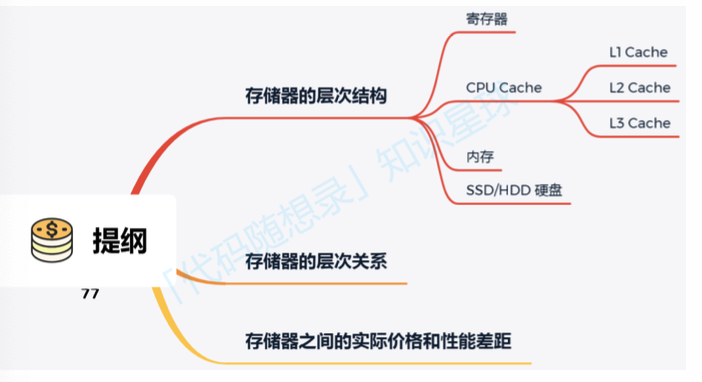

1 存储器的层次结构

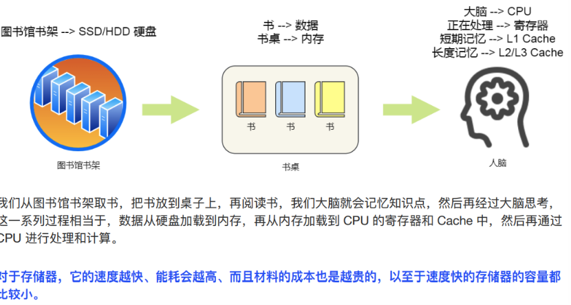


(1)寄存器

寄存器的访问速度非常快，一般要求在半个 CPU 时钟周期内完成读写，CPU 时钟周期跟 CPU 主频息息相关，比
如 2 GHz 主频的 CPU，那么它的时钟周期就是 1/2G，也就是 0.5ns(纳秒)。

(2)CPU Cache(用的是一种叫 SRAM(Static Random-Access Memory，静态随机存储器)的芯片)

SRAM 之所以叫「静态」存储器，是因为只要有电，数据就可以保持存在，而一旦断电，数据就会丢失了。

CPU Cache 通常分为三层，如下图所示:

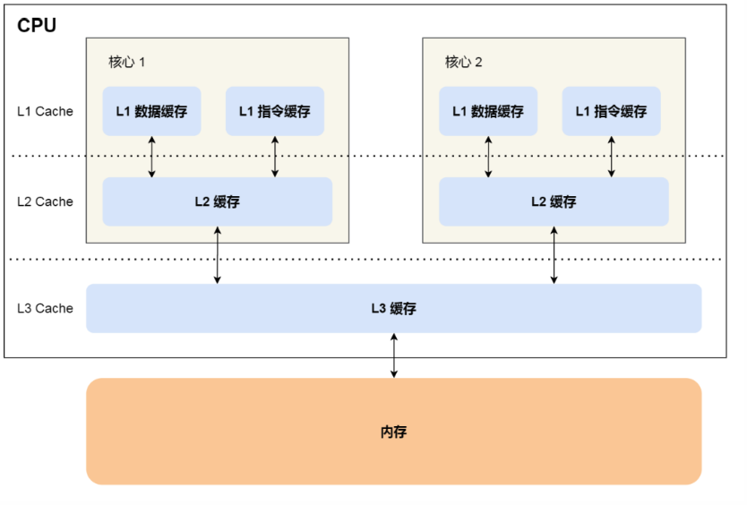

查看各级Cache的大小:

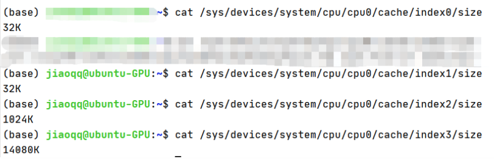

(3)内存

内存用的芯片和 CPU Cache 有所不同，它使用的是一种叫作 DRAM (Dynamic Random Access Memory，动态 随机存取存储器) 的芯片。相比 SRAM，DRAM 的密度更高，功耗更低，有更大的容量，而且造价比 SRAM 芯片 便宜很多。

DRAM 存储一个 bit 数据，只需要一个晶体管和一个电容就能存储，但是因为数据会被存储在电容里，电容会不断 漏电，所以需要「定时刷新」电容，才能保证数据不会被丢失，这就是 DRAM 之所以被称为「动态」存储器的原 因，只有不断刷新，数据才能被存储起来。

DRAM 的数据访问电路和刷新电路都比 SRAM 更复杂，所以访问的速度会更慢，内存速度大概在 200~300 个 时钟 周期之间。

(4)SSD/HDD硬盘:

SSD(Solid-state disk) 就是我们常说的固体硬盘，结构和内存类似，但是它相比内存的优点是断电后数据还是存
在的，而内存、寄存器、高速缓存断电后数据都会丢失。内存的读写速度比 SSD 大概快 10~1000 倍。

机械硬盘(Hard Disk Drive, HDD)，它是通过物理读写的方式来访问 数据的，因此它访问速度是非常慢的，它
的速度比内存慢 10W 倍左右。

2、存储器的层次关系

CPU 并不会直接和每一种存储器设备直接打交道，而是每一种存储器设备只和它相邻的存储器设备打交道。

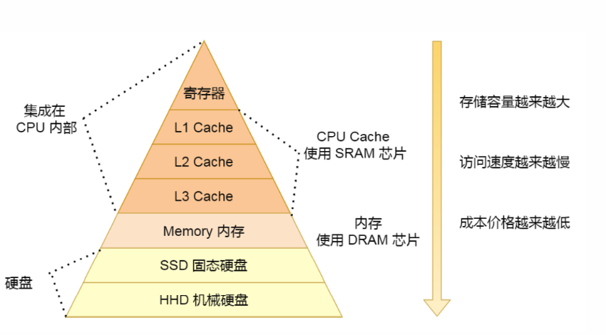

所以，每个存储器只和相邻的一层存储器设备打交道，并且存储设备为了追求更快的速度，所需的材料成本必然也 是更高，也正因为成本太高，所以 CPU 内部的寄存器、L1\L2\L3 Cache 只好用较小的容量，相 反内存、硬盘则 可用更大的容量，这就我们今天所说的存储器层次结构。

3 存储器之间的实际价格和性能差距

不同层级的存储器之间的成本对比图:


机械硬盘(HDD)到底有多慢:


**页面置换算法**

"页"通常指的是虚拟内存中的基本单元，而"页表"是用来管理虚拟地址和物理地址之间映射关系的数据结构

1、最佳页面置换算法(OPT)

置换在「未来」最⻓时间不访问的⻚面,但是实际系统中无法实现，因为程序访问⻚面时是动态的

我们是无法预知每个⻚面在「下一次」访问前的等待时间，因此作为实际算法效率衡量标准。

2、先进先出置换算法(FIFO)

顾名思义，将页面以队列形式保存，先进入队列的页面先被置换进入磁盘。

3、最近最久未使用的置换算法(LRU)

根据页面未被访问时长用升序列表将页面排列，每次将最久未被使用页面置换出去。

4、时钟页面置换算法

把所有的页面都保存在一个类似钟面的「环形链表」中，页面包含一个访问位。

当发生缺页中断时，顺时针遍历页面，如果访问位为1，将其改为0，继续遍历，直到访问到访问位为0页面，进行 置换。

5、最不常用算法

记录每个页面访问次数，当发生缺页中断时候，将访问次数最少的页面置换出去，此方法需要对每个页面访问次数
统计，额外开销。

**分段**

虚拟内存采用的是分页技术，也就是将地址空间划分成固定大小的页，每一页再与内存进行映射。

如果使用分页系统的一维地址空间，动态增长的特点会导致覆盖问题的出现。

分段的做法是把每个表分成段，一个段构成一个独立的地址空间。

每个段的长度可以不同，并且可以动态增长。

1、纯分段

分段和分页本质上是不同的，页面是定长的而段不是。

优点:

    (1) 共享:有助于几个进程之间共享过程和数据。 比如共享库
    (2) 保护:每个段都可以独立地增大或减小而不会影响其他的段

2、分段和分页结合

程序的地址空间划分成多个拥有独立地址空间的段，每个段上的地址空间划分成大小相同的页。

这样既拥有分段系统的共享和保护，又拥有分页系统的虚拟内存功能.

3、分段与分页的比较

对程序员的透明性:

分页透明，但是分段需要程序员显式划分每个段。

地址空间的维度:

分页是一维地址空间，分段是二维的。

大小是否可以改变:

页的大小不可变，段的大小可以动态改变。

出现的原因:

分页主要用于实现虚拟内存，从而获得更大的地址空间;分段主要是为了使程序和数据可以被划分为逻辑上独立的
地址空间并且有助于共享和保护。

**虚拟内存**

简述

属于计算机系统内存管理的一种技术，虚拟地址空间构成虚拟内存，它使得应用程序认为自己拥有连续的可用内存
空间，但实际上是被分隔的多个物理内存页、以及部分暂时存储在磁盘上的交换分区所构成的。虚拟内存的实现通
过硬件异常、硬件地址翻译、主存、磁盘以及内核软件共同完成。

1、地址空间:

地址空间是物理内存的抽象，是一个进程可用于寻址内存的一套地址集合。

2、分页:

地址空间被分割成多个块，每一块称作一页或页面(Page)。每一页有连续的地址范围，这些页被映射到连续的物理 内存(页框)。

3、页表:

页表的目的是把虚拟页面(虚拟地址)映射为页框(物理地址)。

页表给出了虚拟地址与物理地址的映射关系。

从数学的角度说页表是一个函数，他的参数是虚拟页号，结果是物理页页框号

4、加速分页:

(1)TLB加速分页

概念:将虚拟地址直接映射到物理地址，而不必再访问页表，这种设备被称为转换检测缓冲区(TLB)、相联存储 器或快表

工作过程:将一个虚拟地址放入MMU中进行转换时，硬件首先通过将该虚拟页号与TLB中所有表项同时进行匹 配，判断虚拟页面是否在其中:

1. 虚拟页号在TLB中。如果MMU检测一个有效的匹配并且访问操作并不违反保护位，则将页框号直接从TLB中取 出而不必访问页表。

2. 虚拟页号不在TLB中。如果MMU检测到没有有效的匹配项就会进行正常的页表查询。接着从TLB中淘汰一个表 项，然后用新的页表项替换它。

(2)软件TLB管理

5、针对大内存的页表

(1)多级页表

(2)倒排页表

三个重要的能力:

1. 高速缓存

按照存储器层次结构中的缓存划分来看，将位于k层的更小更快的存储设备作为存储在k+1层的更大更慢的存储设备 的缓存。具体如下:

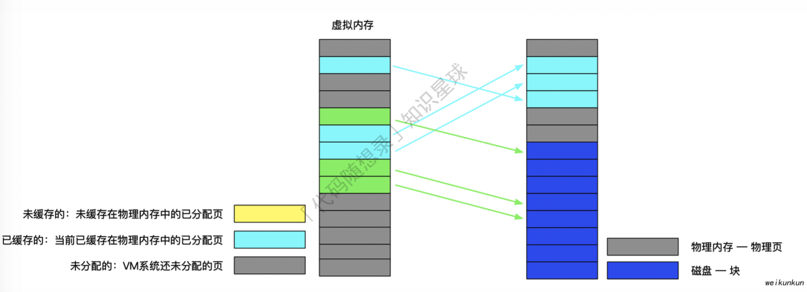

在虚拟内存中的虚拟页共分为三种类型:

   1. 未分配(没有被进程申请使用的，也就是空闲的虚拟内存， 不占用虚拟内存磁盘的任何空间)
   2. 未缓存(仅仅加载到磁盘中的页)
   3. 已缓存(已经加载到内存中的内存页(页框))

2. 内存管理

3. 内存保护

现代操作系统中，用户进程不应该被允许修改它的只读代码段;

而且也不应该允许它读取或修改任何内核中的代码和数据结构;

并且也不允许其读取或者修改其他进程的私有内存，以及修改和其他进程共享的虚拟页面。

如果不对进程的内存访问进行限制，攻击者就能够访问和修改其他进程的私有内存，进而导致整个系统崩溃。大体的虚拟寻址如下:

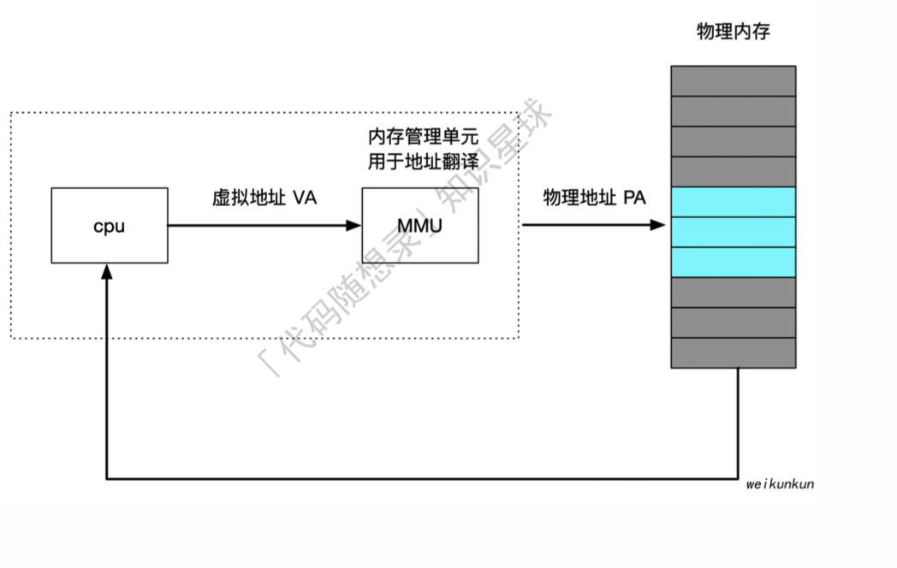

通过MMU，每次都会读取页表中的一个页表条目(PTE)，通过在这些页表条目(PTE)中添加一些标志位，就能够实 现对一个虚拟页的访问控制权限。譬如:

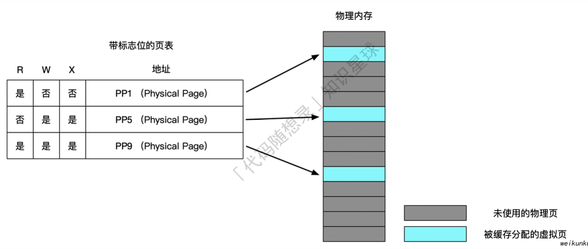

相关的其他概念

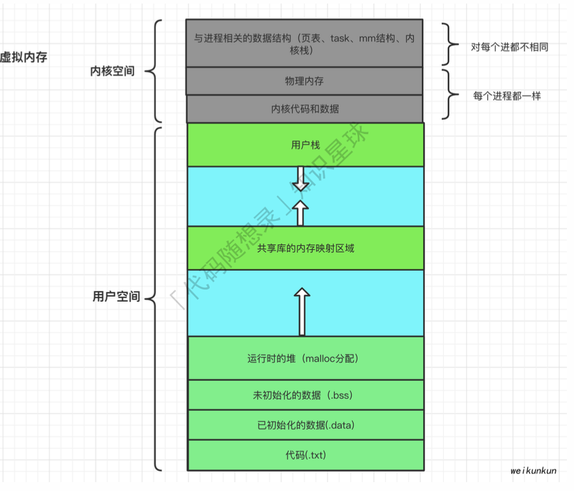

1. 用户态和内核态

为了使操作系统内核提供一个无懈可击的进程抽象，处理器必须提供一种机制，限制一个应用可以执行的指令以及 他可以用来访问的地址空间范围。

处理器通常是用某个控制寄存器中的一个模式位来提供这种观功能的，该寄存器描述了进程当前享有的特权。

当设置了模式位时:

    进程就运行在内核态中。

    运行在内核态中的进程可以执行指令集中的任何指令，并且可以访问系统中的任何内存位置。

没有设置模式位时:

    进程就运行在用户态。用户模式中的进程不允许执行特权指令。

    比如:停止处理器、改变模式位、或者发起一个I/O操作。同时也不允许用户态下的进程直接引用地址空间中内核 空间的代码和数据。 任何这样的尝试都会导致致命的保护故障。用户态下的程序必须通过系统调用接又间接的访问内核代码和数据。

2. 上下文切换 

上下文切换属于一种较高层形式的异常控制流，进行上下切换涉及到的内容如下:

(1)各种寄存器，TLB 也是其中之一。

(2)程序计数器

(3)用户栈

(4)内核栈

(5)内核中的各种数据结构

1. 页表
2. task_struct 
3. mm_struct

小总结

虚拟内存的思想，整体来看就是:通过结合磁盘和内存各自的优势，利用中间层对资源进行更合理地调度，充分提高资源的利用率。并提供和谐以及统一的抽象。

为什么需要虚拟内存:(摘自 为什么Linux需要虚拟内存一文)

   1. 虚拟内存可以结合磁盘和物理内存的优势为进程提供看起来速度足够快并且容量足够大的存储
   2. 虚拟内存可以为进程提供独立的内存空间并引入多层的页表结构将虚拟内存翻译成物理内存，进程之间可以共享
   物理内存减少开销，也能简化程序的链接、装载以及内存分配过程;
   3. 虚拟内存可以控制进程对物理内存的访问，隔离不同进程的访问权限，提高系统的安全性。

## 文件系统

**文件**

1. 文件

文件是一种抽象机制，它提供了一种在磁上保存信息而且方便以后读取的方法。这种方法可以使用户不必了解存储信息的方法、位置和实际磁盘工作方式等有关细节

2. 文件命名

win95、win98用的都是MS-DOS的文件系统，即FAT-16， win98扩展了FAT-16成为FAT-32。

较新版的操作系统NTFS,win8配备ReFS。微软优化FAT,叫作exFAT。prog.c，圆点后面的部分称为文件扩展名。

3. 文件结构

1、字节结构

把文件看成字节序列为操作系统提供了最大的灵活度

2、记录序列

文件结构上的第一步改进，这种模型中，文件是具有固定长度记录的序列

3、树

文件在这种结构中由一棵记录树构成，每个记录不必具有相同的长度，记录的固定位置上有一个键字段。这棵树按 “键”字段进行排序，从而可以对特定“键”进行快速查找。

4. 文件类型

   1. 普通文件
   2. 目录
   3. 字符特殊文件(UNIX) 
   4. 块特殊文件(UNIX)

5. 文件访问

1、顺序访问

按顺序读取文件的全部字节，早期操作系统只有这种访问方式

2、随机访问文件

当用磁盘存储文件时，可以以任何次序读取其中字节或记录的文件。许多应用程序需要这种类型文件

6. 文件属性

除了文件名和数据外，所有操作系统还会保存其他的文件相关信息，如创建日期、时间和大小等，这些附加的信息
称为文件属性

举例:

创建者:创建文件者ID 所有者:当前所有者 当前大小:文件字节数 ··· : ···

7. 文件操作

使用文件的目的是存储信息并方便以后检索。对于存储和检索，不同系统提供了不同的操作。

常见的文件操作(系统调用):

1、create

创建不包含任何数据的文件

2、delete

当不再需要某个文件时，必须删除该文件以释放磁盘空间

3、open

在使用文件之前，必须先打开文件

4、close

访问结束后，不再需要文件属性和磁盘地址，这时应该关闭文件以释放内部表空间

5、read

在文件中读取数据

6、write

向文件写数据，写操作一般也是从文件当前位置开始

7、append

此调用是write的限制形式，他只能在文件末尾添加数据

8、seek

对于随机访问文件，要指定从何处开始获取数据，通常的方法是用seek系统调用把当前位置指针指向文件中特定的 位置。

9、get attributes

进程运行常需要读取文件属性

10、set attributes 

某些属性是可由用户设置的，甚至在文件创建之后 

11、rename 

用户尝尝要改变已有的名字，rename系统调用用于这一目的

**目录**

文件系统通常提供目录或文件夹用于记录文件的位置，在很多操作系统中目录本身也是文件

1. 一级目录系统

在一个目录中包含所有文件，这有时称为根目录

2. 层级目录系统

当用户有着数以千计的文件，为了寻找方便。需要层次结构(即一个目录树)

3. 路径名

    1、绝对路径名

    它由从根目录到文件的路径组成。
    
    Windows : \usr\ast\maibox
    UNIX:/usr/ast/maibox

    路径名的第一个字符是分隔符，则这个路径是绝对路径    

    2、相对路径名

    它常和工作目录(working directory)(也和当前目录(acurrent directory))一起使用

    例:UNIX

    `cp /usr/ast/mailbox /usr/ast/mailbox/mailbox.bak`

    和命令

    `cp mailbox mailbox.bak # 具有相同的含义`

    3、特殊目录项

    . dot:指当前目录

    .. dotdot 指其父目录

4. 目录操作

管理目录的系统调用

举例(Unix):

```
create
delete
opendir
closedir
readdir
rename
link
unlink
# 创建目录
# 删除目录
# 目录内容可被读取
# 读目录结束
# 返回打开目录下一个目录项
# 改变目录名
# 链接技术允许在多个目录中出现同一个文件 # 删除目录项
```

## 文件系统的实现

文件存储实现的关键问题是记录各个文件分别用到哪些磁盘块。不同的操作系统用到不同的方法

1. 文件系统布局
   
文件系统存放在磁盘上。多数磁盘划分为一个或多个分区，每个分区中国有一个独立的文件系统。

磁盘0号扇区称为主引导记录(MBR)，用来引导计算机。在MBR结尾是分区表。该表给出每个分区的起始结束地 址。

表中的一个分区被标记为活动区。在计算机被引导时，BIOS读入并执行MBR。MBR做的第一件事是确定活动分 区，读入它的第一个块，称为引导块，并执行之。

引导块中的程序将装载该分区中的操作系统。

2. 文件的实现

1、连续分配

最简单的分配是把每个文件作为一连串连续数据块存储在磁盘

优势:

(1)实现简单

记录每个文件用到磁盘块简化为只需记住两个数字即可:第一块的磁盘地址和文件的块数。给定了第一块编号，一个简单的加法就可以找到任何其他块的编号

(2)操作性能较好

因为单个操作中就能从磁盘上读出整个文件。只需一次寻找。

2、链表分配

为每个文件构造磁盘块链表。每一块的第一个字作为指向下一块的指针，块的其他部分存放数据。

优势:

(1)可以充分利用磁盘块，不会因为磁盘碎片浪费存储内存

(2)随机访问快。

缺点:

指针占用一些字节，每个磁盘块存储数据的字节数不再是2的整数次幂。怪异的大小降低了系统的运行效率，每个 块前几个字节被指向下一个块的指针所占据，需要从两个磁盘中获取拼接信息，这就因复制而引发额外的开销。

3、采用内存中的表进行链表分配

取出每个磁盘块的指针字，把他放在内存的一个表中，解决链表分配的不足。内存中这样的表格称为文件分配表
(File Allocation Table，FAT)

4、i节点

最后一个记录各文件分别包含哪些磁盘块的方法是给每个文件赋予一个称为i节点的数据结构，其中列出了文件属性 和文件的磁盘地址。

3. 目录的实现

在读文件之前，必须先打开文件。打开文件时，操作系统利用用户给出的路径名找到相应的目录项。

简单目录:包含固定大小的目录，在目录项中有磁盘地址和属性

采用i节点的系统:把文件属性存放在i节点中而不是目录项中。这种情形下，目录项会更短。

4. 共享文件

当几个用户同在一个项目里工作时，他们常常需要共享文件。

共享文件与目录的联系称为一个链接(link)。这样文件系统本身就是一个有向无环图(DAG)，而不是一棵树。

5. 日志结构文件系统

CPU运行速度越来越快，磁盘容量越来越大，价格越来越便宜(但磁盘速度并没有增快多少)，同时内存容量也以 指数形式增长。

而没有得到快速发展的参数是磁道的寻道时间。这些成为了文件系统性能的瓶颈，为了解决这一问题设计了全新的 文件系统即日志结构文件系统(LFS)。

虽然是一个很吸引人的想法，由于它们和文件系统不匹配，该文件系统并没有被广泛应用。

6. 日志文件系统

基本的想法是保存一个用于记录系统下一步将要做什么的日志。

这样当系统在完成他们即将完成的任务前崩溃时，重新启动后，可以通过查看日志，获取崩溃前计划完成的任务，并完成它们。

这样的文件日志系统，并已经被实际应用。微软的NTFS、Linux的 ext3和ReiserFS文件系统都使用日志。

7. 虚拟文件系统

将多个文件系统整合到一个统一的结构中。

一个Linux系统可以用ext2作为根文件系统，ext3分区装载在/usr下，另一块采用ReiserFS文件系统的硬盘装载 在/home下，以及一个ISO 9660的CD-ROM临时装载在/mnt下。从用户的观点来看，只有一个文件系统层级。

它们事实上是多种文件系统，对于用户和进程是不可见的。绝大多数Unix操作系统都在使用虚拟文件系统(Virtual File System, VFS)

## 文件系统的管理和优化

1. 磁盘空间管理

几乎所有文件系统都把文件分割成固定大小的块来存储，各块之间不一定相邻

1、块大小

从历史的观点上来说，文件系统将大小设在1~4KB之间，但现在随着磁盘超过了1TB，还是将块的大小提升到64KB
并且接受浪费的磁盘孔空间，这样也许更好。磁盘空间几乎不再会短缺。

2、记录空闲块

(1)磁盘块链表

链表的每个块中包含尽可能多的空闲磁盘块号。

通常情况下，采用空闲块存放空闲表，这样不会影响存储器

(2)位图

在位图中，空闲块用1表示，已分配块用0表示。

(3)磁盘配额

为防止人们贪心而占有太多的磁盘空间，用户操作系统常常提供一种强制性磁盘配额机制。
其思想是系统管理员分给每个用户拥有文件和块的最大数量，操作系统确保每个用户不超过分给他们的配额。(配
额表、打开文件表)

2. 文件系统备份

做磁盘备份主要是处理好两个潜在问题中的一个

   1. 从意外的灾难中恢复 
   2. 从错误的操作中恢复

3. 文件系统的一致性

很多文件系统读取磁盘块，进行修改后，再写回磁盘。

如果在修改过的磁盘块全部写回之前系统崩溃，则文件系统有可能处于不一致状态。

如果一些未被写回的块是i节点块、目录块或者是包含有空闲表的块时，这个问题尤为严重

4. 文件系统性能

    1、高速缓存

    减少磁盘访问次数技术是块高速缓存(block cache)或者缓冲区高速缓存(buffer cache)。

    本书中，高速缓存指的是一系列的块，它们在逻辑上属于磁盘，但实际上基于性能的考虑被保存在内存中。

    2、块提取读

    在需要用到块之前，试图提前将其写入高速缓存，从而提高命中率。

    块提前读策略只适用于实际顺序读取的文件。对随机访问文件，提前读丝毫不起作用。

    3、减少磁盘臂运动

    把可能顺序访问的块放一起，当然最好是同一柱面上，从而减少磁盘臂的移动次数。

5. 磁盘碎片整理

移动文件使它们相邻，并把所有的空闲空间放在一个或多个大的连续区域内。

## 磁盘

**生磁盘的使用**

生磁盘:根据盘块号来使用磁盘;

熟磁盘:根据文件来使用磁盘。

**磁盘如何使用?(仍然是 3 件事)**

1. 发送 out 指令;
2. 文件视图
3. 发送中断

**磁盘的结构**

盘面:类似于多个堆叠在一起的 DVD 光盘

磁道:每个 DVD 光盘上的同心圆

扇区:每个同心圆上的 一段儿 小区域

**磁盘 IO 过程**

寻道:将磁头移动到 指定 磁道

旋转:将磁头旋转到磁道中的指定 扇区

传输:对指定扇区 进行 磁盘数据 IO 读写

**一层抽象**

通过盘块号读写磁盘

只用利用 盘块号 block 来进行 磁盘IO，然后由系统根据 block 计算出 C、H、S 即可

**磁盘编址**

由于寻道时间 通常时间更长一些，所以，为了让 磁盘 IO 时间尽可能短一些，则需要使 寻道时间尽量段。即，把当 一个 磁道编址用完后，向下一个 柱面 继续编号，而不是向 下一个 磁道继续编号。

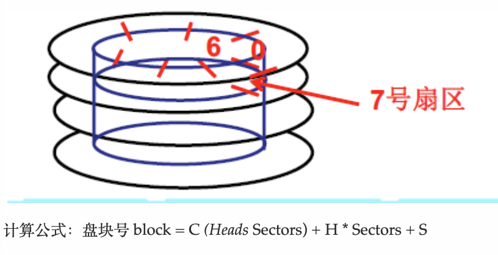

**二层抽象**

多个进程通过队列使用磁盘

虽然一层抽象(利用 盘块号)可以达到使用磁盘的目的，但是如果有多个磁盘访问请求出现在请求队列怎么办? 此时，操作系统会根据 磁盘调度算法 来挑选一个 磁盘请求服务

**常见磁盘调度算法**

1、FCFS:找最先来的请求 优点:公平

缺点:并不提供 最快的服务

FCFS 在寻道过程中，可能已经遇到一些以后可能需要访问的 磁道，但是会跳过，而造成 访问磁道 耗费时间较多。

2、SSTF:类似于 SJF，每次选择距离当前磁头最近的待处理请求

优点:寻道时间最短

缺点:可能造成部分请求 “饥饿”(当某个请求的磁盘距离磁头较远，而一直有比其更近的请求时，这个请求一直无 法执行)

3、SCAN 算法:类似电梯，先处理向上的请求，然后再处理反方向的请求

优点:不会造成部分请求的 “饥饿”

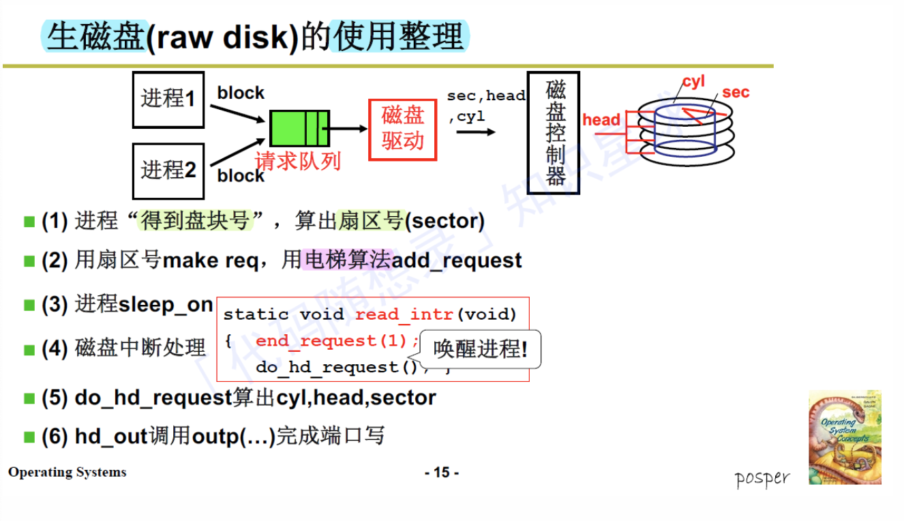


**三层抽象**

利用文件使用磁盘，就成了熟磁盘

需要在盘块上引入更高一层次的抽象概念! 文件

用户眼里的 “文件”:一堆字符序列(字符流)

磁盘上的 “文件”:多个盘块构成的集合

所以，如果要利用文件来进行磁盘IO的话，就需要建立字符流到盘块集合的映射关系

常见的文件映射关系(文件实现方式)有以下 3 种:

1. 顺序结构 
2. 链式结构 
3. 索引

顺序结构-实现文件

FCB:记录文件在磁盘中的起始块

**文件->盘块号**

将文件按照 连续结构存放;(下 左图);

对每个文件建立一个 FCB，记录该文件在磁盘中的 起始块号;

根据文件(字符流)中的第 n 个待查字符 + FCB 计算 (n / 每个盘块的大小 + FCB中的 起始块号】出其在磁盘上对应的 盘块号 【得到盘块号，然后采用 SCAN 算法]

这种方法的缺点:

1. 利用顺序结构存储文件，不利用文件的修改(因为 顺序存储的 增/删 代价非常大)

2. 所以，当需要 动态修改 文件时，最好使用 链式存储文件

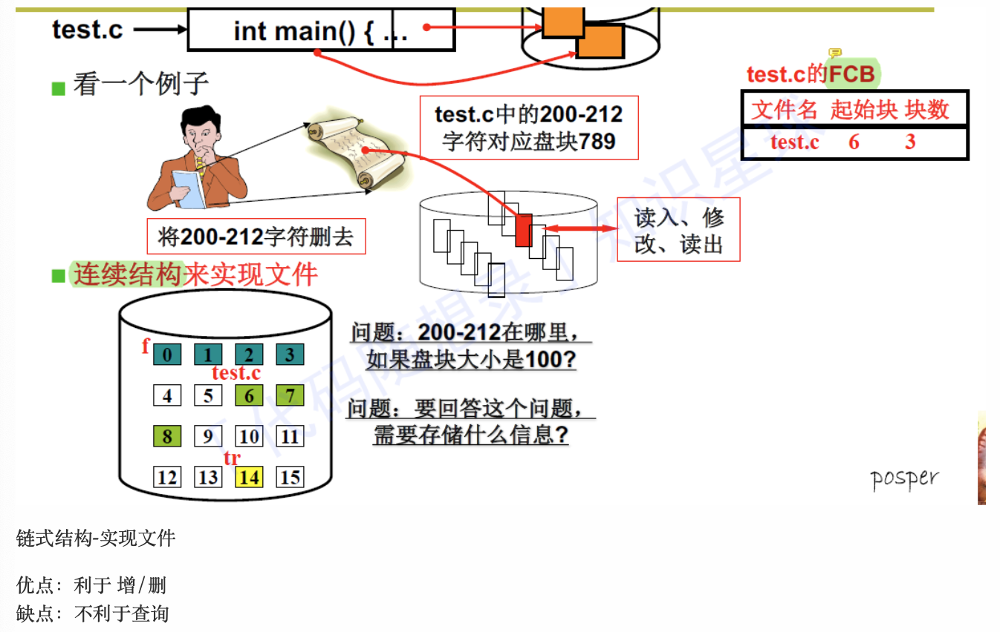

## 外设管理

**如何让外设动起来**

1. CPU 向 外设的控制器发送指令，即 out 指令
2. 形成 文件视图(为了统一 out 指令的形式)
3. 中断(外设处理完事后，需要通知 cpu 继续接手 下一步处理)

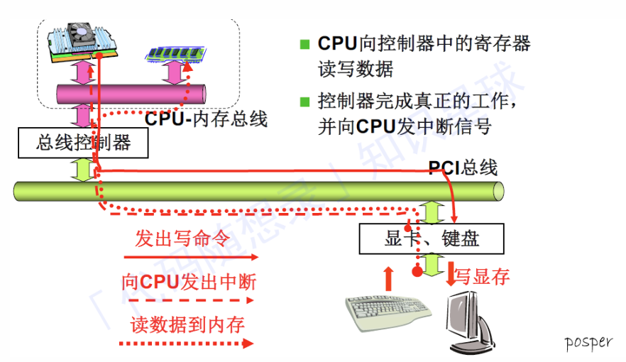

显示器如何工作?即，printf 函数的工作流程

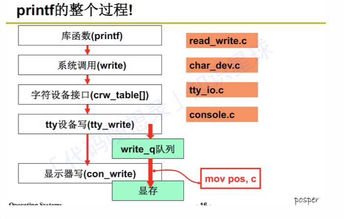

键盘如何工作?

中断处理(根据扫描码 获取 对应的 ascii 码);

将对应的 ascii 码 加入 缓冲队列 read_que 中，等待上层程序调用

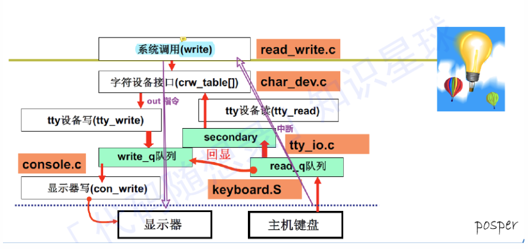

## Linux

**Linux 内存管理**

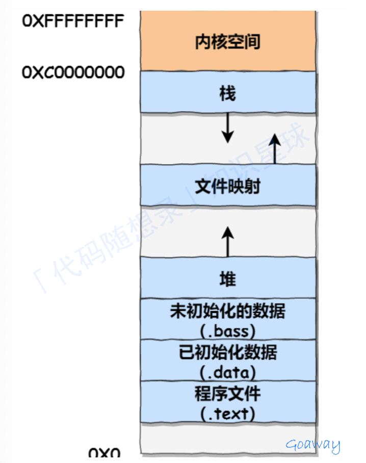

1、程序文件段

包括程序的二进制可执行代码，只读;TEXT

2、已初始化数据段


包括已初始化的全局变量和静态常量;DATA

3、未初始化数据段

包括未初始化的静态变量和全局变量;BSS

4、堆段

包括动态分配的内存，从低地址开始向上增⻓;

5、文件映射段

包括动态库、共享内存等，从低地址开始向上增长(跟硬件和内核版本有关);

6、栈段

包括函数的参数值和局部变量、函数调用的上下文等。栈的大小是固定的，一般是 8 MB 。当然系统也提供了参 数，以便我们自定义大小;栈区是从高地址位向低地址位增长的

## Linux虚拟内存

对32位处理器，虚拟内存空间为4G，每个进程都认为自己拥有4G的空间，实际上，在虚拟内存对应的物理内存上，可能只对应的一点点的物理内存。

进程得到的这4G虚拟内存是一个连续的地址空间(这也只是进程认为)，而实际上，它通常是被分隔成多个物理内 存碎片，还有一部分存储在外部磁盘存储器上，在需要时进行数据交换。

由于存在两个内存地址，因此一个应用程序从编写到被执行，需要进行两次映射。第一次是映射到虚拟内存空间， 第二次时映射到物理内存空间。在计算机系统中，第两次映射的工作是由硬件和软件共同来完成的。承担这个任务 的硬件部分叫做存储管理单元 MMU，软件部分就是操作系统的内存管理模块了。

1、如何处理虚拟地址和物理地址的关系

(1)内存分页

分页就是把整个虚拟和物理内存切成一段段固定大小的空间，连续且尺寸固定的内存空间叫页，Linux下每一页大 小4KB。虚拟内存和物理内存之间通过页表来映射。

当进程访问的虚拟地址在页表中查不到时，系统会产生一个缺页异常，进入系统内核空间分配物理内存、更新进程
页表，最后再返回用户空间，恢复进程的运行。

1. 采用了分页，那么释放的内存都是以页为单位释放的，也就不会产生无法给进程使用的小内存，解决了内存碎片 的问题

2. 内存空间不足时，操作系统将正在运行的进程中，最近没使用的内存页面释放(暂时写入硬盘)需要的时候再加 载进来，一次性只有少数的页，解决了交换效率低的问题

3. 分页使我们在加载程序时，不用一次性加载到物理内存，可以只有在程序运行中，需要用到对应虚拟内存页里面 的指令和数据时，再加载到物理内存里面去


2、分页虚拟地址和物理地址是如何映射的

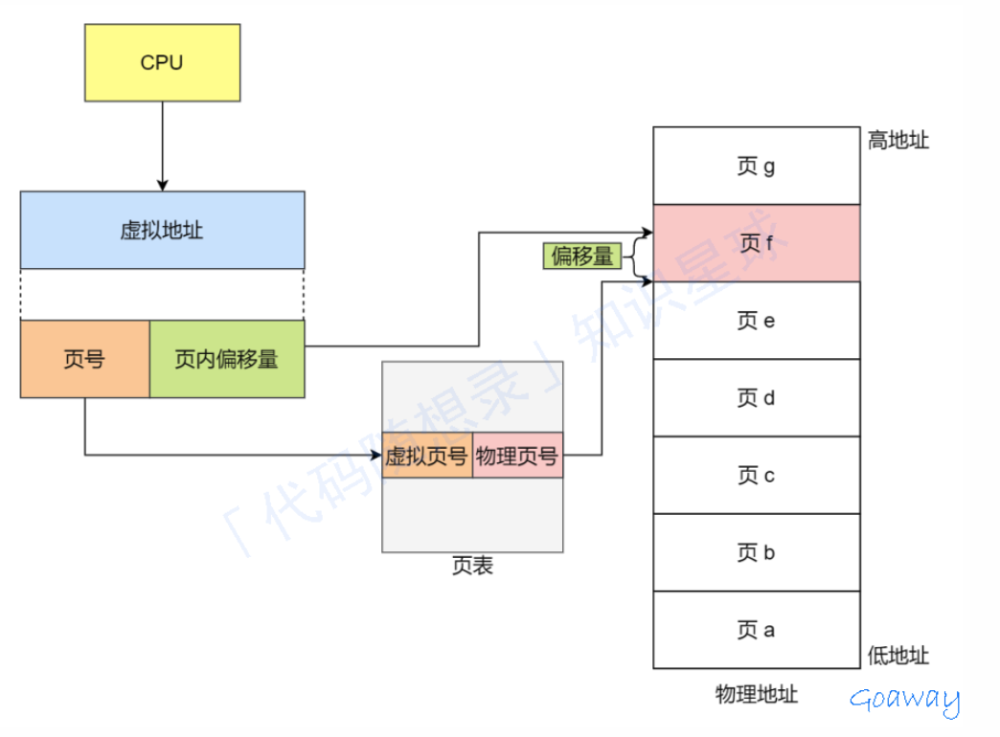

虚拟地址分为:页号和页内偏移。

页号作为页表的索引，页表包含物理页每页所在物理内存的基地址，这个基地址与页内偏移的组合就形成了物理内
存地址。

3、简单的分页缺陷

空间上的缺陷:

32位，单进程一个页4KB，虚拟内存4GB，就有2^20个页，一个页表项4字节，结果是4GB空间映射需要4*2^20 = 4MB存储页表。多进程100，需要400MB。

以页表一定要覆盖全部虚拟地址空间，不分级的页表就需要有 100 多万个页表项来映射，二级分页则只需要 1024 个页表项(此时一级页表覆盖到了全部虚拟地址空间，二级页表在需要时创建)。

4、段页式内存管理

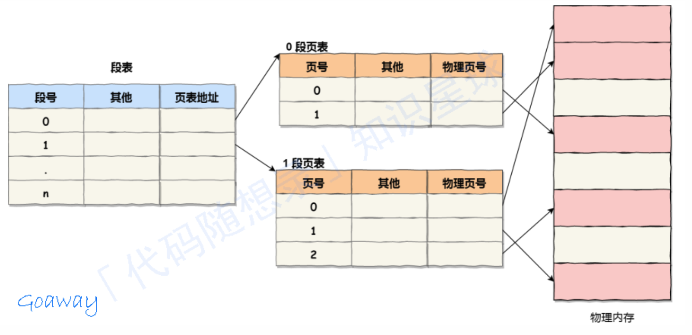

地址结构就由段号、段内页号和页内位移三部分组成。

   1. 第一次访问段表，得到页表起始地址
   2. 第二次访问页表，得到物理页号
   3. 第三次将物理页号与页内位移组合，得到物理地址

可用软、硬件相结合的方法实现段页式地址变换，这样虽然增加了硬件成本和系统开销，但提高了内存的利用率。

**Linux 信号**

信号是用户、系统、进程发送给目标进程的信息，通知某个状态的改变或系统异常。

linux常用信号:

1. SIGHUP控制终端挂起
2. SIGPIPE向读端关闭的通道或socket连接中写数据
3. SIGURG:socket连接上收到紧急数据

**Linux设计**

1、MutiTask 多任务

多个任务同时执行，同时可以是并发或并行。

2、SMP 对称多处理

每个CPU地位相等，使用权限相同，多个CPU共享一个内存，每个 CPU 都可以访问完整的内存和硬件资源。

3、ELF 可执行文件链接格式

Linux中可执行文件的存储格式。

4、Monolithic Kerne宏内核的特征是系统内核的所有模块

比如进程调度、内存管理、文件系统、设备驱动等，都运行在内核态。Linux 的内核是一个完整的可执行程序，且 拥有最高的权限。

**IO复用**

1. I/O(数据交换过程)

1、背景

I/O即Input/Output(输入和输出)，由于程序和运行时数据是在内存中驻留，由CPU这个超快的计算核心来执行，涉及到数据交换的地方，通常是磁盘、网络等，就需要IO接又。

IO编程中涉及到流，其是相对于内存而言的，所以，Input Stream就是数据从外面(磁盘、网络)流进内存，Output Stream就是数据从内存流到外面去。

2、概念

I/O操作就是在运行代码的过程中，可能需要对文件的读写，即将文件输入(Input)到内存和将代码执行结果产生 的文件输出(Output)到外设(网络、磁盘)的过程。

3、分类

   1. 网络I/O:通过网络进行数据的拉取和输出;
   2. 磁盘I/O:主要是对磁盘进行读写工作。

2. 五种IO模型

1、输入阶段一般操作

    1. 等待数据准备好
    2. 从内核向进程复制数据

2、例如:

   1. 等待数据从网络中到达:所等分组到达时，被复制到内核中的某个缓冲区
   2. 把数据从内核缓冲区复制到应用进程缓冲区

3、分类

   1. 阻塞式I/O
   2. 非阻塞式I/O
   3. I/O复用(select和poll)
   4. 信号驱动式I/O(SIGIO)
   5. 异步I/O(POSIX的aio_系列函数)


4、同步I/O

(1)阻塞式I/O

进程或线程等待某个条件，如果条件不满足，则一直等下去。条件满足，则进行下一步操作。(默认情况下)

应用进程通过系统调用 recvfrom 接收数据，但由于内核还未准备好数据报，应用进程就会阻塞住，直到内核准备 好数据报，recvfrom 完成数据报复制工作，应用进程才能结束阻塞状态。

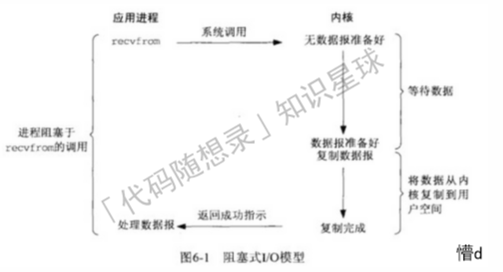

优点:

设备文件不可操作时，可进入休眠状态，将CPU资源让出;当设备文件可以操作的时候就必须唤醒进程，一般在中 断函数中完成唤醒工作;

缺点:

耗费时间，适合并发低，时效性要求低的情况。

(2)非阻塞式I/O

应用进程与内核交互，目的未达到之前，不再一味的等着，而是直接返回;

通过轮询的方式，不停的去问内核数据有没有准备好。如果某一次轮询发现数据已经准备好了，那就把数据拷贝到
用户空间中。

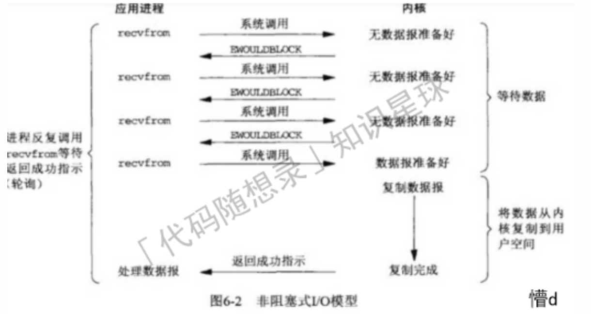

前三次调用 recvfrom 时没有数据可返回，内核立即返回 EWOULDBLOCK 错误

第四次调用 recvfrom 时，已有一个数据报准备好，将其从内核复制到应用进程缓冲区， recvfrom 成功返回;

轮询(polling):

应用进程持续轮询内核，以查看某个操作是否就绪;

缺点:往往耗费大量CPU时间。

(3)IO复用

通过调用 select 或 poll，阻塞在这两个系统调用中的某一个之上，而不是阻塞在真正的I/O系统调用上。

阻塞于 select 调用，等待数据报套接字变为可读，当 select 返回套接字可读这一条件时，调用 recvfrom 把所读数据 报复制到应用进程缓存区。

多个进程I/O注册到同一个 select，当用户进程调用 select，select 监听所有注册好的IO:

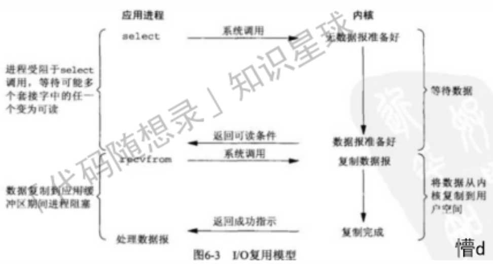

   1. 若所有被监听的I/O需要的数据未准备好，则阻塞
   2. 任意一个所需数据准备好后，select 调用返回
   3. 用户进程通过 recvfrom 进行数据拷贝


优点:可以等待多个描述符就绪。

(4)信号驱动I/O

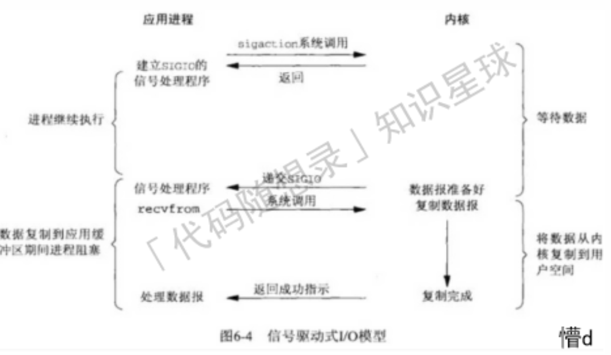

开启套接字信号驱动I/O功能，通过 sigaction 系统调用安装一个信号处理函数，该系统函数立即返回，不阻塞;

数据报准备好后，内核为该进程产生一个 SIGIO 信号递交给进程;

可以在信号处理函数中调用 recvfrom 读取数据报，通知主循环数据已准备好待处理;

可以立即通知主循环，读取数据报。

优点:

等待数据报到达期间进程不被阻塞。主循环可以继续执行，等待来自信号处理函数的通知:既可以是数据已经准备
好被处理，也可以是数据报已经准备好被读取。

(5)异步IO

用户进程告知内核启动某个操作，并由内核在整个操作中完成后通知用户进程。

与信号驱动I/O的区别:

1. 信号驱动I/O是由内核通知我们何时可以启动一个I/O操作
2. 异步I/O是由内核通知我们I/O操作何时完成

步骤:

   1. 用户进程调用aio_read函数，给内核传递描述符、缓冲区指针、缓冲区大小和文件偏移，告诉内核整个操作完成 时如何通知我们，然后就立刻去做其他事情;
   2. 当内核收到aio_read后，会立刻返回，然后内核开始等待数据准备，数据准备好以后，直接把数据拷贝到用户空 间，然后再通知进程本次IO已经完成。

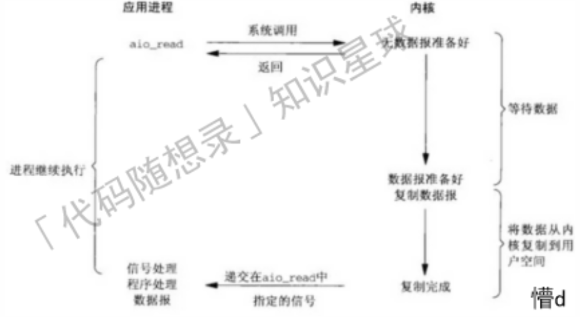

3. 各种IO模型的比较

1、同步I/O

导致请求进程阻塞，直到I/O操作完成;

四种同步模型的区别在于第一阶段等待数据的处理方式不同，第二阶段均为将数据从内核空间复制到用户空间缓冲 区期间，进程阻塞于recvfrom调用。

2、异步I/O

不导致请求进程阻塞。

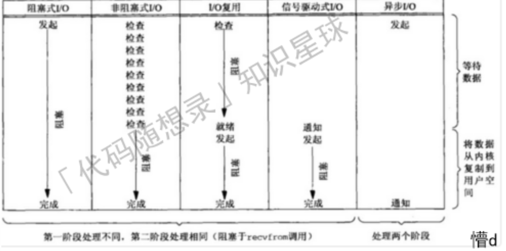

3、I/O复用函数

多路复用接又 select/poll/epoll ，内核提供给用户态的多路复用系统调用，进程可以通过一个系统调用函数从内核
中获取多个事件:

(1)select-->两次遍历+两次拷贝

把已连接的socket放在一个文件描述符集合，调用 select 函数将文件描述符集合拷贝到内核里，让内核来检查是否 有网络事件产生;

通过遍历，有事件产生就把此socket标记为可读/可写，然后再整个拷贝回用户态;

用户态还需要遍历找到刚刚标记的socket。

(2)poll

动态数组，以链表形式来组织，相比于select，没有文件描述符个数限制，当然还会受到系统文件描述符限制。

(3)epoll(event poll)-->红黑树

在内核里使用红黑树来跟踪进程所有待检测的文件描述字。

调用epoll_ctl() 函数，把需要监控的 socket 加入内核中的红黑树里:(红黑树的增删查时间复杂度是O(logn)，不需 要每次操作都传入整个集合，只需要传入一个待检测的socket，减少了内核和用户空间的大量数据拷贝和内存分 配)

epoll 使用事件驱动的机制，内核里维护了一个链表来记录就绪事件(当某个 socket 有事件发生时，通过回调函 数，内核会将其加入到这个就绪事件列表中)


当用户调用 epoll_wait() 函数时，只会返回有事件发生的文件描述符的个数，不需要像 select/poll 那样轮询扫描整 个 socket 集合，大大提高了检测的效率。

(4)epoll触发模式

epoll支持的事件触发模式:


    (1)边缘触发ET 

    (2)水平触发LT

边缘触发模式ET:

当被监控的 Socket 描述符上有可读事件发生时，服务器只会从 epoll_wait中苏醒一次，即使进程没有调用 read 函 数从内核读取数据，也依然只苏醒一次，因此我们程序要保证一次性将内核缓冲区的数据读取完，只有第一次满足 条件的时候才触发，之后就不会再传递同样的事件了。

水平触发模式LT:

当被监控的 Socket 上有可读事件发生时，服务器不断地从 epoll_wait中苏醒，直到内核缓冲区数据被 read 函数读 完才结束，目的是告诉我们有数据，只要满足事件的条件，比如内核中有数据需要读，就一直不断地把这个事件传 递给用户。

(5)select和epoll的区别

   1. select 和 poll 采用轮询的方式检查就绪事件，每次都要扫描整个文件描述符，复杂度O(N);
      
   2. epoll 采用回调方式检查就绪事件，只会返回有事件发生的文件描述符的个数，复杂度O(1);

   3. select 只工作在低效的LT模式，epoll 可以在 ET 高效模式工作;

   4. epoll 是 Linux 所特有，而 select 则应该是 POSIX 所规定，一般操作系统均有实现;

   5. select 单个进程可监视的fd数量有限，即能监听端又的大小有限，64位是2048;epoll 没有最大并发连接的限制， 能打开的 fd 的上限远大于2048(1G的内存上能监听约10万个端又);

   6. select 内核需要将消息传递到用户空间，都需要内核拷贝动作;epoll通过内核和用户空间共享一块内存来实现 的。

**网络**

如何在基本网络通信模型基础上提升服务器自身服务响应?

1、多进程服务器

每次的请求父进程fork出子进程进行业务处理，父进程用于处理请求连接

(1)父子进程的生命周期绝大多数都不相同，如何、何时进行销毁，才能确保不会大量出僵尸进程

(2)子父进程之间如何进行通讯?

进程的创建、切换都需要都会带来大量的开销，同时每个进程都具有自己独立的虚拟内存空间，所以需要使用到 IPC机制，完成进程间的数据交换

2、I/O复用服务器

1. 在不额外创建进程的基础上同时为多个请求端提供请求
2. select、poll、epoll实现优缺点

3、多线程服务器

同一进程下的多个线程共享进程的系统资源，所以相比于多进程，同进程下的多线程通信更加方便，并且切换
  的开销小很多。

1. 如何创建、销毁线程 
2. 如何保证线程的安全 
3. 线程间的通信


