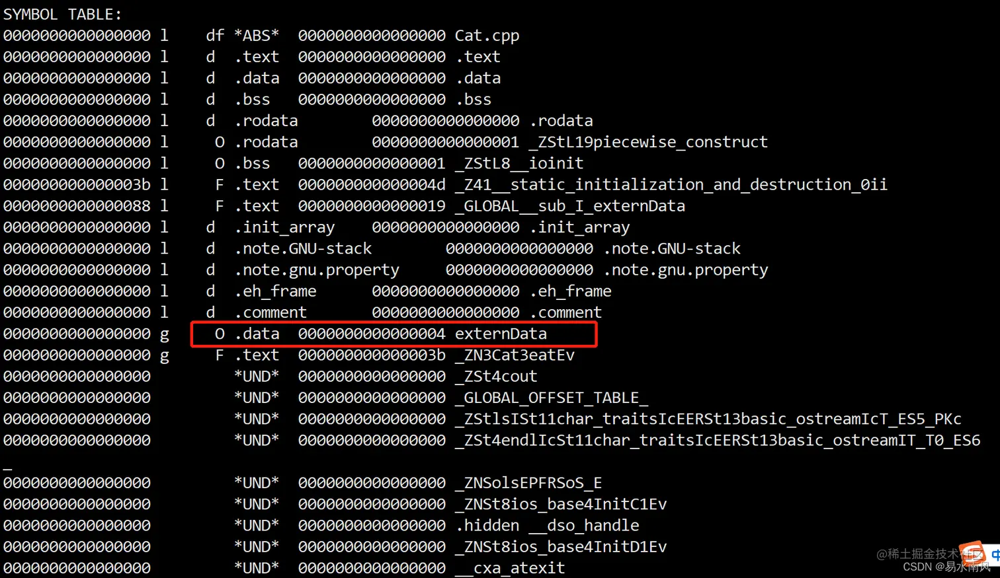
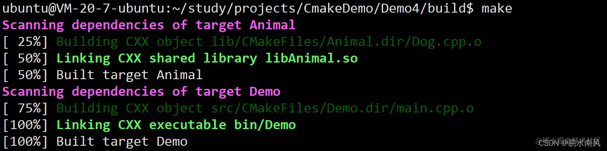

## 以git编译安装为例

下载压缩包wget https://github.com/git/git/archive/refs/tags/v2.41.0.zip

unzip 

cd 

找到README.md

编译安装之前先安装所需依赖包：（用的是docker镜像为ubuntu）

    sudo apt-get install libcurl4-openssl-dev libexpat1-dev gettext libssl-dev zlib1g-dev perl make autoconf curl expat tclsh gettext

1. make configure

    用于生成配置脚本 configure

    在 Git 项目中，configure 脚本是一个自动生成的脚本，它负责根据当前系统的环境和特性生成适合的 Makefile。

    configure 脚本**基于 Autoconf 工具链生成**，用于检测系统的功能、库文件、依赖项和其他配置选项，并根据这些信息生成适当的 Makefile 文件。

    运行 make configure 命令会执行一系列预定义的规则和命令，以便生成 configure 脚本。具体而言，该命令将运行 Autoconf 工具，扫描源代码目录中的配置模板文件（如 configure.ac 或 configure.in），并根据模板生成最终的 configure 脚本。

    这样，开发者可以在不同的系统上使用相同的源代码，而无需手动修改 Makefile 来适应不同的环境和配置。

2. make 

    可以传入参数：`make prefix=/root/gjh`

    是一个常用的构建工具,它主要用于编译源代码并生成可执行文件、库文件或其他构建目标。

    要使用 **make 工具**，通常**需要创建一个名为 Makefile**的文件，并在其中定义项目的规则和依赖关系。然后在终端或命令行界面中运行 make 命令，make 工具将读取 Makefile 文件并执行相应的构建操作。

    1. make install

    在使用 make 命令编译软件时，通常会生成可执行文件、库文件、配置文件等。但是这些文件只是编译好的结果，并没有真正安装到系统中。如果要将这些文件安装到系统中，可以使用 make install 命令。

    使用 make install 命令时，需要以管理员权限运行，以便将文件复制到系统目录。可以使用 sudo make install 命令来获取管理员权限并执行安装操作。

4. 加入环境变量

   - 临时加入当前会话(重启会话会失效)：export PATH="/root/bin:$PATH"

       exec bash, 重启bash会话

   - 永久：echo "export PATH=$PATH:/root/bin" >> /etc/profile

    source /etc/profile (用于在**当前**终端会话中重新加载/etc/profile文件)

    (这段命令是将路径**添加到当前 shell 会话的环境变量中**，并不是将路径添加到某个文件中。)

    有时候还需要**将软件的可执行文件所在的路径添加到系统的环境变量中**，以便在**任何位置都可以直接运行该软件**。

    环境变量是操作系统用来存储一些系统级别的配置信息的变量。当你在命令行中输入一个命令时，**系统会根据环境变量中的路径来查找该命令的可执行文件**

    当你在命令行中输入一个命令时，系统会按照 PATH 环境变量中的路径顺序依次搜索这些路径，直到找到对应的可执行文件为止。

## vim 

回退 ： u

h j k l : 左 下 上 右

移动到文件顶部：按下 gg

移动到文件底部：按下 G

按 0 将光标移动到当前行的第一个字符。

按 $ 将光标移动到当前行的最后一个字符。

全选并删除文本：
   1. v 
   2. h j k l 
   3. d (剪切)
   4. p （粘贴剪切内容）

shift + zz 保存退出

/ + n 查找

## 疑问和知识点：

1. /etc 文件夹用来存放什么相关的文件

    ```
    /etc目录（也称为ETC目录）是Linux和Unix系统中的一个重要目录，用于存放系统配置文件和相关数据。这些文件通常用于配置系统的行为、服务和各种应用程序。
    
    以下是一些在/etc目录下常见的文件和文件夹：
    
    /etc/passwd：包含系统上的用户账户信息。
    
    /etc/group：包含用户组的定义和成员关系。
    
    /etc/shadow：包含加密的用户密码信息。
    
    /etc/hosts：用于配置系统的主机名解析，映射IP地址和主机名之间的关系。
    
    /etc/resolv.conf：用于配置系统的DNS解析器的配置。
    
    /etc/network/interfaces或/etc/sysconfig/
    network-scripts：包含网络接口的配置信息。
    
    /etc/fstab：包含文件系统挂载点的配置。
    
    /etc/ssh/sshd_config：SSH服务器的配置文件。
    
    /etc/crontab：用于配置系统的定时任务（cron jobs）。
    
    /etc/apt/sources.list：用于配置APT软件包管理器的软件源列表（适用于基于Debian的系统）。
    
    /etc/sudoers：用于配置sudo命令的访问权限。
    
    此外，/etc目录还包含许多其他系统和服务的配置文件，例如HTTP服务器（如Apache或Nginx）、数据库服务器（如MySQL或PostgreSQL）、邮件服务器（如Postfix或Sendmail）等。
    
    需要注意的是，对于不同的Linux发行版和Unix操作系统，一些特定的配置文件和文件夹的位置和命名可能会有所不同。因此，具体的配置文件路径和名称可能会因系统而异。
    ```


2. /etc/profile 文件用来干什么

    是一个系统级别的配置文件，它在登录时被读取，并为所有用户设置环境变量和执行系统级别的配置。

    /etc/profile 中的设置**适用于所有用户**

4. source 是什么命令

    source是一个用于在当前Shell环境中执行指定脚本或文件的命令, 它通常用于加载并执行Shell脚本或配置文件，以便在当前Shell会话中使相应的更改生效。

    **或者使用其等效的.（点）命令：**

5. /bin 文件夹用来存放什么相关的文件

    /bin目录（也称为BIN目录）是Linux和Unix系统中的一个重要目录，用于存放系统中最基本和最常用的可执行文件。这些文件通常是系统启动和维护所必需的工具和命令。

    以下是一些在/bin目录下常见的文件：

    /bin/bash：Bash Shell的可执行文件。

    /bin/ls：用于列出目录内容的命令。

    /bin/cp：用于复制文件和目录的命令。

    /bin/mkdir：用于创建目录的命令。

    /bin/rm：用于删除文件和目录的命令。

    /bin/cat：用于显示文件内容的命令。

    /bin/chmod：用于修改文件权限的命令。

    /bin/ping：用于测试网络连接的命令。

    /bin/date：用于显示和修改系统日期和时间的命令。

    /bin/grep：用于在文件中查找匹配模式的命令。

    /bin目录中的文件通常是系统的核心组件，它们被广泛使用并且在几乎所有的Shell环境中可用。这些文件通常被包含在系统的环境变量PATH中，以便可以在任何目录下直接运行它们。


6. `export PATH=$PATH:/usr/local/bin` 这段话是什么意思

   - export：这是一个用于将变量导出为环境变量的关键字。它告诉系统将下面定义的变量PATH导出为环境变量，以便其他程序和命令可以访问它。

   - PATH：这是一个特殊的环境变量，它指定了系统在哪些目录中搜索可执行文件。当你在终端中运行一个命令时，系统会根据PATH变量中列出的目录来查找这个命令的可执行文件。

   - $PATH：这是一个特殊的语法，表示将当前PATH变量的值展开。这样做是为了确保新添加的目录在原有的PATH值的基础上进行扩展。

   - :/usr/local/bin：这是你要添加到PATH变量中的新目录。**冒号（:）用于分隔不同的目录。这段代码的含义是将/usr/local/bin添加到当前PATH值的末尾。**`

7. ~/.bashrc 和 ～/.zshrc都是什么文件

    ~/.bashrc和~/.zshrc是**用户主目录下**的**配置文件**，用于配置Bash和Zsh Shell的**行为**和**环境变量**。

    在**登录到系统时**，Zsh会**自动执行**~/.zshrc文件，并将其中的设置加载到当前Shell会话中。

    你可以运行source ~/.bashrc或source ~/.zshrc命令来重新加载相应的配置文件，使更改立即生效。

8. 如何判断当前会话用的是bash还是zsh

     `echo $0`

9. echo 是如何在命令行中运行起来的

    1. 当你在命令行中输入echo命令，Shell会解析你的输入并识别出你想要执行的命令是echo。

    2. Shell会查找系统中的可执行文件，并根据环境变量PATH中定义的目录进行搜索。默认情况下，echo命令位于/bin目录下。

    3. 一旦Shell找到echo命令的可执行文件，它会在新的子进程中启动该命令。

    4. 子进程中的echo命令会接收命令行中提供的参数，并将它们作为文本进行处理。

    5. echo命令会将接收到的文本作为输出打印到标准输出（通常是终端屏幕）。

   6.  一旦echo命令完成输出，子进程会退出，控制权返回到原始的Shell会话。


## [浅析C/C++编译流程](https://juejin.cn/post/7043778638802518052#heading-9)

 ### 编译器

 编译器，就是将我们写的程序（C、C++、Java等）翻译过计算器能够读懂的二进制指令。

 ### GCC是什么

 gcc是当年GNU计划（打造出一套完全自由（即自由使用、自由更改、自由发布）、开源的操作系统）的产物之一，起初是专门针对C语言的编译器，不过后来经过发展，还可以作为C++、Go、Objective -C 等多种编译语言编写的程序的编译器，现在已经可以称之为“GNU 编译器套件”。
现在已经有很多IDE已经集成了gcc了，但是为了可以更加深刻地认识编译过程，所以文章讲解的是使用原汁原味的gcc，即命令行的方式。

### gcc和g++

前面说了GCC可以编译C和C++，所以对于C和C++，GCC 编译器已经为我们提供了调用它的接口，对于 C 语言或者 C++ 程序，可以通过执行 gcc 或者 g++ 指令来调用 GCC 编译器。（实际上gcc、g++指令也是对ccp（预处理指令）、cc1（编译指令）、as（汇编指令）指令的包装的）
这里容易误以为gcc 专门用来编译C，g++专门编译C++，其实gcc 指令也可以用来编译 C++ 程序，同样 g++ 指令也可以用于编译 C 语言程序。
实际上，只要是 GCC 支持编译的程序代码，都可以使用 gcc 命令完成编译。

**gcc会根据文件名后缀去自行判断出文件类型，即如果遇到文件xxx.c则默认以编译 C 语言程序的方式编译此文件，遇到文件xxx.cpp，则默认以编译 C++ 程序的方式编译此文件。**

**而g++命令无论目标文件的后缀名是什么，都一律按照编译 C++ 代码的方式编译该文件。因为C++兼容C语言，所以就算遇到xxx.c，g++同样也可以以C++方式编译**

不过用gcc编译C++代码，还是会和g++不同，会更加繁琐一些：

在linux终端，假如添加一个c++源文件：

`vim main.cpp`

main.cpp

```
#include <iostream>
#include <string>
using namespace std;
int main(){
    string str ="I am programmer";
    cout << str << endl;
    return 0;
}

```

执行g++将其编译为可执行文件：

`g++ main.cpp`

没有报错。

但是如果使用gcc编译：

`gcc main.cpp `

则立马报错：
```
/usr/bin/ld: /tmp/ccZ7BeFi.o: in function `main':
main.cpp:(.text+0x24): undefined reference to `std::allocator<char>::allocator()'
/usr/bin/ld: main.cpp:(.text+0x3b): undefined reference to `std::__cxx11::basic_string<char, std::char_traits<char>, std::allocator<char> >::basic_string(char const*, std::allocator<char> const&)'
(还有很多)...

```

报错的根本原因就在于，该程序中使用了标准库 和 提供的类对象，而 gcc 默认是无法找到它们的，必须通过“-xc++”明确告诉gcc这是C++文件，并且加上编译选项“ -lstdc++ -shared-libgcc ”指定寻找C++的标准库：

`gcc -xc++ main.cpp -lstdc++ -shared-libgcc `

这样编译是没有问题的。

**因为gcc命令编译C++明显更加麻烦，所以本系列C程序用gcc编译，c++程序用g++编译。**

### C/C++编译流程

上面的例子是是直接用gcc命令从源代码到可执行文件一步到位处理，但是事实上这里可以**分为4个步骤分别是预处理（Preprocessing）、编译（Compilation）、汇编（Assembly）和链接（Linking）**


#### 预处理

预处理就是真正的编译前的准备工作，过程主要是处理那些源文件和头文件中以#开头的命令，比如 #include、#define、#ifdef 等。预处理的规则一般如下：

1. 将所有的#define删除，并展开所有的宏定义。
2. 处理所有条件编译命令，比如 #if、#ifdef、#elif、#else、#endif等。
3. 处理#include命令，将被包含文件的内容插入到该命令所在的位置，这与复制粘贴的效果一样。注意，这个过程是递归进行的，也就是说被包含的文件可能还会包含其他的文件。
4. 删除所有的注释//和/* ... */。
5. 添加行号和文件名标识，便于在调试和出错时给出具体的代码位置。
6. 保留所有的#pragma命令，因为编译器需要使用它们。

预处理由以下命令执行，**预处理的结果是生成.i文件**。.i文件也是包含C语言代码的源文件，只不过所有的宏已经被展开，所有包含的文件已经被插入到当前文件中。

`gcc -E demo.c -o demo.i  `

-E表示执行预处理，-o表示输出的文件名称。如果没有指定-o，则会直接在终端显示出预处理后结果文件内容。


举个栗子：

又回到linux终端，创建一个Cat.cpp：

```
#ifndef UNTITLED_CAT_H
#define UNTITLED_CAT_H

/**
 * 猫
 */
class Cat {
public:
    /**
     * 猫吃东西
     */
    void eat();
};
```

vim Cat.h

```
#endif //UNTITLED_CAT_H

#include "Cat.h"
#include <iostream>
#define EAT "Cat::eat"

void Cat::eat() {
    std::cout << EAT << std::endl;
}

```

执行预处理命令：

`g++ -E cat.cpp -o cat.i`

已经生成Cat.i文件了，查看下：

是一个非常长的文件，大部分我们已经看不懂了。这里截图展示主要部分，可以看出，Cat.h和iostream.h2个头文件已经被展开，而只有Cat.h展开，在Cat.i中才能有Cat类的定义，这也是展开头文件的意义所在，并且Cat.h定义的“#ifndef UNTITLED_CAT_H
#define UNTITLED_CAT_H”语句已经不见


因为文件实在太大，所以让我们执行直接看文件结尾：

`vim cat.i +`

```
 static ios_base::Init __ioinit;


}
# 4 "cat.cpp" 2


# 6 "cat.cpp"
void Cat::eat() {
    std::cout << "Cat::eat" << std::endl;
}
"cat.i" 28659L, 681732C                                     28659,1       Bot

```
终于看到我们的主角Cat本尊了（预处理后Cat.i竟然接近3万行，可想而知展开的iostream.h有多么庞大。。）

可以看到原来定义的宏#define EAT "Cat::eat"已经展开，即用对应的值替换使用的位置，这也验证了前面的说法。

#### 编译

编译就是把预处理完的文件进行一些列的词法分析、语法分析、语义分析以及优化后生成相应的汇编代码文件。编译是整个程序构建的核心部分，也是最复杂的部分之一。

GCC中使用：

`gcc -S demo.i(或demo.c) -o demo.s`

-S表示将源文件（有没有经过预处理的都可以）转化为汇编文件，文件名后缀为s。

现在对上面的Cat.i进行编译：

`g++ -S cat.i -o cat.s`

查看下Cat.s:

```
... ...
	.size	_GLOBAL__sub_I__ZN3Cat3eatEv, .-_GLOBAL__sub_I__ZN3Cat3eatEv
	.section	.init_array,"aw"
	.align 8
	.quad	_GLOBAL__sub_I__ZN3Cat3eatEv
	.hidden	__dso_handle
	.ident	"GCC: (Ubuntu 9.4.0-1ubuntu1~20.04.1) 9.4.0"
	.section	.note.GNU-stack,"",@progbits
	.section	.note.gnu.property,"a"
	.align 8
	.long	 1f - 0f
	.long	 4f - 1f
	.long	 5
0:
	.string	 "GNU"
1:
	.align 8
	.long	 0xc0000002
	.long	 3f - 2f
2:
	.long	 0x3
3:
	.align 8
4:
```

这就是我们曾经熟悉的汇编代码了。

因为汇编语言不是本文的主要内容，所以暂时先跳过这部分内容。

#### 汇编

就是将汇编代码转化为机器码的过程，这个过程相对编译简单很多，没有复杂的语法，也没有语义，也不需要做指令优化，主要是汇编语句和机器指令的对照表一一翻译就可以了。

命令为：

`gcc -c demo.i(或demo.c或demo.s) -o demo.o`

-c表示由源文件或汇编文件生成机器码的目标文件，后缀为o。

汇编下cat.s:

`g++ -c Cat.s -o Cat.o`

目标文件与可执行文件的组织形式非常类似，**只是有些变量和函数的地址还未确定**，程序不能执行。所以**下一步链接的一个重要作用就是找到这些变量和函数的地址。**

**为了更本质地理解下一个步骤——链接，我们需要先对目标文件结构有一定的了解。**

在 Linux 下，**将目标文件与可执行文件统称为 ELF文件。**

目标文件有三种形式：

1. 可重定位目标文件：包含二进制代码和数据，其形式可以**在编译时**与其他可重定位目标文件合并起来，创建一个可执行目标文件，**对应linux的.o和静态链接库。**
2. 可执行目标文件：包含二进制代码和数据，其形式可以被直接拷贝到存储器中执行，**对应可执行文件。**
3. 共享目标文件：一种特殊类型的可重定位目标文件，可以再加载或运行时被动态加载到存储器并链接，**对应动态链接库。**

以下是ELF文件的结构(图来源于：[目标文件和可执行文件里面都有什么？](https://c.biancheng.net/view/vip_2112.html))：

|ELF Header（文件头）|
|--|
|.text（代码段）|
|.rel.text（重定位段）|
|.data（数据段）|
|.rel.data（重定位段）|
|.rodata（只读数据段）|
|.comment（注释信息）|
|.debug（调试信息）|
|line（行号）|
|Section Table（段表）|
|.strtab（String Table，字符串表）|
|.symtab（Symbol Table，符号表）|
|Other Data（其他效据）|

各个段和虚拟内存的映射关系（图来源于南京大学 计算机系统基础(一)主讲：袁春风老师课件）：


其中我们暂时只需要了解以下几个段：

1. ELF Header文件头：描述了整个目标文件的属性，包括是否可执行、是动态链接还是静态链接、入口地址是什么、目标硬件、目标操作系统、段表偏移等信息。
2. .text代码段：存放编译后的机器指令，也即各个函数的二进制代码。一个C语言程序由多个函数构成，C语言程序的执行就是函数之间的相互调用。
3. .data：数据段，存放全局变量和静态变量。（对应[漫谈C语言内存管理](https://blog.csdn.net/sinat_23092639/article/details/118443438?spm=1001.2014.3001.5501)中说的全局数据区）
4. .rodata ：只读数据段，存放一般的常量、字符串常量等对应漫谈C语言内存管理中说的常量区。
5. .rel.text.、rel.data：重定位段，包含了目标文件中需要重定位的全局符号以及重定位入口。
6. .symtab 符号表，保存了全局变量名、局部变量名、函数名等在字符串表中的偏移。

汇编文件生成目标文件的过程，除了将汇编指令转化为二进制指令以外，**还有一件很重要的事情，就是输出符号表。**

什么是符号呢？在漫谈C语言内存管理中的“变量的本质”一小节说过，**变量（函数名）就是地址的助记符，是为了方便人处理而存在的，它们也被称为“符号”，它们的起始地址就成为“符号定义”，当它们被调用的时候也称为符号引用。**

再说下符号表是什么，这对于理解后面的链接本质极为关键。符号表本质上是一种数据库，用来存储代码中的变量，函数调用等相关信息。该表以**key-value 的方式存储数据**。变量和函数的名字就用来对应表中的key部分，value部分包含一系列信息，例如变量的类型，所占据的字节长度，或是函数的返回值。

通过命令

`readelf -h Cat.o`

查看Cat.o的ELF Header：

```
root@hcss-ecs-7ebb:~/practice# readelf -h cat.o
ELF Header:
  Magic:   7f 45 4c 46 02 01 01 00 00 00 00 00 00 00 00 00 
  Class:                             ELF64
  Data:                              2's complement, little endian // 小端模式
  Version:                           1 (current)
  OS/ABI:                            UNIX - System V
  ABI Version:                       0
  Type:                              REL (Relocatable file) // 可重定位目标文件
  Machine:                           Advanced Micro Devices X86-64
  Version:                           0x1
  Entry point address:               0x0 //  入口地址  //因为不能执行，所以入口地址为0x0
  Start of program headers:          0 (bytes into file)
  Start of section headers:          1912 (bytes into file)
  Flags:                             0x0
  Size of this header:               64 (bytes)
  Size of program headers:           0 (bytes)
  Number of program headers:         0
  Size of section headers:           64 (bytes)
  Number of section headers:         16
  Section header string table index: 15

```

目前需要关注的信息已用注释标注出，**可以看出Cat.o是一个可重定位的目标文件，即需要和其他可重定位的目标文件链接成一个可执行文件才可以运行。**

直接查看下生成的Cat.o，因为是二进制文件，不能直接打开，这里**可以用objdump命令来反汇编查看它的符号表信息：**

```
root@hcss-ecs-7ebb:~/practice# objdump -t cat.o

cat.o:     file format elf64-x86-64

SYMBOL TABLE: 
//l表示局部符号，仅本文件内可见
0000000000000000 l    df *ABS*	0000000000000000 cat.cpp
0000000000000000 l    d  .text	0000000000000000 .text
0000000000000000 l    d  .data	0000000000000000 .data
0000000000000000 l    d  .bss	0000000000000000 .bss
0000000000000000 l    d  .rodata	0000000000000000 .rodata
0000000000000000 l     O .rodata	0000000000000001 _ZStL19piecewise_construct
0000000000000000 l     O .bss	0000000000000001 _ZStL8__ioinit
000000000000003b l     F .text	000000000000004d _Z41__static_initialization_and_destruction_0ii
0000000000000088 l     F .text	0000000000000019 _GLOBAL__sub_I__ZN3Cat3eatEv
0000000000000000 l    d  .init_array	0000000000000000 .init_array
0000000000000000 l    d  .note.GNU-stack	0000000000000000 .note.GNU-stack
0000000000000000 l    d  .note.gnu.property	0000000000000000 .note.gnu.property
0000000000000000 l    d  .eh_frame	0000000000000000 .eh_frame
0000000000000000 l    d  .comment	0000000000000000 .comment
0000000000000000 g     F .text	000000000000003b _ZN3Cat3eatEv // l表述全局符号，可被链接器处理到	//很眼熟？没错，就是eat方法，存放在.text段（代码段）中
// //UND表示定义未知，需要被链接
0000000000000000         *UND*	0000000000000000 _ZSt4cout
0000000000000000         *UND*	0000000000000000 _GLOBAL_OFFSET_TABLE_
0000000000000000         *UND*	0000000000000000 _ZStlsISt11char_traitsIcEERSt13basic_ostreamIcT_ES5_PKc
0000000000000000         *UND*	0000000000000000 _ZSt4endlIcSt11char_traitsIcEERSt13basic_ostreamIT_T0_ES6_
0000000000000000         *UND*	0000000000000000 _ZNSolsEPFRSoS_E
0000000000000000         *UND*	0000000000000000 _ZNSt8ios_base4InitC1Ev
0000000000000000         *UND*	0000000000000000 .hidden __dso_handle
0000000000000000         *UND*	0000000000000000 _ZNSt8ios_base4InitD1Ev
0000000000000000         *UND*	0000000000000000 __cxa_atexit
```

这里可以清楚看到各个段的信息，需要注意的点已经用注释标出，**这里需要特别关注的就是_ZN3Cat3eatEv，即eat方法是放在.text段的，等会查看main.o的时候注意看下区别。** 另外就是**UND表示定义未知，需要被链接的符号。**

汇编介绍到此结束，主要就是介绍了目标文件的结构，为链接做铺垫，接下来就是最受瞩目的链接阶段了，**因为这是多文件模块开发的基石，也是整个编译阶段对于我们来说最需要关注的点。**

#### 链接

链接简单来说就是在多模块程序中，一个源文件会引用到其他源文件的变量或者方法，**但是编译成目标文件都是针对单个源文件的，所以此时目标文件并不知道被引用的其他模块的变量或者函数的具体地址，所以此时目标文件中这些被引用的变量或者函数的地址是处于被搁置的状态，而链接就是将这些目标文件合并在一起，让这些被引用的变量或者函数的地址确定下来的过程，即将符号定义的地址填入符号引用处。**

举个不太准确的例子来讲，就如同用乐高积木搭一个足球场，分模块就是场地、观众席、顶棚、外墙几个模块，而各个模块之间有连接的地方，在整体合起来的之前，虽然观众席知道底部将与场地连接，但是由于现在场地还在另一个地方组装，所以暂时在底部先留个坑位，等到各个模块组合（链接）在一起的时候，在和场地的具体连接处连接。

**总的来说，链接分为2步：**

1. 目标文件段的合并，符号表合并完毕之后，再进行符号解析。 
2. 符号重定向。

目标文件段的合并就是将相同的文件段合并在一起，如图（图来源于南京大学 计算机系统基础(一)主讲：袁春风老师课件）：


**符号解析就是链接器将每个符号的引用和符号定义建立关联。 而重定位就是计算每个定义的符号在虚拟地址空间的绝对地址，然后将可执行文件符号引用处的地址修改为重定位后的地址信息。**

**为了更好展示链接，对Cat做了一点小改动，加上了一行：**

```
#include "Cat.h"
#include <iostream>
#define EAT "Cat::eat"
//新声明的全局变量
int externData = 10;

void Cat::eat() {
    std::cout << EAT << std::endl;
}
```

创建一个main.cpp：

```
#include <iostream>
#include "cat.h"
static int s = 1;
static int t;

int a = 1;
int b;
//声明从Cat.cpp引用的变量
extern int externData;

void print(const char* c){
    std::cout << c << std::endl;
}

int main() {
    const char* c = "Here is a Cat";
    
    Cat *cat = new Cat();
    //猫吃东西
    cat->eat();
    std::cout << "externData:" << externData << std::endl;
    
    print(c);
    return 0;
}

```

编译成目标文件并查看符号表信息：

`g++ -c cat.cpp`

`objdump -t cat.o`



可以看到新增的全局变量（符号）externData：

编译main.cpp并查看生成的目标文件：

`g++ -c main.cpp`

`objdump -t main.o`

**注意到Cat的eat方法（main.cpp中的cat->eat();）和引用Cat的externData变量是UND的，就是处于前面说的未知定义，等待链接赋值真正地址的状态。**

此时将main,cpp和Cat.cpp链接起来：

`g++ main.o Cat.o -o main.exe`

`ls`

用readelf命令查看生成的Main.exe的Elf文件头：

`readelf -h main.exe`

```
root@hcss-ecs-7ebb:~/practice# readelf -h main.exe
ELF Header:
  Magic:   7f 45 4c 46 02 01 01 00 00 00 00 00 00 00 00 00 
  Class:                             ELF64
  Data:                              2's complement, little endian
  Version:                           1 (current)
  OS/ABI:                            UNIX - System V
  ABI Version:                       0
  Type:                              DYN (Shared object file) // 共享目标文件
  Machine:                           Advanced Micro Devices X86-64
  Version:                           0x1
  Entry point address:               0x1100 // 有入口地址了
  Start of program headers:          64 (bytes into file)
  Start of section headers:          15800 (bytes into file)
  Flags:                             0x0
  Size of this header:               64 (bytes)
  Size of program headers:           56 (bytes)
  Number of program headers:         13
  Size of section headers:           64 (bytes)
  Number of section headers:         31
  Section header string table index: 30
root@hcss-ecs-7ebb:~/practice# 

```

可以看到入口地址有了，说明程序可以运行了，但是不对，type是DYN (Shared object file)，而不是EXEC (Executable file)。

经过多方查找，发现gcc默认加了--enable-default-pie选项（[gcc编译选项fpic/fPIC, fpie/fPIE的说明](https://blog.csdn.net/baidu_31504167/article/details/99825999?utm_medium=distribute.pc_feed_404.none-task-blog-2~default~BlogCommendFromBaidu~default-1.control404&depth_1-utm_source=distribute.pc_feed_404.none-task-blog-2~default~BlogCommendFromBaidu~default-1.control40)）：

        Position-Independent-Executable是Binutils,glibc和gcc的一个功能，能用来创建介于共享库和通常可执行代码之间的代码–能像共享库一样可重分配地址的程序，这种程序必须连接到Scrt1.o。标准的可执行程序需要固定的地址，并且只有被装载到这个地址时，程序才能正确执行。PIE能使程序像共享库一样在主存任何位置装载，这需要将程序编译成位置无关，并链接为ELF共享对象。
    
        引入PIE的原因是让程序能装载在随机的地址，通常情况下，内核都在固定的地址运行，如果能改用位置无关，那攻击者就很难借助系统中的可执行码实施攻击了。类似缓冲区溢出之类的攻击将无法实施。而且这种安全提升的代价很小

添加-no-pie选项即可关闭Position-Independent-Executable：

`g++ -no-pie main.o cat.o -o main.exe`

```
root@hcss-ecs-7ebb:~/practice# readelf -h main.exe
ELF Header:
  Magic:   7f 45 4c 46 02 01 01 00 00 00 00 00 00 00 00 00 
  Class:                             ELF64
  Data:                              2's complement, little endian
  Version:                           1 (current)
  OS/ABI:                            UNIX - System V
  ABI Version:                       0
  Type:                              EXEC (Executable file) // 可执行文件
  Machine:                           Advanced Micro Devices X86-64
  Version:                           0x1
  Entry point address:               0x4010f0
  Start of program headers:          64 (bytes into file)
  Start of section headers:          15768 (bytes into file)
  Flags:                             0x0
  Size of this header:               64 (bytes)
  Size of program headers:           56 (bytes)
  Number of program headers:         13
  Size of section headers:           64 (bytes)
  Number of section headers:         31
  Section header string table index: 30
```

查看下Main.exe的符号表：

`objdump -t main.exe `

```
0000000000000000       F *UND*	0000000000000000              __cxa_atexit@@GLIBC_2.2.5
//
0000000000404060 g     O .data	0000000000000004              externData

00000000004010f0 g     F .text	000000000000002f              _start
0000000000000000       F *UND*	0000000000000000              _ZStlsISt11char_traitsIcEERSt13basic_ostreamIcT_ES5_PKc@@GLIBCXX_3.4
0000000000000000       F *UND*	0000000000000000              _Znwm@@GLIBCXX_3.4
0000000000000000       F *UND*	0000000000000000              _ZNSolsEPFRSoS_E@@GLIBCXX_3.4
//
00000000004012f6 g     F .text	000000000000003b              _ZN3Cat3eatEv

0000000000401000 g     F .init	0000000000000000              .hidden _init
```

**可以非常开心的看到Cat的eat方法和引用Cat的externData变量此时已经有地址了，分别放在了.data和.text段中。**这就是链接最关键的处理。

运行下一切正常，说明已经链接成功~~

```
root@hcss-ecs-7ebb:~/practice# ./main.exe 
Cat::eat
externData:10
Here is a Cat
```

关于链接更多细节，可以看下深入理解计算机系统 “链接”一章以及南京大学 计算机系统基础(一)主讲：袁春风老师。

#### 静态链接库、动态链接库

C/C++中的库文件，**类似Java的Jar包**，本质就是一个压缩文件，里面是实现某个功能模块的各种代码的打包。通过库文件，可以方便地复用代码，极大地提升了开发的效率。

比如C 语言标准库中提供有大量的函数，如 scanf()、printf()、strlen() 等，只要在源文件中引入对应的头文件，就可以访问到库文件的函数或者变量。而这种头文件和库文件相结合的访问机制的好处在于，我们可以通过头文件去**对外暴露一些外部要用到的接口和变量的同时，不对外暴露内部实现的源码。**

在C/C++中，库文件在链接阶段处理，有2种链接方式，一种是静态链接，即在生成可执行文件之前链接，另外一种是动态链接，即在生成可执行文件之后进行。

静态链接库就是将整个库文件在生成可执行文件之前的链接阶段都打包到可执行文件中


优势是：

1. 可执行文件可以独立运行，无需另外带上库文件
2. 相对于动态链接库，可以在运行的时候节省链接的时间（不过几乎可以忽略）

劣势是：

1. 一旦库文件需要更改，整个可执行文件都要重新链接生成新的可执行文件。
2. 和使用动态链接库生成的可执行文件相比，静态链接库生成的可执行文件的体积更大，所以更占用磁盘空间。
3. 系统中如果有多个程序使用到该库文件，则会因为重复使用而导致内存空间的浪费。

动态链接库则是在运行时才链接到可执行文件中 

优势是：

1. 一旦库文件需要更改，只需要更换库文件即可，可执行程序无需修改。
2. 和使用静态链接库生成的可执行文件相比，使用动态链接库的可执行文件的体积更小，所以更省磁盘空间。
3. 系统中如果有多个程序使用到该库文件，可以复用，即不会造成内存空间的浪费。

劣势是：

1. 可执行文件不可以独立运行，需另外带上库文件
2. 相对于静态链接库，在运行的时候会增加动态链接的时间（不过几乎可以忽略）

可以看出静态链接库和动态链接库优点和缺点和相反的，而综合来看，动态库更加灵活和省空间，所以一般优先使用动态链接库。

**生成静态链接库**

为了更能体会静态链接库的打包，我在原文件夹中添加Dog类：

dog.h

```
#ifndef UNTITLED_DOG_H
#define UNTITLED_DOG_H


class Dog {
public:
	//狗只有一个方法“叫”
    void shout();
};


```
dog.cpp

```
#include "Dog.h"
#include <iostream>

void Dog::shout() {
    std::cout << "I am dog" << std::endl;
}
```
修改main.cpp：

```
#include <iostream>
#include "Cat.h"
#include "Dog.h"

static int s = 1;
static int t;

int a = 1;
int b;

extern int externData;

void print(const char* c){
    std::cout << c << std::endl;
}

int main() {
    const char* c = "Here is a Cat";
    
    Cat *cat = new Cat();
    //猫吃东西
    cat->eat();
    std::cout << "externData:" << externData << std::endl;
    //狗叫
    Dog *dog = new Dog();
    dog->shout();
    
    print(c);
    return 0;
}


```
生成Dog.cpp和main.cpp对应的目标文件：

`g++ -c dog.cpp`

`g++ -c main.cpp`

制作动态库一般用ar打包压缩指令，先man以下ar看下介绍：

`man ar`

简单讲就是ar指令可以创建、修改、抽取一个归档打包文件。

生成静态链接库的参数一般是rcs，通过man可以看到：

r:


v:


s:


具体就不翻译了，各位自己理解吧哈哈~~

这里将Cat.o和Dog.o打包成一个静态链接库Animal.a(linux环境静态链接库后缀为a)：


看，已经生成了静态链接库Animal.a了！

先看下Animal.a的符号表：

`objdump -t Animal.a`


**链接静态库使用g++ -static，-static 选项强制 GCC 编译器使用静态链接库：**


`g++ -static main.o Animal.a`

由于没有显式指定名字，所以a.out就是链接后的可执行文件。执行下：

```
root@hcss-ecs-7ebb:~/practice# ./a.out 
Cat::eat
externData:10
I am dog
Here is a Cat
```

毋庸置疑，静态链接库已经链接成功了!

**生成动态链接库**

动态库由于其需要在程序运行时去加载链接，所以情况会与静态库有所不同。

（以下内容主要来自 深入理解计算机系统） 对于动态共享库而言，主要目的就是允许多个正在运行的继承共享内存中的相同库代码，这里遇到的问题就是多个进程如何共享一个库的代码呢？

方法一： 给每个共享库事先分配一个块专用的地址空间，要求加载器总在这个地址加载共享库。

缺点：

1. 对地址空间使用效率不高，因为即使不加载这个共享库，这部分空间依旧得分配出来。
2. 一旦库被修改，还要调整这块分配的空间，这使得它难以管理
3. 如果共享库很多，就很容易出现地址空间之间出现许多不能使用的内存碎片空间

方法二： 基于方法一的种种缺点，所以出现了“与位置无关的代码”，目的是让库代码可以在任意地址加载执行。（即用相对地址）

首先要知道的是，在一个目标模块（包含共享目标模块）中，数据段总是在代码段后面的，代码段和数据段之间的相对距离固定，和代码段和数据段的绝对地址无关。

所以一个目标模块内的的调用或者引用偏移量是已知的，所以本身就是PIC代码。只有对外部的函数调用和变量引用才需要处理为PIC，因为它们都要求在链接时重定位。

在生成PIC代码的时候，编译器会在数据段开始创建一张“全局偏移量表“GOT”，GOT包含每个被这个目标木块引用的全局数据目标的表目，然后给每个表目生成一个重定位记录，在加载动态库时，动态链接器会重定位GOT的每个表目，使得它包含正确的位置。

（这里只是简单说明下，详细可以看南京大学 计算机系统基础(一)主讲：袁春风老师）

首先生成与位置无关代码的目标文件：

` g++ Cat.cpp Dog.cpp -c -fpic`

然后将目标文件生成动态链接库：

`g++ -shared Cat.o Dog.o -o Animal.so`

已经生成动态链接库：

再用动态库和main.cpp生成可执行文件：

`g++ main.cpp Animal.so -o Animal.exe`

顺手运行下：

`./Animal.exe `

```
./Animal.exe: error while loading shared libraries: Animal.so: cannot open shared object file: No such file or directory
```

额。。找不到动态链接库。

别忘了，动态库是运行时加载的，这里报错是找不到动态库文件。通过ldd命令可以看到可执行文件中动态库的信息：

`lld animal.exe`


可以看到我们动态库确实没找到。为什么呢？

首先动态库的加载是通过动态链接器完成的，动态链接器是操作系统的一个独立的进程，加载动态库时，在它内部有一个默认的搜索顺序，按照优先级从高到低的顺序分别是：

1. 可执行文件内部的 DT_RPATH 段
2. 系统的环境变量 LD_LIBRARY_PATH
3. 系统动态库的缓存文件 /etc/ld.so.cache
4. 存储动态库 / 静态库的系统目录 /lib/, /usr/lib 等

---

1属于可执行文件内部的，我们改变不了。

2一般是在终端输入exportLD_LIBRARY_PATH=$LD_LIBRARY_PATH:xxx，其中 xxx 为动态链接库文件的绝对存储路径

3一般是修改~/.bashrc 或~/.bash_profile 文件，即在文件最后一行添加export LD_LIBRARY_PATH=$LD_LIBRARY_PATH:xxx（xxx 为动态库文件的绝对存储路径）。保存之后，执行source .bashrc指令（此方式仅对当前登陆用户有效）。

4最简单，直接拷贝动态库到系统目录 /lib/, /usr/lib即可，不过为了以后更新动态库方便，一般是创建一个软链接。

这里我就直接用4的方法在系统目录 /lib/, /usr/lib下创建Animal.so的硬链接：

`sudo ln Animal.so /usr/lib/libAnimal.so`

再执行ldd命令查看可执行文件：


已经找到动态库了

执行下：

```
ubuntu@VM-20-7-ubuntu:~/study/projects/CatTest$ ./Animal.exe 
Cat::eat
externData:10
I am dog
Here is a Cat
```

完美~~

## [一篇文章入门C/C++自动构建利器之Makefile](https://juejin.cn/post/7046401218331017224#heading-6)

上一篇浅析C/C++编译本质已经比较详细地介绍了C/C++编译的流程和初步探讨了编译过程中底层的一些细节，可能各位已经发现，即使文章中的Demo很小，但是每次修改源码之后都要调用g++命令再重新链接一次，改了几次之后就有点吃力了，假如遇到大型项目，这样一个个调用g++（gcc）编译命令，那有点一顿操作猛如虎，结果什么的那味么。。

我们程序员总是很喜欢偷懒的，总是希望能交给机器的事情觉得不自己亲自处理，所以编译也是一样，我们要的是**告诉机器一个编译流程，然后每次机器都帮我们一键编译好，于是，Makefile就应运而生了。**

法国数学家laplace才会说，对数的发明延长了科学家生命，那么Makefile也可以说是延长了程序员的寿命。 哈哈哈哈

什么是Makefile呢？首先要先了解下make。make 是一个命令工具，，是一个解释 makefile 中指令的命令工具，一般来说，大多数的 IDE 都有这个命令，比如：Visual C++ 的 nmake，QtCreator 的 qmake ，只是IDE帮我们封装好了，所以一般不需要我们亲自编写。

什么是Makefile呢？首先要先了解下make。**make 是一个命令工具，，是一个解释 makefile 中指令的命令工具**，一般来说，大多数的 IDE 都有这个命令，比如：Visual C++ 的 nmake，QtCreator 的 qmake ，只是IDE帮我们封装好了，所以一般不需要我们亲自编写。

这里专门讲GNU的make，先看下官方文档的叙述：Overview of make

```
The make utility automatically determines which pieces of a large program need to be recompiled, and issues commands to recompile them. ……Our examples show C programs, since they are most common, but you can use make with any programming language whose compiler can be run with a shell command. Indeed, make is not limited to programs. You can use it to describe any task where some files must be updated automatically from others whenever the others change.


To prepare to use make, you must write a file called the makefile that describes the relationships among files in your program and provides commands for updating each file. In a program, typically, the executable file is updated from object files, which are in turn made by compiling source files.


Once a suitable makefile exists, each time you change some source files, this simple shell command:


make suffices to perform all necessary recompilations. The make program uses the makefile data base and the last-modification times of the files to decide which of the files need to be updated. For each of those files, it issues the recipes recorded in the data base.


You can provide command line arguments to make to control which files should be recompiled, or how.


```

简单来说，make就是一个构建工具，通过make的shell命令，去跑Makefile脚本，而Makefile脚本就指定了项目中哪些文件需要编译，文件的依赖关系以及最终的编译目标产物。所以通过make命令加上Makefile脚本就可以实现一键编译整个项目的梦想，而熟悉Makefile，也为将来编译FFmpeg等C/C++开源库打好基础。

### Makefile规则

#### 显示规则

Makefile最基本的规则可用以下语句表示：

```
# 每条规则的语法格式:
target1,target2...: depend1, depend2, ...
	command
	......
	......

```

target：当前规则的生成目标，比如需要生成一个C语言的目标文件
depend：生成目标文件的依赖文件，比如要生成一个C语言的目标文件，需要一个汇编文件（.s后缀的文件）
command：表示具体从依赖文件生成目标文件的方法。比如要从汇编文件生成目标文件，则使用gcc -c命令。

Makefile中第一条规则的目标就是当前Makefile文件的终极目标，而第一条规则中的依赖如果不存在，则会往下寻找生成这个依赖的规则，依次递归执行直到生成终极（第一条规则）目标的依赖全部存在，再生成终极目标。

Makefile就是通过这样一条条这样的规则语句的组合，就实现了对一个大型项目的构建。

举个栗子？

还是用上一篇浅析C/C++编译本质里面的动物例子吧：

为了方便，也更加规范地划分为src和output分别存储源文件和编译产生的文件：

```
root@hcss-ecs-7ebb:~/practice# ls src
cat.cpp  cat.h  dog.cpp  dog.h  main.cpp  Makefile
root@hcss-ecs-7ebb:~/practice# ls output
root@hcss-ecs-7ebb:~/practice# ls
daemon.c  gdb.cpp  output  src
root@hcss-ecs-7ebb:~/practice# 
```

我们的目标是产生一个main的可执行文件，为了得到main，就需要Cat、Dog、main的目标文件，而为了得到这些目标文件，就要从它们的源文件进行预处理、编译、汇编流程，首先我们先根据上面的规则写出产生Cat.o的Makefile语句吧：
powershell复制代码

```
#终极目标是cat.o，依赖是cat.s
cat.o : cat.s
        # 为了得到cat.o的具体命令
        g++ -c cat.s -o cat.o

cat.s : cat.i
        g++ -S cat.i -o cat.s

cat.i : cat.cpp
        g++ -E cat.cpp -o cat.i
```

这里终极目标是Cat.o，为了得到Cat.o，就要得到Cat.s，为了得到Cat.s，就需要往下寻找得到Cat.s的规则语句，依次类推找到直到找到最后一条规则语句，找到依赖项Cat.cpp是已经存在的，然后倒过来执行生成每个步骤的依赖，直到生成最后的Cat.o。

在src目录中执行make命令：

`make`

可以看到make命令很体贴，都把整个过程打印出来了，可以清晰看到整个依赖链生成的全过程。Cat.i、Cat.s、Cat.o文件都已经生成：

```
root@hcss-ecs-7ebb:~/practice/src# make
g++ -E cat.cpp -o cat.i
g++ -S cat.i -o cat.s
# 为了得到cat.o的具体命令
g++ -c cat.s -o cat.o
root@hcss-ecs-7ebb:~/practice/src# ls
cat.cpp  cat.h  cat.i  cat.o  cat.s  dog.cpp  dog.h  main.cpp  Makefile
```

#### 伪目标

如果想删除掉Makefile的文件（Cat.i、Cat.s、Cat.o），传统做法是：


这样子当然很不自动化，如果要删除的文件成百上千，那基本就是gg的节奏。既然Makefile帮我们生成了这些文件，那么它也有责任将这些文件删除。

是的，Makefile可以做到，它可以封装命令来达到一键执行一些命令，通过伪目标来实现，例如删除构建产生的文件：

```
Cat.o:Cat.s
        g++ -c Cat.s -o Cat.o
Cat.s:Cat.i
        g++ -S Cat.i -o Cat.s
Cat.i:Cat.cpp
        g++ -E Cat.cpp -o Cat.i

#.PHONY表示这是个没有目标的规则语句，即伪目标，clear表示伪目标命令名称
.PHONY:
clear:
		//具体的执行命令
		rm -rf Cat.i Cat.s Cat.o


```

.PHONY表示这是个没有目标的规则语句，clear表示伪目标的命令，换行的是具体的伪目标命令。之所以要加使用.PHONY，是因为要防止当前目录刚好有文件名叫clear，从而以为目标是clear而产生的冲突。

怎么使用呢，直接make后面跟着命令名：

`make clear`

```
root@hcss-ecs-7ebb:~/practice/src# make clear
rm -rf cat.i cat.s cat.o
```

可以看到rm -rf Cat.i Cat.s Cat.o已经被执行，文件也顺利被删除。

有了伪目标，我们就开始可以自由地搞一些动作了，只要对命令足够熟悉~

#### 变量

只是产生Cat.o那还没完成项目构建呢，根据上述内容，依葫芦画瓢写出完整Makefile吧：

```
root@hcss-ecs-7ebb:~/practice/src# vim Makefile 

#终极目标是main可执行文件，所以依赖3个文件目标
main: cat.o dog.o main.o
        g++ cat.o dog.o main.o -o main
cat.o : cat.s
        # 为了得到cat.o的具体命令
        g++ -c cat.s -o cat.o

cat.s : cat.i
        g++ -S cat.i -o cat.s

cat.i : cat.cpp
        g++ -E cat.cpp -o cat.i
dog.o : dog.s
        g++ -c dog.s -o dog.o
dog.s : dog.i
        g++ -S dog.i -o dog.s
dog.i : dog.cpp
        g++ -E dog.cpp -o dog.i
main.o:main.s
        g++ -c main.s -o main.o
main.s:main.i
        g++ -S main.i -o main.s
main.i:main.cpp
        g++ -E main.cpp -o main.i

#.PHONY表示这是个没有目标的规则语句，即伪目标，clear表示伪目标命令名称
.PHONY:
clear:
        rm -rf cat.i cat.s cat.o dog.i dog.s dog.o main.i main.s main.o
```

可以看到哗啦啦执行了一堆命令后，main可执行文件出现了。

可执行文件是出现了，但是是个人都能看到这也麻烦了吧，这么个小项目还要写一堆东西，算个什么自动构建系统？

接下来，就是开始大刀阔斧精简Makefile文件的时候了~

1.上篇文章已经说了，gcc命令可以一步到位从源文件生成目标文件，所以可以改为：

```
#终极目标是main可执行文件，所以依赖3个文件目标
main: cat.o dog.o main.o
        g++ cat.o dog.o main.o -o main
cat.o : cat.cpp
        g++ -c cat.cpp -o cat.o
dog.o : dog.cpp
        g++ -c dog.cpp -o dog.o
main.o:main.cpp
        g++ -c main.cpp -o main.o

#.PHONY表示这是个没有目标的规则语句，即伪目标，clear表示伪目标命令名称
.PHONY:
clear:
        rm -rf cat.o dog.o main.o

```

执行下

```
ubuntu@VM-20-7-ubuntu:~/study/projects/CatTest/src$ make
g++ -c Cat.cpp -o Cat.o
g++ -c Dog.cpp -o Dog.o
g++ -c main.cpp -o main.o
g++ Cat.o Dog.o main.o -o main
ubuntu@VM-20-7-ubuntu:~/study/projects/CatTest/src$ ls
Cat.cpp  Cat.h  Cat.o  Dog.cpp  Dog.h  Dog.o  main  main.cpp  main.o  Makefile
ubuntu@VM-20-7-ubuntu:~/study/projects/CatTest/src$ ./main 
Cat::eat
externData:10
I am dog
Here is a Cat
```

当然这只是简化gcc命令，接下来才是重点。

很容易发现，Makefile文件中有重复的内容，比如“Cat.o Dog.o main.o”，作为程序员，应该就有这方面的敏感度了，那么类似抽取变量操作就是必须的了。

没错，Makefile也有变量的概念，定义类似其他语言，常用符号为：

1. =：替换
2. :=：恒等于
3. +=：追加

其实很简单，将上面例子改为：

```
#定义变量
TAR := main
DEPEND := Cat.o Dog.o main.o
G = g++
#通过${}进行变量的使用
${TAR}:${DEPEND}
        ${G} ${DEPEND} -o ${TAR}
Cat.o:Cat.cpp
        ${G} -c Cat.cpp -o Cat.o
Dog.o:Dog.cpp
        ${G} -c Dog.cpp -o Dog.o
main.o:main.cpp
        ${G} -c main.cpp -o main.o

.PHONY:
#删除中间产物
clear:
        rm -rf ${DEPEND}

```

执行结果：

```
ubuntu@VM-20-7-ubuntu:~/study/projects/CatTest/src$ make
g++ -c Cat.cpp -o Cat.o
g++ -c Dog.cpp -o Dog.o
g++ -c main.cpp -o main.o
g++ Cat.o Dog.o main.o -o main
ubuntu@VM-20-7-ubuntu:~/study/projects/CatTest/src$ ls
Cat.cpp  Cat.h  Cat.o  Dog.cpp  Dog.h  Dog.o  main  main.cpp  main.o  Makefile

```

也成功生成main可执行文件

再试试清理中间产物的伪目标：

```
ubuntu@VM-20-7-ubuntu:~/study/projects/CatTest/src$ make clear
rm -rf Cat.o Dog.o main.o
ubuntu@VM-20-7-ubuntu:~/study/projects/CatTest/src$ ls
Cat.cpp  Cat.h  Dog.cpp  Dog.h  main  main.cpp  Makefile

```

同样执行成功。

其实Makefile中已经内置了预定义的变量了：

|命令格式|含义|
|--|--|
|AR|库文件维护程序的名称，默认值为ar 创建静态库.a|
|AS|汇编程序的名称，默认值为as|
|CC|C编译器的名称，默认值为cc|
|CPP|C预编译器的名称，默认值为$（CC）-E|
|CXX|C++编译器的名称，默认值为g++|
|FC|FORTRAN编译器的名称，默认值为f77|
|RM|文件删除程序的名称，默认值为m-f|
|ARFLAGS|库文件维护程序的选项，无默认值|
|ASFLAGS|汇编程序的选项，无默认值|
|CFLAGS|C编译器的选项，无默认值|
|CPPFLAGS|C预编译的选项，无默认值|
|CXXFLAGS|C++编译器的选项，无默认值|
|FFLAGS|FORTRAN编译器的选项，无默认值|

这些预定义的变量也经常使用在一些主流开源项目中，所以多记记才能避免遇到主流开源项目的Makefile一脸懵逼。

所以其实上面的例子的对g++定义的变量也可以改为直接使用CXX：

```
TAR := main
DEPEND := Cat.o Dog.o main.o
#g++使用内置变量
#G = g++

${TAR}:${DEPEND}
        ${CXX} ${DEPEND} -o ${TAR}
Cat.o:Cat.cpp
        ${CXX} -c Cat.cpp -o Cat.o
Dog.o:Dog.cpp
        ${CXX} -c Dog.cpp -o Dog.o
main.o:main.cpp
        ${CXX} -c main.cpp -o main.o

.PHONY:
clear:
        rm -rf ${DEPEND}
```

执行下：

```
ubuntu@VM-20-7-ubuntu:~/study/projects/CatTest/src$ make clear
rm -rf Cat.o Dog.o main.o
ubuntu@VM-20-7-ubuntu:~/study/projects/CatTest/src$ make
g++ -c Cat.cpp -o Cat.o
g++ -c Dog.cpp -o Dog.o
g++ -c main.cpp -o main.o
g++ Cat.o Dog.o main.o -o main
ubuntu@VM-20-7-ubuntu:~/study/projects/CatTest/src$ ls
Cat.cpp  Cat.h  Cat.o  Dog.cpp  Dog.h  Dog.o  main  main.cpp  main.o  Makefile

```
一样也是ok的。

#### 条件语句

```
ifeq (${...}, 1)
    ...
else
    ...
endif
```

#### 隐藏规则

上面的Makefile看起来还不错，挺简介，但是Makefile可不是搞这个麻雀型项目的，燕雀安知鸿鹄志~如果一个项目有成百上千个源文件，那岂不是要写上百行以上的gcc命令？即使有了变量，那定义起来一个个源文件列举出来也是要命，该如何是好呢？

为什么要列出具体文件名呢？有shell经验的估计已经想到了，当然就是通配符，Makefile 是可以使用 shell 命令的，所以 shell 支持的通配符在 Makefile 中也是同样适用的。

：匹配0个或者是任意个字符，比如 .c表示所有以.c结尾的文件。

%：也是匹配任意个字符，一般用于遍历上一层的依赖文件列表并匹配到目标对应的依赖文件

除了通配符，Makefile还有自动化变量来简化脚本，所谓的自动变量也是一种类似通配符的东西，常见的自动化变量：


通过通配符和自动变量这些隐藏规则，就可以大大简化脚本了。还是上面的栗子，一看就懂：

```
TAR := main
DEPEND := Cat.o Dog.o main.o

${TAR}:${DEPEND}
        ${CXX} ${DEPEND} -o ${TAR}
#以上命令改为以下语句。
#相当于遍历DEPEND中每个.o文件名,然后从当前目录中找到同名的.cpp文件，每次执行一次gcc命令生成对应的.o文件
%.o:%.cpp
		#$^会用DEPEND替换，$@会用${TAR}替换
        ${CXX} -c $^ -o $@

```

%.o:%.cpp相当于遍历DEPEND中每个.o文件名,然后从当前目录中找到同名的.cpp文件，每次执行一次gcc命令生成对应的.o文件，而命令中的$^会用DEPEND替换，$@会用${TAR}替换

是不是有种胖子突然减肥成功的感觉呢？

#### 编译动态链接库

现在尝试用Makefile完成上一篇浅析C/C++编译本质所列举的编写动态链接库的栗子。

先把Cat.cpp和Dog.cpp编成动态链接库，这里将生成动态库的资源放到特定目录libSrc中：

```
ubuntu@VM-20-7-ubuntu:~/study/projects/CatTest/src$ mkdir libSrc
ubuntu@VM-20-7-ubuntu:~/study/projects/CatTest/src$ mv Cat.cpp Dog.cpp libSrc/
ubuntu@VM-20-7-ubuntu:~/study/projects/CatTest/src$ ls
Cat.h  Dog.h  libSrc  main  main.cpp  Makefile
ubuntu@VM-20-7-ubuntu:~/study/projects/CatTest/src$ ls libSrc/
Cat.cpp  Dog.cpp
ubuntu@VM-20-7-ubuntu:~/study/projects/CatTest/src$ mv Cat.h Dog.h libSrc/
ubuntu@VM-20-7-ubuntu:~/study/projects/CatTest/src$ ls
libSrc  main  main.cpp  Makefile
ubuntu@VM-20-7-ubuntu:~/study/projects/CatTest/src$ ls libSrc/
Cat.cpp  Cat.h  Dog.cpp  Dog.h
ubuntu@VM-20-7-ubuntu:~/study/projects/CatTest/src$
//移动头文件放到include目录下
ubuntu@VM-20-7-ubuntu:~/study/projects/CatTest/src/libSrc$ mkdir include
ubuntu@VM-20-7-ubuntu:~/study/projects/CatTest/src/libSrc$ ls
Cat.cpp  Cat.h  Dog.cpp  Dog.h  include
ubuntu@VM-20-7-ubuntu:~/study/projects/CatTest/src/libSrc$ mv Cat.h Dog.h include/
ubuntu@VM-20-7-ubuntu:~/study/projects/CatTest/src/libSrc$ ls
Cat.cpp  Dog.cpp  include
ubuntu@VM-20-7-ubuntu:~/study/projects/CatTest/src/libSrc$ ls include/
Cat.h  Dog.h

```

创建新的Makefile文件，根据上面的语法，很容易写出Makefile脚本：

```

LIBTARGET:=libAnimal.so
LIBDEPEND:=Cat.cpp Dog.cpp
#指定是生成动态库
LDFFLAGS:=-shared
#C++编译选项指定生成pic代码以及头文件位置
CXXFLAGS:=-fpic -Iinclude

${LIBTARGET}:${LIBDEPEND}
        ${CXX} ${CXXFLAGS} ${LDFFLAGS} $^ -o $@
```

```
ubuntu@VM-20-7-ubuntu:~/study/projects/CatTest/src/libSrc$ make
g++ -fpic -Iinclude -shared Cat.cpp Dog.cpp -o libAnimal.so
ubuntu@VM-20-7-ubuntu:~/study/projects/CatTest/src/libSrc$ ls
Cat.cpp  Dog.cpp  include  libAnimal.so  Makefile

```

可以看出动态库libAnimal.so已经生成~~

#### 嵌套执行make

现在已经生成动态链接库了，就差和主工程的目标文件一起生成可执行文件了。

这里先调整下目录结构：

```
ubuntu@VM-20-7-ubuntu:~/study/projects/CatTest/src$ ls
app  libSrc  Makefile
ubuntu@VM-20-7-ubuntu:~/study/projects/CatTest/src$ ls app/
include  main.cpp Makefile
ubuntu@VM-20-7-ubuntu:~/study/projects/CatTest/src$ ls libSrc/
Cat.cpp  Dog.cpp  Makefile

```


项目目录下有app和libSrc 2个目录，app主要放主项目代码，libSrc放动态链接库代码，2个目录下都有各自的Makefile，项目根目录有根Makefile。

app下的Makfile：

```
TAR := main
CXXFLAGS := -Iinclude
DEPEND := main.o
#.o文件和动态链接库生成可执行文件
${TAR}:${DEPEND}
        ${CXX} $^ *.so -o $@
%.o:%.cpp
        ${CXX} ${CXXFLAGS} -c $^ -o $@

.PHONY:
clear:
        ${RM} main


```

libSrc目录Makefile:

```
#动态库生成输出到app目录下
LIBTARGET=../app/libAnimal.so
LIBDEPEND=Cat.cpp Dog.cpp
LDFFLAGS=-shared
CXXFLAGS=-fpic -I../app/include
#生成动态库
${LIBTARGET}:${LIBDEPEND}
        ${CXX} ${CXXFLAGS} ${LDFFLAGS} $^ -o $@

.PHONY:
clear:
        ${RM} ${LIBTARGET} *.o *.i *.s

clearTemp:
        ${RM} *.o *.i *.s

```

主要是看下根目录的Makefile，主要用于执行2个子目录的Makefile

```
LIB := libSrc
APP := app

.PHONY : all $(APP) $(LIB)
#这是遍历文件夹语句，每次遍历就执行下面的命令，即make命令
$(APP) $(LIB) :
#-C表示在当前目录下执行make
        $(MAKE) -C $@
#指定APP文件Makefile执行依赖LIB中的Makefile，即先执行LIB中的Makefile，再执行APP文件Makefile
$(APP):$(LIB)

```
主要就是遍历子目录执行对应的Makefile，这里要注意的就是子目录Makefile依赖关系，在最后一行已经指明。

执行根目录Makefile：

```

ubuntu@VM-20-7-ubuntu:~/study/projects/CatTest/src$ make
make -C libSrc
make[1]: Entering directory '/home/ubuntu/study/projects/CatTest/src/libSrc'
g++ -fpic -I../app/include -shared Cat.cpp Dog.cpp -o ../app/libAnimal.so
make[1]: Leaving directory '/home/ubuntu/study/projects/CatTest/src/libSrc'
make -C app
make[1]: Entering directory '/home/ubuntu/study/projects/CatTest/src/app'
g++ main.o *.so -o main
make[1]: Leaving directory '/home/ubuntu/study/projects/CatTest/src/app'
ubuntu@VM-20-7-ubuntu:~/study/projects/CatTest/src$ ls
app  libSrc  Makefile
//执行生成的main可执行文件
ubuntu@VM-20-7-ubuntu:~/study/projects/CatTest/src$ ./app/main 
Cat::eat
externData:10
I am dog
Here is a Cat

```

可以看到Makefile依旧很贴心，整个在各个目录间游动的路径都打印出来了，一切非常顺利~~麻雀虽小五脏俱全，一个像模像样的迷你Makefile系统就这样搭建完成了，相信以后大家看到大的C/C++项目的Makefile就不会一脸懵逼了哈哈。
本文主要就介绍了Makefile入门相关的内容，在本文的基础上，后面将开始讲述cmake以及ndk的知识。


## [升级构建工具，从Makefile到CMake](https://juejin.cn/post/7058217745321558024?searchId=20240426200049D96E25ECC24161A1595E#heading-1)

### 1、CMake介绍

CMake官网开头已经把CMake的作用说得很清楚了：

    CMake is an open-source, cross-platform family of tools designed to build, test and package software. CMake is used to control the software compilation process using simple platform and compiler independent configuration files, and generate native makefiles and workspaces that can be used in the compiler environment of your choice. The suite of CMake tools were created by Kitware in response to the need for a powerful, cross-platform build environment for open-source projects such as ITK and VTK.

上面有一段文字，一句话概括就是CMake是一段跨平台的构建脚本，可以根据具体平台上生成对应的makefile，所以CMake的本质还是生成makefile，然后还是通过makefile来构建项目，CMake本身不构建项目。

以下就从简单到复杂项目来谈一谈CMake如何使用，所用平台依旧是Ubuntu。

### 2、单目录单文件

首先在Demo1目录下创建源文件main.cpp：

```
#include <iostream>
  
int main() {
    std::cout << "Hello, World!" << std::endl;
    return 0;
}
```

然后创建CMakeLists文件（根据规范，CMakeLists.txt这个名字是固定的）：

`vim CMakeLists.txt`

编写CMakeLists.txt：

```
#指定cmake的版本号
cmake_minimum_required(VERSION 3.16)
#工程名称
project(CmakeDemo)
#指定C++版本
set(CMAKE_CXX_STANDARD 14)
#指定生成可执行文件名称和依赖的源文件（可以多个）
add_executable(CmakeDemo main.cpp)

```

可以看到，cmake脚本相比Makefile更加简洁，直接指定源文件和最终可执行文件即可（终于不用为那些gcc命令和中间的汇编、目标文件什么的操碎心了）。通过一句“add_executable”，仿佛就是一句“我用main.cpp生成可执行文件CmakeDemo ”，然后cmake命令就把对应的Makfile生成了。

cmake 命令格式：

`cmake [选项] <现有构建路径>`

`cmake .`

此时cmake指令生成了很多文件，注意到熟悉的Makefile文件已经生成：

```
root@hcss-ecs-7ebb:~/practice/cmake# ls
CMakeCache.txt  cmake_install.cmake  main.cpp
CMakeFiles      CMakeLists.txt       Makefile
```

对于Makefile，那当然就是执行make指令去构建项目：

`make`

```
ubuntu@VM-20-7-ubuntu:~/study/projects/CmakeDemo/Demo1$ make 
Scanning dependencies of target CmakeDemo
[ 50%] Building CXX object CMakeFiles/CmakeDemo.dir/main.cpp.o
[100%] Linking CXX executable CmakeDemo
[100%] Built target CmakeDemo

```

```
root@hcss-ecs-7ebb:~/practice/cmake# ls
CMakeCache.txt  CMakeFiles           CMakeLists.txt  Makefile
CmakeDemo       cmake_install.cmake  main.cpp
```

```
ubuntu@VM-20-7-ubuntu:~/study/projects/CmakeDemo/Demo1$ ./CmakeDemo 
Hello, World!

```

没问题~~

### 3、单目录多文件

现在在原来的基础上进行调整，增加了Dog类：

```
ubuntu@VM-20-7-ubuntu:~/study/projects/CmakeDemo/Demo2$ ls
CMakeLists.txt  Dog.cpp  Dog.h  main.cpp

```
Dog.h：
```
#ifndef CMAKEDEMO_DOG_H
#define CMAKEDEMO_DOG_H


class Dog {
public:
    void shut();

};


#endif //CMAKEDEMO_DOG_H

```
Dog.cpp：
```
#include "Dog.h"
#include <iostream>

void Dog::shut() {
    std::cout << "I am dog!" << std::endl;
}

```
main.cpp：
```
#include "Dog.h"

int main() {
    Dog dog;
    dog.shut();
    return 0;
}

```

对应的CMakeLists.txt改动很小，只需要在add_executable中增加Dog类相关文件即可：

```

#指定cmake的版本号
cmake_minimum_required(VERSION 3.16)
#工程可执行文件名称
project(CmakeDemo1:)
#指定C++版本
set(CMAKE_CXX_STANDARD 14)
#指定生成可执行文件的源文件
add_executable(CmakeDemo main.cpp Dog.cpp Dog.h)
```

**这样每次增加类都要修改CMakeLists.txt，想起Makefile有变量和通配符，那CMake有没有呢？**

答案是肯定的。

`aux_source_directory(. DIR_SRCS)` // 查找当前目录下的所有源文件并保存到DIR_SRCS变量中

```
#指定cmake的版本号
cmake_minimum_required(VERSION 3.16)
#工程可执行文件名称
project(CmakeDemo1:)
#指定C++版本
set(CMAKE_CXX_STANDARD 14)


# 查找目录下的所有源文件
# 并将名称保存到 DIR_SRCS 变量
aux_source_directory(. DIR_SRCS)
#指定生成可执行文件的源文件
add_executable(CmakeDemo ${DIT_SRCS})

```

只要增加aux_source_directory就可以得到目录下的所有文件，然后将所有文件赋值给一个变量DIR_SRCS，传给add_executable即可。

cmake有大量内置变量，有些是用来获取当前环境信息的，比如获取系统版本的CMAKE_SYSTEM_VERSION，有些用来获取当前工程信息的，比如获取工程目录的PROJECT_SOURCE_DIR，有些是用来改变构建过程的，比如编译 C++ 文件时的选项CMAKE_CXX_FLAGS。
官方变量文档就介绍了这些内置变量：[cmake-variables](https://cmake.org/cmake/help/latest/manual/cmake-variables.7.html)

### 4、多目录多文件

还是刚才的工程源文件，不过将Dog类放到lib目录下，lib目录下创建一个CMakeLists.txt文件。用**将Dog类打包为一个动态链接库，然后交给main.cpp链接**为一个可执行文件。


lib中的CMakeLists.txt：

```
# 查找当前目录下的所有源文件
# 并将名称保存到 DIR_LIB_SRCS 变量
aux_source_directory(. DIR_LIB_SRCS)

# 指定生成 Animal链接库，SHARED 表示生成动态链接库
add_library (Animal SHARED ${DIR_LIB_SRCS})

```

其实非常简单，用add_library 生成一个动态链接库libAnimal.so(前缀lib和后缀.so是系统自动会加上去的)

Demo3中的CMakeLists.txt：

```
#指定cmake的版本号
cmake_minimum_required(VERSION 3.16)
#工程可执行文件名称
project(Demo)
#指定C++版本
set(CMAKE_CXX_STANDARD 14)
# 添加一个子目录并构建该子目录。
add_subdirectory(lib)
#添加头文件目录，因为当前根目录的main.cpp需要引用到Dog.h头文件
include_directories(lib)
# 查找目录下的所有源文件
# 并将名称保存到 DIR_SRCS 变量
aux_source_directory(. DIR_SRCS)
#打印出DIR_SRCS变量用于调试
Message("DIR_SRCS = ${DIR_SRCS}")
#指定生成可执行文件的源文件
add_executable(Demo ${DIR_SRCS})
# 添加链接库
target_link_libraries(Demo Animal)

```
多目录这里重点有三个：

1. 添加头文件目录： 因为当前根目录的main.cpp需要引用到Dog.h头文件，所以需要通过include_directories引用头文件目录，注意CMakeLists的目录是相对于当前CMakeLists文件而言的。
   
    `include_directories(lib)`

2. add_subdirectory，官方的说明是`Add a subdirectory to the build.`

    `add_subdirectory(lib)` 

就是要让当前的CMakeLists可以执行到指定子目录的CMakeLists进而构建子目录中的源文件，在这里就是通过子目录构建处对应的动态链接库libAnimal.so。

3. 链接操作：

    `target_link_libraries(Demo Animal)`

将生成的Demo可执行文件和动态链接库进行链接（当然这里还不是真正的链接，因为动态链接库是在运行时链接的）


#### 4.1、多目录多文件标准化

上面的工程结构不太规范，比如CMake产生的文件和源文件放在一起，导致这一部分文件不方便统一处理，现在一般标准的工程结构是这样的：


一个build目录专门用于存放CMake产生的文件；

工程源文件和库源文件分开存放在src和lib目录；

工程根目录有个CMakeLists.txt用于管理全局的CMakeLists文件。

根目录的CMakeLists.txt：

```
CMAKE_MINIMUM_REQUIRED(VERSION 3.16)
  
PROJECT(Demo)
#引入2个子目录
ADD_SUBDIRECTORY(lib)
ADD_SUBDIRECTORY(src)

```

非常简单，将src和lib目录加入构建就好。

src的CMakeLists.txt：

```
#指定可执行文件输出路径为执行CMake的目录下的/scr/bin（/home/ubuntu/study/projects/CmakeDemo/Demo4/build/src/bin）
SET(EXECUTABLE_OUTPUT_PATH ${PROJECT_BINARY_DIR}/bin)

# 添加 lib 子目录
include_directories(../lib)

#添加头文件目录
include_directories(../lib)

# 查找目录下的所有源文件
# 并将名称保存到 DIR_SRCS 变量
aux_source_directory(. DIR_SRCS)

Message("DIR_SRCS = ${DIR_SRCS}")
Message("PROJECT_SOURCE_DIR = ${PROJECT_SOURCE_DIR}")
Message("PROJECT_BINARY_DIR = ${PROJECT_BINARY_DIR}")

#指定生成可执行文件的源文件
add_executable(Demo ${DIR_SRCS})

# 添加链接库
target_link_libraries(Demo Animal)
```

lib的CMakeLists.txt：

```
# 查找当前目录下的所有源文件
# 并将名称保存到 DIR_LIB_SRCS 变量
aux_source_directory(. DIR_LIB_SRCS)

#指定库的输出路径为lib（/home/ubuntu/study/projects/CmakeDemo/Demo4/build/lib）
SET(LIBRARY_OUTPUT_PATH ${PROJECT_BINARY_DIR}/lib)

# 指定生成 Animal链接库
add_library (Animal SHARED ${DIR_LIB_SRCS})
```

由于需要在build下生成构建文件，所以需要在build中执行CMake：

```
ubuntu@VM-20-7-ubuntu:~/study/projects/CmakeDemo/Demo4/build$ cmake ..
-- The C compiler identification is GNU 9.3.0
-- The CXX compiler identification is GNU 9.3.0
-- Check for working C compiler: /usr/bin/cc
-- Check for working C compiler: /usr/bin/cc -- works
-- Detecting C compiler ABI info
-- Detecting C compiler ABI info - done
-- Detecting C compile features
-- Detecting C compile features - done
-- Check for working CXX compiler: /usr/bin/c++
-- Check for working CXX compiler: /usr/bin/c++ -- works
-- Detecting CXX compiler ABI info
-- Detecting CXX compiler ABI info - done
-- Detecting CXX compile features
-- Detecting CXX compile features - done
DIR_SRCS = ./main.cpp
PROJECT_SOURCE_DIR = /home/ubuntu/study/projects/CmakeDemo/Demo4/src
PROJECT_BINARY_DIR = /home/ubuntu/study/projects/CmakeDemo/Demo4/build/src
-- Configuring done
-- Generating done
-- Build files have been written to: /home/ubuntu/study/projects/CmakeDemo/Demo4/build
```

此时build文件已经生成构建文件Makefile和对应的构建结果文件lib和src，并且lib和src已经分别生成了各自对应的Makefile文件


在build下执行make



此时可执行文件和动态链接库已经生成，执行可执行文件：


完美~~

总结下，这里主要就是创建了一个根目录作为统领的CMakeLists.txt，并且修改原来src和lib的CMakeLists.txt一些产出路径，使得它们CMake产生的文件放在build下对应的目录，即工程的放在build目录，src和lib的分别放在build/src和build/lib目录。

最后的目录结构为：

```
ubuntu@VM-20-7-ubuntu:~/study/projects/CmakeDemo/Demo4$ tree
.
├── build
│   ├── CMakeCache.txt
│   ├── CMakeFiles
│   │   ├── 3.16.3
│   │   │   ├── CMakeCCompiler.cmake
│   │   │   ├── CMakeCXXCompiler.cmake
│   │   │   ├── CMakeDetermineCompilerABI_C.bin
│   │   │   ├── CMakeDetermineCompilerABI_CXX.bin
│   │   │   ├── CMakeSystem.cmake
│   │   │   ├── CompilerIdC
│   │   │   │   ├── a.out
│   │   │   │   ├── CMakeCCompilerId.c
│   │   │   │   └── tmp
│   │   │   └── CompilerIdCXX
│   │   │       ├── a.out
│   │   │       ├── CMakeCXXCompilerId.cpp
│   │   │       └── tmp
│   │   ├── cmake.check_cache
│   │   ├── CMakeDirectoryInformation.cmake
│   │   ├── CMakeOutput.log
│   │   ├── CMakeTmp
│   │   ├── Makefile2
│   │   ├── Makefile.cmake
│   │   ├── progress.marks
│   │   └── TargetDirectories.txt
│   ├── cmake_install.cmake
│   ├── lib
│   │   ├── CMakeFiles
│   │   │   ├── Animal.dir
│   │   │   │   ├── build.make
│   │   │   │   ├── cmake_clean.cmake
│   │   │   │   ├── CXX.includecache
│   │   │   │   ├── DependInfo.cmake
│   │   │   │   ├── depend.internal
│   │   │   │   ├── depend.make
│   │   │   │   ├── Dog.cpp.o
│   │   │   │   ├── flags.make
│   │   │   │   ├── link.txt
│   │   │   │   └── progress.make
│   │   │   ├── CMakeDirectoryInformation.cmake
│   │   │   └── progress.marks
│   │   ├── cmake_install.cmake
│   │   ├── libAnimal.so
│   │   └── Makefile
│   ├── Makefile
│   └── src
│       ├── bin
│       │   └── Demo
│       ├── CMakeFiles
│       │   ├── CMakeDirectoryInformation.cmake
│       │   ├── Demo.dir
│       │   │   ├── build.make
│       │   │   ├── cmake_clean.cmake
│       │   │   ├── CXX.includecache
│       │   │   ├── DependInfo.cmake
│       │   │   ├── depend.internal
│       │   │   ├── depend.make
│       │   │   ├── flags.make
│       │   │   ├── link.txt
│       │   │   ├── main.cpp.o
│       │   │   └── progress.make
│       │   └── progress.marks
│       ├── cmake_install.cmake
│       └── Makefile
├── CMakeLists.txt
├── lib
│   ├── CMakeLists.txt
│   ├── Dog.cpp
│   └── Dog.h
└── src
    ├── CMakeLists.txt
    └── main.cpp


```

### 5、add_custom_command


### 总结

本文算是对CMake的入门，就作为一种抛砖引玉的作用吧，CMake本身也比较简单，详细的用法一般可以通过查[CMake官方文档](https://cmake.org/cmake/help/latest/index.html#)或者百度谷歌解决，有了CMake的基础，那么下一步就可以稳步向ndk进军啦


## [程序调试利器——GDB使用指南](https://juejin.cn/post/7207090090102276157?searchId=20240426201316C77B188D3D8DA2A4BA84#heading-17)

### 安装(debian)

1、apt-get安装

`apt-get update`

`apt-get install gdb`

2、源码安装

`apt-get install build-essential` (安装必要的编译工具)

```
# 下载源代码
wget http://ftp.gnu.org/gnu/gdb/gdb-9.2.tar.gz

# 解压安装包
tar -xvzf gdb-9.2.tar.gz

# 编译GDB
cd gdb-7.11
mkdir build
cd build
../configure
make

# 安装GDB
make install

# 检查安装结果
gdb --version //输出

```

### 准备使用gdb

#### 1、docker内使用GDB

GDB需要使用ptrace 方法发送**PTRACE_ATTACH**请求给被调试进程，用来监视和控制另一个进程。

Linux 系统使用/proc/sys/kernel/yama/ptrace_scope设置来对ptrace施加安全控制。

默认ptrace_scope的设置的值是1。默认设置下，进程只能通过PTRACE_ATTACH请求，附加到子进程。

**当设置为0时，进程可以通过PTRACE_ATTACH请求附加到任何其它进程。**

在docker容器内，即使是root用户，仍有可能没有修改这个文件的权限。使得在使用GDB调试程序时会产生“ptrace: Operation not permitted “错误。

为了解决docker容器内使用GDB的问题，我们需要使用特权模式运行docker容器，以便获得修改/proc/sys/kernel/yama/ptrace_scope文件的权限。

```
# 以特权模式运行docker容器
docker run --privileged xxx

# 进入容器，输入如下指令改变PTRACE_ATTACH请求的限制
echo 0 > /proc/sys/kernel/yama/ptrace_scope
```

#### 2、启用生成core文件

默认情况下，程序Crash是不生成core文件的，因为默认允许的core文件大小为0。

为了在程序Crash时，能够生成core文件来帮助排查Crash的原因，我们需要

**修改允许的core文件大小设置**

```
# 查看当前core文件大小设置
ulimit -a 
# 设置core文件大小为不限制
ulimit -c unlimited
# 关闭core文件生成功能
ulimit -c 0
```

这样，当程序Crash时，会在程序所在的目录，生成名称为core.xxx的core文件。

修改core文件生成目录：

这可以通过修改 /proc/sys/kernel/core_pattern 文件来实现，

或者通过使用 sysctl 命令来动态更改：

`sysctl -w kernel.core_pattern=/path/to/core/files/core.%e.%p.%h.%t
`

**当程序运行在Docker容器内时，在容器内进行上述设置后，程序Crash时仍然无法生成core文件**。这时需要我们在Docker容器的宿主机上，明确指定core文件的生成位置。

```
# 当程序Crash时，在/tmp目录下生成core文件
echo '/tmp/core.%t.%e.%p' > /proc/sys/kernel/core_pattern
```

设置中的字段的含义如下：

    /tmp 存放core文件的目录
    
    core 文件名前缀
    
    %t 系统时间戳
    
    %e 进程名称
    
    %p 进程ID

#### 3、生成调试符号表

调试符号表是二进制程序和源代码的变量，函数，代码行，源文件的一个映射。一套符号表对应特定的一套二进制程序，如果程序发生了变化，那么就需要一套新的符号表。

如果没有调试符号表，包含代码位置，变量信息等很多调试相关的能力和信息将无法使用。

在编译时加入-ggdb编译选项，就会在生成的二进制程序中加入符号表，此时生成的二进制程序的大小会有显著的增加。

**-ggdb** **用来生成针对gdb的调试信息，也可以使用-g来代替**

另外，只要条件允许，建议使用-O0来关闭编译优化，用来避免调试时，源代码和符号表对应不上的奇怪问题。

**-O0 关闭编译优化**

除了上面的-E、-S、-c选项外，下面还有一些常用选项。

    -static：此选项对生成的文件采用静态链接
    
    -O0、-O1、-O2、-O3：编译器优化选项的4个级别，
    
    -O0表示没有优化
    
    -O3优化级别最高
    
    -w：不生成任何警告信息。
    
    -Wall：生成所有警告信息。
    
    -+filename：将生成的文件命名为filename

#### 4、使用screen来恢复会话

GDB调试依赖于GDB控制台来和进程进行交互，如果我们的连接终端关闭，那么原来的控制台就没有办法再使用了。此时我们可以通过开启另一个终端，关闭之前的GDB进程，并重新attach到被调试进程，但此时的断点，监视和捕获都要重新设置。

另一种方法就是**使用screen。使用screen运行的程序，可以完全恢复之前的会话，包括GDB控制台。**

```
# 安装screen
apt install screen
# 查看安装结果
screen -v //output: Screen version 4.08.00 (GNU) 05-Feb-20

# 使用screen启动调试
screen gdb xxx
# 查看screen会话列表
screen -ls
# 恢复screen会话
screen -D -r [screen session id]
```

#### 5、启动GDB的几种方式

##### 1. 这是经典的使用GDB的方式。程序可以通过GDB命令的参数来加载，也可以在进入GDB控制台后，通过file命令来加载。

    ```
    # 1. 使用GDB加载可执行程序
    gdb [program]
    
    # 2. 使用GDB加载可执行程序并传递命令行参数
    gdb --args [program] [arguments] # `例：gdb --args server -p 10000`
    
    # 开始调试程序
    (gdb) run
    # 传递命令行参数并开始调试程序
    (gdb) run arg1 arg2
    # 开始调试程序并在main函数入口中断
    (gdb) start
    # 传递命令行参数，开始调试程序并在main函数入口中断
    (gdb) start arg1 arg2
    ```

##### 2. 附加GDB到运行中的进程

GDB可以直接通过参数的方式，附加到一个运行中的进程。也可以在进入GDB控制台后，通过attach命令附加到进程。
需要注意的是一个进程只允许附加一个调试进程，如果被调试的进程当前已经出于被调试状态，那么要么通过detach命令来解除另一个GDB进程的附加状态，要么强行结束当前附加到进程的GDB进程，否则不能通过GDB附加另一个调试进程。

```
# 1. 通过GDB命令附加到进程
gdb --pid [pid]

# 2. 在GDB控制台内，通过attach命令附加的进程
gdb
(gdb) attach [pid]
```

##### 3. 调试core文件

在程序Crash后，如果生成了core文件，我们可以通过GDB加载core文件，调试发生异常时的程序信息。core文件是没有限制当前机器相关信息的，我们可以拷贝core文件到另一台机器进行core分析，但前提是产生core文件的程序的符号表，需要和分析core文件时加载的程序的符号表保持一致。

使用GDB调试core文件

```
# 使用GDB加载core文件进行异常调试
gdb --core [core file] [program]
```

##### 4. 使用GDB加载程序并自动运行

在自动化测试场景中，需要程序能够以非中断的方式流畅地运行，同时又希望附加GDB，以便随时可以了解程序的状态。这时我们可以使用--ex参数，指定GDB完成程序加载后，自动运行的命令。

```
# 使用GDB加载程序，并在加载完成后自动运行run命令
gdb --ex r --args [program] [arguments]
```

### 使用gdb

#### 1、你好，GDB

例：我们先从一个Hello world的例子，通过GDB设置断点来调试程序，近距离接触下GDB。

```
#include <iostream>
#include <string>

int main(int argc, char *argv[]) {
  std::string text = “Hello world”;
  std::cout << text << std::endl;
  return 0;
}
```

接下来我们使用g++编译器编译源码，并设置-ggdb -O0编译选项。

`g++ -ggdb -O0 -std=c++17 main.cc -o main`

生成可执行程序后，我们使用GDB加载可执行程序，并设置断点。

```
# 使用gdb加载main
gdb main

# 在main.cc源文件的第六行设置断点
(gdb) b main.cc:6

# 运行程序
(gdb) run
```

之后，程序会运行到断点位置并停下来，接下来我们使用一些常用的GDB指令来检查程序的当前状态

```
# 输出text变量数据 “Hello world“
(gdb) p text

# 输出局部变量列表，当前断点位置只有一个text局部变量
(gdb) info locals

# 输出当前栈帧的方法参数，当前栈帧函数是main，参数包含了argc和argv 
(gdb) info args

# 查看堆栈信息，当前只有一个栈帧 
(gdb) bt

# 查看当前栈帧附近的源码
(gdb) list

# 继续运行程序
(gdb) c

# 退出GDB
(gdb) q

```
演示结果：
```
(gdb) b main.cpp:6
Breakpoint 1 at 0x245b: file main.cpp, line 6.
(gdb) run
Starting program: /root/practice/main 

Breakpoint 1, main (argc=1, argv=0x7fffffffe4c8) at main.cpp:6
6	  std::cout << text << std::endl;
(gdb) p text
$1 = "Hello world"
(gdb) info locals
text = "Hello world"
(gdb) info args
argc = 1
argv = 0x7fffffffe4c8
(gdb) bt
#0  main (argc=1, argv=0x7fffffffe4c8) at main.cpp:6
(gdb) 
#0  main (argc=1, argv=0x7fffffffe4c8) at main.cpp:6
(gdb) 
#0  main (argc=1, argv=0x7fffffffe4c8) at main.cpp:6
(gdb) 
#0  main (argc=1, argv=0x7fffffffe4c8) at main.cpp:6
(gdb) list
1	#include <iostream>
2	#include <string>
3	
4	int main(int argc, char *argv[]) {
5	  std::string text = "Hello world";
6	  std::cout << text << std::endl;
7	  return 0;
8	}
(gdb) c
Continuing.
Hello world
[Inferior 1 (process 433530) exited normally]
(gdb) q
```

#### 2、Segmentation Fault问题排查

Segmentation Fault是进程**访问了由操作系统内存保护机制规定的受限的内存区域**触发的。当发生Segmentation Fault异常时，操作系统通过发起一个**“SIGSEGV”**信号来终止进程。此外，Segmentation Fault**不能被异常捕捉代码捕获**，是导致程序Crash的常见诱因。

对于C&C++等贴近操作系统的开发语言，由于提供了灵活的内存访问机制，所以自然成为了Segmentation Fault异常的重灾区，由于默认的Segmentation Fault异常几乎没有详细的错误信息，使得开发人员处理此类异常时变得更为棘手。

**在实际开发中，使用了未初始化的指针，空指针，已经被回收了内存的指针，栈溢出，堆溢出等方式，都会引发Segmentation Fault。**

**如果启用了core文件生成，那么当程序Crash时，会在指定位置生成一个core文件。通过使用GDB对core文件的分析，可以帮助我们定位引发Segmentation Fault的原因。**

为了模拟Segmentation Fau我们首先在main.cc中添加一个自定义类Employee

```
class Employee{
public:
    std::string name;
};
```

然后编写代码，模拟使用已回收的指针，从而引发的Segmentation Fault异常

```
void simulateSegmentationFault(const std::string& name) {
    try {
        Employee *employee = new Employee();
        employee->name = name;
        std::cout << "Employee name = " << employee->name << std::endl;
        delete employee;
        std::cout << "After deletion, employee name = " << employee->name << std::endl;

    } catch (...) {
        std::cout << "Error occurred!" << std::endl;
    }
}

```
最后，在main方法中，添加对simulateSegmentationFault方法的调用

```
int main(int argc, char *argv[]) {
  std::string text = "Hello world";
  std::cout << text << std::endl;
  simulateSegmentationFault(text);
  return 0;
}

```

编译并执行程序，我们会得到如下的运行结果

```
$ ./main
Hello world
Employee name = Hello world
Segmentation fault (core dumped)
```

从结果上来看，首先我们的异常捕获代码对于Segmentation Fault无能为力。其次，发生异常时没有打印任何对我们有帮助的提示信息。
由于代码非常简单，从日志上很容易了解到问题发生在”std::cout << "After deletion, employee name = " << employee->name << std::endl;” 这一行。在实际应用中，代码和调用都非常复杂，很多时候仅通过日志没有办法准确定位异常发生的位置。这时，就轮到GDB出场了

```
# 使用GDB加载core文件
gdb --core [core文件路径] main
//对于没有生成core文件的情况，请参考3.2. 启用生成core文件
```

注意其中的”Reading symbols from main..”，如果接下来打印了找不到符号表的信息，说明main程序中没有嵌入调试符号表，此时变量，行号，等信息均无法获取。若要生成调试符号表，可以参考 “3.3. 生成调试符号表”。

成功加载core文件后，我们首先使用bt命令来查看Crash位置的错误堆栈。从堆栈信息中，可以看到__GI__IO_fwrite方法的buf参数的值是0x0,这显然不是一个合法的数值。序号为5的栈帧，是发生异常前，我们自己的代码压入的最后一个栈帧，信息中甚至给出了发生问题时的调用位置在main.cc文件的第15行（main.cc:15），我们使用up 5 向前移动5个栈帧，使得当前处理的栈帧移动到编码为5的栈帧。

```
# 显示异常堆栈
(gdb) bt
#向上移动5个栈帧
(gdb) up 5
```

```
(gdb) bt
#0  __memmove_avx_unaligned_erms ()
    at ../sysdeps/x86_64/multiarch/memmove-vec-unaligned-erms.S:436
#1  0x00007f0c4d9d9632 in _IO_new_file_xsputn (n=94552606646288, data=0x0, 
    f=<optimized out>) at fileops.c:1236
#2  _IO_new_file_xsputn (f=0x7f0c4db376a0 <_IO_2_1_stdout_>, data=0x0, 
    n=94552606646288) at fileops.c:1197
#3  0x00007f0c4d9cd3c1 in __GI__IO_fwrite (buf=0x0, size=1, 
    count=94552606646288, fp=0x7f0c4db376a0 <_IO_2_1_stdout_>) at libioP.h:948
#4  0x00007f0c4dc8a824 in std::basic_ostream<char, std::char_traits<char> >& std::__ostream_insert<char, std::char_traits<char> >(std::basic_ostream<char, std::char_traits<char> >&, char const*, long) ()
   from /lib/x86_64-linux-gnu/libstdc++.so.6
#5  0x000055febd482582 in simulateSegmentationFault (name="Hello world")
    at main.cpp:15
#6  0x000055febd482678 in main (argc=1, argv=0x7ffc85a35e18) at main.cpp:26
(gdb) up 5
#5  0x000055febd482582 in simulateSegmentationFault (name="Hello world")
    at main.cpp:15
15	        std::cout << "After deletion, employee name = " << employee->name << std::endl;
(gdb) 
```

此时可以看到传入的参数name是没有问题的，使用list命令查看下问题调用部分的上下文，再使用info locals命令查看调用时的局部变量的情况。最后使用 p *employe命令，查看employee指针指向的数据

```
# 显示所有的参数
(gdb) info args
# 显示栈帧所在位置的上下文代码
(gdb) list
# 显示所有的局部变量
(gdb) info locals
# 打印employee指针的数据
(gdb) p *employee
```

```
(gdb) p *employee
$1 = {
  name = <error reading variable: Cannot create a lazy string with address 0x0, and a non-zero length.>}
(gdb) 
```

此时可以看到在main.cc代码的第15行，使用std::cout输出Employee的name属性时，employee指针指向的地址的name属性已经不再是一个有效的内存地址（0x0）。

#### 3、 程序阻塞问题排查

程序阻塞在程序运行中是非常常见的现象。并不是所有的阻塞都是程序产生了问题，阻塞是否是一个要解决的问题，在于我们对于程序阻塞的预期。比如一个服务端程序，当完成了必要的初始化后，需要阻塞主线程的继续执行，避免服务端程序执行完main方法后退出。就是正常的符合预期的阻塞。但是如果是一个客户端程序，执行完了所有的任务后在需要退出的时候，还处于阻塞状态无法关闭进程，就是我们要处理的程序阻塞问题。除了上面提到的程序退出阻塞，程序阻塞问题一般还包括：

1. 并发程序中产生了死锁，线程无法获取到锁对象
2. 远程调用长时间阻塞无法返回
3. 程序长时间等待某个事件通知
4. 程序产生了死循环
5. 访问了受限的资源和IO，出于排队阻塞状态

对于大多数阻塞来说，被阻塞的线程会处于休眠状态，放置于等待队列，并不会占用系统的CPU时间。但如果这种行为不符合程序的预期，那么我们就需要查明程序当前在等待哪个锁对象，程序阻塞在哪个方法，程序在访问哪个资源时卡住了等问题.

下面我们通过一个等待锁释放的阻塞，使用GDB来分析程序阻塞的原因。首先引入线程和互斥锁头文件

```
#include <thread>
#include <mutex>
```

接下来我们使用两个线程，一个线程负责加锁，另一个线程负责解锁

```
std::mutex my_mu; 

void thread1_func() {
    for (int i = 0; i < 5; ++i) {
        my_mu.lock();
        std::cout << "thread1 lock mutex succeed!" << std::endl;
        std::this_thread::yield();
    }
}

void thread2_func() {
    for (int i = 0; i < 5; ++i) {
        my_mu.unlock();
        std::cout << "thread2 unlock mutex succeed!" << std::endl;
        std::this_thread::yield();
    }
}

void simulateBlocking() {
    std::thread thread1(thread1_func);
    std::thread thread2(thread2_func);
    thread1.join();
    thread2.join();
}

```

最后，重新编译main程序，并在g++编译时，加入lpthread链接参数，用来链接pthread库

`g++ -ggdb -O0 -std=c++17  main.cc -o main -lpthread`

直接运行main程序，此时程序大概率会阻塞，并打印出类似于如下的信息

```
root@hcss-ecs-7ebb:~/practice# ./main
Hello world
thread1 lock mutex succeed!
thread2 unlock mutex succeed!
thread2 unlock mutex succeed!
thread2 unlock mutex succeed!
thread2 unlock mutex succeed!
thread2 unlock mutex succeed!
thread1 lock mutex succeed!
thread1 lock mutex succeed!
```

为了调查程序阻塞的原因，我们使用命令把gdb关联到运行中的进程

`gdb --pid xxx`

进入GDB控制台后，依旧是先使用bt打印当前的堆栈信息

```
# 打印堆栈信息
(gdb) bt
# 直接跳转到我们的代码所处的编号为2的栈帧
(gdb) f 2
# 查看代码
(gdb) list
```

```
(gdb) bt
#0  __pthread_clockjoin_ex (threadid=140702445770496, thread_return=0x0, 
    clockid=<optimized out>, abstime=<optimized out>, block=<optimized out>)
    at pthread_join_common.c:145
#1  0x00007ff7d7902047 in std::thread::join() ()
   from /lib/x86_64-linux-gnu/libstdc++.so.6
#2  0x000055e6c6d10815 in simulateBlocking () at main.cpp:45
#3  0x000055e6c6d10909 in main (argc=1, argv=0x7ffd67b332f8) at main.cpp:54
(gdb) f 2
#2  0x000055e6c6d10815 in simulateBlocking () at main.cpp:45
45	    thread1.join();
(gdb) list
40	}
41	
42	void simulateBlocking() {
43	    std::thread thread1(thread1_func);
44	    std::thread thread2(thread2_func);
45	    thread1.join();
46	    thread2.join();
47	}
48	
49	int main(int argc, char *argv[]) {
(gdb) 
```

此时我们通过查看堆栈信息，知道阻塞的位置是在main.cc的45行，即thread1.join()没有完成。但这并不是引发阻塞的直接原因。我们还需要继续调查为什么thread1没有结束

```
# 查看所有运行的线程
(gdb) info threads
# 查看编号为2的线程的堆栈
(gdb) thread apply 2 bt
# 切换到线程2
(gdb) thread 2
```

```
(gdb) info threadws
Undefined info command: "threadws".  Try "help info".
(gdb) info threads
  Id   Target Id                                 Frame 
* 1    Thread 0x7f959195a740 (LWP 439260) "main" 0x000055bec13ab815 in simulateBlocking () at main.cpp:45
  2    Thread 0x7f9591959700 (LWP 439261) "main" __lll_lock_wait (
    futex=futex@entry=0x55bec13b0160 <my_mu>, private=0) at lowlevellock.c:52
(gdb) 
```

由于示例程序比较简单，所有运行的线程只有两个，我们可以很容易地找到我们需要详细调查的thread1所在的线程。

当进程当前运行较多线程时，想找到我们程序中的特定线程并不容易。info threads中给出的线程ID，是GDB的thread id，和thread1线程的id并不相同。而LWP中的线程ID，则是系统赋予线程的唯一ID，同样和我们在进程内部直接获取的线程ID不相同。这里我们通过thread apply命令，直接调查编号为2的线程的堆栈信息，确认了其入口函数是thread1_func，正是我们要找到thread1线程。我们也可以通过thread apply all bt命令，查看所有线程的堆栈信息，用来查找我们需要的线程。更简单的方式是调用gettid函数，获取操作系统为线程分配的轻量进程ID（LWP）。

接下来，我们调查thread1的堆栈，找到阻塞的位置并调查阻塞的互斥锁my_mu的信息，找到当前持有该锁的线程id(Linux系统线程ID)，再次通过info threads查到持有锁的线程。最后发现是因为当前线程持有了互斥锁，当再次请求获取锁对象my_mu时，由于my_mu不可重入，导致当前线程阻塞，形成死锁。

```
# 查看thread1的堆栈
(gdb) bt
# 直接跳转到我们的代码所处的栈帧
(gdb) f 4
# 查看锁对象my_mu
(gdb) p my_mu
# 确认持有锁的线程
(gdb) info threads
```

```
(gdb) bt
#0  __lll_lock_wait (futex=futex@entry=0x55bec13b0160 <my_mu>, private=0)
    at lowlevellock.c:52
#1  0x00007f9591ea80a3 in __GI___pthread_mutex_lock (mutex=0x55bec13b0160 <my_mu>)
    at ../nptl/pthread_mutex_lock.c:80
#2  0x000055bec13aba60 in __gthread_mutex_lock (__mutex=0x55bec13b0160 <my_mu>)
    at /usr/include/x86_64-linux-gnu/c++/9/bits/gthr-default.h:749
#3  0x000055bec13abb7e in std::mutex::lock (this=0x55bec13b0160 <my_mu>)
    at /usr/include/c++/9/bits/std_mutex.h:100
#4  0x000055bec13ab736 in thread1_func () at main.cpp:28
#5  0x000055bec13ac777 in std::__invoke_impl<void, void (*)()> (
    __f=@0x55bec2dbe2c8: 0x55bec13ab711 <thread1_func()>)
    at /usr/include/c++/9/bits/invoke.h:60
#6  0x000055bec13ac723 in std::__invoke<void (*)()> (
    __fn=@0x55bec2dbe2c8: 0x55bec13ab711 <thread1_func()>)
    at /usr/include/c++/9/bits/invoke.h:95
#7  0x000055bec13ac6c4 in std::thread::_Invoker<std::tuple<void (*)()> >::_M_invoke<0ul> (
    this=0x55bec2dbe2c8) at /usr/include/c++/9/thread:244
#8  0x000055bec13ac696 in std::thread::_Invoker<std::tuple<void (*)()> >::operator() (
    this=0x55bec2dbe2c8) at /usr/include/c++/9/thread:251
#9  0x000055bec13ac676 in std::thread::_State_impl<std::thread::_Invoker<std::tuple<void (*)()> > >::_M_run (this=0x55bec2dbe2c0) at /usr/include/c++/9/thread:195
#10 0x00007f9591d91de4 in ?? () from /lib/x86_64-linux-gnu/libstdc++.so.6
#11 0x00007f9591ea5609 in start_thread (arg=<optimized out>) at pthread_create.c:477
#12 0x00007f9591bcd353 in clone () at ../sysdeps/unix/sysv/linux/x86_64/clone.S:95
(gdb) f 4
#4  0x000055bec13ab736 in thread1_func () at main.cpp:28
28	        my_mu.lock();
(gdb) p my_mu
$1 = {<std::__mutex_base> = {_M_mutex = {__data = {__lock = 2, __count = 0, 
        __owner = 439261, __nusers = 4294967293, __kind = 0, __spins = 0, __elision = 0, 
        __list = {__prev = 0x0, __next = 0x0}}, 
      __size = "\002\000\000\000\000\000\000\000ݳ\006\000\375\377\377\377", '\000' <repeats 23 times>, __align = 2}}, <No data fields>}
(gdb) info threads
  Id   Target Id                                 Frame 
  1    Thread 0x7f959195a740 (LWP 439260) "main" __pthread_clockjoin_ex (
    threadid=140280369354496, thread_return=0x0, clockid=<optimized out>, 
    abstime=<optimized out>, block=<optimized out>) at pthread_join_common.c:145
* 2    Thread 0x7f9591959700 (LWP 439261) "main" __lll_lock_wait (
    futex=futex@entry=0x55bec13b0160 <my_mu>, private=0) at lowlevellock.c:52
(gdb) 
```

#### 4、数据篡改问题排查

数据篡改不一定会引发异常，但很可能会导致业务结果不符合预期。对于大量使用了三方库的项目来说，想知道数据在哪里被修改成了什么，并不是一件容易的事。对于C&C++来说，还存在着指针被修改后，导致指针原来指向的对象可能无法回收的问题。单纯使用日志，想要发现一个变量在何时被哪个程序修改成了什么，几乎是不可能的事，通过使用GDB的监控断点，我们可以方便地调查这类问题。

我们仍然使用多线程模式，一个线程模拟读取数据，当发现数据被修改后，打印一条出错信息。另一个线程用来模拟修改数据。

这里我们使用的Employee对象的原始的name和修改后的name都大于15个字符，如果长度小于这个数值，你将会观察到不一样的结果。

```
#include <sys/syscall.h>
#include <unistd.h>
#define gettid() syscall(SYS_gettid)

class Employee{
public:
        Employee(){};
        Employee(const std::string& name ) : name(name){};
public:
    std::string name;
};

void check_func(Employee& employee) {
    auto tid = gettid();
    std::cout << "thread1 " << tid << " started" << std::endl;
    while (true) {
        if (employee.name.compare("origin employee name") != 0) {
            std::cout << "Error occurred, Employee name changed, new value is:" << employee.name << std::endl;
            break;
        }
        std::this_thread::yield();
    }
}

void modify_func(Employee& employee) {
    std::this_thread::sleep_for(std::chrono::milliseconds(0));
    employee.name = std::string("employee name changed");
}

void simulateDataChanged() {
    Employee employee("origin employee name");
    std::thread thread1(check_func, std::ref(employee));
    std::thread thread2(modify_func, std::ref(employee));
    thread1.join();
    thread2.join();
}
```

在main方法中，加入simulateDataChanged方法的调用，之后编译并运行程序，会得到如下的结果:

```
root@hcss-ecs-7ebb:~/practice# ./main
Hello world
thread1 440201 started
Error occurred, Employee name changed, new value is:employee name changed
```

现在，我们假设修改了name属性的modify_func在一个三方库中，我们对其内部实现不了解。我们需要要通过GDB，找到谁动了employee对象的name属性

```
# 使用gdb加载main
(gdb) gdb main
# 在进入gdb控制台后，在simulateDataChanged方法上增加断点
(gdb) b main.cc:simulateDataChanged
# 运行程序
(gdb) r
# 连续执行两次下一步，使程序执行到employee对象创建完成后
(gdb) n
(gdb) n

```

```
Reading symbols from main...
(gdb) b main.cpp:simulateDataChanged
Breakpoint 1 at 0x2ae9: file main.cpp, line 74.
(gdb) run
Starting program: /root/practice/main 
[Thread debugging using libthread_db enabled]
Using host libthread_db library "/lib/x86_64-linux-gnu/libthread_db.so.1".
Hello world

Breakpoint 1, simulateDataChanged () at main.cpp:74
74	void simulateDataChanged() {
(gdb) list
69	void modify_func(Employee& employee) {
70	    std::this_thread::sleep_for(std::chrono::milliseconds(0));
71	    employee.name = std::string("employee name changed");
72	}
73	
74	void simulateDataChanged() {
75	    Employee employee("origin employee name");
76	    std::thread thread1(check_func, std::ref(employee));
77	    std::thread thread2(modify_func, std::ref(employee));
78	    thread1.join();
(gdb) n
75	    Employee employee("origin employee name");
(gdb) n
76	    std::thread thread1(check_func, std::ref(employee));
```

之后，我们对employee.name属性进行监控，只要name属性的值发生了变化，就会触发GDB中断

```
# 监视employee.name变量对应的地址数据
(gdb) watch -location employee.name
# 继续执行
(gdb) c

# 在触发watch中断后，查看中断所在位置的堆栈
(gdb) bt
#直接跳转到我们的代码所处的栈帧
(gdb) f 1

```

```
(gdb) watch -location employee.name
Hardware watchpoint 2: -location employee.name
(gdb) c
Continuing.
[New Thread 0x7ffff7a5a700 (LWP 440265)]
thread1 440265 started
[New Thread 0x7ffff7259700 (LWP 440266)]
Error occurred, Employee name changed, new value is:employee name change
[Thread 0x7ffff7a5a700 (LWP 440265) exited]
[Switching to Thread 0x7ffff7259700 (LWP 440266)]

Thread 3 "main" hit Hardware watchpoint 2: -location employee.name

Old value = "origin employee name"
New value = "employee name change"
0x00007ffff7eff643 in std::__cxx11::basic_string<char, std::char_traits<char>, std::allocator<char> >::operator=(std::__cxx11::basic_string<char, std::char_traits<char>, std::allocator<char> >&&) ()
   from /lib/x86_64-linux-gnu/libstdc++.so.6
(gdb) bt
#0  0x00007ffff7eff643 in std::__cxx11::basic_string<char, std::char_traits<char>, std::allocator<char> >::operator=(std::__cxx11::basic_string<char, std::char_traits<char>, std::allocator<char> >&&) ()
   from /lib/x86_64-linux-gnu/libstdc++.so.6
#1  0x0000555555556a95 in modify_func (employee=...) at main.cpp:71
#2  0x00005555555588ba in std::__invoke_impl<void, void (*)(Employee&), std::reference_wrapper<Employee> > (
    __f=@0x555555570440: 0x555555556a19 <modify_func(Employee&)>)
    at /usr/include/c++/9/bits/invoke.h:60
#3  0x00005555555587b6 in std::__invoke<void (*)(Employee&), std::reference_wrapper<Employee> > (__fn=@0x555555570440: 0x555555556a19 <modify_func(Employee&)>)
    at /usr/include/c++/9/bits/invoke.h:95
#4  0x00005555555586e5 in std::thread::_Invoker<std::tuple<void (*)(Employee&), std::reference_wrapper<Employee> > >::_M_invoke<0ul, 1ul> (this=0x555555570438)
    at /usr/include/c++/9/thread:244
#5  0x000055555555867e in std::thread::_Invoker<std::tuple<void (*)(Employee&), std::reference_wrapper<Employee> > >::operator() (this=0x555555570438)
    at /usr/include/c++/9/thread:251
#6  0x000055555555863a in std::thread::_State_impl<std::thread::_Invoker<std::tuple<void (*)(Employee&), std::reference_wrapper<Employee> > > >::_M_run (
    this=0x555555570430) at /usr/include/c++/9/thread:195
#7  0x00007ffff7e92de4 in ?? () from /lib/x86_64-linux-gnu/libstdc++.so.6
#8  0x00007ffff7fa6609 in start_thread (arg=<optimized out>)
    at pthread_create.c:477
#9  0x00007ffff7cce353 in clone ()
    at ../sysdeps/unix/sysv/linux/x86_64/clone.S:95
(gdb) f 1
#1  0x0000555555556a95 in modify_func (employee=...) at main.cpp:71
71	    employee.name = std::string("employee name changed");
(gdb) 

```

在触发中断后，我们发现是中断位置是在modify_func方法中。正是这个方法，在内部修改了employee的name属性。至此调查完毕。

#### 5、堆内存重复释放问题排查

堆内存的重复释放，会导致内存泄露，被破坏的内存可以被攻击者利用，从而产生更为严重的安全问题。目标流行的C函数库(比如libc)，会在内存重复释放时，抛出“double free or corruption (fasttop)”错误，并终止程序运行。为了修复堆内存重复释放问题，我们需要找到所有释放对应堆内存的代码位置，用来判断哪一个释放堆内存的操作是不正确的。

使用GDB可以解决我们知道哪一个变量产生了内存重复释放，但我们不知道都在哪里对此变量释放了内存空间的问题。如果我们对产生内存重复释放问题的变量一无所知，那么还需要借助其它的工具来辅助定位。

下面我们使用两个线程，在其中释放同一块堆内存，用来模拟堆内存重复释放问题

```
void free1_func(Employee* employee) {
    auto tid = gettid();
    std::cout << "thread " << tid << " started" << std::endl;
    employee->name = "new employee name1";
    delete employee;
}

void free2_func(Employee* employee) {
    auto tid = gettid();
    std::cout << "thread " << tid << " started" << std::endl;
    employee->name = "new employee name2";
    delete employee;
}

void simulateDoubleFree() {
    Employee *employee = new Employee("origin employee name");
    std::thread thread1(free1_func, employee);
    std::thread thread2(free2_func, employee);
    thread1.join();
    thread2.join();
}

```

编译程序并运行，程序会因为employee变量的double free问题而终止

```
root@hcss-ecs-7ebb:~/practice# ./main
Hello world
thread 440338 started
thread 440339 started
double free or corruption (fasttop)
Aborted (core dumped)
```

现在我们使用GDB来找到所有释放employee变量堆内存的代码的位置，以便决定那个释放操作是不需要的

```
# 使用GDB加载程序
gdb main
# 在employee变量创建完成后的位置设置断点
(gdb) b main.cpp:98
# 运行程序
(gdb) r
```

在程序中断后，我们打印employee变量的堆内存地址，并在所有释放此内存地址的位置添加条件断点之后继续执行程序

```
# 查看employee变量
(gdb) p employee //$1 = (Employee *) 0x5555555712e0

# 在释放employee变量时，增加条件断点
(gdb) b  __GI___libc_free if mem == 0x5555555712e0
# 继续运行程序
(gdb) c

```

在程序中断时，我们找到了释放employee变量堆内存的第一个位置，位于main.cc文件89行的delete employee操作。继续执行程序，我们会找到另一处释放了employee堆内存的代码的位置。至此，我们已经可以调整代码来修复此double free问题


```

(gdb) p employee
$1 = (Employee *) 0x5555555712e0
(gdb) b __GI___libc_free if mem == 0x5555555712e0
Breakpoint 2 at 0x7ffff7c496d0: file malloc.c, line 3087.
(gdb) c
Continuing.
[New Thread 0x7ffff7a5a700 (LWP 440362)]
[New Thread 0x7ffff7259700 (LWP 440363)]
thread 440363 started
thread 440362 started
[Switching to Thread 0x7ffff7259700 (LWP 440363)]

Thread 3 "main" hit Breakpoint 2, __GI___libc_free (mem=0x5555555712e0)
    at malloc.c:3087
3087	malloc.c: No such file or directory.
(gdb) bt
#0  __GI___libc_free (mem=0x5555555712e0) at malloc.c:3087
#1  0x0000555555556dde in free2_func (employee=0x5555555712e0) at main.cpp:93
#2  0x00005555555592ac in std::__invoke_impl<void, void (*)(Employee*), Employee*> (__f=@0x555555571470: 0x555555556d40 <free2_func(Employee*)>)
    at /usr/include/c++/9/bits/invoke.h:60
#3  0x000055555555910c in std::__invoke<void (*)(Employee*), Employee*> (
    __fn=@0x555555571470: 0x555555556d40 <free2_func(Employee*)>)
    at /usr/include/c++/9/bits/invoke.h:95
#4  0x0000555555558feb in std::thread::_Invoker<std::tuple<void (*)(Employee*), Employee*> >::_M_invoke<0ul, 1ul> (this=0x555555571468)
    at /usr/include/c++/9/thread:244
#5  0x0000555555558f66 in std::thread::_Invoker<std::tuple<void (*)(Employee*), Employee*> >::operator() (this=0x555555571468) at /usr/include/c++/9/thread:251
#6  0x0000555555558efe in std::thread::_State_impl<std::thread::_Invoker<std::tuple<void (*)(Employee*), Employee*> > >::_M_run (this=0x555555571460)
    at /usr/include/c++/9/thread:195
#7  0x00007ffff7e92de4 in ?? () from /lib/x86_64-linux-gnu/libstdc++.so.6
#8  0x00007ffff7fa6609 in start_thread (arg=<optimized out>)
    at pthread_create.c:477
#9  0x00007ffff7cce353 in clone ()
    at ../sysdeps/unix/sysv/linux/x86_64/clone.S:95
(gdb) f 1
#1  0x0000555555556dde in free2_func (employee=0x5555555712e0) at main.cpp:93
93	    delete employee;
(gdb) 

```

#### 6、常用的GDB命令


|命令|缩写|命令说明|
|---|---|---|
|show logging||查看当前的日志设置|
|set logging enabled [on\|off]||启用/禁用日志|
|file [program]||加载要调试的程序|
|attach [pid]||附加到进程|
|detach||从附加的进程分高|
|run [args]|r|开始调试程序|
|start [args]||开始调试程序，并在main函数处中断|
|show args||查看程序启动参数|
|backtrace|bt|查吞线程栈|
|up [frame count]||选着前面的栈帧。不加帧数量时默认为1|
|down [frame count]||选着后面的栈帧。不加帧数量时默认为1|
|continue|c|继续运行|
|next|n|在当前栈帧中，运行到下一条命令（Step Over）|
|step|s|运行到下一条命令（Step Into）|
|reverse-next||反向执行next命令|
|reverse-step||反向执行step命令|
|finish|fin|执行完当前方法，返回到上一栈帧（Step Out）|
|frame [frame num]|f|跳转到指定编号的栈帧|
|List [filename]:[function \| line num]|l|显示源码。如果不指定行号或者方法名，则显示当前栈帧附近的源码|
|info args||查看当前栈帧的参数（方法参数）|
|info locals||查看当前栈帧的局部参数|
|print ‹ var›|p|打印受量|
|ptype ‹ var›||查吞受量类型|
|set [expression]||修改受量的值|
|call [function call expression]||调用函数|


## vscode c++调试

需要配置文件

`ctrl + shift + p` 打开命令面板 键入 `c/c++ edit...` 可以看到c/c++配置

`c_cpp_properties.json` 中的内容就是上面 **c/c++配置** 中的内容


### 1. tash.json(用于编译)


### 2. launch.json（用于调试）

```
{
            "name": "gjh_webserver_v1/server",
            "type": "cppdbg",
            "request": "launch",
            "program": "${workspaceFolder}/gjh_webserver_v1/server",
            "args": [
                "-p","10000"
            ],
            "stopAtEntry": false, // 这一项控制是否在入口处暂停，默认false不暂停，改为true暂停
            "cwd": "${workspaceFolder}/gjh_webserver_v1",
            "environment": [],
            "externalConsole": false, // 这一项控制是否启动外部控制台（独立的黑框）运行程序，默认false表示在集成终端中运行
            "MIMode": "gdb", 
            "setupCommands": [
                {
                    "description": "为 gdb 启用整齐打印",
                    "text": "-enable-pretty-printing",
                    "ignoreFailures": true
                },
                {
                    "description": "将反汇编风格设置为 Intel",
                    "text": "-gdb-set disassembly-flavor intel",
                    "ignoreFailures": true
                }
            ]
        },
```

preLaunchTask：注意与前面tasks中配置的label名字相同！


