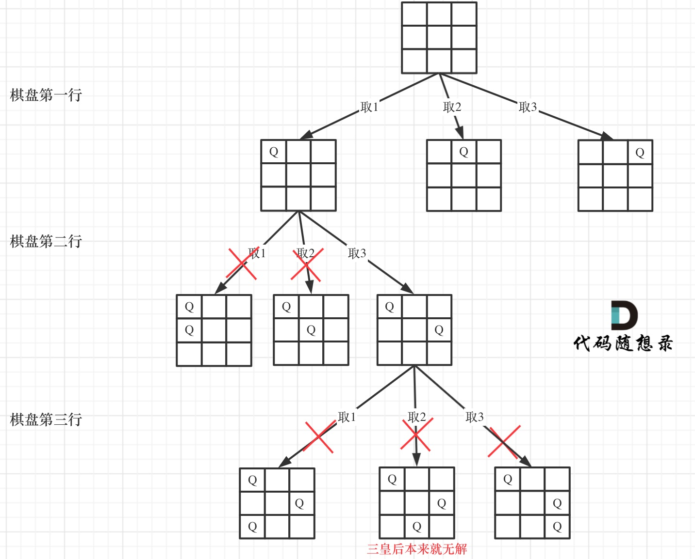

# 代码随想录算法训练营第34天｜回溯算法part06｜回溯算法总结篇、332.重新安排行程（可跳过）、51. N皇后（可跳过）、37. 解数独（可跳过）

## 回溯算法总结篇

[回溯算法总结篇](https://programmercarl.com/%E5%9B%9E%E6%BA%AF%E6%80%BB%E7%BB%93.html#%E7%BB%84%E5%90%88%E9%97%AE%E9%A2%98-2)


## 332.重新安排行程（可跳过）

[332.重新安排行程（可跳过）](https://leetcode.cn/problems/reconstruct-itinerary/)

**代码随想录**

题目要求：

1. 必须从 JFK 开始
2. 如果存在**多种**有效的行程，请你按字符自然排序返回**最小的行程组合**
3. 返回最短有效行程（如果有多个，返回一个就可以）

题目难点：

1. 一个行程中，如果航班处理不好容易变成一个圈，成为死循环（标记航程）
2. 有多种解法，字母序靠前排在前面，让很多同学望而退步，如何该记录映射关系呢 ？（排序：c++中采用map、set都可，底层为红黑树，有序存储）
3. 使用回溯法（也可以说深搜） 的话，那么终止条件是什么呢？（result.size() == tickets.size() + 1）
4. 搜索的过程中，如何遍历一个机场所对应的所有机场。(使用unordered_map<string, map<string, int>> 的这种数据结构对tickets进行存储)

代码：

c++

```


class Solution {
private:
    unordered_map<string, map<string, int>> targets;

public:
    bool backtracking(int ticketNum, vector<string>& result) {
        if(result.size() == ticketNum + 1) {
            return true;
        }

        for (pair<const string, int>& target : targets[result[result.size() - 1]]) {
            if (target.second > 0) {
                result.push_back(target.first);
                target.second--;
                if (backtracking(ticketNum, result)) return true;
                result.pop_back();
                target.second++;
            }
        }
        return false;
    }

    vector<string> findItinerary(vector<vector<string>>& tickets) {
        targets.clear();
        vector<string> result;
        for (const vector<string>& vec : tickets) {
            targets[vec[0]][vec[1]]++;
        }
        result.push_back("JFK");
        backtracking(tickets.size(), result);
        return result;
    }

};
```

python(提交时，超出时间限制)


```
from collections import defaultdict

'''
collections有哪些数据结构：

1. namedtuple: 命名元组

命名元组可以通过 collections.namedtuple() 工厂函数创建，该函数接受一个类型名称和字段名称的字符串列表作为参数，返回一个新的元组子类。

from collections import namedtuple

# 创建命名元组类型
Point = namedtuple('Point', ['x', 'y'])

# 创建命名元组实例
p = Point(1, 2)

# 访问元素
print(p.x, p.y)  # 输出: 1 2

底层实现：
命名元组实际上是一个普通的 Python 类，它继承自内置的元组类，并且在类的定义中动态生成了一些属性和方法，以便让元组的字段能够被名称访问。

2. deque: 双端队列

通过 collections.deque() 函数创建

from collections import deque

# 创建双端队列
dq = deque([1, 2, 3])

# 执行操作
dq.append(4)  # 在右侧添加元素
dq.appendleft(0)  # 在左侧添加元素
dq.pop()  # 移除并返回最右侧元素
dq.popleft()  # 移除并返回最左侧元素

底层实现：
双端队列是由一个双向链表实现的，因此在两端都可以快速进行插入和删除操作。

3. Counter: 计数器

from collections import Counter

# 创建计数器
cnt = Counter(['a', 'b', 'a', 'c', 'a', 'b'])

# 访问计数结果
print(cnt['a'])  # 输出: 3
print(cnt['b'])  # 输出: 2

底层实现：
计数器内部是一个字典，其中键是可哈希对象，值是对应对象的出现次数。

4.  OrderedDict: 有序字典记住了键值对的添加顺序。

from collections import OrderedDict

# 创建有序字典
d = OrderedDict()
d['a'] = 1
d['b'] = 2
d['c'] = 3

# 遍历有序字典
for key, value in d.items():
    print(key, value)

底层实现：
有序字典内部使用双向链表来维护键值对的顺序，因此在遍历时保持了添加顺序。

5. defaultdict: 默认字典 ：默认字典在访问不存在的键时返回一个默认值。

from collections import defaultdict

# 创建默认字典
d = defaultdict(int)

# 访问默认字典
print(d['a'])  # 输出: 0，因为 int() 返回 0

底层实现：
默认字典在内部维护了一个字典，并在访问不存在的键时调用给定的工厂函数来返回默认值。

'''

6. ChainMap: 链映射将多个字典或映射链接在一起形成一个逻辑上的单一视图。

from collections import ChainMap

# 创建链映射
dict1 = {'a': 1, 'b': 2}
dict2 = {'b': 3, 'c': 4}
chain_map = ChainMap(dict1, dict2)

# 访问链映射
print(chain_map['a'])  # 输出: 1
print(chain_map['b'])  # 输出: 2，因为 dict1 中的 'b' 覆盖了 dict2 中的 'b'
print(chain_map['c'])  # 输出: 4

底层实现：
链映射内部维护了一个字典列表，当查询键时，它会顺序查找每个字典，返回找到的第一个键的值。

7. UserDict、UserList、UserString:

这些是字典、列表和字符串的子类，用于自定义数据结构。它们的使用方法和内置的字典、列表和字符串类似，但可以通过继承它们来自定义行为。

8. abc (Abstract Base Classes):

提供了抽象基类，用于定义集合的通用接口。这些抽象基类定义了集合应该具有的方法，但并不提供具体的实现。用户可以根据自己的需要来实现这些抽象基类以创建自定义的集合类型。

'''

class Solution:
    def findItinerary(self, tickets):
        targets = defaultdict(list)  # 创建默认字典，用于存储机场映射关系
        for ticket in tickets:
            targets[ticket[0]].append(ticket[1])  # 将机票输入到字典中
        
        for key in targets:
            targets[key].sort(reverse=True)  # 对到达机场列表进行字母逆序排序
        
        result = []
        self.backtracking("JFK", targets, result)  # 调用回溯函数开始搜索路径
        return result[::-1]  # 返回逆序的行程路径
    
    def backtracking(self, airport, targets, result):
        while targets[airport]:  # 当机场还有可到达的机场时
            next_airport = targets[airport].pop()  # 弹出下一个机场
            self.backtracking(next_airport, targets, result)  # 递归调用回溯函数进行深度优先搜索
        result.append(airport)  # 将当前机场添加到行程路径中
```

## 51. N皇后（可跳过）

[51. N皇后（可跳过）](https://leetcode.cn/problems/n-queens/)

代码随想录：

思路：

首先原理就是回溯

约束条件：

不能同行
不能同列
不能同斜线



二维矩阵中矩阵的高就是这棵树的高度，矩阵的宽就是树形结构中每一个节点的宽度。

注意点：

不能同斜线中分为45度斜线和135度斜线！！！

代码：

python

```
class Solution:
    def solveNQueens(self, n: int) -> List[List[str]]:
        result = []  # 存储最终结果的二维字符串数组

        chessboard = ['.' * n for _ in range(n)]  # 初始化棋盘
        self.backtracking(n, 0, chessboard, result)  # 回溯求解
        return [[''.join(row) for row in solution] for solution in result]  # 返回结果集

    def backtracking(self, n: int, row: int, chessboard: List[str], result: List[List[str]]) -> None:
        if row == n:
            result.append(chessboard[:])  # 棋盘填满，将当前解加入结果集
            return

        for col in range(n):
            if self.isValid(row, col, chessboard):
                chessboard[row] = chessboard[row][:col] + 'Q' + chessboard[row][col+1:]  # 放置皇后
                self.backtracking(n, row + 1, chessboard, result)  # 递归到下一行
                chessboard[row] = chessboard[row][:col] + '.' + chessboard[row][col+1:]  # 回溯，撤销当前位置的皇后

    def isValid(self, row: int, col: int, chessboard: List[str]) -> bool:
        # 检查列
        for i in range(row):
            if chessboard[i][col] == 'Q':
                return False  # 当前列已经存在皇后，不合法

        # 检查 45 度角是否有皇后
        i, j = row - 1, col - 1
        while i >= 0 and j >= 0:
            if chessboard[i][j] == 'Q':
                return False  # 左上方向已经存在皇后，不合法
            i -= 1
            j -= 1

        # 检查 135 度角是否有皇后
        i, j = row - 1, col + 1
        while i >= 0 and j < len(chessboard):
            if chessboard[i][j] == 'Q':
                return False  # 右上方向已经存在皇后，不合法
            i -= 1
            j += 1

        return True  # 当前位置合法
```

## 37. 解数独（可跳过）

[37. 解数独（可跳过）](https://leetcode.cn/problems/sudoku-solver/)

代码随想录：

二维递归

代码：

python

```
class Solution:
    def solveSudoku(self, board: List[List[str]]) -> None:
        """
        Do not return anything, modify board in-place instead.
        """
        self.backtracking(board)

    def backtracking(self, board: List[List[str]]) -> bool:
        # 若有解，返回True；若无解，返回False
        for i in range(len(board)): # 遍历行
            for j in range(len(board[0])):  # 遍历列
                # 若空格内已有数字，跳过
                if board[i][j] != '.': continue
                for k in range(1, 10):
                    if self.is_valid(i, j, k, board):
                        board[i][j] = str(k)
                        if self.backtracking(board): return True
                        board[i][j] = '.'
                # 若数字1-9都不能成功填入空格，返回False无解
                return False
        return True # 有解

    def is_valid(self, row: int, col: int, val: int, board: List[List[str]]) -> bool:
        # 判断同一行是否冲突
        for i in range(9):
            if board[row][i] == str(val):
                return False
        # 判断同一列是否冲突
        for j in range(9):
            if board[j][col] == str(val):
                return False
        # 判断同一九宫格是否有冲突
        start_row = (row // 3) * 3
        start_col = (col // 3) * 3
        for i in range(start_row, start_row + 3):
            for j in range(start_col, start_col + 3):
                if board[i][j] == str(val):
                    return False
        return True
```


