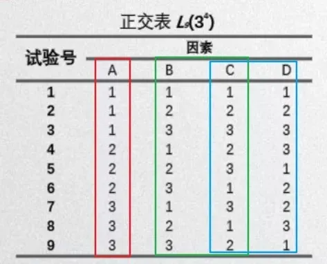

## 黑盒测试

黑盒测试又称为**功能测试、数据驱动测试或基于规格说明书的测试**，是一种从用户观点出发的测试。测试人员一般把被测程序当作一个黑盒子。

黑盒测试主要测到的**错误类型**有：不正确或遗漏的功能；接口、界面错误；性能错误；数据结构或外部数据访问错误；初始化或终止条件错误等等。

常用的**黑盒测试方法**有：等价类划分法；边界值分析法；因果图法；场景法；正交实验设计法；判定表驱动分析法；错误推测法；功能图分析法。

1、等价类划分法

2、边界值分析法

3、[因果图法](https://bbs.huaweicloud.com/blogs/363085)

适用场景：考虑输入条件的组合以及制约关系。采用一种合适的方法对条件组合进行分析，简化。最终目的是用最少的测试用例覆盖最全面的场景。

（通过分析，找出有多少种不同的因果组合，每种因果组合设计一个测试用例，以此减少重复的测试用例）

基本符号：分别是恒等 (—) 、非 (~) 、与 (V) 、或(^)。

    恒等：原因和结果都只能取 2 个值，1 代表条件成立，0 代表条件不成立。恒等相当于原因成立，则结果出现；若原因不成立，则结果也不出现。恒等关系“—”来表示。

    非：原因和结果相反。若原因成立，则结果不出现；若原因不成立，则结果出现。非的关系用 “ ~ ” 表示。

    或：有多个原因。若几个原因中有一个成立，则结果出现；若几个原因都不成立，则结果不出现。或的关系用 “ ^ ” 来表示。

    与：有多个原因。只有几个原因都成立，结果才或出现；若其中一个原因不成立，则结果不出现。与的关系用 “ V ” 来表示。

约束条件：

因果图中除了 4 种基本关系之外还会有一些约束条件。从原因考虑有 4 种约束：互斥、包含、唯一、要求。从结果考虑有 1 种约束：屏蔽。

    互斥 E：a、b、c 只能有一个成立，但是可以都不成立。

    包含 I：a、b、c 中至少有一个成立。可以多选但不能不选。

    唯一 O：a、b、c 有且仅有一个为 1。也就是说多个原因中有且只有一个成立。

    要求 R：如果 a 成立，则要求 b 必须也成立，其他的不做约束。一个出现，另一个也一定出现

    强制屏蔽 M：对于结果的约束。当 a = 1 时，要求 b 必须为0，其他的不约束。a 不成立时，b 的值不一定。

    唯一和互斥的区别是：唯一必须选一个；互斥可以不选，如果选只能选一个，几个原因中有且只有一个成立。

基本步骤：

    1.找出所有的原因，原因即输入条件或输入条件的等价类。

    2.找出所有的结果，结果即输出条件。

    3.明确所有输入条件之间的制约关系以及组合关系，判断条件是否可以组合。

    4.明确所有输出条件之间的制约关系以及组合关系，判断结果是否可以同时输出。

    5.找出不同输入条件组合会产生哪些输出结果。

    6.将因果图转换成判定表或决策树。

    7.判定表或决策表中每一列表示的情况设计测试用例。

**实例见原址**

- 场景法

场景法就是模拟用户操作软件时的场景，主要用于测试系统的业务流程。

基本流：按照**正确的业务流程来实现**的一条操作路径即模拟正确的操作流程。

备选流：导致程序出现**错误的操作流程**即模拟错误的操作流程。

- 正交实验设计法

[学习链接](https://zhuanlan.zhihu.com/p/75073232)

解决有很多输入条件，每种条件的有多个值，为了减少测试次数，并达到测试效果的方法（多输入条件组合类）

1. 必知术语：

    因素：在试验中，影响试验结果的变量。

    因素数：在试验中，影响试验结果的变量个数。

    水平：因素所处的状态。

    水平数：因素所包含的状态集合数量。

2. 全面试验

即全组合，也叫笛卡尔积

3. 正交试验

正交实验设计是研究**多因素多水平**的一种设计方法

4. 正交试验的意义

为了准确、合理减少不必要的试验成本，我们就可以使用正交试验。

5. 正交试验的特点

    分布均匀：任一列中，任一因素的水平（状态）出现的次数相同。

    整齐可比：任两列中，任意一个水平组合出现的次数相同。

    

**正交试验使用方法**

1. 设计步骤

正交试验四步走： （a）明确试验目的 （b）确定因素和水平 （c）选择合适正交表 （d）用例设计与编写

2. 正交表

必须满足“均匀分布、整齐可比”才行（如上图所示）

3. 用例数计算方法

 n=k x (m-1)+1

 k:正交表纵列数（最多能安排的因数个数）

 m:因素水平数

 **混合水平正交表**

 混合水平正交表就是**各因素水平数不完全相等**的正交表

 - 判定表驱动分析法

[学习地址](https://www.cnblogs.com/linyfeng/p/9211673.html)

应用场景：在一些数据处理问题中，逻辑条件取值的组合过多时，判定表是一个不错的选择！

针对不同逻辑条件的组合值，分别执行不同的操作。判定表很适合于处理这类问题。另外，判定表通常与因果图法结合使用。

判定表通常由四个部分组成，如下:

意思分别为：

条件桩 : 列出问题的所有条件

条件项: 列出左列条件桩的取值（真假值）

动作桩: 列出问题规定可能采取的操作

动作项: 列出在对应的条件项组合下应采取的动作.

规则: 任何一个条件组合的特定取值及其相应要执行的操作称为规则。在判定表中贯穿条件项和动作项的一列就是一条规则。显然,判定表中列出多少组条件取值,也就有多少条规则,既条件项和动作项有多少列。注意化简，即规则合并有两条或多条规则具有相同的动作，并且其条件项之间存在着极为相似的关系。

步骤：

1. 列出所有条件和动作
（如何确定规则的个数？加入有n个条件，每个条件有两个取值（0,1），故有2n中规则

1. 生成判定表

2. 简化判定表（合并相似规则，即相同动作）

3. 得出测试用例

- 错误推测法

错误推测法是基于经验和直觉推测程序中所有可能存在的各种错误, 从而有针对性的设计测试用例的方法。错误推测方法的基本思想: 列举出程序中所有可能有的错误和容易发生错误的特殊情况, 根据它们选择测试用例。

**最后，对于黑盒测试的综合策略是：**

首先，考虑边界值分析法，边界值分析法是在任何情况下都必须使用的方法，因为经验表明这种方法设计的测试用例发现程序错误的能力最强。必要时用等价类划分方法补充一些测试用例。

其次，可以用错误推测法再追加一些测试用例。这时，可以对照程序逻辑，检查已设计出的测试用例的逻辑覆盖率，如果没有达到要求的覆盖标准，应当再补充足够的测试用例；如果程序的功能说明中含有输入条件的组合情况，则一开始就可以选用因果图法。

## 白盒测试

