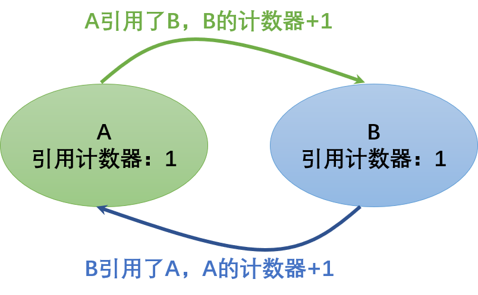
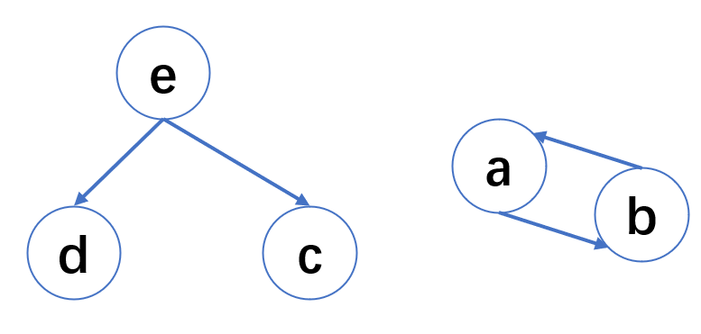

[1. 自我介绍](#6)

[2. 实习相关](#1)

[3. C++/Python相关](#3)   

[3.1 C++](#3.1)   

[3.2 Python](#3.2)

[4. 项目](#4)

[5. 基础](#5)

[5.1 计算机网络](#5)

[5.2 操作系统](#5)

[5.3 数据库](#5)

[5.4 数据结构](#5)

[5.5 Linux](#5)

[6. 测试/测试开发相关](#7)

[6.1 测试知识](#7)

[6.2 测试用例](#7)

[7. 手撕算法](#8)

[8. HR](#2)

[9. 研究生期间研究方向](#9)

[10. 反问环节](#10)

[10.1 技术面反问环节](#10)

[10.2 hr面反问环节](#10)

## <p id='6'>自我介绍</p>

    面试官您好，我叫耿佳豪，家在辽宁阜新，本科就读于辽宁工程技术大学，专业是软件工程，硕士就读于黑龙江大学，专硕，专业也是软件工程。

    在本科期间，我的学习成绩在全年级前20%，有着较好的软件编程基础。

    在读研期间，因为对人工智能比较感兴趣，所以研究方向选择了自然语言处理大方向下相对容易的小方向，中医智能处方与情感分析，通过对这个方向的学习与研究，学到了很多关于深度学习方面的知识，如比较流行的神经网络模型和预训练模型transformer,BERT等，同时也对python编程和数据分析有了进一步的了解，在深度学习项目的运行环境的部署，和解决各种出现bug上积累的一定的经验，这锻炼了我自主解决问题的能力和遇到困难时保持稳定的情绪等。

    去年的年初，去了北京算能科技有限公司实习，岗位是AI软件测试实习生，职责是对应用于人工智能芯片上软件进行系统测试，包括测试用例的设计，编写shell自动化脚本，测试环境的搭建，以及执行测试，提交bug，和回归测试，参与公司软件的迭代。

    通过这段实习经历，让我对在基于linux系统环境下的服务器上的各种操作更加熟练，提升了我的测试思维，对bug的书写规范，流转流程等也有了了解；

    同时，让我更早的接触了工作生活，提高了对软件测试工程师这份工作职责的认识；总之，这段实习经历收获很多，无论是技术上还是其他方面，很感谢这段实习经历带给我的收获。

    在今年的暑假期间，为了更好的对Linux系统、socket编程、计算机网络、操作系统等知识有更好的实际的了解，自己独立学习并开发了一个基于Linux系统的c++语言的多线程、高并发、轻量级的web服务器，可以同时支持一定数量的客户通过http/https协议访问服务器的资源。

    结合自己的实习经历与技术水平和比较追求完美的性格特点，并且想去更大的平台去学习和提升自己，所有把自己的就业目标定位在测试开发工程师岗位，xxx是我渴望去工作的大厂，如果有机会能去这里工作，我一定会倍加珍惜，感谢面试官，我的自我介绍完毕。

## <p id='1'>实习相关</p>

1. （1）你能详细介绍一下你的实习经历吗，（2）在其中你的任务有哪些，你负责哪个模块

(实习经历，你都负责什么，具体哪个模块，业务流程是什么?)(字节)

        方式1：
        对应用在贵公司研发的人工智能芯片上的自己开发的软件进行一个系统测试，包括功能测试、性能测试、稳定性测试、接口测试、文档、兼容性测试、界面测试等，首先当有新的软件版本要测试时，将待测的软件拉取下来，部署在待测试的服务器上，主要是各种linux系统，软件部署完成后，先进行一个smoke测试，对可能造成测试暂停的地方先测一下，如果通过在进行全面的系统测试，之后，就是测试自己负责的模块的测试，有自动化脚本测试，也有手动执行的测试，在测试过程中，如果发现了问题，要先进行复测和查看命令行输出和日志，分析错误的原因，确认是bug后，通过jira进行bug的撰写提交给制定的开发人员，修复bug后，要重新拉取最新的版本进行验证，等待这个系统测试完成，还会进行一个回归测式，测试一下主要的功能是否正常，然后我们的组长会出测试报告，看是否可以上线。每次系统测试之后，会进行一个测试的总结，交流测试经验。对，大概就是这些，参与软件的迭代。

        2024年4月14日改进：
        
        字节三面后总结：（介绍一一下你实习期间的项目是什么，你的工作是什么，都做了哪些 （应该用star法则来回答，还得好好总结一下））
        情景：
            首先，我所实习的公司主要生产人工智能计算卡，质量保障部门就负责对适配在芯片上的自研的驱动和功能性软件进行进行一个系统的、全面的测试，包括功能测试、性能测试、兼容性测试等。

        任务：
            我的具体测试任务是测试整个系统测试中的几个模块，主要是底层驱动与多媒体相关的模块。每次提测之前，我们质量保障小组会进行一个整体确定测试需求的会，组长给我们分配测试模块、测试资源、和对应模块的测试需求。

        行动：
            我的行动就是：
            1. 制定测试计划，包括，测试时间进度的安排，测试模块的优先级安排，测试资源的合理规划
            2. 测试用例设计、导师检查、自动化、导入蝉道库

                如果负责测试的模块有新增功能，那我就根据负责测试用例设计，（这个地方如果问道根据什么来制定测试用例，是说需求规格说明书还是使用说明书呢...），之后就是和导师、开发共同进行需求评审，通过之后，用例导入蝉道库，可以实现自动化的用例进行自动化脚本的实现，没问题了并入大脚本。

            3. 提测

                从版本服务器下载提测版本驱动和软件，部署到服务器

                首先，smoke冒烟测试，确定主要功能是否正常，会不会造成测试阻塞

                如果没问题，那就按照测试计划去执行负责模块的测试，对于功能测试，依次部署测试环境、调度需要测试的文件、执行测试，对于有自动化脚本的测试，需要部署环境、准备测试需要的前提，并执行、然后查看执行结果，对于手动测试，就需要手动部署、执行、比对结果，95都实现了自动化。对于兼容性测试，因为软件安装在不同的linux系统下，包括ubuntu,centos, debain, 麒麟系统,不同的cpu架构，还有soc小型计算机，所有每种架构和系统的组合都需要测到。对于性能测试，我测到的就是持续多路编解码视频文件，最多支持的路数是否满足规格，时候可以稳定运行规定之间以上等这样的性能测试，还有就是指定参数下，视频的帧率、码率是否符合条件等。

                期间如果出现了bug，我会通过手动测试并检查测试步骤和参数没有问题，没问题的情况下，就会查看程序执行日志与系统日志，初步判定问题的原因，再通过jira按照bug的书写规范提交给开发人员，并协助开发，开发解决后，拉取新版本的软件进行验证，看是否会复现，如果没问题，关闭bug

                测试过程中，每天都会有bug 评审会

            4. 整个测试完成后，会生成一个测试报告，更具测试报告确定是否发布
            5. 可以上线后，在上线之前会有一个回归测试
            6. 上线
            7. 每个版本的测试完成后，都会有一个总结会，总结自己的不足和整个测试小组中存在的问题。

        结果：

            因为自己刚从学校出来，每次的版本测试，都会对整个测试的业务流程更加熟悉，哪些地方需要关注，哪些地方需要先测，哪些地方后测。还有就是对于测试手法的提升，自己的效率也不断的提高，越往后的测试，越熟练。每次测试都会学到很多东西。
            让我熟悉了常用的linux命令、不同的linux系统和cpu架构、对于服务器的维护、还有就是docker、虚拟机一些需要用到的工具。

            （在执行的过程中，确实会出现软件崩掉或者异常的情况，并让开发进行的修复。其实我觉得在测试过程中，因为设计到不同的架构和操作系统读=对应了不同的软件版本，然后每个软件版本都需要系统测试，在计划的时间内，如何完成全部的测试内容，对于每个测试模块的时间的把握还有业务的熟悉程度都有很大的关系，我在每次的测试任务完成时，都回去总结，在测试过程中，那里做的不好，以便于下一次不犯，比如说，各个模块之间的依赖关系要搞清楚，不要重复测试，刚开始对于业务不熟悉，后来慢慢的就熟练了。

            还有就是在自己的测试手法的不断改进，测试过程中，会同时用到多个ftp服务器,多个ssh linux服务器的窗口，搞着搞着就乱了，所以测试时慢慢的形成了自己的风格，比如说电脑桌面的这些软件窗口的布局，切来切去会乱，那我后来就形成自己的电脑桌面布局，这样就很清晰了，不至于每次的切换位置都是不固定的

            总之，在每次软件的迭代中，都会总结经验，也都会出现新的问题，这对于我对软件测试工程师这门职业也有了更加进一步的了解。）

        

1. 你在实习过程中遇到了什么困难？那你怎么解决的呢？(图森未来二面)

        “首先这个问题如果回答的好，面试管会继续追问下去的，也就有了话题，如果回答不好，容易把天聊死”

        业务方面，有两个困难：1. 在短时间内快速熟悉业务流程 2. 对业务的细节的不断的理解 3. 测试结果比对没有通过，但不确定是不是bug

        一是在业务学习方面，刚到公司对我应该负责的部门的业务流程和公司产品都不熟悉，然后下周就要参加到新版本的测试任务中去，所以要在一周内快速学习和了解自己负责的模块的业务逻辑和产品之间的区别。

        测试过程中有一个困难：在指定之间内，利用有限的测试资源，保质保量更加高效的测试完成自己负责的模块。

        二是在测试过程中，对于自己负责的测试模块要在计划的的时间测试完成的这种测试进度把控方面，受测试资源、测试模块之间的联系、时间如何合理分配才能更有效率的影响。

        三是测试过程中涉及到未用过的工具和技术：docker/虚拟机...

2. 实习过程中的收获/经验
   
        测试经验：

        1. 对各个模块的复杂度、执行时间、需要注意的地方在测试开始之前明确，在执行过程中，计划好测试优先级和每个模块的测试时间，充分利用所有的服务器，对于可以并行的模块同时进行，节省时间，提高效率。

        2. 对于需要下载到本地或者上传到指定ftp服务器上的文件，一次性传输到指定地方，避免重复登录服务器，浪费时间。

        3. 在测试之前搞清楚测试的需求，确定测试优先级，避免影响外发进度，对于不重要的模块可以后测试。

        4. 对于每次测试都会重复执行的命令，写成shell脚本，一次执行。

        通过这段实习经历，不仅学到了很多之前未接触的知识，掌握了工作的业务流程，熟悉了工作环境，同时还收获了宝贵的友谊，和谐的团队氛围和每个人的优秀都值得我好好借鉴和学习

3. 你在实习过程中有没有测试出bug，你是如何定位问题的（字节）

    （实习中有没有发现bug，什么原因，怎么处理的）（字节三面）

        字节三面后总结：

        我在实习中，遇到过一些bug，比如说页面显示的数据不符合规格说明书，那我就直接通过jira提交给开发人员就可以了，后续进行bug的验证

        如果执行某个case崩掉了，比如说执行输入指定分辨的视频，对其进行重新编解码，生成指定的分辨率和码率的视频，并且是以8路同时编解码的形式，同时生成8个指定分辨率的视频，会出现不能生成视频或者生成的视频有条纹不正常的情况。

        首先我会保留现场，保留好生成的文件和日志信息

        然后我会确认一下自己的执行步骤和输入是否正确，如果没有问题，我会再执行一次，看看是否还会复现该问题

        如果还是出现问题，那就是bug

        接着我会去看程序的执行输出信息还有系统的日志，看看是不是有fail，error报错信息，是什么原因导致的问题，对其有一个大概的判断

        然后我会将这个问题通过jira 比标准的bug书写规范提交给开发人员，让其修复，并协助开发人员解决这个问题

        待开发人员修复后，在后续日期的软件版本中测试该问题是否解决，并记录，在下次测试中重点关注这个功能是否还会出现问题。


## <p id='3'>c++相关</p>

### <p id='3.1'>c++</p>
1. c++11新特性
2. static
3. 封装、继承、多态

        封装（Encapsulation）、继承（Inheritance）、和多态（Polymorphism）是面向对象编程（Object-Oriented Programming，OOP）的三个核心概念，它们有助于构建模块化、可维护和可扩展的软件系统。以下是它们的简要解释：

        封装（Encapsulation）：

        封装是一种将数据和操作数据的方法打包在一起的概念。
        它通过将数据成员（通常是属性）和操作数据的方法（通常是函数或方法）封装在一个类中，以实现数据的隐藏和保护。
        这意味着外部代码不能直接访问一个对象的内部数据，而必须使用公开的接口（方法）来访问和修改数据。
        封装提供了数据隐私和安全性，同时也允许实现数据验证和控制。
        继承（Inheritance）：

        继承是一种机制，允许一个类（子类/派生类）基于另一个类（父类/基类）的属性和方法构建。
        子类继承了父类的属性和方法，可以重用父类的代码，同时可以在子类中添加新的属性和方法或覆盖父类的方法。
        继承促进了代码重用、扩展性和层次化的设计。
        多态（Polymorphism）：

        多态是一种允许不同对象对同一消息作出不同响应的概念。
        在多态中，不同的类可以对相同的方法名称做出不同的实现，从而允许根据对象的实际类型来调用方法，而不需要关心具体的类型。
        多态性增加了代码的灵活性和可扩展性，使代码更容易适应变化和增加新功能。

### <p id='3.2'>python</p>
1. 我的主要编程语言,python,说一下你用python都做了什么
2. python的垃圾回收机制

    垃圾回收算法有很多，主要有：引用计数、标记-清除、分代收集等。

    在python中，垃圾回收算法以引用计数为主，标记-清除和分代收集两种机制为辅。

    1 引用计数

    1.1 引用计数算法原理

    引用计数原理比较简单：
    每个对象有一个整型的引用计数属性。用于记录对象被引用的次数。
    例如对象A，如果有一个对象引用了A，则A的引用计数+1。
    当引用删除时，A的引用计数-1。
    当A的引用计数为0时，即表示对象A不可能再被使用，直接回收。
    在Python中，可以通过sys模块的getrefcount函数获取指定对象的引用计数器的值，我们以实际例子来看。

    ```
    import sys

    class A():
        def __init__(self):
            pass
            
    a = A()
    print(sys.getrefcount(a))
    ```

    1.2 计数器增减条件

    上面我们看到，创建一个A对象，并将对象赋值给a变量后，对象的引用计数器值为2。那么什么时候计数器会+1，什么时候计数器会-1呢？

    1.2.1 引用计数+1的条件

        对象被创建，如A()。
        对象被引用，如a=A()。
        对象作为函数的参数，如func(a)。
        对象作为容器的元素，如arr=[a,a]。

    1.2.2 引用计数-1的条件

        对象被显式销毁，如del a。
        变量重新赋予新的对象，例如a=0。
        对象离开它的作用域，如func函数执行完毕时，func函数中的局部变量（全局变量不会）。
        对象所在的容器被销毁，或从容器中删除对象。

    1.3 引用计数的优点与缺点

    1.3.1 引用计数优点

    高效、逻辑简单，只需根据规则对计数器做加减法。
    实时性。一旦对象的计数器为零，就说明对象永远不可能再被用到，无须等待特定时机，直接释放内存。

    1.3.2 引用计数缺点

    需要为对象分配引用计数空间，增大了内存消耗。
    当需要释放的对象比较大时，如字典对象，需要对引用的所有对象循环嵌套调用，可能耗时比较长。
    循环引用。这是引用计数的致命伤，引用计数对此是无解的，因此必须要使用其它的垃圾回收算法对其进行补充。

    

    2 标记-清除

    上一小节提到，引用计数算法无法解决循环引用问题，循环引用的对象会导致大家的计数器永远都不会等于0，带来无法回收的问题。

    标记-清除算法主要用于潜在的循环引用问题，该算法分为2步：

    标记阶段。将所有的对象看成图的节点，根据对象的引用关系构造图结构。从图的根节点遍历所有的对象，所有访问到的对象被打上标记，表明对象是“可达”的。

    清除阶段。遍历所有对象，如果发现某个对象没有标记为“可达”，则就回收。

    ```
    class A():
        def __init__(self):
            self.obj = None
    
    def func():
        a = A()
        b = A()
        c = A()
        d = A()

        a.obj = b
        b.obj = a
        return [c, d]

    e = func()
    ```

    上面代码中，a和b相互引用，e引用了c和d。整个引用关系如下图所示：

    

    如果采用引用计数器算法，那么a和b两个对象将无法被回收。而采用标记清除法，从根节点（即e对象）开始遍历，c、d、e三个对象都会被标记为可达，而a和b无法被标记。因此a和b会被回收。
    这是读者可能会有疑问，为什么确定根节点是e，而不会是a、b、c、d呢？这里就有讲究了，什么样的对象会被看成是根节点呢？一般而言，根节点的选取包括（但不限于）如下几种：
    当前栈帧中的本地变量表中引用的对象，如各个线程被调用的方法堆栈中使用到的参数、 局部变量、 临时变量等。
    全局静态变量
    …

    3 分代收集

    3.1 分代收集原理

    在执行垃圾回收过程中，程序会被暂停，即stop-the-world。

    为了减少程序的暂停时间，采用分代回收(Generational Collection)降低垃圾收集耗时。

    分代回收基于这样的法则：

    接大部分的对象生命周期短，大部分对象都是朝生夕灭。
    经历越多次数的垃圾收集且活下来的对象，说明该对象越不可能是垃圾，应该越少去收集。
    Python中，对象一共有3种世代：G0,G1,G2。

    对象刚创建时为G0。
    如果在一轮GC扫描中存活下来，则移至G1，处于G1的对象被扫描次数会减少。
    如果再次在扫描中活下来，则进入G2，处于G1的对象被扫描次数将会更少。

    3.2 触发GC时机

    当某世代中分配的对象数量与被释放的对象之差达到某个阈值的时，将触发对该代的扫描。当某世代触发扫描时，比该世代年轻的世代也会触发扫描。
    那么这个阈值是多少呢？我们可以通过代码查看或者修改，示例代码如下

    ```
    import gc
    threshold = gc.get_threshold()
    print("各世代的阈值:", threshold)

    # 设置各世代阈值
    # gc.set_threshold(threshold0[, threshold1[, threshold2]])
    gc.set_threshold(800, 20, 20)
    ```

    在Python中，主要通过引用计数进行垃圾回收；通过 “标记-清除” 解决容器对象可能产生的循环引用问题；通过 “分代回收” 以空间换时间的方法提高垃圾回收效率。

3. python 的装饰器

    在代码运行期间动态增加功能的方式，称之为“装饰器”（Decorator）。

    ```
    import functools

    def log(func):
        @functools.wraps(func)  # 把还原原始函数的__name__属性（没有这行__name__会变成wraps）
        def wrapper(*args, **kw):
            print('call %s():' % func.__name__)
            return func(*args, **kw)
        return wrapper
    ```

    ```
    import functools

    def log(text):
        def decorator(func):
            @functools.wraps(func) # 把还原原始函数的__name__属性（没有这行__name__会变成wraps）
            def wrapper(*args, **kw):
                print('%s %s():' % (text, func.__name__))
                return func(*args, **kw)
            return wrapper
        return decorator
    ```
4. python 高级特性有哪些

        切片：取指定索引范围的操作 L[0:3] 后10个数：L[-10:] 前10个数，每两个取一个:L[:10:2]

        **tuple也是一种list，唯一区别是tuple不可变**

        迭代:可以通过for循环来遍历这个list或tuple，这种遍历我们称为迭代（Iteration）。

        **默认情况下，dict迭代的是key。如果要迭代value，可以用for value in d.values(), 如果要同时迭代key和value，可以用for k, v in d.items()。**

        判断是否可迭代：

            ```
            from collections.abc import Iterable 
            isinstance('abc', Iterable) # str是否可迭代
            ```

        列表生成式:是Python内置的非常简单却强大的可以用来创建list的生成式。

        **在一个列表生成式中，for前面的if ... else是表达式，而for后面的if是过滤条件，不能带else**

        生成器:在Python中，这种一边循环一边计算的机制，称为生成器：generator。

        generator保存的是算法，generator也是可迭代对象：
5. python 多线程开发

        多进程：

            先创建子进程

            用start()方法启动

            join()方法可以等待子进程结束后再继续往下运行，通常用于进程间的同步。

        Pool：如果要启动大量的子进程，可以用进程池的方式批量创建子进程

            p = Pool(4)

            批量创建进程

            p.close() # 调用close()之后就不能继续添加新的Process了。

            p.join() # 对Pool对象调用join()方法会等待所有子进程执行完毕，

        进程间通信：有几种方式，有可能陷入死锁

        多线程：

        启动一个线程就是把一个函数传入并创建Thread实例，然后调用start()开始执行（任何进程默认就会启动一个线程，我们把该线程称为主线程，主线程又可以启动新的线程）

        1. 创建线程
        2. 线程.start()
        3. 线程.join()

        继续执行主线程

        线程锁：多线程中，所有变量都由所有线程共享，所以，任何一个变量都可以被任何一个线程修改，因此需要锁

## <p id='4'>项目</p>
1. 你在做项目过程中有没有遇到什么困难，你是怎么解决的？(代码随想录c++web服务器面经)

    这个项目是我在学习计算机网络和Linux socket编程过程中独立开发的轻量级的web服务器，服务器的网络模型是模拟Proactor加线程池的模式，IO处理使用了非阻塞IO和IO多路复用技术，具备处理多个客户端处理http协议下的get请求和post请求。这个项目从三月份开始做，到现在一直在完善。

    项目中的工作：

    学习到了什么：

2. 项目中的难点

    项目中我的主要工作可以分为两部分

    一部分是服务器的网络框架、日志系统、等一些基本系统的搭建，这部分的难点在于技术的理解和选型，以及将一些开源的框架调整后应用到我的项目中去。

    另一部分是为了提高服务器性能所做的一些优化，比如缓存机制、内存池等一些额外系统的搭建。这部分的难点在于找出服务器的性能瓶颈，然后结合自己的想法去突破这个瓶颈，提高服务器的性能。

3. 项目中遇到的困难？你是如何解决的？（图森未来二面）

    一方面是对不同的技术理解不够深刻，难以选出最合适的技术框架。这部分的话我主要是反复阅读作者在GitHub提供的一些技术文档，同时也去搜索一些技术对比的文章去看，如果没有任何相关的资料我会尝试去联系作者。

    另一方面是编程期间遇到的困难，在代码编写的过程中由于工程能力不足，程序总会出现一些bug。这部分的话我首先是通过日志去定位bug，然后推断bug出现的原因并尝试修复，如果是自己目前水平无法修复的bug，我会先到网上去查找有没有同类型问题的解决方法，然后向同学或者直接到StackOverflow等一些国外知名论坛上求助。

4. 针对项目做了哪些性能方面的优化（影石）
5. epoll （zeromq） select poll（影石）
6. 你对项目都进行过哪些测试
 

## <p id='5'>基础</p>

### <p id='5.1'>计算机网络</p>
1. https如何保证安全性
2. 证书的颁发机构
3. 计算机网络 get和post的区别
4. 输入网址后到显示都会有哪些操作（输入一个网址到显示流程是什么，字节二面）
5. 一个url都包含了哪些信息
6. 状态码知道吗？
7. TCP握手
8. tcp的可靠性
9. 计算机网络的七层，七层中都涉及到了哪些协议

### <p id='5.2'>操作系统</p>

1. 内存泄漏

    内存溢出 out of memory，是指程序在申请内存时，没有足够的内存空间供其使用，出现out of memory；比如申请了一个integer,但给它存了long才能存下的数，那就是内存溢出。

    内存溢出就是你要求分配的内存超出了系统能给你的，系统不能满足需求，于是产生溢出。

    内存泄漏是指你向系统申请分配内存进行使用(new)，可是使用完了以后却不归还(delete)，结果你申请到的那块内存你自己也不能再访问（也许你把它的地址给弄丢了），而系统也不能再次将它分配给需要的程序。

    内存泄露 memory leak，是指程序在申请内存后，无法释放已申请的内存空间，一次内存泄露危害可以忽略，但内存泄露堆积后果很严重，无论多少内存,迟早会被占光。
2. 死锁产生条件
3. 进程和线程区别，通信方式有什么区别

### <p id='5.3'>数据库</p>
1. 查询所有科目成绩都大于80分的学生的姓名
2. 查找出班级里面姓王的2-5名的成绩
3. 数据库中的事务
4. 数据库 查找班级里面成绩前三名的男生的成绩
5. 数据库的join和order by
6. 索引
    1. 单列索引 `create index idx_student on Student(学生姓名);` `select * from Student where studnet_name = '张三'`
    2. 复合索引 create index idx_student on Student(学生姓名，学生ID);
    3. 唯一索引 create unique index idx_student on Student(学生ID);
    4. 主键索引 alter table Student add primary key(学生ID);
    5. 全文索引 create fulltext index idx_student on ContentTable(content_column); select * from ContentTable where match(content_column) against('关键词');
    6. 空间索引 CREATE SPATIAL INDEX idx_spatial_location ON SpatialTable (location_column);
        空间索引用于处理空间数据类型，例如几何图形或地理数据。支持空间查询，如包含在范围内的地理位置。
    7. 位图索引 CREATE BITMAP INDEX idx_bitmap_status ON StatusTable (status_column);
        位图索引通常用于处理有限个离散值的列，如状态列。适用于只有几种不同取值的列。


### <p id='5.4'>数据结构</p>
1. 完全二叉树和平衡二叉树
2. 位图
3. 说一下数据结构中栈队列链表和堆的特点与区别
4. 有哪些数据结构，他们的特点是什么
5. 你都了解什么树，有哪些用途，了解B树和B+树吗

        二叉树：
            1. 平衡二叉树
            2. 二叉排序树
            3. 堆
            4. 表达式树
            5. 哈夫曼树用于数据的压缩
        多叉树：
            1. 文件系统
            2. XML和HTML文档

        B树：B树为多路搜索树，深度低，搜索数据时磁盘IO较少，多用于索引外存数据，只支持随机访问，不支持顺序访问；

        https://blog.csdn.net/qq_62767608/article/details/129804741

        B+树：外节点依关键字组成顺序链表，支持区间搜索，且空间局部性好，缓存命中率高；

        为什么MySQL索引使用的是B+树而非B树：

            1 B+树与B树的设计主要用于提高I/O速度，B+树的内部结点不保存记录数据，只保存关键字，这样每一层存储的索引数量会增加，意味着B+树和B树在层高相2同的情况下，B+树存储的索引数量更多，使得磁盘I/O次数更少

            2 如果涉及到范围查找， B+ 树由于所有数据都在叶子结点，不用跨层，同时由于有双向链表结构，只需要找到首尾，通过链表就能把所有数据取出来了，查询性能更高。而B树则需要全局遍历

            3 由于B+树所有数据都存储在叶子结点，所以B+树的I/O次数会更加稳定

            4 基于B+树这样的数据结构，如果采用自增的整型数据作为主键，可以更好的避免数据增加的时候带来的叶子结点分裂


        红黑树：红黑树为二叉自平衡搜索树，深度大，多用于内存排序；

        红黑树是平衡二叉树的一种，红黑树中的节点，一类被标记为黑色，一类被标记为红色。除此之外，一棵红黑树还需要满足这样几个要求：

            根节点是黑色的；

            每个叶子节点都是黑色的空节点（NIL），也就是说，叶子节点不存储数据；

            任何相邻的节点都不能同时为红色，也就是说，红色节点是被黑色节点隔开的；

            每个节点，从该节点到达其可达叶子节点的所有路径，都包含相同数目的黑色节点；

        它的作用或者优势：

        AVL平衡二叉树是一种高度平衡的二叉树，所以查找的效率非常高，但是，有利就有弊，AVL树为了维持这种高度的平衡，就要付出更多的代价。每次插入、删除都要做调整，就比较复杂、耗时。

        红黑树只是做到了近似平衡，并不是严格的平衡（“平衡”的意思可以等价为性能不退化。“近似平衡”就等价为性能不会退化的太严重），但树的高度仍然是对数量级的，因此性能的损失并不多，并且红黑树降低了对旋转的要求，在插入时避免了大量的旋转，提高了插入,删除的操作性能，所以在维护平衡的成本上，要比AVL树要低，对于工程应用来说，要面对各种异常情况，为了支撑这种工业级的应用，我们更倾向于这种性能稳定的平衡二叉查找树。

### <p id='5.5'>Linux</p>
1. Linux上查看日志a.txt一共500行，查看200到300行

```
cat a.txt | head -n 300 | tail -n 100
```

2. 还问了一个查看日志的命令 我都忘了

dmesg

3. Linux常用命令\查看端口号命令
4. docker k8s(影石) docker的特点，优点（字节二面）
5. linux top
6. [linux查看端口号top，top中有哪些信息](https://juejin.cn/post/6844904041483337741)

    进程号、进程名称、cpu占用率、运行时间、端口号、占用内存、ppid（父进程）、状态等

    进程有哪几种状态：
    
7. Linux如何定位文本中的浮点数

    此条命令是过滤test.txt中的每行中含有浮点数的行

    `grep -Eo '[0-9]+\.[0-9]+' filename.txt`

    `cat filename.txt | grep '[0-9]\+\.[0-9]\+'`

    `awk '/[0-9]+\.[0-9]+/{ print $0 }' filename.txt`

    `sed -n -E '/[0-9]+\.[0-9]+/p' 草稿纸.txt`

    ```
    上面提供的 grep、awk 和 sed 命令在定位文本中的浮点数时确实有一些区别，尽管它们都可以用于这个任务，但每个命令有其自己的特点和用法。

    grep命令：

    grep -Eo '[0-9]+\.[0-9]+' filename.txt
    使用 -E 选项启用扩展正则表达式，允许使用 + 来表示一个或多个前面的字符。
    使用 -o 选项只输出匹配的部分，而不是整行。

    awk命令：

    awk '/[0-9]+\.[0-9]+/{ print $0 }' filename.txt
    awk 在满足指定条件的行上执行操作，这里是用正则表达式来匹配。
    使用 /[0-9]+\.[0-9]+/ 正则表达式匹配，并通过 print $0 打印整行。

    sed命令：

    sed -n -E '/[0-9]+\.[0-9]+/p' filename.txt
    sed 也是对匹配的行执行操作，类似于 awk。
    -n 选项禁止自动打印所有行，只有在指定条件的行上执行操作。
    使用 /[0-9]+\.[0-9]+/p 正则表达式匹配，并使用 p 命令打印匹配的行。
    总之，这三种命令都能够用于在文本中定位浮点数，但它们的用法、选项和语法有一些差异。您可以根据具体的需求和个人偏好选择适合您的命令。
    ```

## <p id='7'>测试/测试开发相关</p>

### <p id='7.1'>测试知识</p>
1. 你为什么选择测试开发岗？(看你对算法有研究，为什么不选择算法，现在不是很火吗？)(图森未来二面)

    因为自己有一份测试实习的经历、结合自己学历背景、还有当前的技术水平、再加上我做事情比较耐心的性格特点和注重细节的习惯、综合考虑选择测试开发，了解到测试开发也需要进行开发，薪资虽然比开发略低、但是要求没有开发高，也许更容易上岸，并且自己有一个去更大的平台的梦想，所以就把最终的职业目标定在了测试开发。

2. 研发和测开的岗位区别？

    研发是从0到1根据软件需求规格说明书设计开发出符合对应要求的软件，包括大量的代码编写和单元测试，模块集成测试等

    测试开发是：首先会对研发设计出来的软件进行系统的全面的测试，包括测试的计划的设计、用例的设计、执行、bug的监督等，除此之外，为了提高测试效率，并保证测试的深度和广度，测试人员可以通过开发自动化测试工具，比如说自动化的脚本，或者是UI自动化，或者是借助测试工具比如过postman的接口测试工具实现自动化测试等，这里涉及到开发提升效率的测试工具

    侧重点不同吧

3. 为什么测开的技术要求更高？

    自动化测试

    编程技能以实现自动化测试程序的设计

    调试和故障排除（定位bug和解决）

4. 为什么适合测开

    从技术角度了解程度来说，目前从事开发工作的能力感觉还不够，而测试开发要求相对来说较低

    从个人性格习惯来说，我平时是一个注重细节，做事情有计划，并按照计划去执行，追求完美的一个人，测试是发现软件中的缺陷的工作，所以与我的个人性格习惯相匹配

    了解到开发加班严重，但是测试开发相对来说好一点虽然工资低了一点，但是综合考虑，还是觉得测试开发比较适合的

5. 软件上线流程
6. 黑盒测试有哪些
7. 有没有接触过app测试相关的工作
8. 了解过IOS和android吗，做过Android或者ios项目吗

### <p id='7.2'>测试用例设计</p>

    在封闭路段追桶测试，用例设计(图森未来二面)
    微信发语言的场景设计题
    用例场景设计题，微信的视频通话（忘说了语音通话，然后问语音通话的测试用例设计）(理想)
    淘宝对加入购物车和提交订单进行测试，你怎么测试（发散思维）
    百度搜索框的用例设计
    如果让你测试登陆页面，你会怎样设计测试用例
    抖音的黑屏或者今日头条的黑屏可能有哪些原因（字节）
    微信的评论用例设计（字节）
    http->https测试用例设计，（因为没有回答好，所以又问了我http和https协议的区别）（字节二面）
    chatgpt的测试，你会进行哪些测试，说一半，然后叉过去了（字节二面）
    设计网址栏的用例
  

## <p id='8'>手撕算法</p>

1. 判断最长的有效子串(图森未来二面)（）
2. 用自己擅长的语言编个排序（滴滴面试）
3. 冒泡排序算法
4. 找出数组中和为9的两个数的索引 集合 (哈希映射)
5. 单链表如何查找到中间的元素，双指针法（字节）（走两步，走一步）
6. 判断回文数，方法1:双指针法， 方法2:reversed（讲一下你的代码设计的思路）（字节）
7. 算法题：python算法题 输出小于n的最大数，这个最大数中的数组要都在给定的数组A中（字节二面）

## <p id='2'>HR</p>

1. 你为什么要选择这个城市(湖南长沙)
2. 你的期望薪资是多少(湖南长沙)
3. 未来的规划

    未来就是继续保持学习，积累技术能力和工作经验，如果可以的话我会选择成为c++开发工程师或者测试架构师等方向，总而言之，就是继续不断的学习技术和工具，保持自己的竞争力
    
4. 问你只实习了3个月是为什么（百度）
5. 实习偏向于北京还是深圳，你是东北的，是不是会更加偏向于北京？我说都可以，深圳也是我想去的，想去感受一下（字节二面）
6. 你是研三，如果秋招找到工作了，公司要你去提前实习，你还能在这里接着实习吗？我说如果出现这种情况，我会与公司进行沟通，选择留在这里（字节二面）

## <p id='9'>研究生期间研究方向</p>
1. 讲一下你对GAT的理解，还有bert
2. 研究方向相关

        什么方面级的情感分析：是用特定的深度学习模型来预测一个句子中的方面词对应的情感极性是什么（有积极的，消极的，中性的）？它是一个多分类任务，我们的目标就是通过各种深度学习技术来提高预测的准确率，不说这个研究方向下的比较流行的技术，GAT如注意力机制，还有BERT模型的应用，BERT模型主要用来进行词嵌入，让词向量获得通用的上下文语义信息。除此之外的，还可以结合句子中的存在的句法知识和不同成分之间形成的树形结构，通过嵌入这些关系来提高最终模型的预测精度。

        什么是中医智能处方：其实他也是一个多分类模型，只不过是相同的深度学习技术的不同应用而已，我们通过输入病人的症状集合，来预测对应的中药集合，在建立模型时，我们可以考虑用图注意力机制来嵌入病人的个体特征或者不同症状或者症状中药等之间的关系，通过让模型学习各种关系，来提高最终模型的准确率。在模型进行处理的每个阶段，可以融入中医的理论体系，比如说中医给人看病时，要经过辩证和论治两个阶段，然后再更具治法进行谴药组方，也就是说我们可以利用深度学习技术对中医处方的流程来进行建模，模拟中医看病的过程，通过大规模的数据集的训练，以达到中医智能辅助诊疗的目的。
        
3. 做过哪些项目，我回答的是我的研究生研究经历(字节二面) -> 对深度学习项目有过哪些测试(字节二面) 
6. 你做的情感分析有哪些应用（其实我感觉面试官是想通过有哪些应用来引出测试相关的内容，可以我当时没想出来）(字节二面) 
7. 情感分析怎么处理的(字节二面) 
8. 你的研究方向为情感分析，那你觉得你的研究方向在测试方面可以有哪些应用呢？(字节二面) 

## <p id='10'>反问环节</p>

### <p id='10.1'>技术面反问环节</p>
1. 反问：怎么部门用到的技术或者工具都是什么？
2. 我们部门负责的业务是什么，我有哪些地方还需要学习呢？

        提升自己两个方面：软实力（表达方式方面）硬实力（代码）

        软实力：star法则回答问题

            "STAR法则"通常是在面试过程中用来回答行为面试问题的一种方法。这个缩写代表着以下四个关键元素：

            情境（Situation）：首先，您需要描述您所面临的具体情境或背景。这可以是一个项目、一个挑战、一个任务或一个团队合作的情景。确保提供足够的背景信息，以使面试官了解您所面对的情况。

            任务（Task）：接下来，说明您在该情境中需要完成的具体任务或目标。这有助于强调您面临的挑战和您的责任。

            行动（Action）：在此步骤中，描述您采取了哪些具体行动来应对情境和任务。强调您的个人贡献以及您采取的具体步骤和决策。

            结果（Result）：最后，讲述您采取行动后的结果。这可以包括您的行动如何影响了情境、达到的成果以及您从中学到的教训。强调您的成功和成就，同时提及您的自我反思。

            通过使用STAR法则，您可以提供结构化的、具体的答案，以更好地展示您的技能、经验和解决问题的能力。这种方法有助于使您的回答更具体、更有说服力，并帮助面试官更好地了解您的潜力和适合度。
3. 


### <p id='10.2'>hr面反问环节</p>
1. [你认为你是一个什么样的人？](https://zhuanlan.zhihu.com/p/139952856)

   是一种随机应变的策略，只有掌握到了方法，再结合自身的情况，这样的回答才有血有肉，直指人心

   1. 其实面试官问应聘者这个问题的目的是：

        第一，判断应聘者是否真实地阐述了自己的优点和缺点。

        第二，应聘者所阐述的优点是否是这个职位所需要的素质，缺点是否与我们公司的岗位要求相悖。

        即求职者需要向面试官展示最真诚的一面，还有求职者的优缺点与岗位需求的匹配性。

   2. 职场新人来讲，可以从那些共同弱点

        共同弱点：缺乏实践经验、社会阅历较浅

        所学专业的发展趋势：如知识结构不甚合理、专业知识不足以应对新的挑战等

        自身个性中的缺憾：如过分追求完美，开拓精神不够，或过于追求工作效率，小心谨慎不足等

        **从容理性来自于面试前的充分准备和深思熟虑，而不是幼稚冲动**

    3. 当面试官问你最大的优点是什么？

        a. 认准了目标就会一直坚持下去，并全力以赴，不会轻言放弃的人。

           1. 考研：当时自己的基础并不好，但是心中有一个名校梦，想去更大的平台去发展，所以就全力以赴的去准备，从大三下3月份开始到大四上考完，整整做了9个月，当时取得了不错的成绩但是还是差了一点没有考上。在调剂间和二战间选择，决定再复习一年，于是又自己租房子二战，复习了半年的时间，可惜最终还是没有考上，最终选择了调剂，虽然心里难受，但是还是选择退一步，但心中依然严格要求自己，争取在读研时更加努力，找到一份好的工作，坚持自己的想法！
        b. 我是一个责任感很强的人，做事情认真负责，不会欺骗自己的人。

            2. 在实习过程中，对于组长分配给自己的任务，我不会因为时间而赶进度，而放弃质量，因为我知道慢慢来比较快，过于急躁造成的损失往往需要双倍的时间来弥补，不可以赌博。
        c. 在朋友和亲戚眼中，我是一个靠谱，说到做到，很死板的一个的人。

    4. 当面试官问你最大的缺点是什么？

        a. 我的公开演讲能力比较差， 在公共场合讲话的时候我会感到紧张， 不过谈论我熟悉的领域我会比较放松。所以当我需要做公开发言的时候，我必须要准备得很充分。
        b. 我觉得我有时候会过分在意别人的感受， 比方说， 不敢直接表达不同意见， 因为觉得会让对方丢面子， 其实这样做很不利于快速有效地开展工作。我希望自己能够逐渐学会更加爽快， 对人对事更加直接。
        c. 我的缺点是容易受到别人的影响， 比方说， 大家都学习我也就学得很拼命， 大家纷纷找兼职， 我也开始做兼职。我发现自己有从众的心理，所以，如果能加入腾讯就好了， 腾讯里有很多优秀人才， 我就可以受到好的影响了。


