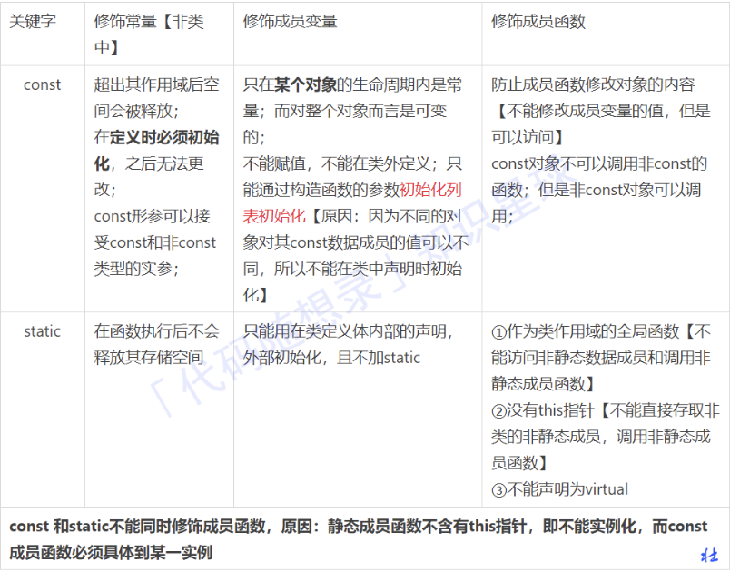

## 一面

1、shell编程

查看server.log中的ip出现次数前十的ip地址

`cat server.log | grep -Eo "\b([0-9]{1,3}\.){3}[0-9]{1,3}\b" | sort | uniq -c | sort -nr | head -10`

2、c++ 重写和重载、单继承、多继承、...,const static的区别，重写会重写父类中的什么东西

重写和重载
   1. override是重写(覆盖)了一个方法 

    以实现不同的功能，一般是用于子类在继承父类时，重写父类方法。

    规则:
      1. 重写方法的参数列表，返回值，所抛出的异常与被重写方法一致
      2. 被重写的方法不能为private
      3. 静态方法不能被重写为非静态的方法
      4. 重写方法的访问修饰符一定要大于被重写方法的访问修饰符(public>protected>default>private)
   2. overload是重载，这些方法的名称相同而参数形式不同 一个方法有不同的版本，存在于一个类中。
   
    规则:
       1. 不能通过访问权限、返回类型、抛出的异常进行重载
       2. 不同的参数类型可以是不同的参数类型，不同的参数个数，不同的参数顺序(参数类型必须不一样) 
       3. 方法的异常类型和数目不会对重载造成影响
    使用多态是为了避免在父类里大量重载引起代码臃肿且难于维护。 
    
    重写与重载的本质区别是,加入了override的修饰符的方法,此方法始终只有一个被你使用的方法。

3. 单继承、多继承、多重继承

   1. 继承

       定义: 让某种类型对象获得另一个类型对象的属性和方法

       功能: 它可以使用现有类的所有功能，并在无需重新编写原来的类的情况下对这些功能进行扩展

       常见的继承有三种方式:

       1、实现继承:指使用基类的属性和方法而无需额外编码的能力

       2、接又继承:指仅使用属性和方法的名称、但是子类必须提供实现的能力

       3、可视继承:指子窗体(类)使用基窗体(类)的外观和实现代码的能力

   2. 单继承 ： 单继承是指一个类只能继承自一个基类（父类）。在单继承中，一个子类只能有一个直接的父类。

   3. 多重继承：一个类同时继承多个类。这意味着一个派生类可以拥有多个直接父类。多继承可以带来更丰富的功能组合，但也容易导致复杂性增加和潜在的命名冲突。

   4. 多层继承： 多层继承指的是一个派生类继承自另一个派生类，而后者又继承自基类。这样就形成了一个继承的层次结构。

   5. 虚拟继承：通常用于解决多重继承中的“菱形继承”问题。


       在虚拟继承中，派生类只会继承共同基类的一个实例，而不是每个基类都有自己的实例。这样可以确保共同基类的成员不会重复，避免了二义性和冲突。

   6. 私有继承：

       它定义了一个继承关系，但继承的成员在派生类中是私有的。这意味着基类的公有和保护成员在派生类中都变成了私有的，而派生类对象不能直接访问这些成员。


4. const static的区别

    const 关键字

    被它修饰的值不能改变，是只读变量。必须在定义的时候就给它赋初值。

   1. 常量指针:
   是指定义了一个指针，这个指针指向一个只读的对象，不能通过常量指针来改变这个对象的值。常量指针强调的是
   指针对其所指对象的不可改变性。

   2. 指针常量:
   指针常量是指定义了一个指针，这个指针的值只能在定义时初始化，其他地方不能改变。指针常量强调的是指针的
   不可改变性。

    static

    作用:实现多个对象之间的数据共享 + 隐藏，并且使用静态成员还不会破坏隐藏原则;默认初始化为0


    


5. 用例设计方面，深度不够，概括面还不错

        微信红包功能测试

        功能

        在红包钱数，和红包个数的输入框中只能输入数字
        红包里最多和最少可以输入的钱数 200 0.01
        拼手气红包最多可以发多少个红包 100、超过最大拼手气红包的个数是否有提醒
        当红包钱数超过最大范围是不是有对应的提示
        当发送的红包个数超过最大范围是不是有提示
        当余额不足时，红包发送失败
        在红包描述里是否可以输入汉字，英文，符号，表情，纯数字，汉字英语符号，是否可以
        输入它们的混合搭配
        输入红包钱数是不是只能输入数字
        红包描述里许多能有多少个字符 10个
        红包描述，金额，红包个数框里是否支持复制粘贴操作
        红包描述里的表情可以删除
        发送的红包别人是否可以领取、发的红包自己可不可以领取 2人
        24小时内没有领取的红包是否可以退回到原来的账户、超过24小时没有领取的红包，是否还可以领取
        用户是否可以多次抢一个红包
        发红包的人是否还可以抢红包 多人
        红包的金额里的小数位数是否有限制
        可以按返回键，取消发红包
        断网时，无法抢红包
        可不可以自己选择支付方式
        余额不足时，会不会自动匹配支付方式
        在发红包界面能否看到以前的收发红包的记录
        红包记录里的信息与实际收发红包记录是否匹配
        支付时可以密码支付也可以指纹支付
        如果直接输入小数点，那么小数点之前应该有个0
        支付成功后，退回聊天界面
        发红包金额和收到的红包金额应该匹配
        是否可以连续多次发红包
        输入钱数为0，"塞钱进红包"置灰

    性能

        弱网时抢红包，发红包时间
        不同网速时抢红包，发红包的时间
        发红包和收红包成功后的跳转时间
        收发红包的耗电量
        退款到账的时间

    兼容

        苹果，安卓是否都可以发送红包
        电脑端可以抢微信红包

    界面

        发红包界面没有错别字
        抢完红包界面没有错别字
        发红包和收红包界面排版合理
        发红包和收到红包界面颜色搭配合理

    安全

        对方微信号异地登录，是否会有提醒 2人
        红包被领取以后，发送红包人的金额会减少，收红包金额会增加
        发送红包失败，余额和银行卡里的钱数不会少
        红包发送成功，是否会收到微信支付的通知
        易用性(有点重复)
        红包描述，可以通过语音输入
        可以指纹支付也可以密码支付


6. python 合并生序链表

    ```
    class ListNode:
        def __init__(self, val=0, next=None):
            self.val = val
            self.next = next

    def mergeTwoLists(l1, l2):
        dummy = ListNode(0)
        current = dummy
        
        while l1 and l2:
            if l1.val < l2.val:
                current.next = l1
                l1 = l1.next
            else:
                current.next = l2
                l2 = l2.next
            current = current.next
        
        if l1:
            current.next = l1
        else:
            current.next = l2
        
        return dummy.next

    # 创建第一个链表: 1 -> 3 -> 5
    l1 = ListNode(1)
    l1.next = ListNode(3)
    l1.next.next = ListNode(5)

    # 创建第二个链表: 2 -> 4 -> 6
    l2 = ListNode(2)
    l2.next = ListNode(4)
    l2.next.next = ListNode(6)

    # 合并两个链表
    merged_list = mergeTwoLists(l1, l2)

    # 打印合并后的链表元素
    while merged_list:
        print(merged_list.val, end=" -> ")
        merged_list = merged_list.next

    ```

7. 自我介绍

8. 你在实习时用到了哪些自动化测试框架

9. mysql中 char 和 varchar的区别

    CHAR：固定长度的字符串存储方式。当定义一个CHAR列时，你需要指定固定的长度，如果存储的数据长度小于指定长度，MySQL会在数据后面填充空格，使其达到指定长度。

    VARCHAR：可变长度的字符串存储方式。它只会占用实际存储数据所需的空间加上一到两个额外的字节来记录实际长度。因此，对于长度不固定的数据，VARCHAR比CHAR更有效地利用存储空间。

10. 大厂的测试流程

    https://mp.weixin.qq.com/s/zeZKWgIKNlnCstPqQ1KdzA

   需求评审->上线结束

   我应该怎么介绍自己的测试流程，才能要面试管觉得我对整个测试流程已经掌握了，证明测试学到了东西呢？（这个问题主要考察面试者**是否对测试整体有一个清晰的认知**以及是否具备**主动推进测试流程**的能力。）

   **推进测试流程**以及**良好的交流沟通能力**大概是除技术能力之外最重要的软实力了。

   对于管理者来说：除了给下级部署测试任务之外，很重要的日常就是去协调各个系统资源，宏观调控，推进整体进度。

   对于常规的功能测试测试流程来说：

    版本迭代：一个月两次

    产品经理下个月会把需求发给对应系统的开发经理与测试经理

    然后部门leader开始分发需求、任务 （当然分配任务的时候，也会空出一部分人力做自动化测试和性能测试）

    1. 需求评审：主要参与人员为负责这个需求对应系统和它的上下游系统的开发和测试，以及提出这个需求的产品经理。
    2. 产品经理需求排期。每月两个版本，排期两次。
    3. 测试经理分配任务。以版本为单位分配测试任务，一次排一个版本或者两个版本任务。
    4. 编写测试用例，用例评审 。参与用例评审人员为这个需求所涉及系统的开发测试，以及产品经理，跟需求评审人员差不多。会议目的主要看用例场景是否有遗漏，需求是否理解错误。稍微大些的项目一般使用xmind梳理场景，再用excel细化每条用例。
    5. 录入track系统。记录测试需求以及信息的系统，主要录入提测时间，案例条数，是否冒烟通过等信息，也便于统计工作量。
    6. 开发提测，提测模版 。  开发部署代码到测试环境，然后发邮件给测试，邮件包含测试信息比如url，查找日志关键字，主要测试点等。
    7. 测试，提bug，复测，移动卡片。公司使用自研系统管理测试流程，拖动卡片来反馈测试进度，类似于禅道，jira之类的。
    8. 发邮件UAT验证。 测试验证完之后发邮件给业务以及产品经理，验证功能是否符合需求，没问题需要回复邮件通过，时间一般为上线前两天。
    9. 发系统测试报告，代码封版。 一般为上线前一天，测试没问题，代码封版，发系统测试报告，不允许再修改代码。如果封版之后发现有问题，需要发邮件给运维，申请解封。之后重新发送系统测试报告。
    10. 回归测试，发回归测试报告。一般为上线当天，封版之后对之前测试需求进行回归测试，防止开发合错代码以及漏发服务之类的，回归测试没问题发回归测试报告。
    11. 上线。 时间一般为版本日当天晚上12点之后，此时对用户影响最小，有些项目采取灰度发布方式的话会早一些，一般九点左右。
    12. 生产验证 。 上线之后进行生产验证，一般为测试留守进行验证，或者开发自己验，不太重要的项目第二天上班之后进行验证
   
    以上测试流程，就是一个相对比较规范的流程了，其中每个环节都要严格遵守，防止万一出问题，追责时，如果没按照规范来就要背锅了。

    所以职场人要学会的一项重要能力就是学会甩锅，保护自己。当然，上面讲的主要是功能测试流程，关于自动化测试和性能测试流程等之后再聊。


11. 测试的推动能力和计算机基础


## 4月16日 二面
1. 自我介绍
2. 说一下测试的详细流程
3. case是会积累的吗，我回答是
4. 什么样的情况会手动执行case，我举了两个例子（指示灯、视频流）主要是考察自己的测试思维，面试官从我的设计的手动case中发现了问题，展开了讨论
5. 对于测试开发、研发理解，未来的规划
6. 如何保证测试用例覆盖率率，有没有一种机制
7. 问我有没有offer
8. 最长不重复子串，并针对其进行用例设计

反问：需要提升的地方：对于测试的理解，就是在测试中你对于不合理的地方的建议

总结：

1. 再仔细总结一下实习期间用例设计，不要给自己挖坑
2. 测试思维，什么是测试思维，给你一个待测的点，你怎么设计测试，怎么实现自动化，怎么推动测试
3. docker再深入理解

回忆测试过程中的需要手动执行的case

1. vpu 测试串流功能
   
   实际上可以分为两步：

    1. 串流环境的搭建（可以搭建完一直播放串流）
    2. 测试新软件的串流捕获功能，可以实现一个自动化

2. 测试板卡指示灯

通过执行相应的命令达到重启办卡、开关使能、打开和关闭办卡指示灯的功能

3. 自动化实现起来比较难，无法结果校验

4. 一些性能测试需要单独执行


