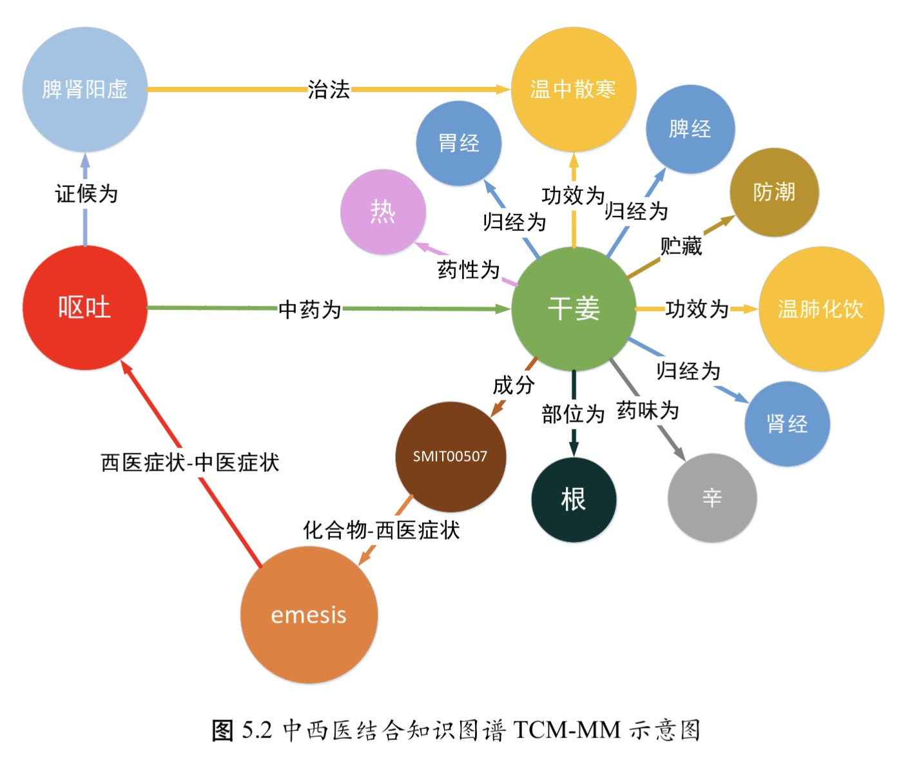

# 基于图神经网络的中医药方推荐技术研究\_靳远远\_

## 数据集

1. 中医医案数据集TCM（已下载）

2. TCMKG（中医知识图谱、未找到资源）

   - 论文来自： WANG X,ZHANG Y,WANG X,et al.A Knowledge Graph Enhanced Topic Modeling Approach for Herb Recommendation[C]//International Conference on Database Systems for Advanced Applications.2019:709724. 
   - 融合了来自中药图典网站、中医数据库和互联网资源医砭网站等多源异构数据，构建了中医知识图谱**TCMKG**
        - 网址：[http://www.a-hospital.com/w/](http://www.a-hospital.com/w/) 和 [http://yibian.hopto.org/](http://yibian.hopto.org/)
  
3. TCM-MM（靳自建中西医结合结合数据库、估计不会给）
    - 论文来自：中医药理学知识库SymMap[34]: WU Y,ZHANG F,YANG K,et al.SymMap:an integrative database of traditional Chinese medicine enhanced by symptom mapping[J].Nucleic acids research,2019,47(D1):D1110D1117.`**论文pdf已下载**
        - SymMap的数据来源于：
          1. [31]XUE R,FANG Z,ZHANG M,et al.TCMID:traditional Chinese medicine integrative database for herb molecular mechanism analysis[J].Nucleic acids research,2012,41(D1):D1089D1095.
          2. [32]RU J,LI P,WANG J,et al.TCMSP:a database of systems pharmacology for drug discover from herbal medicines[J].Journal of cheminformatics,2014,6 (1):16.
          3. [33]ZHANG R Z,YU S J,BAI H,et al.TCMMesh:the database and analytical system for networ pharmacology analysis for TCM preparations[J].Scientific reports,2017,7(1):114.
          4. [34]WU Y,ZHANG F,YANG K,et al.SymMap:an integrative database of traditional Chines medicine enhanced by symptom mapping[J].Nucleic acids research,2019,47(D1):D1110D1117.
    
## 数据集构造方法：
- 三元组为(q,r,t)表示头实体q和尾实体t之间存在关系r
- 数据来源：
  1. TCM-KG（中医辩证论治理论） ： 共包含55,556个实体，23种关系和133,6421个三元组。例如三元组（呕吐，证候，脾肾阳虚）表示引起呕吐的证候为脾肾阳虚。**目前数据集还没有获取到**
  2. SymMap （中药的药理学知识）: 该数据库包含1717种中医症状、961种西医症状、499种中药、19595种中药所含化合物、4302种靶标、5235种疾病；
       - 一阶关系包括：6638对中药-中医症状、48372对中药-化合物、2978对中医症状-西医症状、29370对化合物-靶标、7256对靶标-疾病、12107对西医症状-疾病

- 本体构建：
  1. 将二部图SH中包含的症状和中药根据名称对应到TCMKG与SymMap中的实体
- 信息抽取：

    TCMKG本身以三元组形式组织，直接抽取中医症状S和中药H相关的三元组即可；

    SymMap网站的半结构化信息抽取，根据网页html源码中的标签来抽取*中药-化合物*、*化合物-西医症状*及*中医症状-西医症状*这三类关系

二部图中的边ysh转换为三元组(s,交互,h)合并到TCMMM后，得到**扩充后的知识图谱G**

知识图谱如图所示：

