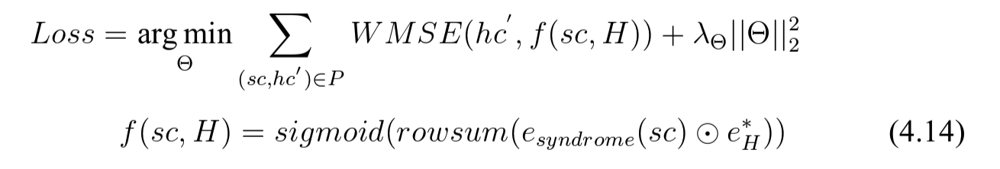
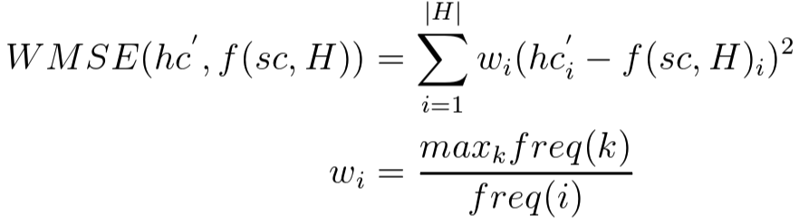

# 目录

[输入嵌入(已完成)](#1)

[知识图谱嵌入（已完成）](#2)

[症状层面的注意力机制融合（已完成）](#3)

[中药层面的注意力机制融合（症候归纳）（已完成）](#4)

[处方](#5)

[输出的嵌入(数据集得到，需清洗一下后，送入模型)](#6)

[模型的更新](#7)

[模型的评估部分](#8)

[实验分析](#9)

## 嵌入部分

### <a id='1'>1 输入嵌入（症状集合+个体特征）</a>

嵌入采用的模型：TCM-SD-BERT

输入：

sympotms + individual_characteris 

-> cls + symptoms + sep + individual_charachteris + sep 

->

batchsize * token2index

batchsize * attention_mask

batchsize * type_ids


任务：

1. 修改TCM-SD-BERT模型为上面的输出/输出模式（11.24日 输入已完成）

2. 数据集的清洗和标准化
   
   a. 将症状集合从precriptions.json的“主治”中剥离出来（前期也可以直接输入）
   
   b. 将个体特征从precriptions.json的"加减化裁"中剥离出来；（每种特征由";"拆分 -> 作为个体特征）

### <a id='2'>2 知识图谱嵌入 </a>

采用最先进的知识图谱嵌入模型将知识图谱嵌入

知识图谱可以采用TCM-KG的

**11月22日**

发现[ComplEx-RP](https://github.com/facebookresearch/ssl-relation-prediction/blob/main/doc/hyper-parameters/fb15k237.md#best-run-for-fb15k237)有完整的指导说明

数据梳理流程：

   FB15K-237(head, relation, tail)(0.877/0.057/0.066) -> train/valid/test -> 得到实体集合和关系集合并指定id -> train : batchsize -> 实体和关系的词典和嵌入

   TCM-KG(head, tail, relation) 
   
   -> TCM-KG(head, relation, tail)(已完成) 
   
   -> 得到实体集合和关系集合并指定id(已完成) 
   
   -> **确定实体类别(已完成)** 
   
   -> train(已完成) 
   
   -> 实体和关系的词典和嵌入(已完成) (bert为的dim=1024，嵌入也设置为1024)
   
   -> 根据实体类别取出对应类别的嵌入(已完成，见本机/Users/gjh/workspaces/vscode/python/5.TCM.python/ssl-relation-prediction/load_embeddings)

   **注意：是负数形式表示的**

   首先要明确嵌入的存储方式，然后取出对应的实部和虚部(已完成)

11.25日：关于compex-rp模型嵌入向量时复数后，试图寻找其他模型时发现了解到：我的想法的实现可以通过**Link Property Prediction（边属性预测）** 和 **Knowledge Graph Completion（知识图谱补全**任务来进行嵌入。

**对应处方任务应采用Link Prediction（链接预测）任务描述： 给定图中的一些已知的症状-中药关系，模型需要预测图中未知的症状-中药关系。应用场景： 预测某个症状与哪些中药有关联。**

**知识图谱补全任务主要应用于扩展和完善知识图谱。通过预测缺失的关系或属性，可以提高知识图谱的完整性和可用性。**

12.1日 

现在可以先采用ComplEx-RP的嵌入方法，不追求效果的好坏，先把流程走通就行！


## <a id='3'>3 嵌入融合（症状层的嵌入）</a>

输入的嵌入和知识图谱的嵌入采用注意力机制的方式进行特征融合

任务：

1. 清楚注意力机制处理流程，包括输入格式、输出

通过查看transformers的bert模型源码了解到，可以用其中的multi-cross-attention模式使用我的想法

`from transformers.modeling_bert import BertSelfAttention`

明确类中几点内容：

参数都有什么作用。自己准备好并封装成config对像传入。

1、__init__(): 参数config + position_embedding_type

config(有很多参数，只考虑BertSelfAttention类__init__()函数用到的参数):

   1. config.hidden_size: 隐藏层输出的大小 int类型
   2. config.num_attention_heads: 注意力机制头的数量
   3. config.max_position_embeddings: 模式数值即可（512）
   4. config.is_decoder: 模式，如果为decoder即q与k,v是分开的

postion_embedding_type: 位置嵌入方式 如果是decoder模式，就采用绝对嵌入，如果是encoder模式，就相对嵌入

2、forward()：传入的参数都是什么作用，我该如何准备

   1. hidden_states: batchsize * max_sequence_lenght * dim 输入（当crossAttention模式时，hidden_status可理解为q查询向量,也就是tcm_bert_outputs）

   2. attention_mask: 对应输入的掩码，屏蔽不参与计算的部分

   3. head_mask: 屏蔽掉某个头

   4. encoder_hidden_status: 可以理解为传进来的k,v

   5. encoder_attention_mask: 对k,v对应不参与计算的部分进行掩盖

   6. past_key_value: 上一次的k,v(避免重复计算，提高计算效率)

   7. output_attentions: 是否输出注意力分数

11.27日

q为tcm_bert嵌入, 最终池化为3个向量:

   1. pooling_outputs = 整个输入的池化
   2. 第一个句子的池化（症状输入）
   3. 第二个句子的池化（个体特征输入）

kv为知识图谱嵌入：
   症状实体嵌入集合

通过多头交叉注意力机制得到3个向量（已完成）

## <a id='4'>4 中药层面的注意力机制融合（症候归纳）</a>

1、先采用利用博士论文二的症候归纳方法，把整体的流程跑通：

就是该中药向量同所有的症状进行注意力机制得到对于每个症状的权重，再进行聚合，得到针对该中药的隐式证候向量。然后每个中药都是这样的操作，最终也就是每个中药都有一个对应的证候向量，对应相乘，再行相加，再sigmoid得到概率

q为中药实体的知识图谱嵌入

kv为症状层输出的三个向量

->通过多头交叉注意力机制得到每味中药对应的症候向量（已完成）

## <a id='5'>5 处方</a>

1. 博士论文症候归纳并处方方法：

方法：

1. 得到的症候向量和中药向量 相乘相加 再经过 sigmoid函数得到0～1之间的概率，并设定阀值获得对应的中药集合
2. 通过真实值来计算loss

代码：

```
predict_probs = tf.nn.sigmoid(tf.matmul(user_embeddings, self.ia_embeddings, transpose_a=False,transpose_b=True))

mf_loss = tf.reduce_sum(tf.matmul(tf.square((items - predict_probs), name=None), self.item_weights), 0)
```

公式：




## **<a id='6'>6 输出的嵌入</a>**

### 6.1 目标：

1、每个处方都有对应的中药集合，需要将中药集合从'组合'中提取出来

      "人参去芦，白术、茯苓去皮（各9g），甘草炙（6g）。" -> ['人参', '白术', '茯苓', '甘草'] 

      已完成

2、每个处方如果有'加减化裁'，需要 先拆分 再提取每种情况的对应的症状和中药

      "若呕吐，加半夏以降逆止呕；胸膈痞满者，加枳壳、陈皮以行气宽胸；心悸失眠者，加酸枣仁以宁心安神；若畏寒肢冷，脘腹疼痛者，加干姜、附子以温中祛寒。烦渴，加黄芪；胃冷，呕吐涎味，加丁香；呕逆，加藿香；脾胃不和，倍加白术、姜、枣；脾困，加人参、木香、缩砂仁；脾弱腹胀，不思饮食，加扁豆、粟米；伤食，加炒神曲；胸满喘急，加白豆蔻。",

      -> (每种情况均已 '。' '；' 分隔开 )

      若呕吐，加半夏以降逆止呕 -> {'个体特征': ['呕吐'], '中药': ['半夏'], '治法': ['降逆止呕']}

      胸膈痞满者，加枳壳、陈皮以行气宽胸 -> {'个体特征': ['胸膈痞满'], '中药': ['枳壳'], '治法': ['行气宽胸']}

      心悸失眠者，加酸枣仁以宁心安神 -> {'个体特征': ['心悸失眠'], '中药': ['酸枣仁'], '治法': ['宁心安神']}

      若畏寒肢冷，脘腹疼痛者，加干姜、附子以温中祛寒 -> ... ...

      烦渴，加黄芪 -> ... ... 

      ... ...

3、 每个处方都有主治、主治中有证型和症状集合。下面具体分析

### 6.2 具体的解决办法：

#### 6.2.1 办法1失败（受tokens限制，收费） ： 通过文心一言大模型进行实体识别并个性化输出好像可以做出来

      我理解调用文心一言API接口调用大概的流程如下：

      -> 创建一个prompt模版：

      prompt:给出含有中草药、用法、用量的序列: {herb_sequence}, 请识别出每一味中药及对应的用法、用量，以python词典的格式返回结果，只返回结果，其他任何无关的数据不输出

      -> 每次调用大模型的接口，只需要替换herb_sequence部分

      -> 每次对话的结果，先保存，再提取

      -> 形成最后的数据集

      12.2日 受tokens限制，文心一言欠费了（不能全部识别出来）

#### 6.2.2 办法2 成功 ：尝试使用哈工大的本草模型

1、 活字模型可以直接部署在服务器上，直接可以调用

2、 本草模型是如何像活字那样直接调用的呢？已经搞清楚，原理就是两个模型融合之后，进入评估模式

接下来，决定采用本草模型，将infer.py修改成输入问题集，输出结果集，再对结果集做标准化，可以实现定制化的数据集

具体想法实现逻辑：

   1. '组成' (已完成)

      加载prescription.json -> 取index和‘组成’ -> 从组成中通过大模型识别出中草药实体 -> 将index和中草药实体存储到新的文件 -> 数据的清洗和标准化

      发现使用本草也就是将活字lora后反倒是效果不好了。

      使用活字2 + [csdn格式化输出方法](https://blog.csdn.net/weixin_43907802/article/details/131635868) 取得了不错的效果

   2. '加减化裁'（已完成）

   3. 主治

      主治中：可能含有证，但一定有症状描述。

      具体分析主治主要有几种格式：

      1. "脾胃气虚证。面色萎黄，语声低微，气短乏力，食少便溏，舌淡苔白，脉虚弱。"

      -> 句号分割。前面是证型。后面是症状描述

      "主治伤寒痞证，胃气虚弱，腹中雷鸣，下利，水谷不化，心下痞硬而满，干呕心烦不得安；狐惑病。临床常用于急慢性胃肠炎症、白塞氏综合症等。"

      -> 前面是证型。后面是症状描述，但是不以句号分割

      2. "冠心病，心绞痛。"

      -> 可以理解为只有症状描述

      3. "1、脾虚气陷证。饮食减少，体倦肢软，少气懒言，面色萎黄，大便稀溏，舌淡脉虚；以及脱肛，子宫脱垂，久泻久痢，崩漏等。2、气虚发热证。身热自汗，渴喜热饮，气短乏力，舌淡，脉虚大无力。"

      -> 有数字作为不同情况，不同情况中根据句号分割，前面是证型。后面是症状描述

      "1、伤寒少阳病证。邪在半表半里，症见往来寒热，胸胁苦满，默默不欲饮食，心烦喜呕，口苦，咽干，目眩，舌苔薄白，脉弦者。2、妇人伤寒，热入血室。经水适断，寒热发作有时。3、疟疾，黄疸等内伤杂病而见以上少阳病证者。",

      -> 有的虽然按照数字划分了，但是子句内部并不是完全按照“句号分割，前面是证型。后面是症状描述”的逻辑进行的说明。

      解决办法：先用正则表达式根据数字划分子句。每个子句送入活字，让其识别证型和症状集合。再将结果通过正则表达式提取，形成规范的格式。

      "①《伤寒论》：风湿相搏，骨节疼烦，掣痛不得屈伸，近之则痛剧，汗出短气，小便不利，恶风不欲去衣，或身微肿者。②《外台》引《近效方》：风虚头重眩，苦极不知食味。"

      -> 数字是圈1、圈2的这种

      4.  "妇人妊娠或经期，肝脾两虚，腹中拘急，绵绵作痛，头晕心悸，或下肢浮肿，小便不利，舌质淡、苔白腻者。现于纠正胎位。"

      -> 句号分割，前面是症状描述，后面无用的话。

      像这种情况只能将其送入活字，一起识别证型和症状集合，再利用正则表达式规范格式。

      5. "肾阴、肾阳不足而虚火上炎之更年期综合征，高血压病，肾炎、肾盂肾炎，尿路感染，闭经。1.《妇产科学》：更年期综合征，肾阴肾阳二虚证。2.《中医方剂临床手册》：高血压病，闭经，以及其他慢性疾病，见有肾阴、肾阳不足而虚火上炎者。3.《中医方剂手册》：肾阳不足，虚火浮越，头晕，头痛，目眩，肢冷，尿频，阳萎，早泄；妇女月经不调。4.《古今名方》：肾炎、肾盂肾炎、尿路感染、闭经等见有肾虚火旺证候者。"

      -> 解决办法：1. 按照数据进行划分子句 2. 识别证型和症状集合

      6. "小儿乙脑重症，症见发热（39~40度），头痛，烦躁，口渴，胸闷，恶心，呕吐，神志恍惚，惊掣，偶有惊厥，舌质红，苔黄或腻，脉说。"

      -> 完全按照数据划分子句还不行，数字还有其他用途

   综合处理办法：

   4. 只有一个句号：识别证型和症状描述

   5. 多于1个句号：

      1. 如果子句中有以序号开头的情况，说明每个句子都是一个独立的描述
      2. 如何没有以序号开头的情况，说明前面是证型，后面是症状描述

截止到12月5日 中药集合、加减化裁、症状集合都可以实现

预计最终形成的数据集：
包括：index、方名、中草药集合、主要症状集合+'证型'（如果有多组，就并列拆开）、不同附加症状对应不同的中草药集合

12月7日 通过代码获得了最终的数据集，但是距离应用还差一点，需要进一步清洗

具体体现在：
   1. herb_list ： 
      1. 中草药名称中有的带有括号，应想办法去掉括号及其中的内容

      -> 通过正则表达式删除

      2. 虽然是列表格式，但是内容中不是中草药名称，一堆无关字符

      -> 可以通过统计所有重要集合每味中药出现的次数，对于出现频次低于阀值的中草药名称，从对应的中草药集合列表中删除（如果删除后，列表为空，删除这个sample），并建立中草药名称词典。

      3. 中草药名称存在有英文字母或者其他非中文字符的情况

      -> 如果出现这种情况，直接删除这一味中草药

   2. add_or_sub_list：
      1. 对于个体特征列表：
         先采用 1. 去掉括号及括号中的内容 2.  使用正则表达式匹配除中文外的字符的方法
      2. 对于中药列表：采用herb_list相同的办法

         中药列表中的中药存在含有'去、减、裁'字样标识的情况，表示去掉这味中药，不是增加，在数据集的处理时应注意（暂时没有处理）

   3. syndrome_and_symptoms_list：
      证型 ： 先不管

      症状：按herb_list的处理办法先这么处理

得到最终的数据集后，基于数据集做一些事情。将数据处理的代码保存好。开始模型的设计和实验。

12月10日

数据集基本准备完成，在上面做进一步的处理

接下来回归到一刚开始的任务，输出的嵌入上面：

train的整个流程跑通了，但是有一些问题：

1. 原本bert的嵌入和自己的两个多头注意力层用的是不同的参数，但你由于config中我有嵌入了一个cofig对象，在保存模型时，不能保存，所以只能先把自己定义的config换回原来的，现在还不知道行不行，不知道有什么问题。

-> 解决办法：模型里面创建对象再传入，不一开始就创建对象了（已完成）

2. 评估部分流程还不熟悉

评估流程跑通了，但是评估方法不一样，我改了一下，**但是改的不准确，以后还得微调，具体的评估方法还得再定**（已完成）

3. 目前的数据集是样本，如何用上真正的数据集
4. 在求损失时，没有加权，仅仅为了跑通而使用了均方差，看看有没有更好的
5. bert和知识图谱的嵌入方面没有统一

## **<a id='7'>7 模型的更新</a>**

已完成，是TCM-BERT原本的更新方法，没有变

## **<a id='8'>8 模型的评估部分</a>**

评估部分，因为是多分类任务，与原本的评估方法不太一样，所以目前是测量他的acc, f1, top_k, 等作为他的评估


## <a id = '9'>9 实验分析</a>

截止12月12日，代码跑通，但并不意味着可以实现好的效果，如果想有效果，觉得还得做一下对比与实验，明确为什么这么做的理由，为什么理论上会有好的效果。

1. 要搞清楚：我现在的知识图谱嵌入的引入仅仅是知识表示的引入。与靳远远等人提出的异质图有什么区别，他们的异质图相比我现在想到的知识表示的引入有什么优点

现有的知识图谱嵌入方法：都是所有实体在嵌入时，可以理解为是同质的，只考虑关系的嵌入，而靳远远等人提出将不同类型实体视作异质的，通过自己构建图结构，再利用注意力感知机制自学习图结构。

相比知识图谱，自己构建的异质图更加小而精，嵌入必要的关系，不嵌入多余的关系，从而达到更好的效果。

2. 不同输出、嵌入情况的组合下，进行实验分析

   1. 输入： 症状描述序列 + 个体特征序列 + 普通的知识图谱嵌入表示
   2. 输入：输入症住集合 + 个体特征集合 + 症状与个体特征mask标识，bert输出嵌入后通过mask序列进行向量融合 + 知识图谱语义嵌入后在进行知识图谱嵌入


截止12.17日 感觉采用博士论文的处方方法，效果不理想，所以看了极大多分类的论文，可以这个处理方法我觉得很好，如果可以用的话，跑通的话，数据集也有，也适配，创新点好多了，可以完美解决，所以转战到极大多分类上面来。

1. 如果使用博士论文的分类方法，1. 需要统一中草药词典，2. 损失函数还要调整 3. 仅能出top_k 
2. 如果使用极大多分类的方法，1. 需要把博士论文代码搞清楚 2. 然后拼接 3. 拼接之后需要通过注意力机制结合知识图谱 
3. 系统的实现


