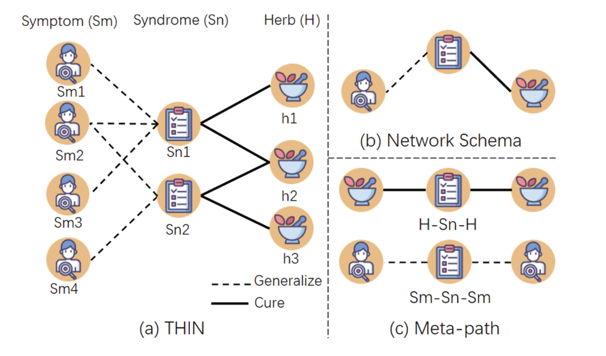

# HGCL:HGCL: Heterogeneous Graph Contrastive Learning for Traditional Chinese Medicine Prescription Generation

# 异构图对比学习对于中医处方推荐

## 研究贡献

1. 构建THIN(TCM Heterogeneous Information Networks)中医异构信息图

2. 提出了一个应用于中医处方生成的图对比表示学习模型HGCL，是异构图对比学习的第一次中医尝试。

3. 实验结果state-of-the-art。

## THIN

## 元路径

根据THIN自定义有几种元路径格式，并生成元路径集合

## HGCL

利用图对比学习来学习结点水平和语义水平的知识

结点水平就是THIN

语义水平就是元路径

## 数据集

1. TCMRel: https://www.aminer.org/tcmrelextr

    已下载

2. ChP：is built from the Pharmacopoeia of the People’s Republic of China 2015 Edition, with formula, herb, symptom, and function included.

3. 自建数据集无法下载

## 图对比学习：

当提到图对比学习（Graph Contrastive Learning）时，通常指的是一种利用图结构数据进行自监督学习的方法。图对比学习旨在学习出一种能够对图中不同节点或子图进行区分的特征表示，使得相似的节点或子图在特征空间中更加接近，而不相似的节点或子图则更加分离。

图对比学习方法可以分为两个主要阶段：

构建正负样本对和学习特征表示。在构建正负样本对阶段，首先从图数据中随机选择一个节点或子图作为查询节点（或查询子图），然后根据一定的规则或采样策略，选择与查询节点（或查询子图）相似或不相似的节点（或子图）作为正样本和负样本。通过构建这样的样本对，可以建立起一个训练数据集。

在学习特征表示阶段，利用构建的训练数据集，使用深度学习模型对节点或子图进行编码，得到它们的特征表示。一般来说，常用的深度学习模型包括图卷积网络（Graph Convolutional Network，GCN）和图注意力网络（Graph Attention Network，GAT）等。通过最大化正样本对的相似性，并最小化负样本对的相似性，模型可以学习到一种具有区分性的特征表示。

图对比学习的一个重要应用是图表示学习，即学习出节点或子图的低维度表示，使得节点或子图之间的关系能够在特征空间中得到准确的刻画。这种刻画可以用于图分类、图聚类、图生成等任务。

总结来说，图对比学习是一种利用图结构数据进行自监督学习的方法，通过构建正负样本对和学习特征表示，使得相似的节点或子图在特征空间中更加接近，而不相似的节点或子图则更加分离。它可以应用于图表示学习等任务，为图数据的分析和应用提供基础支持。

