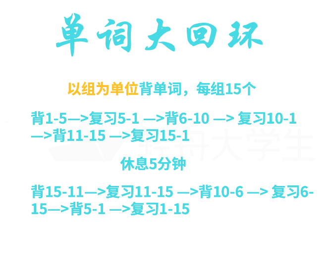
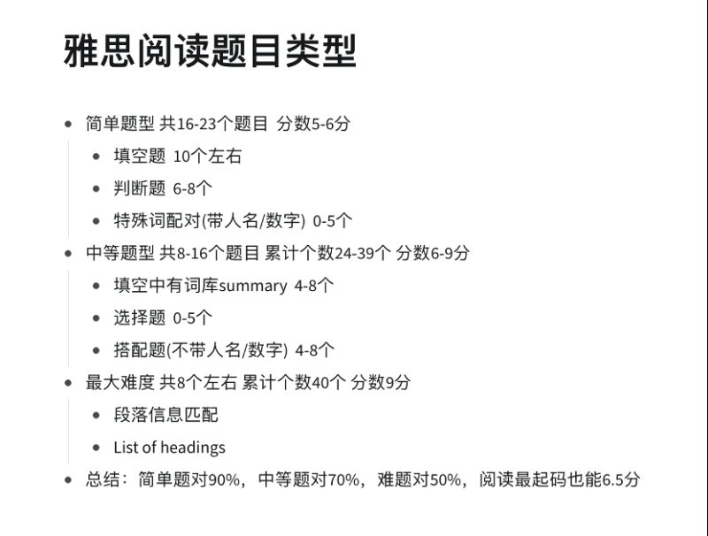
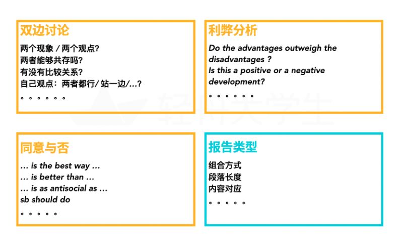

# 学而思 雅思全科备考训练营
## 教师资源
- 口语 ： 陈依玲
- 听力 ： 尹汉哲
- 写作 ： 樊子超
- 阅读 ： 徐忆宁

## 各个科目 6.5分为例
- 阅读
  1. 背单词
     - 方法：每组15个单词，每天需要按照上图所示循环方式，至少背3组单词(共45个)，但也不要超过10组(贪多嚼不烂)而且，每隔3天，需要把前三天之内背过的单词，进行一遍总复习，在每三天总复习的过程中，可以把未掌握的单词，单独记录下来，专门查漏补缺，强化记忆。
    
  2. 题型
   
    

    根据官方评分标准，阅读和听力的简单题和难题没有分值差别，以听力和学术阅读(A类)为例，40道题中任意做对30道，基本达到了听力和学术阅读7分的要求
    因此，阅读和听力要根据自己的目标分数，来安排要做对什么题型

    各种题型都有对应的“最科学的处理方法”，如果不掌握正确的做题方法，只是闷头刷题，刷完对个答案，也不思考总结，阅读很容易遭遇瓶颈期(到达某个分数段，再也上不去了)；

    3. 非常重要另一件事请是：阅读要做复盘表

    

    复盘表可以帮助大家梳理出，自己的哪类题型掌握不是很好，像阅读这样的科目，反而不能轻视哦

- 听力

  1. 目标分数6.5分的同学，首先要做到剑4—剑16，所有填空答案词：读得对、知道意思、拼写完全正确才可以，否则，只知道中文意思，拼写不对得不了分，自己读不对，听到正确读音反应不过来，也不行
  2. 达到上述词汇基础之后，由于听力各部分题目难度基本呈递增趋势，对于各部分，目标正确率要求如下：
   
        第一部分 目标正确率85%

        第二部分 目标正确率75%

        第三部分 目标正确率65%

        第四部分 目标正确率55%
        
        如此组合，听力6.5的分数完全有保证；
    3. 同学们至少需要刷剑4—剑16中任意3本书的题量，做题 + 总结高频场景、高频考点词 + 总结个人常错点(读音方面：吞音、连读、重音位置等；场景方面：哪些场景背景知识，自己特别陌生，需要做针对性补强；题型方面：哪些题型自己根本毫无章法，需要多琢磨，找到最合适的处理办法)；

- 写作

把小作文各种图表题：Table(表格)、Bar(柱状图)、Line(线状图)、Pie(饼状图)、Flow-chart(流程图)及其各种组合，至少各练一篇+至少各找一篇范文揣摩、仿写；

如果是G类同学，小作文写的是各种书信、邮件；
另外，同学们需要了解，写作大作文的常见4大类题目类型

大作文也需要刷往前数至少三年的机经，每一篇看到题目，要能够马上反应出属于上述四类中的哪一类；每一篇，都要列一下提纲;如果不做上述动作，上考场，一篇文章提纲都列不对，跑题之后，得不了6分；写作各类话题：如科技类、政府类、全球化类等等，请从三年机经中，上述4类题目类型中，各找一篇进行全真写作训练(必须写够250字)，并且找朋友帮忙批改——只写，不找人批改，等于白写；

- 口语

首先同学们需要知道，每年1、5、9月初口语题库会有一次大范围轮换，除非是对自己口语极度自信、或者实在来不及必须马上出成绩的同学，否则，建议避开1、5、9月月初的考试，毕竟，我们要在考场上有备而来，才能尽量保证高水平发挥；

如果刚刚开始备考，建议要先跟读，跟读听力材料，是提升口语非常好的方式，每天坚持跟读，长时间下来一定会有质的变化

雅思口语part1-part2部分，分人、事、地、物四大类，想保证口语6分，至少以上四大类话题，得各找5个区分度尽量大的题目(描述一个你最尊敬的人 / 描述一个你最尊敬的老人，这俩话题区分度就太小，完全可以合并)，一共凑至少20个口语话题，每个话题，提前整理好思路，写好能说2分钟的英文，并且背诵熟练；

如果Part 1和Part 2你能做到上述准备，Part 3虽然比较灵活，有了Part 1和Part 2的语料储备，应该也不会发挥太差；

以上是关于备考规划，大家可以存下来哦；当然每个人的情况，和目标分都是不一样的，备考规划要因人而异，如果觉得备考有难度，可以咨询负责自己的规划哦[加油]