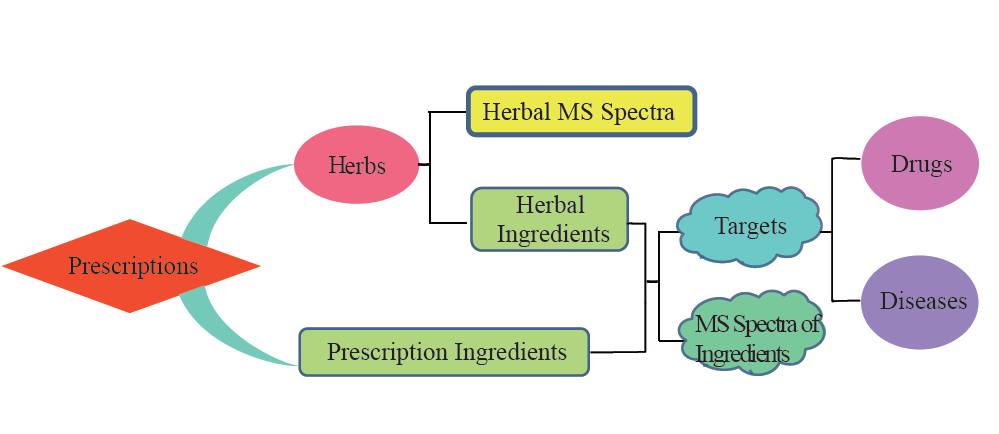
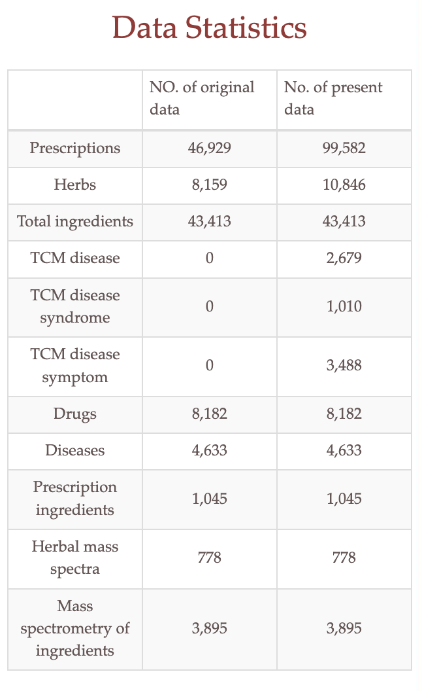

# TCMID(Traditional Chinese Medicine Integrated Database )

**[网址](http://47.100.169.139/tcmid)**

## 介绍

如图所示：

Herbal MS Spectra（草药质谱图）: 质谱（Mass Spectrometry，简称MS）物质的分子结构和组成。草药质谱图谱可以提供有关草药中存在的化学成分的信息。

数据统计：

## 数据集文件分析

1. herb-TCMID.v2.01

单条数据为例：

    Pinyin Name	拼音名：QIAN JIN ZI

    Chinese Name 中文名：千金子	
					
    English Name 英文名：Caper Euphorbia Seed

    Latin Name 拉丁文名：Euphorbia lathyris

    Properties 属性：NA

    Meridians 经络：NA

    Use Part 使用部分：	ripe seed without seed coat（成熟种子无种皮）

    Effect 功效：To expel water and disperse swelling, break blood and disperse concretion.（利水消肿，破血散结。）

    Indication 治疗病症：Edema, phlegm-rheum, accumulation and distention-fullness, urinary and fecal stoppage, amenorrhea due to blood stasis, intractable impediment, wart. （水肿，痰饮，积满，二便不通，瘀血闭经，顽痹，疣。）

2. HERB_MS.txt

sample:

    herb_id : 7629

    herb_pinyin_name : AI DI CHA
    
    herb_Latin_Name : Ardisiae japonicae
    
    spectrum_name : HPLC （"spectrum_name: HPLC" 意味着该光谱是使用高效液相色谱法进行分析和生成的。这种光谱通常用于检测、定量和分离复杂样品中的化合物。）
    
    herb_origin : 贵州
    
    herb_origin_pinyin : GUI ZHOU
    
    spectrum_description （草药所含化合物） : 6.gallic acid;17.bergenin;20.chlorogenic acid;31.quercitrin (6.没食子酸;17.岩白菜素;20.绿原酸;31.槲皮素)

3. Ingredient_MS-TCMID.v2.01.txt

sample:

    Ingredient_name : Chrysophanic acid

    GNSP_ID : "CCMSLIB00000006876"

4. ingredient_targets_disease_drug-TCMID.v2.03.txt

根据文件名的推测，该文件可能包含关于成分（ingredient）、靶点（targets）、疾病（disease）和药物（drug）之间关联信息的数据。

sample:

    abietic acid	3145	Q9Y6L6	SLCO1B1	614332;237450	DB00655;DB00950;DB06403;DB00279;DB00220;DB01045;DB00224;DB00227;DB00286;DB04881;DB00091;DB08912;DB00917;DB01092;DB00912;DB08860;DB00503;DB00563;DB00859;DB01095;DB00509;DB00520;DB00688;DB00412;DB01232;DB01132;DB05804;DB06589;DB00451;DB08884;DB00275;DB00661;DB01076;DB01053;DB06772;DB00783;DB00762;DB00669;DB06626;DB06210;DB00583;DB06151;DB01393;DB00213;DB05239;DB00390;DB06290;DB00877;DB00908;DB00973;DB04348;DB01892;DB11362;DB13153;DB13139;DB09137;DB01098;DB00641;DB09102;DB02659;DB02691;DB09054;DB00175;DB00177;DB08864;DB09272;DB00439;DB00197;DB01583;DB01241;DB00345
   
5. prescription-TCMID.v2.01.txt

sample:

    pinyin_name	JIA WEI CAN XIA TANG

    chinese_name : 加味参夏汤	

    composition	: 人参1两半，半夏1两半，肉桂1两，甘草（炙）5钱，乳香3钱。

    pinyin_composition	: REN SHEN,BAN XIA,ROU GUI,GAN CAO,RU XIANG,

    indication	: 七情相干，眩晕欲倒；又治七情之气郁于心腹，不可忍，脉沉迟者。

    use_method	: 每服5钱，加生姜5片，水煎服。

    references	:《赤水玄珠》卷十六。	

## TCMID的构建：

将中药草药成分与其相互作用的蛋白质联系起来，**鉴定出了大量的生物活性化合物**，并推断出**它们与蛋白质的相互作用靶点**。

## TCMID与其他数据库的不同：

TCMID的另一个亮点是通过使用草药和化合物作为**桥梁**，**将中药方剂与蛋白质相连接**。因此，它可以用于分析方剂的多靶点效应，并探索每个方剂的潜在分子机制。

我们还将草药成分与疾病（OMIM）和药物（DrugBank）进行了关联。这将提供丰富的信息，帮助研究人员进行药物发现。

例如，

**如果一个化合物和一个已批准的药物都靶向相同的蛋白质，那么这个化合物可能是开发新药的最有前景的候选药物。**

**如果一个化合物和一种疾病共享相同的蛋白质，那么含有该化合物的草药可能对这种疾病具有一定的作用。**

## 草药具备的5个属性

一个草药具有五个属性。它们是性 味 归经、功能 与 适应症。

性指的是患者对草药的反应所基于的基本特性，它有四种属性：寒、凉、温、热；

味用于描述草药对人体的作用，包括五种性格：辛辣、酸、甘甜、苦、咸；

归经：描述了草药对身体特定部位的选择性治疗作用，包括十二个不同的器官：心、肝、脾、肺、肾、胃、大肠、小肠、膀胱、胆囊、心包、三焦。

功能用于说明草药治疗作用的机制。例如，常见的一种草药“当归”具有“活血化瘀”、“调经”和“润肠通便”的功能；

适应症指的是草药治疗的疾病或症状。几种草药按照主药、副药、助药和使药的顺序组成方剂，而后面的草药在顺序中表示重要性较低。

