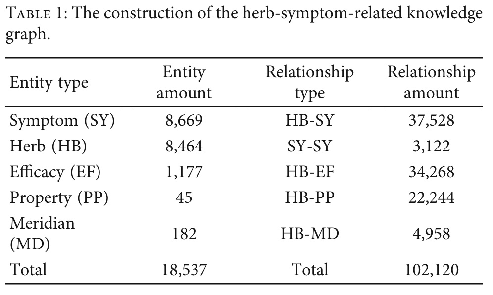
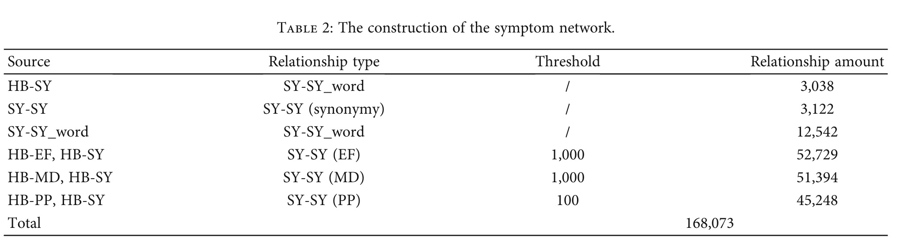

# TCMPR: TCM Prescription Recommendation Based on Subnetwork Term Mapping and Deep Learning

# 基于子网络术语映射和深度学习的中医处方推荐

## 数据集

不公开

- Clinical Case Dataset ：包括病例的标题、作者、医生姓名、患者阐述之后的情况、**临床诊断**、**治疗信息**。
  
  从临床诊断和治疗信息中获得：症状集合、治疗方法、中西医诊断、主诉、证型、处方名、中药集合

  - 训练模型所用数据集形式

    症状集合：处方（药方集合）

    对数据进行了处理：手工标准化、过滤数据以去除长尾分布、

- HSKG的构建（herbsymptom-related knowledge graph）

    实体和关系类别如表所示：

    

## TCMPR整个处理流程

1. 通过**元路径方法**和**HSKG**知识图谱来构建symptom network

    symptom network中仅有两种类型的实体：症状 和 症状词；并有5种类型的关系；具体如表所示：

    

    这个关系类型为什么有这么多种？

    在symptom network中有relationship是**通过间接联系**得到的，而这间接联系就有EF, MD, PP等几种，症状-症状在元路径的两端

2. symptom network的嵌入。包括**症状**，**症状词**。

    嵌入方法有多种：DeepWalk [22], node2vec [23], LINE [24], TransE [25], and One-Hot [26]

3. 利用基于子网络映射的术语表示（SSTM）从symptom network的子网络中抽取相应的症状和症状词

    见整体框架图B部分的SSTM部分

    最后是更具出现频率来筛选的

4. 症状和症状词特征向量的融合
   
5. 利用融合之后的向量来进行处方预测

