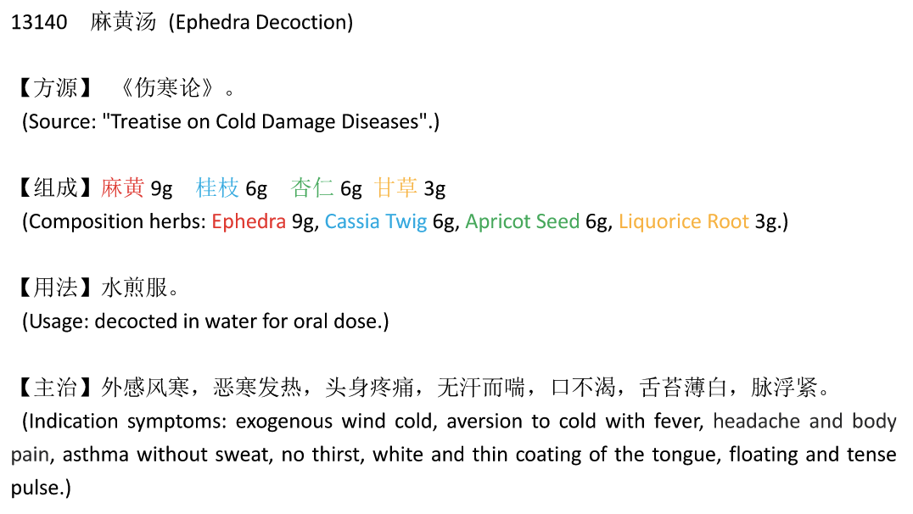
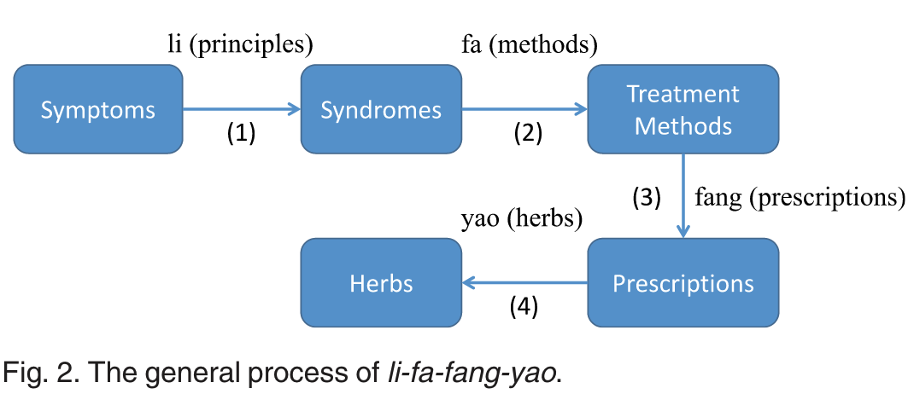

# A Topic Modeling Approach for Traditional Chinese Medicine Prescriptions 一种面向中药方剂的主题建模方法

## 摘要

1. 很少有研究使用中医理论来生成处方
2. 提出了一个主题模型 并 结合领域知识

## Introduction

- 一个中医药方的例子。标有红色、蓝色、绿色和橙色的药物分别是君药、臣药、佐药和使药。它们在处方中起着不同的作用。

图中的名方“麻黄汤”为例

麻黄(标红色)为君药，用于发汗，治疗主症恶寒发热、气喘无汗。

桂枝(标有蓝色)是臣药，有助于麻黄发汗，并治疗次要症状头痛和身体疼痛。

杏仁(标有绿色)是佐药，帮助麻黄治疗哮喘。

甘草(标记为橙色)是使药，使其他三种药物更好的相互作用。

处方中有 **4个中药和7个症**

- 理法方药的一般过程。

    

## 贡献

1. 提出一个主题模型基于中医理论来生成处方

2. 最早研究处方生成问题之一 并 最早基于知识

3. 提出了一个标准数据集

## 数据

每种症状都有一个证候类别，每种草药都有功效描述文本。

在所有98334个处方中，33765个在两个过滤器中同时具有症状和草药。

390症状 和 811草药 出现在33765张处方中。

在33765张处方中进行的实验

## PTM模型

**理法方药**

中医通常首先综合疾病表现(症状) symptoms 

-> 确定患者的证候 syndrome 

-> 特定的治疗方法 treatment methods(**一般一个治疗方法对应一个证型**) 

-> 根据 治疗方法 开出 处方 

-> 每种治疗方法都是通过一些药物来实现的(例如，上述两种治疗方法主要是通过麻黄来实现的)，并且每种药物都具有君-臣-佐-使的作用。

一个 对应一个证型 。

然后，根据 治疗方法 开出 处方 。

每种治疗方法都是通过一些药物来实现的，并且每种药物都具有君-臣-佐-使的作用(例如，麻黄是君药)

处理方式：

    P为处方集合，p为每个处方

    每个p中：

        有中药集合Nhp：hpn为处方p中的第n个中药
        
        症状集合Nsp：spm为处方p中的第m个症状

        Zpn为hpn潜在的治疗方法

        Z'pm为spm潜在的证型

        Xpn为hpn潜在的君臣佐使角色（但是标有君臣佐使角色的数据集很少）

k 属于1...K, k 为症状-治法

