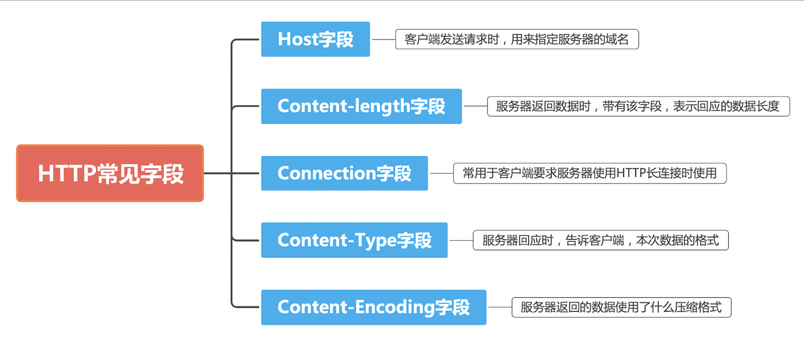

1. 从输入 URL 到页面展示到底发生了什么？

    用户：

    1. 用户**输入网址url**

    客户端：

    浏览器：

    2. 浏览器进程**检查url，组装协议，构成完整的url（**包括协议名称（http/https）、用户名（可省略）、密码（可省略）、web服务器域名、端口号（可省略）、文件的路径名）
    3. 浏览器进程**解析url**
    4. 根据http协议**生成http请求消息**（对什么url的路径（CGI程序或者指定路径文件） + 进行怎样的操作（常用方法：get、post、put等方法））
        请求消息格式：**请求行+消息体**（1 条请求消息中只能写 1 个 URI。如果需要获取多个文件，必须 对每个文件单独发送 1 条请求。）

        

    5. **根据域名查询ip地址和端口号**。浏览器进程**调用Socket库**（属于操作系统程序但是由应用程序调用并与操作系统的协议栈建立连接，相当于桥梁）中的**域名解析程序向DNS服务器**（有一个对照表）**查询域名**（域名是有层次结构的，查询时会根据层级结构来到指定的DNS服务器，由上层到下层，但有时也会用到缓存服务器就近获取ip地址）**对应的ip地址和端口号**（Socket 库是用于调用网络功能的程序组件集合。）

        
    
    协议栈和网卡（**网络控制软件(协议栈)和网络硬件(网卡)**）：

    

    （**IP中还包括ICMP 协议和 ARP 协议**。ICMP 用于告知**网络包传送过程中产生的错误以及各种控制消息**，**ARP**用于根据IP地址查询相应的以太网**MAC地址**。）

    6. **委托协议栈**发送消息（按照指定的顺序来调 用 Socket 库中的程序组件。）（协议栈:操作系统内部的**网络控制软件**，也叫“协议驱动”“TCP/IP 驱动”等。）

        **TCP:**

        1. 应用程序通过Socket库***创建套接字**（通信控制信息）：套接字中**描述符**是用来识别不同的套接字的，应用程序是通过“描述符”这一类似号码牌的东西来识别套接字的。

        

        

        2. 通过套接字**连接**（Socket 库中的名为 connect 的程序组件）：需要指定描述符、 服务器 IP 地址和端口号（描述符:应用程序用来识别套接字的机制IP 地址和端口号:客户端和服务器之间用来识别对方套接字的机制）

        connect(< 描述符 >, < 服务器 IP 地址和端口号 >, ...)传递给协议 栈中的 TCP 模块

        连接操作的第一步是在 TCP 模块处创建表示连接控制信息的头部。经过**三次握手**。

        SYN = 1

        3. 数据**收发**

        MTU:一个网络包的最大长度，以太网中一般为 1500 字节。

        MSS:除去头部之后，一个网络包所能容纳的 TCP 数据的最大 长度。

        

        对较大的数据进行拆分是对http请求消息进行拆分

        4. **断开并删除**套接字

        FIN = 1 

        

        **IP:**

        IP 模块负责添加如下**两个头部**。

        (1) MAC 头部:**以太网用的头部，包含 MAC 地址**
        
        (2) IP 头部:**IP 用的头部，包含 IP 地址**

        **通过 ARP 查询目标路由器的 MAC 地址（48bit）(广播)**

        IP 模块会通过 ICMP 消息将错误告知发送方(图 2.1)。 ICMP 规定了各种类型的消息

    7. **网卡驱动**、**网卡****

    网卡的 ROM 中保存着全世界**唯一**的 MAC 地址，这是在生产网 卡时写入的。

    开头加上**报头**和**起始帧分界符**，在末尾加上用于检测错误的**帧校验序列**

    

    8. 双绞线
    9.  集线器

    10. 交换机

    交换机端口的 MAC 模块不具有 MAC 地址。有一张MAC地址表来进行转发。

    11. 互联网接入路由器

    路由器的各个端口都具有 MAC 地址和 IP 地址。

    互联网接入路由器输出到互联网的包带有 PPPoE头部和PPP头部

    12. ADSL Modem

    12、13之间时电信号
    
    13. DSLAM（局端多路Modem）
    14. BAS（宽带接入服务器）

    BAS将ATM信元还原成网络包，根据接收方IP 地址进行转发

    15. 隧道

    BAS转发的包被加上L2TP头部并通过隧道

    16. 隧道专用路由器
    17. 互联网运营商
    18. 防火墙
    19. 缓存服务器
    20. 网卡
    21. 网卡驱动
    22. 协议栈
    23. web服务器
    24. 原路返回浏览器接收响应消息并显示内容

    判断响应消息中的数据属于哪种类型。Content-Type 头部字段的值来进行判断

    HTML 文档通过标签表示文档的布局和字体等样式信息，浏览器需 要解释这些标签的含义，按照指定的样式显示文档的内容。

2. [面试官，不要再问我三次握手和四次挥手](https://yuanrengu.com/2020/77eef79f.html)

**面试时越简单的问题，一般就是隐藏着比较大的坑，一般都是需要将问题扩展的**

进行三次握手的主要作用就是为了确认**双方的接收能力和发送能力**是否正常

   1. 三次握手
   
   1.1 为什么需要三次握手，两次不行吗？

   1.2 什么是**半连接队列**？（还有全连接队列）

   1.3 ISN(Initial Sequence Number)是固定的吗？

   1.4 三次握手过程中可以携带数据吗？

   1.5 SYN攻击是什么？

   1.6 第三次握手失败怎么办？

   2. 四次挥手

   2.1 挥手为什么需要四次？

   2.2 2MSL等待状态

   2.3 四次挥手释放连接时，等待2MSL的意义?

   2.4 为什么TIME_WAIT状态需要经过2MSL才能返回到CLOSE状态？

   2.5 TIME-WAIT状态过多怎么办

3. [今天的每日一题是：TCP与UDP的概念，特点，区别和对应的使用场景？](https://juejin.cn/post/7136762246180536351)

4. HTTP常见的状态码和常见的字段？期待大家的答案，大家也可以用思维导图的形式回答

5. HTTP有哪些请求以及GET和POST请求的区别？

   1. 作用不同
   GET用于从服务端获取资源
   POST一般用来向服务器端提交数据
   2. 参数传递方式不同
   GET请求的参数一般写在URL中，且只接受ASCII字符
   POST请求参数一般放在请求体中，对于数据类型也没有限制
   3. 安全性不同
   因为参数传递方式的不同，所以两者安全性不同，GET请求的参数直接暴露在URL中，所以更不安全，不能用来传递敏感信息。
   4. 参数长度限制不同
   GET传送的数据量较小，不能大于2KB。
   POST传送的数据量较大，一般被默认为不受限制。
   HTTP 协议没有 Body 和 URL 的长度限制，对 URL 限制的大多是浏览器和服务器的原因。
   5. 编码方式不同
   GET 请求只能进行 URL 编码（application/x-www-form-urlencoded）
   POST 支持多种编码方式（application/x-www-form-urlencoded 或 multipart/form-data。为二进制数据使用多种编码。）
   6. 缓存机制不同
   GET 请求会被浏览器主动cache，而 POST 不会，除非手动设置。
   GET 请求参数会被完整保留在浏览器历史记录里，而 POST 中的参数不会被保留。
   GET 产生的 URL 地址可以被 保存为书签，而 POST 不可以。
   GET 在浏览器回退时是无害的，而 POST 会再次提交请求。
   7. 时间消耗不同
   GET 产生一个 TCP 数据包；
   POST 产生两个 TCP 数据包。
   对于 GET 方式的请求，浏览器会把 header 和 data 一并发送出去，服务器响应 200（返回数据）；而对于 POST，浏览器先发送 Header，服务器响应 100 continue，浏览器再发送 data，服务器响应 200 ok（返回数据）
   8. 幂等
   意思是多次执行相同的操作，结果都是「相同」的。
   GET 方法就是安全且幂等的，因为它是「只读」操作，无论操作多少次，服务器上的数据都是安全的，且每次的结果都是相同的。
   POST 因为是「新增或提交数据」的操作，会修改服务器上的资源，所以是不安全的，且多次提交数据就会创建多个资源，所以不是幂等的。

   

6. 什么是强缓存和协商缓存

7. HTTP1.0和HTTP1.1的区别？HTTP2.0于http1.1的区别？

HTTP1.0和HTTP1.1的区别？

长连接

HTTP1.1支持长连接，每一个TCP连接上可以传送多个HTTP请求和响应，默认开启Connection:Keep-Alive，而HTTP1.O默认为短连接，每次请求都需要建立一个TCP连接。

缓存

HTTP1.0主要使用If-Modified-Since,Expires来做为缓存判断的标准，HTTP1.1则引入了更多的缓存控制策略例如Entity tag， If-None-Match等更多可供选择的缓存头来控制缓存策略。

管道化

基于HTTP1.1的长连接，使得请求管线化成为可能。管线化使得请求能够“并行”传输，但是响应必须按照请求发出的顺序依次返回，性能在一定程度上得到了改善

增加Host字段

使得一个服务器能够用来创建多个 Web 站点。

状态码

新增了24个错误状态响应码

带宽优化

HTTP1.0中，存在一些浪费带宽的现象，例如客户端只是需要某个对象的一部分，而服务器却将整个对象送过来了，并且不支持断点续传功能，HTTP1.1则在请求头引入了range头域，它允许只请求资源的某个部分，即返回码是206（Partial Content）

------

HTTP1.1和HTTP2.0的区别？

二进制分帧：在应用层（HTTP/2.0）和传输层（TCP or UDP）之间增加一个二进制分帧层，从而突破 HTTP1.1 的性能限制，改进传输性能，实现低延迟和高吞吐量。

多路复用（MultiPlexing），允许同时通过单一的 HTTP/2 连接发起多重的请求-响应消息，这个强大的功能则是基于“二进制分帧”的特性。

首部压缩，HTTP1.1 不支持 header 数据的压缩，HTTP/2.0 使用 HPACK 算法对 header 的数据进行压缩，这样数据体积小了，在网络上传输就会更快。高效的压缩算法可以很大的压缩 header ，减少发送包的数量从而降低延迟。

服务端推送（server push），在 HTTP/2 中，服务器可以对客户端的一个请求发送多个响应，即服务器可以额外的向客户端推送资源，而无需客户端明确的请求。

1. HTTPS的工作原理？(https是怎么建立连接的），HTTPS与HTTP的区别

HTTP 与 HTTPS 的区别

HTTP 是明文传输，HTTPS 通过 SSL\TLS 进行了加密

HTTP 的端口号是 80，HTTPS 是 443

HTTPS 需要到 CA 申请证书

HTTP 的连接简单，是无状态的；HTTPS 协议是由 SSL+HTTP 协议构建的可进行加密传输、身份认证的网络协议，比 HTTP 协议安全。

9. DNS是什么，及其查询过程

计算机网络：自顶向下给出的概念是DNS 是：一个由分层的 DNS 服务器实现的分布式数据库

一个使得主机能够查询分布式数据库的应用层协议，作用是将主机名转换成ip地址。

浏览器访问了某个域名，首先会查找浏览器缓存、本地 hosts 文件、DNS 缓存，没有找到的话再去请求本地 DNS 服务器，由它负责完成域名的解析

本地 DNS 会依次请求根域名服务器拿到对应的顶级域名服务器的地址，然后请求顶级域名服务器，拿到权威域名服务器的地址，之后权威域名服务器会返回最终的 IP 给本地 DNS 服务器，由它再返给浏览器。

10. http多个tcp连接怎么实现的，TCP 的 Keepalive 和 HTTP 的Keep-Alive 是一个东西吗？

（一）http多个tcp连接怎么实现的

http多个tcp连接是靠某些服务器对 Connection: keep-alive 的 Header 进行了支持。简而言之，完成这个 HTTP 请求之后，不要断开 HTTP 请求使用的TCP 连接。这样的好处是连接可以被重新使用，之后发送 HTTP 请求的时候不需要重新建立 TCP 连接，以及如果维持连接，那么 SSL 的开销也可以避免。

（二）TCP 的 Keepalive 和 HTTP的 Keep-Alive 是一个东西吗?

HTTP 的 Keep-Alive，是由应用层（用户态）实现的，称为 HTTP 长连接；

TCP 的 Keepalive，是由 TCP 层（内核态）  实现的，称为 TCP 保活机制；

（1）每次请求都要经历这样的过程：建立 TCP -> 请求资源 -> 响应资源 -> 释放连接，这就是HTTP短连接，但是这样每次建立连接都只能请求一次资源，所以HTTP 的 Keep-Alive实现了使用同一个 TCP 连接来发送和接收多个 HTTP 请求/应答，避免了连接建立和释放的开销，就就是 HTTP 长连接。

（2）TCP 的 Keepalive 这东西其实就是 TCP 的保活机制，通俗地说，就是TCP有一个定时任务做倒计时，超时后会触发任务，内容是发送一个探测报文给对端，用来判断对端是否存活。

详细的可以看文章介绍：[傻傻分不清的TCP keepalive和HTTP keepalive](https://juejin.cn/post/7021170300809117709?searchId=202308022059030BA8E906EC0374D3AAA3)

TCP的KEEP_ALIVE默认关闭 需要打开 so_keepalive 有效才行，而http1.1的keep-alive一般都会在http报文首部显示表述，用以底层tcp的复用，这样做到目的是可以减少服务端TIME_ WAIT 状态的无效等待，降低fd开销

11. TCP连接如何确保可靠性

    TCP连接确保可靠性的手段：
    1. **分块**：TCP 会将要传输的数据流分为多个块(chunk)，然后向每个 chunk 中添加 TCP 标头，这样就形成了一个 TCP 段也就是报文段。
    2. **序列号**
    TCP给每个数据包指定序列号，接收方根据序列号对数据包进行排序，且去掉重复序列号的数据进行去重。
    3. **“校验和”**是保存在 TCP 首部中的一个数据，TCP 的发送端和接收端会采用相同的算法，根据发送的数据计算出一个 16 位的校验和，并且校验和会连同数据一起发送给接收端。接收端在得到数据之后，**会根据接收的数据生成一个新的校验和，然后用新的校验和与传递过来的校验和做对比**，如果校验和相同，那么说明数据在传递过程中没有发生任何改变，是一个有效的数据，反之则为无效数据，舍弃即可。
    4. **确认应答**
    TCP 通过肯定的确认应答(ACK) 来实现可靠的数据传输，当主机 A将数据发出之后会等待主机 B 的响应。如果有确认应答(ACK)，说明数据已经成功到达对端。反之，则数据很可能会丢失。
    5. **超时重传**
    在发送数据报文时，设定一个定时器，每间隔一段时间，没有收到对方的ACK确认应答报文，就会重发该报文。
    6. **流量控制**
    TCP 通过使用一个接收窗口的变量来提供流量控制。接受窗口会给发送方一个指示到底还有多少可用的缓存空间。发送端会根据接收端的实际接受能力来控制发送的数据量。
    7. **拥塞控制**
    根据所感知到的网络的拥塞程度来限制发出报文段的速率，如果 TCP 发送方感知到没有什么拥塞，则 TCP 发送方会增加发送速率；如果发送方感知沿着路径有阻塞，那么发送方就会降低发送速率。

12. 既然提到了拥塞控制，那你能说说说拥塞控制是怎么实现的嘛

    拥塞控制算法主要有四种：慢启动，拥塞避免，快速重传，快速恢复。

    1. 慢启动
    在连接刚开始时，发送方会逐渐增加发送窗口大小，从而以指数增长的速度增加发送的数据量。
    2. 拥塞避免
    一旦慢启动阶段过去，发送方进入拥塞避免阶段。在这个阶段，发送方逐渐增加发送窗口的大小，但增加速率较慢，避免过快增加导致网络拥塞。
    3. 超时重传
    如果发送方在超时时间内未收到确认，它会认为数据包丢失，并重传这些数据包。这是拥塞控制的最后手段，用于检测和处理网络中的丢包或拥塞情况。当网络出现拥塞，也就是会发生数据包重传
    4. 快速重传（Fast Retransmit）和快速恢复（Fast Recovery）：当发送方发送的数据包丢失或网络出现拥塞时，接收方会发送重复确认（duplicate ACK）通知发送方有数据包丢失。当发送方收到一定数量的重复确认时，它会立即重传丢失的数据包，而不是等待超时。这样可以减少网络的拥塞程度。
    5. 拥塞窗口调整：发送方根据网络的拥塞程度动态调整发送窗口的大小，通过监测网络延迟和丢包情况来确定合适的发送速率，以避免网络拥塞。
    
13. 进程和线程的区别

进程是系统进行资源分配和调度的基本单位。

线程（thread）是操作系统能够进行运算调度的最小单位，线程是进程的子任务，是进程内的执行单元。

一个进程至少有一个线程，一个进程可以运行多个线程，这些线程共享同一块内存。

资源开销：

进程：由于每个进程都有独立的内存空间，创建和销毁进程的开销较大。进程间切换需要保存和恢复整个进程的状态，因此上下文切换的开销较高。

线程：线程共享相同的内存空间，创建和销毁线程的开销较小。线程间切换只需要保存和恢复少量的线程上下文，因此上下文切换的开销较小。

通信与同步：

进程：由于进程间相互隔离，进程之间的通信需要使用一些特殊机制，如**管道、消息队列、共享内存**等。

线程：由于线程共享相同的内存空间，它们之间可以直接访问共享数据，线程间通信更加方便。

安全性：

进程：由于进程间相互隔离，一个进程的崩溃不会直接影响其他进程的稳定性。

线程：由于线程共享相同的内存空间，一个线程的错误可能会影响整个进程的稳定性。

14. 进程调度算法你了解多少？

    进程调度算法是操作系统中用来管理和调度进程（也称为任务或作业）执行的方法。这些算法决定了在多任务环境下，如何为各个进程分配CPU时间，以实现公平性、高吞吐量、低延迟等不同的调度目标。

    1. 先来先服务调度算法
    按照进程到达的先后顺序进行调度，即最早到达的进程先执行，直到完成或阻塞。
    2. 最短作业优先调度算法
    优先选择运行时间最短的进程来运行
    3. 高响应比优先调度算法
    综合考虑等待时间和服务时间的比率，选择具有最高响应比的进程来执行
    4. 时间片轮转调度算法
    将CPU时间划分为时间片（时间量），每个进程在一个时间片内运行，然后切换到下一个进程。
    5. 最高优先级调度算法
    为每个进程分配一个优先级，优先级较高的进程先执行。这可能导致低优先级进程长时间等待，可能引发饥饿问题。
    6. 多级反馈队列调度算法
    将进程划分为多个队列，每个队列具有不同的优先级，进程在队列之间移动。具有更高优先级的队列的进程会更早执行，而长时间等待的进程会被提升到更高优先级队列。
    7. 最短剩余时间优先：每次选择剩余执行时间最短的进程来执行。
    8. 最大吞吐量调度：旨在最大化单位时间内完成的进程数量

15. [进程间有哪些通信方式？](https://www.xiaolincoding.com/os/4_process/process_commu.html#%E7%AE%A1%E9%81%93)

    1. 管道（Pipe）：
    管道是一种半双工的通信方式，用于在父子进程或者同一用户下的两个进程之间进行通信。可以分为匿名管道和命名管道（FIFO）。匿名管道主要用于具有亲缘关系的进程，而命名管道可以用于不同用户之间的进程通信。
    2. 消息队列（Message Queue）：
    异步通信，消息队列是一种消息传递机制，允许进程通过在消息队列中发送和接收消息来进行通信。
    3. 信号量（Semaphore）：
    信号量用于控制多个进程对共享资源的访问。通过信号量可以实现进程的**同步和互斥，避免竞态条件**。
    4. 共享内存（Shared Memory）：
    共享内存允许多个进程在它们之间共享同一块物理内存区域，从而实现高效的数据交换。
    5. 套接字（Socket）：
    套接字是一种用于网络通信的IPC方式，可以用于在不同计算机上的进程之间进行通信。它不仅可以用于同一主机上的进程通信，还可以用于跨网络的进程通信。

16. 什么是死锁？如何避免死锁？

死锁是指两个或多个进程在争夺系统资源时，由于互相等待对方释放资源而无法继续执行的状态。

死锁只有同时满足以下四个条件才会发生：

互斥条件：一个进程占用了某个资源时，其他进程无法同时占用该资源。

持有并等待条件：一个进程可以在等待其他资源的同时持有一些资源。

不可剥夺条件：资源不能被强制性地从一个进程中剥夺，只能由持有者自愿释放。

环路等待条件：多个进程之间形成一个循环等待资源的链，每个进程都在等待下一个进程所占有的资源。

只需要破坏上面一个条件就可以避免死锁，最常见的并且可行的就是使用资源有序分配法（让所有进程按照相同的顺序请求资源），来破坏环路等待条件。

17. 什么是虚拟内存？[为什么需要虚拟内存？](https://www.xiaolincoding.com/os/3_memory/vmem.html#%E8%99%9A%E6%8B%9F%E5%86%85%E5%AD%98)

什么是虚拟内存？

虚拟内存是一块被计算机作为额外内存的硬盘空间和内存空间。（内存中，通过建立硬盘空间的分页映射来管理维护这些硬盘空间，需要建立分页表）

18. 什么是内存分段和分页？它们的作用是什么？

内存分段是将一个程序的内存空间分为不同的逻辑段（segments），每个段代表程序的一个功能模块或数据类型，如代码段、数据段、堆栈段等。每个段都有其自己的大小和权限。

分页是把整个虚拟和物理内存空间切成一段段固定尺寸的大小。这样一个连续并且尺寸固定的内存空间，我们叫页（Page）

作用：

逻辑隔离： 内存分段和分页都实现了程序的逻辑隔离，使不同的功能模块或数据类型能够被单独管理和保护，提高了程序的可靠性和安全性。

内存保护： 通过将不同的段或页面设置为只读、可读写、不可执行等权限，操作系统可以确保程序不会越界访问或修改其他段的内容，从而提高了系统的稳定性。

虚拟内存： 分段和分页都有助于实现虚拟内存的概念，允许应用程序认为它们在使用的是一个比实际物理内存更大的内存空间。

内存共享： 通过分页，操作系统可以实现内存页面的共享，从而节省内存空间，多个进程可以共享相同的代码或数据页面。

内存管理： 分页更加灵活，允许操作系统将不同进程的页面分散存放在物理内存中，从而提高内存利用率。分段则更适用于管理不同的逻辑模块。

19. 解释一下用户态和内核态？

用户态（User Mode）和内核态（Kernel Mode）是操作系统中两种不同的执行模式，用于控制进程或程序对计算机硬件资源的访问权限和操作范围。这两种模式的区别在于进程在不同模式下可以执行的指令和访问的资源不同。

用户态（User Mode）：

处于用户态的 CPU 只能受限的访问内存，并且不允许访问外围设备，用户态下的 CPU 不允许独占，也就是说 CPU 能够被其他程序获取。

内核态（Kernel Mode）：

处于内核态的 CPU 可以访问任意的数据，包括外围设备，比如网卡、硬盘等，处于内核态的 CPU 可以从一个程序切换到另外一个程序，并且占用 CPU 不会发生抢占情况，一般处于特权级 0 的状态我们称之为内核态。

20. 解释一下页面置换算法，例如LRU（最近最少使用）、FIFO（先进先出）等

页面置换算法 

常见页面置换算法有最佳置换算法（OPT）、先进先出（FIFO）、最近最久未使用算法（LRU）、时钟算法（Clock）

最佳置换算法: 该算法根据未来的页面访问情况，选择最长时间内不会被访问到的页面进行置换。那么就有一个问题了，未来要访问什么页面，操作系统怎么知道的呢?操作系统当然不会知道，所以这种算法只是一种理想情况下的置换算法，通常是无法实现的。

先进先出算法：也就是最先进入内存的页面最先被置换出去。这个算法比较简单明了，就不过多解释了。但是先进先出算法会存在一个问题，就是Belady问题，即随着分配给进程的空闲页面数增加，缺页的情次反而也会增加。
这和我们常识是相悖的，因为我们通常认为如果一个进程经常发生缺页，那么就应该应该为他多分配一点内存。然而使用FIFO算法时，反而可能导致更多缺页情况出现。这就是Belady问题，Belady问题只会在使用FIFO算法时出现。

最近最久未使用算法：LRU算法基于页面的使用历史，通过选择最长时间未被使用的页面进行置换。LRU算法的核心思想是，最近被访问的页面可能在未来被再次访问，而最长时间未被访问的页面可能是最不常用的，因此将其置换出去可以腾出空间给新的页面
LRU算法通常是使用一个数据结构去维护页面的使用历史，维护使用历史就是通过访问字段实现的。访问字段的位数和操作系统分配给该进程的页面数有关，比如分配4个页面，访问字段就是2位，16个页面，访问字段就是4位，依次类推。如此，每一个页面的访问字段都可以不同，通过访问字段的不同，我们就可以判断页面的使用历史。

时钟算法：Clock算法基于一个环形链表或者循环队列数据结构来管理页面的访问情况，用于选择被置换的页面。Clock算法的核心思想是通过使用一个指针(称为时钟指针)在环形链表上遍历，检查页面是否被访问过。这个访问过同样需要我们上面说到的访问字段来表示，此时访问字段只有一位。每个页面都与一个访问位相关联，标记该页面是否被访问过。

当需要进行页面置换时，Clock算法从时钟指针的位置开始遍历环形链表。
如果当前页面的访问位为0，表示该页面最久未被访问，可以选择进行置换。将访问位设置为1，继续遍历下一个页面。
如果当前页面的访问位为1，表示该页面最近被访问过，它仍然处于活跃状态。将访问位设置为0，并继续遍历下一个页面如果遍历过程中找到一个访问位为0的页面，那么选择该页面进行置换。

21. 解释一下进程同步和互斥，以及解决这些问题的方法。

进程同步是指在多个并发执行的进程之间协调和管理它们的执行顺序，以确保它们按照一定的顺序或时间间隔执行。

互斥指的是在某一时刻只允许一个进程访问某个共享资源。当一个进程正在使用共享资源时，其他进程不能同时访问该资源。

解决进程同步和互斥问题的方法包括：

1. 临界区（Critical Section）： 将可能引发互斥问题的代码段称为临界区。为了实现互斥，每个进程在进入临界区前必须获取一个锁，退出临界区后释放该锁。这确保同一时间只有一个进程可以进入临界区。
2. 互斥锁（Mutex）： 互斥锁是一种同步机制，用于实现互斥。每个共享资源都关联一个互斥锁，进程在访问该资源前需要先获取互斥锁，使用完后释放锁。只有获得锁的进程才能访问共享资源。
3. 信号量：信号量包括一个计数器和一组等待队列。进程可以尝试获取信号量，如果计数器大于零，则减少计数器并继续执行。否则，进程将进入等待队列，直到其他进程释放信号量。
4. 条件变量（Condition Variable）： 条件变量用于在进程之间传递信息，以便它们在特定条件下等待或唤醒。通常与互斥锁一起使用，以确保等待和唤醒的操作在正确的时机执行。

22. 什么是中断和异常？它们有什么区别？

中断是指计算机处理器在执行程序过程中，由硬件或外部设备发出的信号，用于暂停当前程序的执行，以处理紧急事件或来自外部设备的请求。中断可以分为外部中断和内部中断。

外部中断： 由外部设备引发，如键盘输入、鼠标事件、硬件故障等。外部中断会导致处理器从当前任务中切换到中断处理程序，然后再回到原来的任务。

内部中断（时钟中断）： 是由计算机内部的定时器或时钟引发的。它定期发生，用于确保操作系统的正常运行，例如进行时间片轮转调度。

而异常指在程序执行过程中发生的非预期事件或错误条件，如非法操作码、地址越界、算术溢出等。

区别：

触发原因：

中断是由硬件或外部设备引发的，用于处理外部事件或请求。

异常是由程序内部的错误或非预期事件引发的，如非法指令、除以零等。

处理方式：

中断会暂停当前程序的执行，切换到中断处理程序，处理完成后再返回到原来的任务。
异常会引发特定的异常处理机制，通常涉及中断当前指令的执行，跳转到异常处理程序，然后恢复执行。

频率：
中断的发生频率取决于外部事件或设备的活动，可能不是定期发生的。
异常通常是在程序执行过程中出现错误时触发的，发生频率相对不那么高。

23. 介绍一下几种典型的锁

互斥锁：

互斥锁是一种最常见的锁类型，用于实现互斥访问共享资源。在任何时刻，只有一个线程可以持有互斥锁，其他线程必须等待直到锁被释放。这确保了同一时间只有一个线程能够访问被保护的资源。

读写锁：

读写锁允许多个线程同时“读取”共享资源，但在写入资源时需要独占访问，一旦有写者，则后续读者必须等待，唤醒时优先考虑写者，这对于读取频繁、写入较少的场景可以提高并发性能。

自旋锁：

自旋锁是一种基于忙等待的锁，即线程在尝试获取锁时会不断轮询，直到锁被释放。

条件变量：

条件变量是用于线程之间通信的一种同步机制，它与锁一起使用，用于等待某个条件满足。一个线程可以等待条件变量，并在满足条件时被唤醒。常用于生产者-消费者模型等场景。

24. 你知道的线程的同步方式有哪些？

线程同步机制是指在多线程编程中，为了保证线程之间的互不干扰，而采用的一种机制。常见的线程同步机制有以下几种：

互斥锁：互斥锁是最常见的线程同步机制。它允许只有一个线程同时访问被保护的临界区（共享资源）

条件变量：条件变量用于线程间通信，允许一个线程等待某个条件满足，而其他线程可以发出信号通知等待线程。通常与互斥锁一起使用。

读写锁：读写锁允许多个线程同时读取共享资源，但只允许一个线程写入资源。

信号量：用于控制多个线程对共享资源进行访问的工具。

25. 一条SQL查询语句是如何执行的？

大体来说，MySQL 可以分为Server层和存储引擎层两部分。

1连接器:连接器负责跟客户端建立连接、获取权限、维持和管理连接。

2查询缓存:MySQL拿到一个查询请求后，会先到查询缓存看看，之前是不是执行过这条语句。之前执行过的语句及其结果可能会以key-value对的形式，被直接缓存在内存中。

3分析器:你输入的是由多个字符串和空格组成的一条SQL语句，MySQL需要识别出里面的字符串分别是什么，代表什么。

4优化器:优化器是在表里面有多个索引的时候，决定使用哪个索引;或者在一个语句有多表关联(join)的时候，决定各个表的连接顺序。

5执行器:MySQL通过分析器知道了你要做什么，通过优化器知道了该怎么做，于是就进入了执行器阶段，开始执行语句。

26. 说一说事务隔离级别

当数据库上有多个事务同时执行的时候，就可能出现脏读（dirty read）、不可重复读（non-repeatable read）、幻读（phantom read）的问题，为了解决这些问题，就有了“隔离级别”的概念。

SQL标准的事务隔离级别包括：读未提交（read uncommitted）、读提交（read committed）、可重复读（repeatable read）和串行化（serializable ）

读未提交是指，一个事务还没提交时，它做的变更就能被别的事务看到。

读提交是指，一个事务提交之后，它做的变更才会被其他事务看到。

可重复读是指，一个事务执行过程中看到的数据，总是跟这个事务在启动时看到的数据是一致的。当然在可重复读隔离级别下，未提交变更对其他事务也是不可见的。

串行化，顾名思义是对于同一行记录，“写”会加“写锁”，“读”会加“读锁”。当出现读写锁冲突的时候，后访问的事务必须等前一个事务执行完成，才能继续执行。

27. 事务的四大特性有哪些

事务事务（Transaction）是一组数据库操作的逻辑单元，被视为一个独立的工作单元：

    事务通常遵循ACID属性
    
    原子性（Atomicity）： 事务中的所有操作要么都成功执行，要么都不执行

    一致性（Consistency）： 事务使数据库从一个一致的状态转变到另一个一致的状态。

    隔离性（Isolation）： 并发执行的多个事务之间应该相互隔离，即每个事务都不应该对其他事务的中间状态产生影响。

    持久性（Durability）： 一旦事务成功提交，其对数据库的修改应该永久保存，即使在系统崩溃后也应该保留。

28. 索引有哪些种类？

一、从数据结构维度进行分类:

①B+树索引:所有数据存储在叶子节点，复杂度为O(logn)，适合范围查询。

②哈希索引:适合等值查询，检索效率高，一次到位。

③全文索引:MyISAM和InnoDB中都支持使用全文索引，一般在文本类型char，text，varchar类型上创建。

④R-Tree索引:用来对GIS数据类型创建SPATIAL索引

二、从物理存储维度进行分类:

①聚集索引:数据存储与索引一起存放，叶子节点会存储一整行记录，找到索引也就找到了数据。

②非聚集索引:数据存储与索引分开存放，叶子节点不存储数据，存储的是数据行地址。

三、从逻辑维度进行分类:

①主键索引:一种特殊的唯一索引，不允许有空值。

②普通索引:MySQL中基本索引类型，允许空值和重复值

③联合索引:多个字段创建的索引，使用时遵循最左前缀原则

④唯一索引:索引列中的值必须是唯一的，但是允许为空值

⑤空间索引:MySQL5.7之后支持空间索引，在空间索引这方面遵循OpenGIS几何数据模型规则。

29. MySQL什么使用B+树来作索引，它的优势什么？

    1. 单点查询：B 树进行单个索引查询时，最快可以在 O(1) 的时间代价内就查到。从平均时间代价来看，会比 B+ 树稍快一些。但是 B 树的查询波动会比较大，因为每个节点即存索引又存记录，所以有时候访问到了非叶子节点就可以找到索引，而有时需要访问到叶子节点才能找到索引。B+ 树的非叶子节点不存放实际的记录数据，仅存放索引，数据量相同的情况下，B+树的非叶子节点可以存放更多的索引，查询底层节点的磁盘 I/O次数会更少。
    2. 插入和删除效率：B+ 树有大量的冗余节点，删除一个节点的时候，可以直接从叶子节点中删除，甚至可以不动非叶子节点，删除非常快。B+ 树的插入也是一样，有冗余节点，插入可能存在节点的分裂（如果节点饱和），但是最多只涉及树的一条路径。B 树没有冗余节点，删除节点的时候非常复杂，可能涉及复杂的树的变形。
    3. 范围查询：B+ 树所有叶子节点间有一个链表进行连接，而 B 树没有将所有叶子节点用链表串联起来的结构，因此只能通过树的遍历来完成范围查询，范围查询效率不如 B+ 树。B+ 树的插入和删除效率更高。存在大量范围检索的场景，适合使用 B+树，比如数据库。而对于大量的单个索引查询的场景，可以考虑 B 树，比如nosql的MongoDB。

30. 什么时候需要创建索引，什么时候不需要创建索引？

何时需要创建索引：

表的主关键字：自动建立唯一索引

直接条件查询的字段：经常用于WHERE查询条件的字段，这样能够提高整个表的查询速度

查询中与其它表关联的字段：例如字段建立了外键关系

查询中排序的字段：排序的字段如果通过索引去访问将大大提高排序速度

唯一性约束列： 如果某列具有唯一性约束，那么为了确保数据的唯一性，可以在这些列上创建唯一索引。

大表中的关键列： 在大表中，如果查询的效率变得很低，可以考虑在关键列上创建索引。

何时不需要创建索引：

小表： 对小表创建索引可能会带来额外的开销，因为在小数据集中扫描整个表可能比使用索引更快。

频繁的插入、更新和删除操作： 索引的维护成本会随着数据的插入、更新和删除操作而增加。如果表经常被修改，过多的索引可能会影响性能。

数据重复且分布平均的表字段：假如一个表有10万行记录，性别只有男和女两种值，且每个值的分布概率大约为50%，那么对这种字段建索引一般不会提高数据库的查询速度。

很少被查询的列： 如果某列很少被用于查询条件，那么为它创建索引可能没有明显的性能提升。

查询结果总行数较少的表： 如果查询的结果集总行数很少，使用索引可能不会有太大的性能提升。

31. 说下你了解的MVCC机制？

MVCC（Multi-Version Concurrency Control，多版本并发控制）,用于管理多个事务同时访问和修改数据库的数据，而不会导致数据不一致或冲突。MVCC的核心思想是每个事务在数据库中看到的数据版本是事务开始时的一个快照，而不是实际的最新版本。这使得多个事务可以并发执行，而不会互相干扰。

32. 索引失效的场景有哪些？

OR 条件： 当查询中使用多个 OR 条件时，如果这些条件不涉及同一列，索引可能无法有效使用。数据库可能会选择全表扫描而不是使用多个索引。

对列进行类型转换： 如果在查询中对列进行类型转换，例如将字符列转换为数字或日期，索引可能会失效。

使用通配符前缀搜索： 在使用通配符前缀（如LIKE 'prefix%'）进行搜索时，大多数索引无法使用，因为索引通常是按照列的完整值进行排序的。

不等号条件： 当查询中包含不等号条件（如>,<,>=,<=）时，索引可能会失效。通常情况下，索引只能用于等值比较。

表连接中的列类型不匹配： 如果在连接操作中涉及的两个表的列类型不匹配，索引可能会失效。例如，一个表的列是整数，另一个表的列是字符，连接时可能会导致索引失效。

33. MySQL的执行引擎有哪些？

主要有MyISAM、InnoDB、Memery等引擎：

InnoDB引擎提供了对事务ACID的支持，还提供了行级锁和外键的约束。

MyISAM引擎不支持事务，也不支持行级锁和外键约束。

Memery就是将数据放在内存中，数据处理速度很快，但是安全性不高。

34. MySQL日志文件有哪几种？详细说一说每种日志

    1.错误日志文件
    2.查询日志文件
    3.二进制日志文件
    4.事务日志文件
    5.中继日志文件
    6.慢查询日志文件

35. MySQL 有哪些锁？作用分别是什么？
    1.
    从锁粒度维度
    表锁：锁整个表
    记录锁：锁指定记录
    间隙锁：锁指定范围的间隙，阻塞其他事务的插入操作，防止幻读
    next-lock key：锁指定记录及其上或下间隙

    从阻塞维度
    共享锁：可以被多个读事务共享，阻塞写事务
    排他所：只能由一个事务获取，其他事务要获取，就得阻塞

    2.
    MyISAM 支持表锁，InnoDB 支持表锁和行锁，默认为行锁
    表级锁：开销小，加锁快，不会出现死锁。锁定粒度大，发生锁冲突的概率最高，并发量最低
    行级锁：开销大，加锁慢，会出现死锁。锁力度小，发生锁冲突的概率小，并发度最高

36. Cookie和Session是什么，有什么区别

    Cookie和 Session都用于管理用户的状态和身份, Cookie通过在客户端记录信息确定用户身份，Session通过在服务器端记录信息确定用户身份。
    Cookie
    Cookie 是存储在用户浏览器中的小型文本文件，用于在用户和服务器之间传递数据。通常，服务器会将一个或多个 Cookie 发送到用户浏览器，然后浏览器将这些 Cookie 存储在本地。
    服务器在接收到来自客户端浏览器的请求之后，就能够通过分析存放于请求头的Cookie得到客户端特有的信息，从而动态生成与该客户端相对应的内容。 
    Session
    客户端浏览器访问服务器的时候，服务器把客户端信息以某种形式记录在服务器上。这就是Session。Session 主要用于维护用户登录状态、存储用户的临时数据和上下文信息等。
    Cookie和Session有什么区别？
    存储位置：Cookie 数据存储在用户的浏览器中，而 Session 数据存储在服务器上。
    数据容量：Cookie 存储容量较小，一般为几 KB。Session 存储容量较大，通常没有固定限制，取决于服务器的配置和资源。
    安全性：由于 Cookie 存储在用户浏览器中，因此可以被用户读取和篡改。相比之下，Session 数据存储在服务器上，更难被用户访问和修改。
    传输方式：Cookie 在每次 HTTP 请求中都会被自动发送到服务器，而 Session ID 通常通过 Cookie 或 URL 参数传递。

37. PING是怎么工作的？

    PING命令的作用是什么?
    PING命令是计算机网络中常用的命令之一，它的作用是测试两台计算机之间的连通性以及测量数据包往返的时间。
    PING命令的工作原理是什么?

    PING命令的工作原理涉及到ICMP(Internet Control Message Protocol)和网络协议栈的操作:
    1.发送ICMP Echo请求：当用户在命令行中输入 PING命令并指定目标主机(可以是IP地址或域名)时，操作系统会创建一个ICMP Echo请求消息，这是一个特殊的网络控制消息，用于询问目标主机是否在线。
    2.封装数据包：ICMP Echo请求消息被封装在一个IP数据包中，该数据包的源IP地址是发送方主机的IP地址，目标IP地址是PING命令中指定的目标主机的IP地址。然后，数据包会通过操作系统的网络协议栈发送到网络上。
    3.路由：数据包在网络中传输时，会经过一系列的路由器和网络设备。每个设备都会检查数据包的目标IP地址，并将其转发到正确的下一个目标。
    4.接收ICMP Echo响应：当目标主机接收到ICMP Echo请求消息后，它会生成一个ICMP Echo响应消息作为回应。这个响应消息包含与请求消息相同的数据，以及其他标识信息。
    5.数据包返回：ICMPEcho响应消息被封装在一个IP数据包中，源IP地址是目标主机的IP地址，目标IP地址是PING命令中指定的发送方主机的IP地址。然后，数据包会通过网络返回到发送方主机。
    6.解析结果：发送方主机收到ICMP Echo响应消息后，PING命令会计算往返时间(Round-Trip
    Time，RTT)，即从发送请求到接收到响应的时间间隔。此外，PING还会显示其他信息，如目标主机的IP地址、丢包率等。
    需要注意的是，有些网络设备或防火墙可能会阻止或限制ICMP消息的传输，因此在某些情况下， PING命令可能无法正常工作。此外，由于网络中的不稳定性，PING命令可能会出现延迟或丢包现象，因此在分析结果时需要综合考虑多次的测试结果。

38. 什么是SYN攻击？如何避免？

    攻击者发送大量伪造的 SYN 请求到目标服务器，但不完成后续的握手过程，从而让服务器一直等待确认，消耗服务器的资源（如半连接队列和系统资源），当半连接队列满了之后，后续再收到SYN报文就会丢弃，导致无法与客户端之间建立连接。
    1.使用防火墙： 网络边界部署防火墙，可以识别和过滤掉来自恶意IP地址的SYN攻击流量。
    2. 启用TCP SYN Cookie：利用算法，通过对方的IP、端口、己方IP、端口的固定信息，以及对方无法知道而己方比较固定的一些信息，如MSS(最大报文段大小)、时间等，在收到对方的ACK报文后，重新计算一遍，看其是否与对方回应报文中的（Sequence Number-1）相同，从而决定是否分配TCB资源。
    3. 增大半连接队列：修改TCP的内核参数，增大全连接队列大小
    4. 无效连接监视释放：不停监视系统的半开连接和不活动连接，当达到一定阈值时拆除这些连接，从而释放系统资源。
    5. 限制并发连接数：配置服务器上的操作系统或应用程序，以限制每个IP地址或来源的并发连接数。

39. 什么是对称加密和非对称加密？

对称加密

对称加密也称为私钥加密，使用相同的密钥来进行加密和解密。
在加密过程中，明文数据通过应用特定的算法和密钥进行加密，生成密文数据。解密过程则是将密文数据应用同样的算法和密钥进行解密，恢复为明文数据。
由于加密和解密都使用相同的密钥，因此对称加密算法的速度通常较快，但密钥的安全性很重要。如果密钥泄漏，攻击者可以轻易地解密数据。

非对称加密

非对称加密也称为公钥加密，使用一对不同但相关的密钥：公钥和私钥。
公钥用于加密数据，私钥用于解密数据。如果使用公钥加密数据，只有拥有相应私钥的人才能解密数据；如果使用私钥加密数据，可以使用相应公钥解密。

除了加密和解密，非对称加密还用于【数字签名】，可以验证消息的来源和完整性。

40. HTTPS是如何保证数据的完整性的（如何保证内容不被篡改）？

为了保证传输的内容不被修改，可以将传输的内容计算出一个【指纹】，对方收到后，也把接收的内容计算出一个【指纹】，然后进行对比，如果【指纹】相同，则说明内容没有被篡改，常常会使用摘要算法（哈希函数）来计算出内容的哈希值，通过摘要算法可以生成数据的唯一标识，从而验证数据的完整性。

但是摘要算法只能保证内容不被修改，不能保证发送者的身份，为了避免这种情况，计算机里会用非对称加密算法来解决，共有两个密钥：公钥用于验证签名，私钥用于生成签名。私钥是由服务端保管，然后服务端会向客户端颁发对应的公钥。如果客户端收到的信息，能被公钥解密，就说明该消息是由服务器发送的。

生成数字签名：

发送者使用私钥对消息的摘要（通常是通过哈希函数计算得到）进行加密，生成数字签名。
数字签名是消息的哈希值经过私钥加密的结果。

发送消息和数字签名：

发送者将原始消息和生成的数字签名一起发送给接收者。

验证数字签名：

接收者收到消息和数字签名后，使用发送者的公钥对数字签名进行解密，得到摘要值。
接收者再次计算收到的消息的摘要（使用相同的哈希函数），将其与解密得到的摘要值进行比较。
如果两个摘要值相同，说明消息未被篡改过，数字签名有效，消息来源可信。

41. 数字证书验证流程

密钥生成：

首先，实体（例如服务器、个人或组织）需要生成一对密钥：公钥和私钥。
公钥是用于加密和验证的，可以被公开分享。
私钥用于解密和签名，必须保密，只有持有者知道。

证书请求（CSR - Certificate Signing Request）：

实体生成一个证书请求，其中包含公钥、实体信息（如名称、电子邮件等）和签名。
CSR是一个包含有关实体信息的文本块，可以被发送到数字证书颁发机构（CA）以获取数字证书。

证书颁发：

实体将证书请求发送给数字证书颁发机构（CA）。
CA会验证请求者的身份，然后使用自己的私钥对请求中的信息进行签名，生成数字证书。
数字证书包括公钥、实体信息、CA的信息和签名等内容。

证书验证：

当实体收到数字证书时，它可以使用CA的公钥验证证书的签名，确保证书未被篡改且由合法的CA签发。
接收者可以检查证书中的实体信息以及CA的信息，确保证书的合法性。

数字证书使用：

接收者可以使用数字证书中的公钥来加密数据，然后发送给证书的持有者。
持有者使用私钥解密数据，保护数据的机密性。
持有者还可以使用私钥生成数字签名，接收者使用公钥验证签名，验证数据的来源和完整性。

数字证书的颁发机构：？

**测开相关的每日一题**

42. 功能测试用例一般包含哪些内容?

八大要素编写规范：用例编号、用例标题、模块/项目、前置条件、优先级、测试步骤、测试数据、预期结果

43. 发现一个bug, 怎么定位是客户端还是服务端的问题

    1. 抓包分析，对接口进行抓包分析，如果请求里的参数出现错误，一般都是客户端bug；如果请求正常，而响应是错误的，那就是服务端的bug
    2. 日志分析，通过查看客户端/服务端的日志，分析有没有异常的日志信息，从而确定具体原因。

44. App测试和web测试有什么区别

App测试和Web测试的区别

web和app的区别
web 项目 ，一般都是b/s架构，基于浏览器的。
App则是C/S的，必须要有 客户端 。那么在系统测试测试的时候就会产生区别了。
首先从系统架构来看的话，Web测试只要更新了服务器端， 客户端 就会同步会更新。而且 客户端 是可以保证每一个用户的 客户端 完全一致的。但是App端是不能够保证完全一致的，除非用户更新 客户端 。如果是App下修改了服务端，意味着 客户端 用户所使用的核心版本都需要进行回归测试一遍。

性能方面
web页面可能只会关注响应时间。
App则还需要关心流量、电量、CPU、GPU、Memory这些了。

兼容方面
Web是基于浏览器的，所以更倾向于浏览器和电脑硬件，电脑系统的方向的兼容，不过一般还是以浏览器的为主。而浏览器的兼容则是一般是选择不同的浏览器内核进行测试（IE、chrome、Firefox）。
App的测试则必须依赖phone或者是pad，不仅要看分辨率，屏幕尺寸，还要看设备系统。系统总的来说也就分为Android和iOS，不过国内的Android的定制系统太多，也是比较容易出现问题的。

相比较web测试，app更是多了一些专项测试：

一些异常场景的考虑以及弱网络测试。这里的异常场景就是中断，来电，短信，关机，重启等。
而弱网测试是App测试中必须执行的一项测试。包含弱网和网络切换测试。需要测试弱网所造成的用户体验，重点要考虑回退和刷新是否会造成二次提交。需要测试丢包，延时的处理机制。避免用户的流失。

安装、卸载、更新：

web测试是基于浏览器的所以不必考虑这些。而app是 客户端 的，则必须测试安装、更新、卸载。除了常规的安装、更新、卸载还要考虑到异常场景。包括安装时的中断、弱网、安装后删除安装文件，更新的强制更新与非强制更新、增量包更新、断点续传、弱网，卸载后删除App相关的文件等等。
界面操作

现在app产品的用户都是使用的触摸屏手机，所以测试的时候还要注意手势，横竖屏切换，多点触控，事件触发区域等测试。

45. 讲一下你们的测试流程

测试需求分析阶段：阅读需求，理解需求，主要就是对业务的学习，分析需求点，参与需求评审会议

测试计划阶段：主要任务就是编写测试计划，参考软件需求规格说明书， 项目 总体计划，内容包括测试范围（来自需求文档），进度安排，人力物力的分配，整体测试策略的制定。风险评估与规避措施有一个制定。

测试设计阶段：主要是编写测试用例，会参考需求文档（原型图），概要设计，详细设计等文档，用例编写完成之后会进行评审。

测试执行阶段：搭建环境，执行冒烟测试（预测试）-然后进入正式测试，bug管理直到测试结束

测试评估阶段：出测试报告，确认是否可以上线

测试流程：了解用户需求-->参考需求规格说明书-->测试计划（人力物力时间进度的安排）-->编写测试用例-->评审用例-->搭建环境-->测试包安排预测（冒烟测试）-正式测试-bug-测试结束出报告-->版本上线-->面向用户

46. 黑盒测试方法有哪些？

功能测试（Functional Testing）： 这是最常见的黑盒测试方法之一，它检查软件的各种功能是否按照规格说明正常工作。测试人员根据需求规格文档或用户故事来设计测试用例，以验证每个功能是否按照预期执行。

界面测试（User Interface Testing）： 这种测试方法关注于用户界面的可用性和一致性。测试人员检查界面元素是否正确显示，用户能否轻松导航，以及用户输入是否正确处理。

兼容性测试（Compatibility Testing）： 此类测试旨在确保软件在不同的操作系统、浏览器、设备或网络环境下正常工作。这包括跨浏览器测试、跨平台测试等。

性能测试（Performance Testing）： 性能测试包括负载测试、压力测试、性能剖析等，以验证软件在不同负载条件下的性能表现。这有助于确定系统的响应时间、吞吐量和资源使用情况。

安全测试（Security Testing）： 安全测试用于检查软件的安全性，以识别和解决潜在的安全漏洞和风险。这包括渗透测试、身份验证和授权测试等。

47. 

    

    

