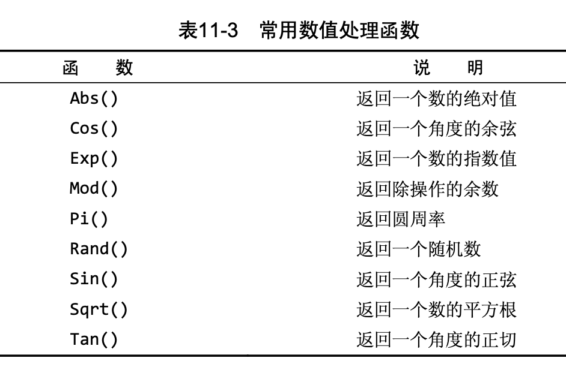

# 阅读 MySQL必知必会 毕节

## 使用MySQL

1. 连接 mysql workbench(客户端软件)

    为了连接到MySQL，需要以下信息:

        - 主机名(计算机名)——如果连接到本地MySQL服务器，为localhost;
        - 端口(如果使用默认端口3306之外的端口);
        - 一个合法的用户名;
        - 用户口令(如果需要)。
  
    在连接之后，你就**可以访问你的登录名能够访问的任意数据库和表了。**

2. 选择数据库

`use crashcourse;`  -> Database changed

`show databases;` -> 现实当前用户下的所有数据库

`show tables;` -> 现实当前用户下的所有表

`show columns from customers;` 或 `describe customers;` -> 返回当前选择的数据库内可用表的列表

`SHOW STATUS;` -> 用于显示广泛的服务器状态信息;

`SHOW CREATE DATABASE;`和`SHOW CREATE TABLE;` -> 分别用来显示创
建特定数据库或表的MySQL语句;

`SHOW GRANTS;` -> 用来显示授予用户(所有用户或特定用户)的安
全权限;

`SHOW ERRORS;`和`SHOW WARNINGS;` -> 用来显示服务器错误或警告消息。

`help show;` -> 显示允许的SHOW语句。

## 检索数据

检索单个列

`select prod_name from products;`

检索多个列

`select prod_id, prod_name, prod_price from products;`

检索所有列

`select * from products;`

检索不同的行

DISTINCT关键字,此关键字指示MySQL **只返回不同的值。**（类似于集合操作）如果给出SELECT DISTINCT vend_id, prod_price，有两个列，distince会同时作用于两个列

`SELECT DISTINCT vend_id FROM products;`

限制结果

为了返回第一行或前几行，可使用**LIMIT子句**。

`select prod_name from products limit 5;` -> LIMIT 5指示MySQL返回 不多于5行

为得出下一个5行，可指定要检索的**开始行和行数**(limit 5,5) 

注意：**行0 检索出来的第一行为行0而不是行1。因此，LIMIT1,1 将检索出第二行而不是第一行。**

LIMIT 4 OFFSET 3意为从行3开始取4行，就像LIMIT 3, 4一样。

`select prod_name from products limit 5,5`

使用完全限定的表名

`select products.prod_name from products;`

`select products.prod_name from crashcourse.products;`

## 排序检索数据

排序数据

select为SQL语句， from为select语句的子句，有些子句是必须的，有些子句是可选的

排序子句ORDER BY(默认为升序)

`select prod_name from products ORDER BY prod_name;`

按多个列排序

首先按价格，然后再按名称排序。仅在多个行具有相同的prod_price 值时才对产品按prod_name进行排序。如果prod_price列中所有的值都是唯一的，则不会按prod_name排序。

```
select prod_id, prod_price, prod_name
from products
order by prod_price, prod_name
```

指定排序方向

默认的排序顺序**升序（ASC关键字 默认）（从A到Z）**，指定**降序关键字DESC**

```
select prod_id, prod_price, prod_name
from products
order by prod_price DESC
```

所有多个列，**DESC关键字只应用到直接位于其前面的列名**

```
select prod_id, prod_price, prod_name
from products
order by prod_price DESC, prod_name 
```
prod_price列以降序排序，而prod_name列(在每个价格内)仍然按标准 的升序排序。

注意：在字典(dictionary)排序顺序中，A被视为与a相同，这是MySQL (和大多数数据库管理系统)的默认行为。

使用ORDER BY和LIMIT的组合，能够找出一个列中最高或最低的值。

```
select prod_id, prod_price, prod_name
from products
order by prod_price DESC
limit 1
```
->price最高的值

## 6 过滤数据

- 使用WHERE子句

`select prod_name, prod_price from products where prod_price = 2.50;`

注意：WHERE子句的位置 在同时使用ORDERBY和WHERE子句时，应 该让**ORDER BY位于WHERE之后**

- where子句操作符


- 检查单个值

`select prod_name, prod_price from products where prod_name = 'fuses';`

MySQL在**执行匹配时默认不区分大小写，所 以fuses与Fuses匹配。**

- 不匹配检查

`select vend_id, prod_name from products where vend_id <> 1003;`

**!=和<>都是可以的**

- 范围值检查

`select prod_name, prod_price from products where prod_price between  5 and 10;`

**注意写法：where prod_price between 5 and 10**

- 空值检查

在一个列不包含值时，称其为包含空值NULL。

使用WHERE子句IS NULL子句

`select prod_name from products where prod_price IS NULL`

注意：NULL与不匹配不是同一个东西

## 7 数据过滤

- 组合WHERE子句

操作符(operator) 用来联结或改变**WHERE子句中的子句**的关键 字。也称为逻辑操作符(logical operator)

**AND**操作符(用在WHERE子句中的关键字)

不止一个列进行过滤，多个条件

`select prod_name, prod_price, prod_name from products where vend_id = 1003 and prod_price <= 10;`

**OR**操作符

`select prod_name, prod_price, prod_name from products where vend_id = 1002 or vend_id = 1003;`

- 计算次序

WHERE可包含**任意数目的AND和OR操作符**。**允许两者结合**以进行复杂
和高级的过滤。

`where vend_id = 1002 or vend_id = 1002 and prod_price >= 10` SQL(像多数语言一样)在处理OR操作符前，**优先处理AND操 作符**。

使用 **括号()** 来改变计算次序 `(vend_id = 1002 or vend_id = 1002) and prod_price >= 10`

- IN操作符

与or操作符的作用一致

```
select prod_name, prod_price
from  products
where vend_id in (1002, 1003)
order by prod_name;
````

in相比or的优点：IN的最大优点是**可以包含其他SELECT语句**，使得能够更动态地建
立WHERE子句。

- NOT操作符

NOT操作符有且只有一个功能，那就是否定它之后所 跟的任何条件。

为了列出除1002和1003之外的所有供应
商制造的产品：

```
select prod_name, prod_price
from  products
where vend_id not in (1002, 1003)
order by prod_name;
```

not在与IN操作符联合 使用时，NOT使找出与条件列表不匹配的行非常简单。

## 8 用通配符进行过滤

- LIKE操作符

结合通配符完成复杂搜索

通配符：用来匹配值的一部分的特殊字符。

搜索模式(search pattern)： 由字面值、通配符或两者组合构
成的搜索条件。

通配符本身实际是SQL的WHERE子句中有特殊含义的字符

1. 百分号(%)通配符 : %表示任何字符出现 任意次数

e.g. 找出所有以词jet起头的产品

 `where prod_name LIKE 'jet%'` 
 
 **搜索结果区分大小写**，% 代表搜索模式中给定位置的**0个、1个或多个字符。**

 注意：
    1. 若词的尾部有空格，子句WHERE prod_name LIKE '%anvil'将不会匹配它们
    2. 注意NULL %不会匹配NULL


2. 下划线(_)通配符: 下划
线只匹配单个字符而不是多个字符。

`where prod_name LIKE '_ton anvil'`

## 9 用正则表达式 进行搜索

- 正则表达式介绍

正则表达式是用来匹配文本 的特殊的串(字符集合)， 

- 使用MySQL正则表达式

MySQL 用WHERE子句对正则表达式提供了初步的支持，允许你指定正则表达式， 过滤SELECT检索出的数据。（但可用的正则表达式仅为很小的部分）

1. 基本字符匹配

e.g. 检索列prod_name包含文本1000的所有行:

```
select prod_name
from products
where prod_name regexp '1000'
order by prod_name
```

它告诉MySQL:REGEXP后所跟的东西作 为正则表达式(与文字正文1000匹配的一个正则表达式)处理。

注意：

列值内进行匹配，如果被匹配的文本在 列值中出现，**列值中包括1000即可，不是全部，相当于 like '%1000%'**；如果想匹配整个列值，写法在后面；

`where prod_name regexp '.000'` **.是正则表达式语言中一个特殊的字符。它表示匹配任意一个字符**，因此，1000和2000都匹配 且返回。

2. 进行OR匹配

使用|

```
select prod_name
from products
where prod_name regexp '1000|2000'
```

表示列值中出现过‘1000’或者‘2000’行

3. 匹配几个字符之一

使用[], [123]表示当前位置匹配1或2或3

```
select prod_name
from products
where prod_name regexp '[123]Ton'
order by prod_name
```

正则表达式[123]Ton 为[1|2|3]Ton的缩写，也可以使用后者。

必须加[]，否则：1｜2｜3Ton就表示 出现1或2或3Ton 不是 1Ton或2Ton或3Ton的意思

注意：**字符集合也可以被否定**，[123] 匹配字符1、2或3，但[^123]匹配除这些字符外的任何东西。

4. 匹配范围

集合可用来定义要匹配的一个或多个字符，例[123456789] 为了简化

-> 可使用-来定义一个范围 即 [1-9] 或者 [a-z]匹配任意字母字符

5. 匹配特殊字符

正则表达式语言**由具有特定含义的特殊字符构成** ，如 .、[]、 |和-等。

但如果想匹配特殊字符

-> **为了匹配特殊字符，必须用\\为前导。\\-表示查找-，\\.表示查找.。** 即所谓的转义

注意：
1. 匹配\ 为了匹配反斜杠(\)字符本身，需要使用\\\。
2. 多数正则表达式实现使用单个反斜杠转义特殊字符，**但MySQL要求两个反斜杠**


6. 匹配字符类

为更方便工作，可以使用预定义的字符集，称为字符类(character class)


7. 匹配多个实例

表中的元字符在正则表达式中表示了特殊的意思


8. 定位符

目前为止的所有例子都是匹配一个串中任意位置的文本。**为了匹配特定位置的文本，需要使用定位符。**


`where prod_name regexp '^[0-9\\.]'`

表示 **.或任意数字**为串中**第一个字符时**才匹配它们

注意：1. ^的双重用途 ^有两种用法。在集合中(用[和]定义)，用它 来否定该集合，否则，用来指串的开始处。

## 10 创建计算字段

**拼接字段** 将值联结到一起构成单个值 （Concat()函数）

注意：多数DBMS使用+或||来实现拼接， MySQL则使用Concat()函数来实现

`select Concat(vend_name, '(', vend_country, ')') from vendors order by vend_name;`

结果：'Anvils R Us(USA)'

删除数据右侧多余的空格来整理数据，这可以 使用MySQL的RTrim()函数来完成(LTrim()(去掉串左边的空格)以及 Trim()(去掉串左右两边的空格)。)

`select Concat(RTrim(vend_name), '(', RTrim(vend_country), ')') from vendors order by vend_name;`

**使用别名**

`select Concat(RTrim(vend_name), '(', RTrim(vend_country), ')') as vend_title from vendors order by vend_name;`

**执行算术运算**

`select prod_id, quantity, item_price, quantity*item_price as expanded_price from orderitems where order_num = 20005`


注意：SELECT 3*2;将返回6，SELECT Trim('abc');将返回abc，而SELECT Now()利用Now()函数返回当前日期和时间。可以明白如何根据需要使用SELECT进行试验。

## 11 使用数据处理函数

大多数SQL支持的函数：字符串操作、算术操作、处理时间或者日期格式、返回特殊信息

**文本处理函数**

`select vend_name, Upper(vend_name) AS vend_name_upcase from vendors order by vend_name;`


注意：

表中的SOUNDEX需要做进一步的解释。**SOUNDEX是一个将任何文 本串转换为描述其语音表示的字母数字模式的算法。**

例：

customers表中有一个顾 客Coyote Inc.，其联系名为Y.Lee。但如果这是输入错误，此联系名实 际应该是Y.Lie，怎么办?

```
select cust_name, cust_contact 
from customers 
where Soundex(cust_contact) = Soundex('Y Lie');
```

返回结果：'Y Lee'

**日期和时间处理函数**


特别说明：

MySQL使用的日期格式：yyyy-mm-dd

Date(order_date)指示MySQL仅提取列的日期部分（例：查询列值为where order_date = '2005-09-01'的行是，只会全值匹配，如果列值为‘2005-09-01 11:30:05’这样的怎么办？应使用Date('2005-09-01')会把包含时间的行查找出来）（为了养成好习惯可以只要查找日期就使用Date()函数）

不过，还有一种日期比较需要说明。如果你想检索出2005年9月下的 所有订单，怎么办?

方法1:

```
select cust_id, order_num 
from orders 
where Date(order_date) between "2005-09-01" and "2005-09-30";
```

方法2:

```
select cust_id, order_num 
from orders 
where Year(order_date) = 2005 and Mouth(order_date) = 9;
```

**数值处理函数**



##  12 汇总数据

**聚集函数：运行在**行组**上，计算和返回单 个值的函数。**


SUM()也可以用来合计计算值

例：

`select sum(item_price * quantity) as total_price from oderitems where order_num = 2005`

**在多个列上进行计算 如本例所示，利用标准的算术操作符， 所有聚集函数都可用来执行多个列上的计算。**

NULL值 SUM()函数忽略列值为NULL的行。

**聚集不同值**

DISTINCT(ALL为默认 ALL参数不需要指定，因为它是默认行为。如果 不指定DISTINCT，则假定为ALL。)

`select avg(distinct prod_price) as avg_price from products where vend_id = 1003`

注意：如果指定列名，则DISTINCT只能用于COUNT()。DISTINCT 不能用于COUNT(*)，因此不允许使用COUNT(DISTINCT)， 否则会产生错误。类似地，**DISTINCT必须使用列名**，不能用于计算或表达式。

**组合聚集函数**

```
select count(*) as num_items, min(prod_price) as price_min, max(prod_price) as price_max, avg(prod_price) as price_avg 
from products;
```

## 13 分组数据

**GROUP BY子句和HAVING子句**

**GROUP BY**

`select vend_id, count(*) as num_prods from products group by vend_id;`

表示按照vend_id进行分组，并使用了count()计数字段（计数字段根据组别进行计数，而不是计算总数）

GROUP BY子句指示MySQL分组数据，然后**对每个组而不是 整个结果集进行聚集。**

注意：

1. **GROUP BY子句必须出现在WHERE子句之后，ORDER BY子句之前。**
2. 如果分组列中具有NULL值，则NULL将作为一个分组返回。如果列 中有多行NULL值，它们将分为一组。
3. GROUP BY子句可以**包含任意数目的列**。这使得能对分组进行嵌套， 为数据分组提供更细致的控制。（例：group by vend_id, vend_name）
4. 如果在GROUP BY子句中**嵌套了分组，数据将在最后规定的分组上 进行汇总**。换句话说，在建立分组时，指定的所有列都一起计算
(所以不能从个别的列取回数据)。
5. GROUP BY子句中列出的每个列都必须是**检索列**或**有效的表达式**
(但不能是聚集函数)。**如果在SELECT中使用表达式，则必须在 GROUP BY子句中指定相同的表达式**。不能使用别名。
6. 除聚集计算语句外，SELECT语句中的每个列都必须在GROUP BY子 句中给出。

**HAVING**

WHERE过滤行，而HAVING过滤分组。

HAVING支持所有WHERE操作符

`select cust_id, count(*) as orders from orders group by cust_id having count(*) >= 2;`

WHERE在数据 **分组前**进行过滤，HAVING在数据**分组后**进行过滤

`select vend_id, count(*) as num_prods from products where prod_price >= 10 group by vend_id having count(*) >= 2;`

**分组和排序**


GROUP BY是分组 **不排序**，所以既分组又排序的话：

`sum(quantity*item_price) as ordertotal from orderitems group by order_num having sum(quantity*item_price) >= 50 order by ordertotal;`

顺序是：where -> group by -> having -> order by
where 按照单个行进行筛选

group by 分组

having 作用于组

order by 排序

**select 子句顺序**


## 14 使用子查询


子查询： 嵌套在其他查询中的查询

**利用子查询进行过滤**

举例：列出订购物品TNT2的所有客户？

(对于包含订单号、客户ID、 订单日期的每个订单，orders表存储一行。

各订单的物品存储在相关的 orderitems表中。

orders表不存储客户信息。它只存储客户的ID。实际 的客户信息存储在customers表中。)

查询顺序：

1. 检索包含物品TNT2的所有订单的编号。
2.  检索具有前一步骤列出的订单编号的所有客户的ID。 
3.  检索前一步骤返回的所有客户ID的客户信息。

代码：

```
select cust_name, cust_contact
from customers
where cust_id in (select cust_id
					from orders
					where order_num in (select order_num
										from orderitems
										where prod_id = 'TNT2'))
```

保证SELECT语句具有与WHERE子句中相同数目的列

**作为计算字段使用子查询**

显示customers表中每个客户的订单总数。订单与相应的客户ID存储在orders表中?

步骤：
1. 从customers中检索每名客户
2. 对于检索出的每个客户，统计其在orders表中的订单数目

代码：

```
select cust_name, cust_state, 
		(select count(*)
        from orders
        where orders.cust_id = customers.cust_id) as orders
from customers
order by cust_name;
```

完全限定列名:` where orders.cust_id = customers.cust_id`

相关子查询(correlated subquery) 涉及外部查询的子查询。

## 15 联结表

**外键(foreignkey)** 外键为某个表中的一列，它包含另一个表 的主键值，定义了两个表之间的关系。

总之，关系数据可以有效地存储和方便地处理。因此，关系数据库 的可伸缩性远比非关系数据库要好。

**如果数据存储在多个表中，怎样用单条SELECT语句检索出数据? 使用联结**

简单地说，联结是一种机制，用来在一条SELECT 语句中关联表，因此称之为联结。使用特殊的语法，可以联结多个表返 回一组输出，联结在运行时关联表中正确的行。

**创建联结** ：规定要联结的所有表以及它们如何关联即可

```
select vend_name, prod_name, prod_price
from vendors, products
where vendors.vend_id = products.vend_id
order by vend_name, prod_name;
```

WHERE子句的重要性:实际上做 的是将第一个表中的每一行与第二个表中的每一行配对

如果没有where将是 笛卡儿积 的行数 （这样的联结也叫叉联结）

**内部联结**

目前为止所用的联结称为**等值联结(equijoin)**，这种联结也称为**内部联结**

```
select vend_name, prod_name, prod_price
from vendors inner join products on vendors.vend_id = products.vend_id
order by vend_name, prod_name;
```

**与上面的用where的用法相同**

**联结多个表**

```
select prod_name, vend_name, prod_price, quantity
from orderitems, products, vendors
where products.vend_id = vendors.vend_id and
	orderitems.prod_id = products.prod_id and 
    order_num = 20005;
```

上方的三个嵌套子查询可以通过联结表改进为：

```
select cust_name, cust_contact
from customers, orders, orderitems
where customers.cust_id = orders.cust_id
    and orderitems.order_num = orders.order_num
    and prod_id = 'TNT2';
```

## 16 创建高级联结

**表别名**

表别名只在查询执行中使用

```
select cust_name, cust_contact
from customers as c, orders as o, orderitems as oi
where c.cust_id = o.cust_id
	and oi.order_num = o.order_num
    and prod_id = 'TNT2';
```

**不同类型的联结**

1. 自联结

```
select prod_id, prod_name
from products
where vend_id = (
		select vend_id
		from products
		where prod_id = 'DTNTR');
```

使用子查询

使用联结

```
select p1.prod_id, p1.prod_name
from products as p1, products as p2
where p1.vend_id = p2.vend_id
	and p2.prod_id = 'DTNTR';
```

此查询中需要的两个表实际上是相同的表，为了避免引用具有二义性，使用了表别名。

**WHERE(通过匹配p1中 的vend_id和p2中的vend_id)首先联结两个表，然后按第二个表中的 prod_id过滤数据，返回所需的数据。**

2. 自然联结

联结时至少有一个列出现在不止一个表中。

自然联结排除多次出现，使每个列只返回一次。

使用select *作用于第一个表，对其他表使用明确的列名进行select

```
select c.* o.order.num, o.order_date, oi.prod_id, oi.quantity, oi.item_price
from customers as c, orders as o, orderitems as oi
where c.cust_id = o.cust_id
    and oi.order_num = o.order_num
    and prod_id = 'FB';
```

3. 外部联结

许多联结将一个表中的行与另一个表中的行相关联。

但有时候会需要包含没有关联行的那些行。

外部联结还包括没有关联行的行。

例


```
select customers.cust_id, orders.order_num
from customers left outer join orders
	on customers.cust_id = orders.cust_id;
```

上述代码：在使用**OUTER JOIN**语法时，**必须使用RIGHT或LEFT关键字** 指定包括其所有行的表(RIGHT指出的是OUTER JOIN右边的表，而LEFT 指出的是OUTER JOIN左边的表)。上面的例子使用LEFT OUTER JOIN从FROM 子句的**左边表(customers表)中选择所有行。**

**使用带聚集函数的联结**

```
select customers.cust_name, customers.cust_id, count(orders.order_num) as nums_ord
from customers inner join orders
	on customers.cust_id = orders.cust_id
group by customers.cust_id;
```

GROUP BY子句按客户分组数据，因此，函数调用COUNT (orders.order_num)对每个客户的订单计数，将它作为num_ord返回。

**使用联结和联结条件**

1. **应该总是提供联结条件**
2.  在一个联结中可以包含多个表，甚至对于每个联结可以采用不同
的联结类型。

## 17 组合查询

**并(union)/复合查询/组合查询**

任何具有多个WHERE子句的SELECT语句 都可以作为一个组合查询给出，也就是说where和组合查询都可以，但是性能有差别

```
select vend_id, prod_id, prod_price
from products
where prod_price <= 5
union
select vend_id, prod_id, prod_price
from products
where vend_id IN (1001, 1002);
```

上方代码等于下方代码：

```
select vend_id, prod_id, prod_price
from products
where prod_price <= 5 or vend_id IN (1001, 1002);
```

**UNION规则**

1.  UNION中的每个查询必须包含相同的列、表达式或聚集函数(不过各个列不需要以相同的次序列出)。
2.  列数据类型必须兼容:类型不必完全相同，但必须是DBMS可以隐含地转换的类型(例如，不同的数值类型或不同的日期类型)。

**包含或取消重复的行**

UNION从查询结果集中默认自动去除了重复的行(换句话说，它的行为与 单条SELECT语句中使用多个WHERE子句条件一样)

如果想取消自动去除重复：使用 UNION ALL而不是UNION

**对组合查询结果排序**

在用UNION组合查询时，只能使用一条ORDER BY子句，它**必须出现在最后一条SELECT语句之后**

ORDER BY子句将用它来排序所有SELECT语句返回的所有结果。

UNION的组合查询可以应用不同的表。

## 18 全文本搜索(MySQL的全文本搜索)

like和正则表达式性能方面存在问题，有很多限制。

全文本搜索MySQL创建指定列中各词的一个索引，搜索可以针对这些词进行。

**启用全文本搜索**

一般在创建表时启用全文本搜索。

为了进行全文本搜索， MySQL根据子句FULLTEXT(note_text)的指示对它进行索引。这里的 FULLTEXT索引单个列，如果需要也可以指定多个列。

```
create table productnotes
(
note_id int not null auto_increment,
prod_id char(10) not null,
note_date datetime not null,
note_text text null,
primary key(note_id),
fulltext(note_text)
) engine=MyISAM;
```

**进行全文本搜索**

```
select note_text
from productnotes
where Match(note_text) against('rabbit');
```

注释：

此SELECT语句检索单个列note_text。

由于WHERE子句，一个全文本搜索被执行。

Match(note_text)指示MySQL针对指定的 列进行搜索，Against('rabbit')指定词rabbit作为搜索文本。由于有 两行包含词rabbit，这两个行被返回。

注意：

1. 使用完整的Match()说明 传递给Match()的值必须与 FULLTEXT()定义中的相同。如果指定多个列，则必须列出它 们(而且次序正确)。
2. 搜索不区分大小写

同`where note_text like '%rabbit%'`;

全文本搜索的一 个重要部分就是对结果排序。具有较高等级的行先返回(因为这些行很 可能是你真正想要的行)。

**使用查询扩展**

只有一个注释包含词anvils， 但你还想找出可能与你的搜索有关的所有其他行，即使它们不包含词anvils

利用查询扩展，**能找出可能相关的结果，即使它们并不精确包含所查找的词**

```
select note_text
from productnotes
where match(note_text) against('anvils');
```
只有一行包含词anvils，因此只返回一行。

下面是相同的搜索，这次使用查询扩展(with query expansion):

```
select note_text
from productnotes
where match(note_text) against('anvils' with query expansion);
```

这次返回了7行。第一行包含词anvils，因此等级最高。第二行与anvils无关，但因为它包含第一行中的两个词(customer 和recommend)，所以也被检索出来。

**布尔文本搜索**

即使没有FULLTEXT索引也可以使用 

```
select note_text
from productnotes
where match(note_text) against('anvils' in boolean mode);
```

此全文本搜索检索包含词heavy的所有行(有两行)。其中使用了关键字IN BOOLEAN MODE，**但实际上没有指定布尔操作符， 因此，其结果与没有指定布尔方式的结果相同。**

为了匹配包含heavy但不包含任意以rope开始的词的行，可使用以下查询:

```
select note_text
from productnotes
where match(note_text) against('heavy -rope*' in boolean mode);
```

表示匹配词heavy，但-rope*明确地分析指示MySQL排除包含rope*(任何以rope开始的词，包括 172 ropes)的行

** -排除一个词，而* 是截断操作符(可想象为用于词尾的一个通配符) **


更多的例子：

`where match(note_text) against('+rabbit +bait' in boolean mode);` 这个搜索匹配包含词rabbit和bait的行。

`where match(note_text) against('rabbit bait' in boolean mode)`; 没有指定操作符，这个搜索匹配包含rabbit和bait中的至少一 个词的行。

`where match(note_text) aginst('"rabbit bait"' in boolean mode);` 这个搜索匹配短语rabbit bait而不是匹配两个词rabbit和 bait。

`where match(note_text) against('>rabbit <carrot' in boolean mode);`  匹配rabbit和carrot，增加前者的等级，降低后者的等级。

`where match(note_text) against('+saft +(<combination)' in boolean mode);` 这个搜索匹配词safe和combination，降低后者的等级。

**全文本搜索的使用说明**

1. 在索引全文本数据时，短词被忽略且从索引中排除。短词定义为 那些具有3个或3个以下字符的词(如果需要，这个数目可以更改)。
2. MySQL带有一个内建的非用词(stopword)列表，这些词在索引全文本数据时总是被忽略。如果需要，可以覆盖这个列表(请参阅MySQL文档以了解如何完成此工作)。
3. 许多词出现的频率很高，搜索它们没有用处(返回太多的结果)。因此，MySQL规定了一条50%规则，**如果一个词出现在50%以上 的行中，则将它作为一个非用词忽略。****50%规则不用于IN BOOLEAN MODE。**
4. 如果表中的行数少于3行，则全文本搜索不返回结果(因为每个词 或者不出现，或者至少出现在50%的行中)。
5. 忽略词中的单引号。例如，don't索引为dont。
6. 不具有词分隔符(包括日语和汉语)的语言不能恰当地返回全文本搜索结果。
7. 如前所述，**仅在MyISAM数据库引擎中支持**全文本搜索。

## 19 插入数据

**数据插入**

1. 插入完整的行;
2. 插入行的一部分;
3. 插入多行;
4. 插入某些查询的结果。

**插入完整的行**

```
insert into customers
values(null, 'Pep E. LaPew', '100 Main Street', 'Los Angeles', 'CA', '90046', 'USA', null, null);
```

对每个列**必须**提供一个值

下方在插入行时，MySQL将**用VALUES 列表中的相应值填入列表中的对应项**：

```
insert into customers(
cust_name,
cust_address,
cust_city,
cust_state,
cust_zip,
cust_country,
cust_contact,
cust_email
)
values(
'Pep E. LaPew', '100 Main Street', 'Los Angeles', 'CA', '90046', 'USA', null, null
);
```

省略的列必须满足以下某个条件:
1. 允许NULL值
2. 在表定义中给出默认值。这表示如果不给出值，将使用默认值。

**插入多个行**

```
insert into customers(属性, 属性, ...)
values(
    第一行数据
),(
    第二行数据
);
```

**插入检索出的数据**

可以利用它将一条SELECT语句的结果插入表中,这就是所 谓的INSERT SELECT

```
insert into customers(
	cust_name,
    cust_address,
    cust_city,
    cust_state,
    cust_zip,
    cust_country,
    cust_contact,
    cust_email
)
select cust_name,
    cust_address,
    cust_city,
    cust_state,
    cust_zip,
    cust_country,
    cust_contact,
    cust_email
from custnew;
```

注意：

1. 确保cust_id的值不重复
2. 这条语句将插入多少行有赖于custnew表中有多少行

INSERT SELECT中SELECT语句可包含WHERE子句以过滤插入的数据。

## 20 更新和删除数据

**更新数据**

1. 更新表中**特定行;**
2. 更新表中**所有行。**

```
update customers
set cust_email = 'elmer@fudd.com'
where cust_id = 10005;

```

注意：**没有 WHERE子句，MySQL将会用这个电子邮件地址更新customers表中所有行**

```
update customers
set cust_name = 'The Fudds',
	cust_email = 'elmer@fudd.com'
where cust_id = 10005;
```
在此例子中，更新客户10005的 cust_name和cust_email列。

注意：IGNORE关键字 为即使是发
生错误，也继续进行更新 

`update ignore customers...`

为了删除某个列的值，可设置它为NULL(假如表定义允许NULL值)。

```
update customers
set cust_email = NULL
where cust_id = 10005;
```

**删除数据**

1. 从表中删除**特定的行;**
2. 从表中删除**所有行。**

```
delete from customers
where cust_id = 10006;
```

删除一行

如果想从表中删除所有行，不要使用DELETE。 可使用TRUNCATE TABLE语句

**更新和删除的指导原则**

1. 除非确实打算更新和删除每一行，否则绝对不要使用不带WHERE 子句的UPDATE或DELETE语句。
2. 保证每个表都有**主键**(如果忘记这个内容，请参阅第15章)，尽可能 像WHERE子句那样使用它(可以指定各主键、多个值或值的范围)。
3. 使用强制实施引用完整性的数据库(关于这个内容，请参阅第15章)，这样MySQL将不允许删除具有与其他表相关联的数据的行。

MySQL没有撤销(undo)按钮。(不能恢复数据)

## 21 创建和操纵表

1. 使用具有交互式创建和管理表的工具
2. 表也可以直接用MySQL语句操纵。

**表创建基础**

```
create table customers(
	cust_id int not null auto_increment,
    cust_name char(50) not null,
    cust_address char(50) null,
    cust_city char(50) null,
    cust_state char(5) null,
    cust_zip char(10) null,
    cust_country char(50) null,
    cust_contact char(50) null,
    cust_email char(255) null,
    primary key(cust_id)
);
```

以列名开始，后跟数据类型，PRIMARY KEY关键字指定

注意：如果要防止意外覆盖已有的表，SQL要求首先手工删 除该表(请参阅后面的小节)，然后再重建它，而不是简单地 用创建表语句覆盖它。

如果你仅想在一个表不存在时创建它，应该在表名后给出IF NOT EXISTS。

**使用NULL值**

允许NULL值的列也允许在 插入行时不给出该列的值。不允许NULL值的列不接受该列没有值的行， 换句话说，在插入或更新行时，该列必须有值。

NULL为默认设置

注意：NULL值是没有值， 它不是空串

**主键再介绍**

主键值必须唯一

如果主键使用单个列，则它的值必须唯一。

如果使用多个列，则 这些列的组合值必须唯一。

单个列：`primary key (vend_id)`

多个列：`primary key (order_num, order_item)`

**主键中只能使用不允许NULL值的列**

**使用AUTO_INCREMENT**

AUTO_INCREMENT告诉MySQL，本列每当增加一行时自动增量

每个表只允许一个AUTO_INCREMENT列，而且它必须被索引(如，通
过使它成为主键)。

你可以简单地在**INSERT**语句 中指定一个值，**只要它是唯一的(至今尚未使用过)即可**,该 值将被用来替代自动生成的值。**后续的增量将开始使用该手工 插入的值。**

注意：如何在使用AUTO_INCREMENT列时获得这个值呢?可使 用last_insert_id()函数获得这个值，如下所示:

`select last_insert_id()`

此语句返回最后一个AUTO_INCREMENT值。

**指定默认值**

DEFAULT关键字

`(quantity int not null default 1, ...)`

MySQL不允许使用函 数作为默认值，它只支持常量。

**引擎类型**

MySQL与其他DBMS不一样，它具有多种引擎。它打包多个引擎， 这些引擎都隐藏在MySQL服务器内，全都能执行CREATE TABLE SELECT 等命令。

如果省略ENGINE=语句，则 使用默认引擎(很可能是MyISAM)，多数SQL语句都会默认使用它。

引擎类型可以混用。

外键不能跨引擎（使用一 个引擎的表不能引用具有使用不同引擎的表的外键。）

**更新表**

ALTER TABLE语句

为了使用ALTER TABLE更改表结构，必须给出下面的信息:

1. 在ALTER TABLE之后给出**要更改的表名**(该表必须存在，否则将 出错);
2. 所做**更改的列表**。

```
alter table vendors
add vend_phone char(20);
```

这条语句给vendors表**增加一个名为vend_phone的列**，必须明 确其数据类型。

```
alter table vendors
drop column vend_phone;
```
**删除刚刚添加的列**

ALTER TABLE的一种常见用途是定义外键。

```
ALTER TABLE orderitems
ADD CONSTRAINT fk_orderitems_orders
FOREIGN KEY (order_num) REFERENCES orders (order_num);
```

fk_orderitems_orders 是外键约束的名称

这个语句的作用是将 order_num 列作为外键，将其与 orders 表中的 order_num 列进行关联。**这意味着在 orderitems 表中的每一行，order_num 列的值必须存在于 orders 表的 order_num 列中。**

如果尝试插入一个在 orders 表中不存在的订单号，或者尝试更新 orderitems 表中的 order_num 列为一个在 orders 表中不存在的订单号，将会触发外键约束的错误。这有助于维护数据的完整性和一致性。


复杂的表结构更改一般需要手动删除过程，它涉及以下步骤:

1. 用新的列布局创建一个新表;
2. 使用INSERT SELECT语句,从旧表复制数据到新表。如果有必要，可使用转换函数和
计算字段;
3. 检验包含所需数据的新表;
4. 重命名旧表(如果确定，可以删除它);
5. 用旧表原来的名字重命名新表;
6. 根据需要，重新创建触发器、存储过程、索引和外键。

使用ALTER TABLE要极为小心，应该 在进行改动前做一个完整的备份(模式和数据的备份)。

**删除表**

`drop table customers2;`

**重命名表**

命名单个表：

`rename table customers2 to customers`

命名多个表：

```
rename table backup_customers to customers,
    backup_vendors to vendors,
    backup_products to products;
```

## 22 使用视图

视图是虚拟的表

作为视图，它不包含表中应该有的任何列或数据，它包含的是一个SQL查询

**为什么使用视图**

1. 重用SQL语句
2. 简化复杂的SQL操作。在编写查询后，可以方便地重用它而不必知道它的基本查询细节。
3. 使用表的组成部分而不是整个表。
4. 保护数据。可以给用户授予表的特定部分的访问权限而不是整个表的访问权限。
5. 更改数据格式和表示。视图可返回与底层表的表示和格式不同的数据。

视图创建之后，可以用与表基本相同的方式利用它们。

执行**SELECT操作，过滤和排序数据，将视图联结到其他视图或表，甚 至能添加和更新数据**(添加和更新数据存在某些限制。关于这个内容稍 后还要做进一步的介绍)。

**视图的规则和限制**

1. 与表一样，视图必须**唯一命名**(不能给视图取与别的视图或表相 同的名字)。
2. 对于可以创建的视图**数目没有限制。**
3. 为了创建视图，必须具有足够的访问权限。这些限制通常由数据库管理人员授予。
4. **视图可以嵌套**，即可以利用从其他视图中检索数据的查询来构造
一个视图。
5. ORDER BY可以用在视图中，但如果从该视图检索数据SELECT中也含有ORDER BY，那么该视图中的ORDER BY将**被覆盖。**
6. 视图**不能索引**，也不能有关联的触发器或默认值。
7. 视图可以和表**一起使用**。例如，编写一条联结表和视图的SELECT
语句。

**使用视图**

1. 创建 `create view`
2. 查看视图 `show create view viewname`
3. 删除 `drop view viewname`
4. 更新视图时，可以先用DROP再用CREATE，也可以直接用CREATE OR
REPLACE VIEW。如果要更新的视图不存在，则第2条更新语句会创 建一个视图;如果要更新的视图存在，则第2条更新语句会替换原 有视图。

**利用视图简化复杂的联结**

视图的最常见的应用之一是隐藏复杂的SQL(已经建立的视图可以多次使用)

**用视图重新格式化检索出的数据**

```
select concat(rtrim(vend_name), '(', rtrim(vend_country), ')') as vend_title
from vendors
order by vend_name;
```

**rtrim()函数用于去除字符串末尾的空格**

假如经常需要这个格式的结果，创建一个视图，每次需要时使用它即可

```
create view vendorlocations as 
select concat(rtrim(vend_name), '(', rtrim(vend_country), ')') as vend_title
from vendors
order by vend_name;
```

**用视图过滤不想要的数据**

**使用视图与计算字段**

```
create view orderitemsexpanded as 
select order_num,
    prod_id,
    quantity,
    item_price,
    quantity*item_price as expand_price
from orderitems;
```

**更新视图**

能否更新?答案视情况而定。

**更新一个视图将更新其基表**


如果视图定义中有以下操作，则不能进行视图的更新:

1. 分组(使用GROUP BY和HAVING);
2. 联结;
3. 子查询;
4. 并;
5. 聚集函数(Min()、Count()、Sum()等);
6. DISTINCT;
7. 导出(计算)列。

## 23 使用存储过程

**存储过程**

可以创建存储过程。存储过程简单来说，就是为以后的使用而保存 的一条或多条MySQL语句的集合。

MySQL称存储过程的执行为调用，因此MySQL执行存储过程的语句 为CALL。

**执行存储过程**

```
call productpricing(@pricelow,
					@pricehigh,
                    @priceaverage);
```

执行名为productpricing的存储过程，它计算并返回产 品的最低、最高和平均价格。

**创建存储过程**

```
delimiter //
                    
create procedure productpricing()
begin
	select avg(prod_price) as priceaverage
    from products;
end //

delimiter ;
```

如果存储过程接受参数，它们将在()中列举出来。此存储过程没有参数，但后跟的()仍然需要。

`call productpricing();`

使用这个存储过程

**删除存储过程**

`drop procedure productpricing;`

**使用参数**

存储过程并不显示结果，而是把结果返回给你指定的变量。

以下是productpricing的修改版本(如果不先删除此存储过程，则不能再次创建它):

```
delimiter //
create procedure productpricing(
	out p1 decimal(8,2),
    out ph decimal(8,2),
    out pa decimal(8,2)
)
begin
	select min(prod_price)
    into p1
    from products;
    select max(prod_price)
    into ph
    from products;
    select avg(prod_price)
    into pa
    from products;
end; //
delimiter ;
```

此存储过程接受**3个参数**:pl存储产品最低价格，ph存储产品最高价格，pa存储产品平均价格。

每个**参数必须具有指定的类型**，这里使用十进制值。

关键字**OUT指出相应的参数用来从存储过程传出 一个值(返回给调用者)。**

MySQL支持**IN(传递给存储过程)**、**OUT(从存 储过程传出，如这里所用)**和**INOUT(对存储过程传入和传出)类型的参数。**

存储过程的代码位于BEGIN和END语句内，如前所见，它们是一系列 SELECT语句，用来检索值，然后**保存到相应的变量(通过指定INTO关键 字)。**

调用存储过程：

`call productpricing(@pricelow, @pricehigh, @priceaverage);`

由于此存储过程要求3个参数，因此必须正好传递3个参数，不多也不少。

**在调用时，这条语句并不显示任何数据。它返回以后可以显示(或
在其他处理中使用)的变量。**

为了显示检索出的产品平均价格，可如下进行:

`select @priceaverage;`

`select @pricehigh, @pricelow, @priceaverage;`

使用IN和OUT参数, ordertotal接受订单 号并返回该订单的合计:

```
delimiter //
create procedure ordertotal(
	in onumber int,
    out ototal decimal(8,2)
)
begin
	select sum(item_price*quantity)
    from orderitems
    where order_num = onumber
    into ototal;
end; //
delimiter ;
```

调用存储过程：

`call ordertotal(20005, @total);`

显示结果：

`select @total;`

**建立智能存储过程**

```
-- Name:ordertotal
-- Paremeters: onumber = order number
-- 				taxable = 0 if not taxable, 1 if taxable
-- 				ototal = order total variable

delimiter //;
create procedure ordertotal(
	in onumber int,
    in taxable boolean,
    out ototal decimal(8,2)
)comment 'obtain order total, optionally adding tax'
begin
	-- declare vaibale for total
    declare total decimal(8,2);
    -- declare taxrate int default 6;
    declare taxrate int default 6;
    
    -- get the order total
    select sum(item_price*quantity)
    from orderitems
    where order_num = onumber
    into total;
    
    -- is the taxable?
    if taxable then
		-- yes, so add taxrate to the total
        select total + (total/100*taxrate) into total;
	end if;
	
    -- and finally, save to out variable
    select total into ototal;
end;
delimiter ;


```

增加了注释(前面放置--)。

添加了另外一个 参数taxable，它是一个布尔值(如果要增加税则为真，否则为假)。

用DECLARE语句定义了两个局部变量(DECLARE要求指定 变量名和数据类型，它也支持可选的默认值(这个例子中的taxrate的默 认被设置为6%)。)

SELECT语句已经改变，因此其结果存储到total(局部 变量)而不是ototal。

IF语句检查taxable是否为真，如果为真，则用另 一SELECT语句增加营业税到局部变量total。最后，用另一SELECT语句total(它增加或许不增加营业税)保存到ototal。

**COMMENT关键字** : 它不是必需的，但如果给出，将 在SHOW PROCEDURE STATUS的结果中显示。

```
call ordertotal(2005, 0, @total);
select @total;
```

**检查存储过程**

`show create procedure ordertotal;`

为了获得包括何时、由谁创建等详细信息的存储过程列表，使用SHOW PROCEDURE STATUS。

为限制其输出，可使用LIKE指定一个过滤模式，例如:

`show create procedure ordertotal like 'ordertotal'`

##  24 使用游标

为什么要使用游标？解决了什么问题？

没有办法得到第一行、下一行或前10行，也不存在每次一行 地处理所有行的简单方法(相对于成批地处理它们)。有时，需要在检索出来的行中前进或后退一行或多行。这就是使用 游标的原因。

MySQL游标只能用于 **存储过程(和函数)。**

**使用游标**

1 声明(定义)

2 声明后，打开游标

3 结束使用时，必须关闭游标

声明：

```
delimiter //
create procedure processorders()
begin
	declare ordernumbers cursor
    for 
    select order_num from orders;
end //
delimiter ;
```

打开：

`open ordernumbers;`

关闭：

`close ordernumbers;`


**使用游标数据**

FETCH语句

第一个例子从游标中检索单个行(第一行):

```
delimiter //
create procedure processorders()
begin
	-- declare local variables
    -- declare o int;
    
    -- declare the cursor
    declare ordernumbers cursor
    for 
    select order_num from orders;
    
    -- open th cursor
    open ordernumbers;
    
    -- get order number
    fetch ordernumbers into o;
    
    -- close the cursor
    close ordernumbers;
end//
delimiter ;    
```

其中FETCH用来检索**当前行的order_num列**(将**自动从第一行开始**)到一个名为o的局部声明的变量中。对检索出的数据**不做 任何处理**。

```
delimiter //
create procedure processorders()
begin
	-- declare local variables
    declare done boolean default 0;
    declare o int;
    
    -- declare the cursor
    declare ordernumbers cursor 
    for
    select order_num from orders;
    
    -- declare continue handler
    declare continue handler for sqlstate '02000' set done = 1;
    
    -- open the cursor
    open ordernumbers;
    
    -- loop through all rows
    repeat
		-- get order number
        fetch ordernumbers into o;
	-- end of loop
    until done end repeat;
    
    -- close the cursor
    close ordernumbers;
end//
delimiter ;
```

例子中的FETCH是在REPEAT内，反复执行直到done为真

CONTINUE HANDLER 语句它是在条件出现时被执行 的代码。 这里，它指出当SQLSTATE '02000'出现时，SET done=1。SQLSTATE '02000'是一个未找到条件，当REPEAT由于没有更多的行供循环而不能继 续时，出现这个条件。

注意：

DECLARE语句的次序

**DECLARE语句定义的局部变量必须在定义任意游标或句柄 之前定义，而句柄必须在游标之后定义。**

如果一切正常，你可以在循环内放入任意需要的处理(在FETCH语句之后，循环结束之前)。

游标存储过程样例的更 进一步修改的版本，这次对取出的数据进行某种实际的处理:

```
delimiter //
create procedure processorders()
begin
	-- declare local variables
    declare o int;
    declare t decimal(8,2);
    
    -- declare the cursor
    declare ordernumbers cursor for
    select order_num from orders;
    
    -- declare continue handler
    declare done int default 0;
    declare continue handler for sqlstate '02000' set done = 1;
    
    -- create a table to store the results
    create table ordertotals
    (order_num int, total decimal(8,2));
    
    -- open the cursor
    open ordernumbers;
    -- loop the cursor
    repeat
		-- get order number
        fetch ordernumbers into o;
        
        -- get the total for the order
        call ordertotal(o, t);
        
        -- insert order and total into ordertotals
        insert into ordertotals(order_num, total)
        values(o,t);
	-- end of loop
    until done end repeat;
    
    -- close the cursor
    close ordernumbers;
end;
//
delimiter ;
```

此存储过程不返回数据，但它能够创建和填充另一个表，可以用一 条简单的SELECT语句查看该表:

`select * from ordertotals;`

## 25 使用触发器

**触发器**

在需要时被执行

支持触发器的语句：DELETE、INSERT、UPDATE

**创建触发器**

在创建触发器时，需要给出4条信息:

1 唯一的触发器**名**;

2 触发器**关联的表**;

3 触发器应该**响应的活动**(DELETE、INSERT或UPDATE);

4 触发器**何时执行**(处理之前或之后)。

注意：保持每个数据库的触发器名唯一

CREATE TRIGGER语句创建

```
create trigger newproduct after insert on products
for each row select 'Product added';
```

表示此触发器将在INSERT语句成功执行后执行

FOR EACH ROW，因此代码对每个插入行执行。在这个例子中，文本Product added将对每个插入的行显示一次。

注意：

- **仅支持表**

- **每个表最多支持6个触发器(每条INSERT、UPDATE 和DELETE的之前和之后)。**

- **单一触发器不能与多个事件或多个表关联，所 以，如果你需要一个对INSERT和UPDATE操作执行的触发器，则应该定义 两个触发器。**

**删除触发器**

`drop trigger newproduct;`

**INSERT触发器**

注意：

- 在INSERT触发器代码内，可引用一个**名为NEW的虚拟表**，**访问被 插入的行;**
- 在**BEFORE** INSERT触发器中，NEW中的值也**可以被更新**(允许更改 被插入的值);
- 对于AUTO_INCREMENT列，NEW在INSERT**执行之前包含0**，在INSERT **执行之后包含新的自动生成值。**

```
create trigger neworder after insert on orders
for each row
select new.order_num;
```

触发器从NEW. order_num取得 这个值并返回它(此触发器必须按照AFTER INSERT执行，因为在BEFORE INSERT语句执行之前，新order_num还没有生成。)

**DELETE触发器**

注意：

- 在DELETE触发器代码内，你可以引用一个**名为OLD的虚拟表**，访问被删除的行;
- OLD中的值全都是**只读**的，不能更新。

```
create trigger deleteorder before delete on orders
for each row
begin
	insert into archive_orders(order_num, order_date, cust_id)
    values(old.order_num, old.order_date, old.cust_id);
end;
```

它使用一条INSERT语句
将OLD中的值(要被删除的订单)保存到一个名为archive_ orders的存档表中

**UPDATE触发器**

注意：

- 在UPDATE触发器代码中，你可以引用一个名为**OLD的虚拟表访问 以前(UPDATE语句前)的值，**引用一个**名为NEW的虚拟表访问新 更新的值;**
-  在BEFORE UPDATE触发器中，NEW中的值可能也被**更新**(允许更改 将要用于UPDATE语句中的值);
- OLD中的值全都是只读的，不能更新。


下面的例子保证州名缩写总是大写：

```
create trigger updatevendor before update on vendors
for each row
set new.vend_state = upper(new.vend_state);
```

注意这个set的用法

每次更新一行时，都会用Upper(NEW.vend_state)替换。

**本章注意**

MySQL触发器中不支持CALL语句这表示不能从触发 器内调用存储过程。所需的存储过程代码需要复制到触发器内。

## 26 管理事务处理

MyISAM和InnoDB是两种最常使用 的引擎。前者不支持明确的事务处理管理，而后者支持。

事务处理(transaction processing)可以用来维护数据库的**完整性**，它 保证成批的MySQL操作要么完全执行，要么完全不执行。

例子：

如果故障发生在添加了客户之后，orders表添加之前，不会有什么 问题。某些客户没有订单是完全合法的。

但是，如果故障发生在orders行添加之后，orderitems行添加之前， 怎么办呢?现在，**数据库中有一个空订单。**

如何解决这种问题?这里就需要使用事务处理了。

事务处理是一种 250 机制，用来管理必须成批执行的MySQL操作，以保证数据库不包含不完 整的操作结果。

几个术语：

    事务(transaction)指一组SQL语句;

    回退(rollback)指撤销指定SQL语句的过程;

    提交(commit)指将未存储的SQL语句结果写入数据库表;

    保留点(savepoint)指事务处理中设置的临时占位符(place-
    holder)，你可以对它发布回退(与回退整个事务处理不同)。

**控制事务处理**

管理事务处理的关键在于将SQL语句组分解为逻辑块，并明确规定数 据何时应该回退，何时不应该回退。

标识事务的开始:

`start transaction`

使用ROLLBACK

```
select * from ordertotals;
start transaction;
delete from ordertotals;
select * from ordertotals;
rollback;
select * from ordertotals;
```

用一条ROLLBACK语句回退 START TRANSACTION之后的所有语句

ROLLBACK只能在一个事务处理内使用

哪些语句可以回退? 事务处理用来管理INSERT、UPDATE和 DELETE语句。(SELECT语句也可以但是没有意义， 回退CREATE或DROP操作操作不会被撤销。)

使用COMMIT

一般的MySQL语句都是直接针对数据库表执行和编写的。这就是 所谓的隐含提交(implicit commit)，即提交(写或保存)操作是自动 进行的。

事务处理块中，提交不会隐含地进行

```
start transaction;
delete from orderitems where order_num = 20010;
delete from orders where order_num = 20010;
commit;
```

保证订单不被部分删除

使用保留点

ROLLBACK和COMMIT语句就可以写入或撤销整个事务处理。

回退部分事务处理,必须能在事务处理块中合适的位置放 置占位符。

占位符称为保留点,创建占位符

`savepoint delete1;`

回退到本例给出的保留点

`rollback to delete1;`

保留点越多越好

保留点在事务处理完成(执行一条ROLLBACK或 COMMIT)后自动释放

更改默认的提交行为

为指示MySQL不自动提交更改

`set autocommit = 0;`

设置autocommit为0(假)指示MySQL不自动提交更改 (直到autocommit被设置为真为止)。

标志为连接专用 autocommit标志是针对每个连接而不是服 务器的。

```
-- 设置 autocommit 为 0，禁用自动提交
SET autocommit = 0;

-- 开始一个事务
START TRANSACTION;

-- 执行一些 SQL 操作，例如插入、更新、删除等
INSERT INTO orders (order_id, customer_id, total_amount) VALUES (1, 101, 500);
UPDATE customers SET balance = balance - 500 WHERE customer_id = 101;

-- 检查数据是否正确
SELECT * FROM orders WHERE order_id = 1;
SELECT * FROM customers WHERE customer_id = 101;

-- 如果一切正常，手动提交事务
COMMIT;

-- 如果有问题，回滚事务
-- ROLLBACK;

-- 最后，恢复自动提交模式
SET autocommit = 1;

```

事务的四条性质：

    原子性（Atomicity）：原子性确保事务被视为一个不可分割的操作单元，要么完全执行，要么完全回滚。如果在事务执行期间发生错误，那么所有的修改将被撤销，数据库状态将恢复到事务开始前的状态。

    一致性（Consistency）：一致性确保事务将数据库从一个一致状态转换为另一个一致状态。在执行事务之前和之后，数据库必须满足预定义的一致性规则，以确保数据的有效性和完整性。

    隔离性（Isolation）：隔离性指的是在并发环境下，多个事务的执行是彼此隔离的，一个事务的操作不会被其他事务看到，直到它被提交。这可以防止并发事务之间的干扰和数据不一致。

    持久性（Durability）：持久性确保一旦事务提交，其对数据库的更改将是永久的，即使发生系统崩溃或断电等故障，数据的更改也不会丢失。


## 27 全球化和本地化


**字符集和校对顺序**

术语:

- 字符集为字母和符号的集合;
- 编码为某个字符集成员的内部表示;
- 校对为规定字符如何比较的指令。

校对为什么重要:
 
    使用区分大小写的校对顺序，这 些词有一种排序方式，使用不区分大小写的校对顺序有另外 一种排序方式。

    寻找apple的WHERE子句是否能找到 APPLE

    诸如法文à或德文ö这样的字符时，情况更复 杂

使用何种字符集和校对的决定在服务器、数据库和表级进行。

**使用字符集和校对顺序**

查看所支持的字符集完整列表

`show character set;`

查看所支持校对的完整列表

`show collation`

通常系统管理在安装时定义一个默认的字符集和校对。此外，也可 以在创建数据库时，指定默认的字符集和校对。为了确定所用的**字符集 和校对**，可以使用以下语句:

```
show variables like 'character%';
show variables like 'collation%';
```

为了给表指定字符集和校对，可使用带子句的CREATE TABLE(参见 第21章):

```
create table mytable
(
    column1 int,
    column2 varchar(10)

)default character set bebrew
collate hebrew_general_ci;
```

此语句创建一个包含两列的表，并且指定一个字符集和一个校 对顺序。

注意：

    如果指定CHARACTER SET和COLLATE两者，则使用这些值。

    如果只指定CHARACTER SET，则使用此字符集及其默认的校对(如SHOW CHARACTER SET的结果中所示)。

    如果既不指定CHARACTER SET，也不指定COLLATE，则使用数据库默认。

除了能指定字符集和校对的表范围外，MySQL还允许对每个列设置 它们，

```
create table mytable
(
    column1 int,
    column2 varchar(10),
    column3 varchar(10) character set latin1 collate latin1_general_ci
)default character set bebrew
collate hebrew_general_ci;
```

如果你需要用与创建表时不同的校对顺序排序特定的SELECT语 句，可以在SELECT语句自身中进行:

```
select * from  customers
order by lastname, firstname collate latin1_general_cs;
```

临时区分大小写 上面的SELECT语句演示了在通常不区分大 小写的表上进行区分大小写搜索的一种技术。

COLLATE还可以用于GROUP BY、HAVING、聚集 函数、别名等。

## 28 安全管理

**访问控制**

MySQL服务器的安全基础是:用户应该对他们需要的数据具有适当 的访问权，既不能多也不能少。换句话说，用户不能对过多的数据具有 过多的访问权。

你需要给用户 提供他们所需的访问权，且仅提供他们所需的访问权。这就是所谓的访 问控制，管理访问控制需要创建和管理用户账号。

MySQL Administrato(在第2章中 描述)提供了一个图形用户界面，可用来管理用户及账号权限。

在对非现实的数据库试验MySQL时，这样做很好。不过在现实世界 的日常工作中，决不能使用root。应该创建一系列的账号，有的用于管 理，有的供用户使用，有的供开发人员使用，等等。

**管理用户**

MySQL用户账号和信息存储在名为mysql的MySQL数据库中。

访问它

```
use mysql;
select user from user;
```

mysql数据库有一个名为user的表，它包含所有用户账号。

**创建用户账号**

`create user ben identified by 'pasdfasdf'`

CREATE USER创建一个新用户账号。在创建用户账号时不一定需
要口令，不过这个例子用IDENTIFIED BY 'p@$$wOrd'给出了 一个口令。

GRANT语句(稍后介绍)也可以创建用 户账号，但一般来说CREATE USER是最清楚和最简单的句子。

此外，也可以通过直接插入行到user表来增加用户，不过为安 全起见，一般不建议这样做。

为重新命名一个用户账号，使用RENAME USER语句，如下所示:

`rename user ben to bforta;`

**删除用户账号**

`drop user bforta;`

**设置访问权限**

`show grants for bforta;`

用户定义为user@host, 如果不指定主机名，则使用默认的主机名%

为设置权限，使用GRANT语句。GRANT要求你至少给出以下信息:

- 要授予的权限;
- 被授予访问权限的数据库或表;
- 用户名。

`grant select on crashcourse.* to bforta;`

此GRANT允许用户在crashcourse.*(crashcourse数据库的所有表)上使用SELECT。

SHOW GRANTS反映这个更改:

`show grants for bforta;`

GRANT的反操作为REVOKE，用它来撤销特定的权限:

`revoke select on crashcourse.* from bforta;`

撤销的访问权限必须存在，否则会出错。

GRANT和REVOKE可在几个层次上控制访问权限:

- 整个服务器，使用GRANT ALL和REVOKE ALL;
- 整个数据库，使用ON database.*;
- 特定的表，使用ON database.table;
- 特定的列;
- 特定的存储过程。


简化多次授权 可通过列出各权限并用逗号分隔，将多条 GRANT语句串在一起，如下所示:

`grant select, insert on crashcourse.* to bforta;`

**更改口令**

`set password for bforta = password('flsjgkasdf);`

SET PASSWORD还可以用来设置你自己的口令:

`set password = password('sagsdfgsag);`

在不指定用户名时，SET PASSWORD更新当前登录用户的口令。

# 29 数据库维护

**备份数据**

- 使用命令行实用程序mysqldump转储所有数据库内容到某个外部 文件。在进行常规备份前这个实用程序应该正常运行，以便能正 确地备份转储文件。
- 可用命令行实用程序mysqlhotcopy从一个数据库复制所有数据 (并非所有数据库引擎都支持这个实用程序)。
- 可以使用MySQL的BACKUP TABLE或SELECT INTO OUTFILE转储所 有数据到某个外部文件。这两条语句都接受将要创建的系统文件 名，此系统文件必须不存在，否则会出错。数据可以用RESTORE TABLE来复原。

首先刷新未写数据 为了保证所有数据被写到磁盘(包括索引 数据)，可能需要在进行备份前使用FLUSH TABLES语句。

**进行数据库维护**

ANALYZE TABLE，用来检查表键是否正确。ANALYZE TABLE返回如 下所示的状态信息:

`analyze table order;`

CHECK TABLE用来针对许多问题对表进行检查。在MyISAM表上还对 索引进行检查。CHECK TABLE支持一系列的用于MyISAM表的方式。

`check table orders, orderitems;`

CHANGED检查自最后一次检查以来改动过的表。

EXTENDED执行最 彻底的检查，

FAST只检查未正常关闭的表，

MEDIUM检查所有被删 除的链接并进行键检验，

QUICK只进行快速扫描。

如果MyISAM表访问产生不正确和不一致的结果，可能需要用 REPAIR TABLE来修复相应的表。

如果从一个表中删除大量数据，应该使用OPTIMIZE TABLE来收回

所用的空间，从而优化表的性能。


**诊断启动问题**

**查看日志文件**

- 错误日志。它包含启动和关闭问题以及任意关键错误的细节。此 日志通常名为hostname.err，位于data目录中。此日志名可用 --log-error命令行选项更改。
- 查询日志。它记录所有MySQL活动，在诊断问题时非常有用。此 日志文件可能会很快地变得非常大，因此不应该长期使用它。此 日志通常名为hostname.log，位于data目录中。此名字可以用 --log命令行选项更改。

## 30 改善性能

1 总是有不止一种方法编写同一条SELECT语句。应该试验联结、并、
子查询等，找出最佳的方法。

2 一般来说，存储过程执行得比一条一条地执行其中的各条MySQL
语句快。

3 决不要检索比需求还要多的数据。换言之，不要用SELECT *(除
非你真正需要每个列)。 

4 在导入数据时，应该关闭自动提交。你可能还想删除索引(包括
FULLTEXT索引)，然后在导入完成后再重建它们。

5 必须索引数据库表以改善数据检索的性能。

6 你的SELECT语句中有一系列复杂的OR条件吗?通过使用多条
SELECT语句和连接它们的UNION语句，你能看到极大的性能改
进。

7 索引改善数据检索的性能，但损害数据插入、删除和更新的性能。

8 LIKE很慢。一般来说，最好是使用FULLTEXT而不是LIKE。

