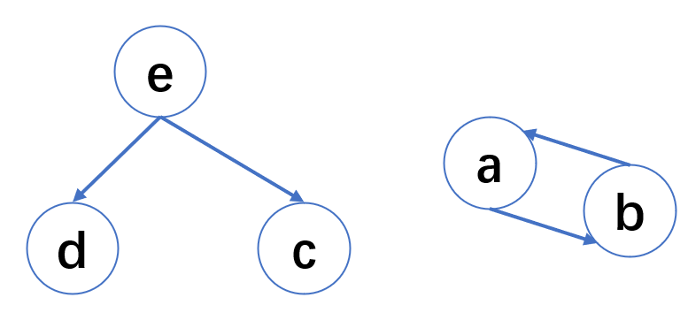

一面：
1. 内存泄漏

内存溢出 out of memory，是指程序在申请内存时，没有足够的内存空间供其使用，出现out of memory；比如申请了一个integer,但给它存了long才能存下的数，那就是内存溢出。

内存溢出就是你要求分配的内存超出了系统能给你的，系统不能满足需求，于是产生溢出。

内存泄漏是指你向系统申请分配内存进行使用(new)，可是使用完了以后却不归还(delete)，结果你申请到的那块内存你自己也不能再访问（也许你把它的地址给弄丢了），而系统也不能再次将它分配给需要的程序。

内存泄露 memory leak，是指程序在申请内存后，无法释放已申请的内存空间，一次内存泄露危害可以忽略，但内存泄露堆积后果很严重，无论多少内存,迟早会被占光。

2. https如何保证安全性

见每日一题

3. 用例设计

见每日一题

4. 微信发语言的场景设计题


5. python的垃圾回收机制

垃圾回收算法有很多，主要有：引用计数、标记-清除、分代收集等。

在python中，垃圾回收算法以引用计数为主，标记-清除和分代收集两种机制为辅。

1 引用计数

1.1 引用计数算法原理

引用计数原理比较简单：
每个对象有一个整型的引用计数属性。用于记录对象被引用的次数。
例如对象A，如果有一个对象引用了A，则A的引用计数+1。
当引用删除时，A的引用计数-1。
当A的引用计数为0时，即表示对象A不可能再被使用，直接回收。
在Python中，可以通过sys模块的getrefcount函数获取指定对象的引用计数器的值，我们以实际例子来看。

```
import sys

class A():
    def __init__(self):
        pass
        
a = A()
print(sys.getrefcount(a))
```

1.2 计数器增减条件

上面我们看到，创建一个A对象，并将对象赋值给a变量后，对象的引用计数器值为2。那么什么时候计数器会+1，什么时候计数器会-1呢？

1.2.1 引用计数+1的条件

    对象被创建，如A()。
    对象被引用，如a=A()。
    对象作为函数的参数，如func(a)。
    对象作为容器的元素，如arr=[a,a]。

1.2.2 引用计数-1的条件

    对象被显式销毁，如del a。
    变量重新赋予新的对象，例如a=0。
    对象离开它的作用域，如func函数执行完毕时，func函数中的局部变量（全局变量不会）。
    对象所在的容器被销毁，或从容器中删除对象。

1.3 引用计数的优点与缺点

1.3.1 引用计数优点

高效、逻辑简单，只需根据规则对计数器做加减法。
实时性。一旦对象的计数器为零，就说明对象永远不可能再被用到，无须等待特定时机，直接释放内存。

1.3.2 引用计数缺点

需要为对象分配引用计数空间，增大了内存消耗。
当需要释放的对象比较大时，如字典对象，需要对引用的所有对象循环嵌套调用，可能耗时比较长。
循环引用。这是引用计数的致命伤，引用计数对此是无解的，因此必须要使用其它的垃圾回收算法对其进行补充。


2 标记-清除

上一小节提到，引用计数算法无法解决循环引用问题，循环引用的对象会导致大家的计数器永远都不会等于0，带来无法回收的问题。

标记-清除算法主要用于潜在的循环引用问题，该算法分为2步：

标记阶段。将所有的对象看成图的节点，根据对象的引用关系构造图结构。从图的根节点遍历所有的对象，所有访问到的对象被打上标记，表明对象是“可达”的。

清除阶段。遍历所有对象，如果发现某个对象没有标记为“可达”，则就回收。

```
class A():
    def __init__(self):
        self.obj = None
 
def func():
    a = A()
    b = A()
    c = A()
    d = A()

    a.obj = b
    b.obj = a
    return [c, d]

e = func()
```

上面代码中，a和b相互引用，e引用了c和d。整个引用关系如下图所示：



如果采用引用计数器算法，那么a和b两个对象将无法被回收。而采用标记清除法，从根节点（即e对象）开始遍历，c、d、e三个对象都会被标记为可达，而a和b无法被标记。因此a和b会被回收。
这是读者可能会有疑问，为什么确定根节点是e，而不会是a、b、c、d呢？这里就有讲究了，什么样的对象会被看成是根节点呢？一般而言，根节点的选取包括（但不限于）如下几种：
当前栈帧中的本地变量表中引用的对象，如各个线程被调用的方法堆栈中使用到的参数、 局部变量、 临时变量等。
全局静态变量
…

3 分代收集

3.1 分代收集原理

在执行垃圾回收过程中，程序会被暂停，即stop-the-world。

为了减少程序的暂停时间，采用分代回收(Generational Collection)降低垃圾收集耗时。

分代回收基于这样的法则：

接大部分的对象生命周期短，大部分对象都是朝生夕灭。
经历越多次数的垃圾收集且活下来的对象，说明该对象越不可能是垃圾，应该越少去收集。
Python中，对象一共有3种世代：G0,G1,G2。

对象刚创建时为G0。
如果在一轮GC扫描中存活下来，则移至G1，处于G1的对象被扫描次数会减少。
如果再次在扫描中活下来，则进入G2，处于G1的对象被扫描次数将会更少。

3.2 触发GC时机

当某世代中分配的对象数量与被释放的对象之差达到某个阈值的时，将触发对该代的扫描。当某世代触发扫描时，比该世代年轻的世代也会触发扫描。
那么这个阈值是多少呢？我们可以通过代码查看或者修改，示例代码如下

```
import gc
threshold = gc.get_threshold()
print("各世代的阈值:", threshold)

# 设置各世代阈值
# gc.set_threshold(threshold0[, threshold1[, threshold2]])
gc.set_threshold(800, 20, 20)
```

在Python中，主要通过引用计数进行垃圾回收；通过 “标记-清除” 解决容器对象可能产生的循环引用问题；通过 “分代回收” 以空间换时间的方法提高垃圾回收效率。

6. 证书的颁发机构

CSR 证书签名请求

SSL （Secure Socket Layer）位于可靠的面向连接的网络层协议和应用层协议之间的一种协议层。

TLS：（Transport Layer Security，传输层安全协议），用于两个应用程序之间提供保密性和数据完整性。该协议由两层组成：TLS记录协议和TLS握手协议。


    