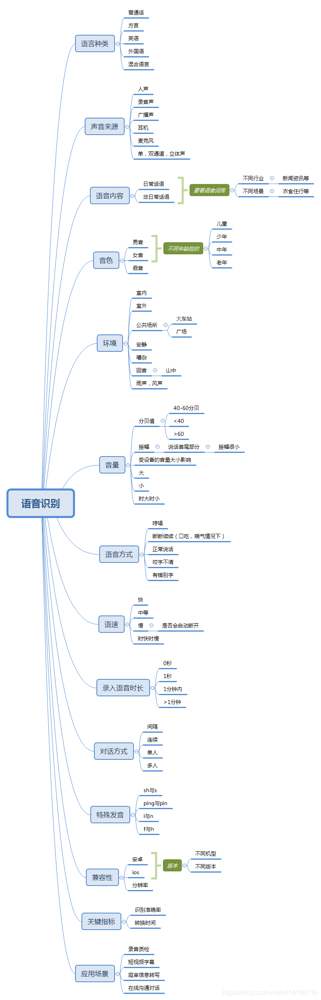

理想面试准备：

智能驾舱应用生态：

1. 测试类型包括自动化测试：

自动化工具：

    接口自动化：postman/jmeter(性能和接口)
    pytest是一个用于编写和运行Python单元测试的框架。它提供了丰富的断言库和测试运行器，使得编写和运行测试变得更加简单和高效。
    Selenium是一个用于自动化Web浏览器的工具。它提供了一组API，可以通过编程方式控制浏览器的行为，模拟用户与Web应用程序的交互。
    持续集成

自动化脚本：
    Appium: 用于移动应用程序测试的自动化测试框架。ADB（Android Debug Bridge）是Android开发工具包（SDK）中的一个命令行工具，用于与连接到计算机的Android设备进行通信。Appium 通过调用 ADB 命令来与设备进行通信，从而实现自动化测试的目标。

    Shell脚本：

功能测试：

性能测试：

稳定性测试：

兼容性测试：

接口测试：

**语控测试：**

**app项目测试经验：**

智能驾舱应用测试：

    智能驾舱应用测试是确保汽车驾驶体验和系统功能正常运作的重要环节。以下是一些常见的智能驾舱应用测试方面，以及一些建议的测试用例设计：

    用户界面测试：
    确保用户界面友好、易用，符合设计规范。
    测试各种屏幕尺寸和分辨率下的适应性。
    验证颜色对比度和可读性。

    语音识别测试：
    确保语音指令的准确性和响应时间。
    测试在不同噪声环境下的语音识别性能。

    导航和地图测试：
    验证导航功能的准确性和及时性。
    测试在不同地理位置和网络状态下的地图加载速度。

    手势控制和触摸屏测试：
    验证手势控制的准确性和响应时间。
    测试触摸屏的灵敏度和多点触控功能。

    驾驶辅助功能测试：
    测试自动驾驶模式的稳定性和安全性。
    验证自动刹车、车道保持等驾驶辅助功能的有效性。

    性能测试：
    测试应用在不同硬件配置下的性能表现。
    模拟长时间使用以检测内存泄漏或性能下降。

    安全性测试：
    验证用户数据的加密和隐私保护机制。
    测试应对网络攻击和恶意软件的能力。

    连接性测试：
    测试应用在不同网络条件下的稳定性。
    验证与车辆内部和外部设备的连接性。

    软件更新测试：
    模拟软件升级过程，确保用户数据不会丢失。
    验证新版本软件的兼容性和稳定性。

    用户体验测试：
    进行用户调查和反馈收集，以了解用户满意度。
    测试不同用户场景下的交互体验。

    紧急情况模拟测试：
    模拟车辆突发状况，如紧急刹车或系统故障，确保应用能够正确应对。
    在设计测试用例时，需要考虑覆盖各种使用场景、不同设备和网络条件。使用各种输入方式进行测试，模拟用户在真实驾驶环境中可能遇到的各种情况，以确保智能驾舱应用在各种条件下都能够稳定、高效地运行。

面试：

1. 自我介绍
2. 介绍实习经历，深挖我实习期间到底干了什么
3. 有没有接触过app测试相关的工作
4. 用例场景设计题，微信的视频通话
5. 忘说了语音通话，然后问语音通话的测试用例设计
6. 我的主要编程语言,python,说一下你用python都做了什么
   

